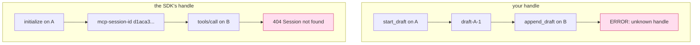

# 3.5 — 💥 The handle B had never heard of

## One-line answer

Doing the handle pattern correctly is not enough: an opaque identifier travelling in the payload is
still useless if the thing it points at lives in one process's memory, and the same failure arrives
twice in this rig — once from your code and once from the SDK, with a real `404 Session not found`.

## The story

You reserve a book at the library and they give you a reference number.

The number is on a printed slip. It says nothing about the book, nothing about you, and nothing about
which branch you were standing in — which feels like exactly the right design, because you have used
systems where the receipt gave away far too much.

A week later you are near the branch across the river, so you go in there and hand over the slip. The
woman at the desk types the number, waits, and says she has no record of it. She is not being
difficult; her screen genuinely does not have it. The reservation lives on the branch you made it at,
in a system that was set up when there was one branch, and the number on the slip was never a pointer
to a shelf in the *library*. It was a pointer to a shelf in *that building*.

The slip is correct. The number is correct. The design of the slip is correct. And it still does not
work, because the thing it points at was never put anywhere the second branch could look.

## The idea in plain language

This is the failure that is hardest to see coming, because everything visible about it is right.

[Day 32's 3.4](../../../day-32-mcp-stateless-core/parts/03-headers-and-caches/3.4-state-that-travels-in-the-payload.md)
gave the rule for cross-call memory under a stateless protocol: the server mints an **explicit,
opaque handle** and the client passes it back as an **ordinary tool argument**.
[Day 36](../../../day-36-long-jobs-and-tasks/) built task handles on exactly that policy. Both are
correct and neither is being questioned here.

But that rule is about the **interface**. It says how the memory is *named* and how the name
*travels*. It says nothing at all about where the memory is *kept*, and it is entirely possible —
easy, in fact — to satisfy every word of it while keeping the data in a dictionary that belongs to
one process.

So there are two separate questions, and passing the first one tells you nothing about the second:

| Question | About | Answered by |
| --- | --- | --- |
| How is cross-call state named and carried? | the interface | an opaque handle in the payload |
| Where does the data behind the handle live? | the storage | a store every instance can reach |

A handle whose data is in process memory is a *session with better manners*. It has the shape the
specification asked for and the lifetime the specification removed.

There is a tell, and it is worth learning to spot in code review: **a handle that contains the
identity of the thing that made it**. `draft-A-1` names its minter. So does a session identifier, and
so does any handle built from a hostname, a port, a container name or a process id. If the identity
of the minter has to be inside the handle for the system to work, the data is on the minter.

## Why Sutra needs it

Because `sutra_mcp/tasks.py` from [Day 36](../../../day-36-long-jobs-and-tasks/) is the place in the
whole package most likely to have exactly this defect, and its interface is impeccable.

Day 36 built the long-job pattern: a call that starts work returns a handle immediately, and the
client polls with it. That is the right shape, it is what the Tasks extension asks for, and it will
pass any review of the schema. The question this part asks is the one the schema cannot answer —
when `start` runs on A and `get` runs on B, is the progress record somewhere B can read?

The same question applies to
[Day 37's elicitation state](../../../day-37-auth-and-elicitation/): a server that returns "I need
input" with opaque state, and a client that comes back with the answer, is the same mint-and-return
shape with the same storage question underneath it.

And [Day 45's audit](../../../day-45-the-mcp-audit/) needs a check for this that is not "read the
code". Mint a handle, use it twice, and see whether both calls work.

## The mechanism

Two versions of the same tool, one variable apart:

```python
# days/day-43-stateless-by-default/lab/leaky_server.py  (extract)
@mcp.tool()
def start_draft(first_line: str) -> str:
    """Mint a handle for a reply that is written across several calls."""
    if SHARED:
        return store.mint(first_line)
    handle = f"draft-{INSTANCE}-{len(DRAFTS) + 1}"
    DRAFTS[handle] = first_line
    return handle


@mcp.tool()
def append_draft(handle: str, text: str) -> str:
    """Add a line to an existing draft, named by its handle."""
    if SHARED:
        try:
            return store.append(handle, text)
        except KeyError:
            return f"ERROR {INSTANCE}: unknown handle {handle!r}"
    if handle not in DRAFTS:
        return f"ERROR {INSTANCE}: unknown handle {handle!r}"
    DRAFTS[handle] = DRAFTS[handle] + " " + text
    return DRAFTS[handle]
```

**Line by line:**

- Both branches have the **same signature**, return the same type and publish the same schema, which
  is the point of putting them in one function. Nothing a client can see distinguishes the correct
  version from the broken one.
- `f"draft-{INSTANCE}-{len(DRAFTS) + 1}"` is the tell from the section above, written out: the
  instance letter and a per-process counter.
- `store.mint(first_line)` returns `"draft-" + secrets.token_urlsafe(8)` — no instance, no counter,
  no order. `secrets` rather than `random` because
  [1.3](../01-accidental-state/1.3-the-state-that-is-not-a-dictionary.md) noted that a seeded
  generator produces the same sequence in every process, which for identifiers is catastrophic.
- The `except KeyError` in the shared branch and the `if handle not in DRAFTS` in the memory branch
  produce the **same message**. That is deliberate: an unknown handle is a legitimate outcome in both
  worlds — a client can always send something expired or wrong — so the two must be distinguishable
  by *frequency*, not by wording. In the shared world it means "that handle is not real". In the
  broken world it means "that handle is not real *here*", and no message says which.
- Returning a sentence rather than raising follows
  [Day 34's 4.1](../../../day-34-building-sutra-mcp-tools/parts/04-two-kinds-of-no/4.1-the-tool-said-no.md):
  the tool ran and could not do the job, so it is a result rather than a protocol error. Correct — and
  it is also why nothing counts this.

The second version of the failure needs no code from you at all, because the SDK already has it. From
[1.4](../01-accidental-state/1.4-the-session-your-sdk-keeps-for-you.md), with `stateless_http=False`,
the session identifier *is* a handle: minted by one instance, stored in that instance's
`_server_instances` dictionary, and sent back by the client on every later request. Same pattern, same
defect, one layer down.



## When it breaks

Your handle, from the two-instance run on 2026-09-05:

```text
-- the handle: minted by one instance, used by the next --
   minted: draft-A-1
   ERROR B: unknown handle 'draft-A-1'
   Sorry about the delay. Line 3.
```

The third line is worse than the second. The append that landed back on A **succeeded**, and produced
a draft containing line 1 and line 3. Line 2 is gone. Not marked missing, not queued, not retried —
gone, from a request that returned successfully. If this were a customer reply it would go out with a
sentence missing and a coherent-looking beginning and end.

The SDK's handle, from the stateful arm of the same rig:

```text
   request 1  initialize        -> session d1aca30136b84ffb95fa81041633ec4c
   request 1  answered by       -> sutra-mcp-leaky
   request 2  same session      -> {"http_status": 404, "jsonrpc": "2.0", "id": "server-error", "error": {"code": -32600, "message": "Session not found"}}
   request 3  same session      -> {"jsonrpc": "2.0", "id": 3, "result": {"content": [{"type": "text", "text": "A"}], "structuredContent": {"result": "A"}, "isError": false}}
```

The same session string, sent twice, one request apart. `404 Session not found` and then a normal
result. Nothing about the identifier changed between them.

The two failures are worth comparing, because they are the same bug with opposite ergonomics:

| | your handle | the SDK's session |
| --- | --- | --- |
| what comes back | a successful call with `ERROR …` in the text | HTTP 404, JSON-RPC `-32600` |
| visible to error metrics | **no** | yes |
| the model sees it | yes, as tool output | no, the client library sees it |
| how it usually gets "fixed" | a retry that half-works | a retry that succeeds |

The one that is invisible to your dashboards is the one you wrote. That is not a coincidence: the
protocol layer has been designed by people who thought about failure taxonomies, and your tool body
has not — yet. Deciding which of your tool's failures are results and which are errors is
[Day 34's 4.1](../../../day-34-building-sutra-mcp-tools/parts/04-two-kinds-of-no/4.1-the-tool-said-no.md)
`TODO(me)`, and this is the day it acquires a consequence.

With `--shared`, both lines of the same sequence work, and the minted handle looks like
`draft-KsbOEwU1g14` — no instance in it, because there is nothing to say.

## In production

**What a professional writes instead:** the handle is a random token, the record behind it is a row
with an owner and an expiry, and an unknown handle is a distinct, countable outcome rather than a
sentence in a text block. The check that this is right is not a code review — it is a test that mints
a handle on one instance and uses it on another, which is the only thing that distinguishes a real
handle from a session with better manners.

**What degrades at scale:** the fraction of follow-up calls that land somewhere useful, which is
`1/n`. But the more painful degradation is the partial one from the third output line: with more
instances you get *more* sequences that partly work, so the population of half-written records grows
faster than the population of outright failures. Silent partial success is the hardest state to clean
up afterwards, because you cannot query for it.

**The failure mode that only appears with real traffic:** the handle that outlives its instance. Even
with everything shared, a container is replaced mid-job, and a handle whose record says `running` is
now pointing at work nobody is doing. Shared storage fixes *reachability*; it does not fix
*ownership*, and a real task store needs a heartbeat or a lease so that abandoned work is detectable.
That is not today's build, and it is the honest limit of today's fix.

**The review comment a senior engineer leaves:** *"the draft handle has the instance name in it. That
string is the design telling us where the data is — if we needed the instance in the handle, we would
need the instance to answer, and that is the thing we are claiming not to need. Random token, row in
the database with an owner and an expiry, and a test that mints on one process and appends on
another."*

**The interview question:** *"you returned an opaque handle from a tool instead of holding a session.
Is your server stateless?"* The honest answer: *"Not necessarily — the handle is about the interface,
not about the storage. I can satisfy the whole handle pattern and still keep the data in a dictionary
in one process, and then a follow-up call that lands on another replica gets 'unknown handle'. The
tell in code review is a handle that contains the identity of whatever minted it: if the instance has
to be in the string, the data is on the instance. The test is to mint on one process and use it on
another, and the thing to watch for is not the failure — it is the partial success, where an
alternating balancer means every other call works and you end up with records missing a line rather
than records that are obviously broken."*

## Check yourself

```bash
cd days/day-43-stateless-by-default/lab
uv run python twoup.py | sed -n '/the handle/,/^$/p'
uv run python twoup.py --shared | sed -n '/the handle/,/^$/p'
uv run python twoup.py --stateful
```

Three blocks: a lost line, a complete draft, and a 404. Say which of the three failures a dashboard
counting JSON-RPC errors would have shown you.

**Out loud, without scrolling up:** say what an opaque handle does and does not guarantee, and give
the one-glance tell that a handle's data is stuck on one instance.

**Next:** [4.1 — Down, out, or nowhere](../04-where-state-goes/4.1-down-out-or-nowhere.md).
