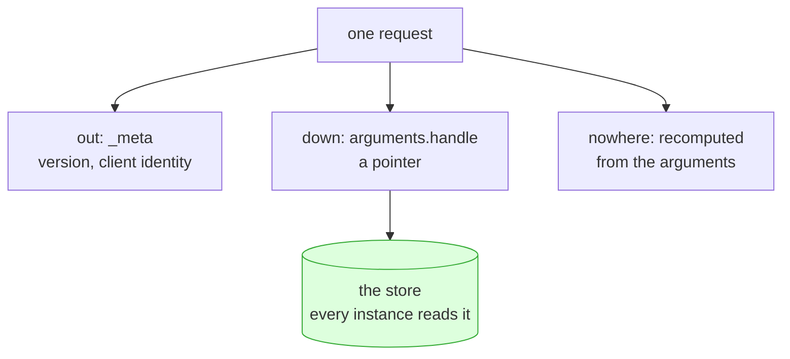

# 4.1 — Down, out, or nowhere

## One-line answer

State never disappears when a server becomes stateless; it moves, and there are exactly three places
it can move to — **down** into a shared store, **out** into the caller's payload, or **nowhere**
because it turned out not to be needed — and picking the wrong one is what section 3 was measuring.

## The story

There are three places people keep a spare key, and each one is a different bet.

**Under the mat.** Fast, free, and everybody who has ever thought about it knows where it is. It
works until the first time it matters.

**With the neighbour.** Now the key is somewhere else. You have to knock, they have to be in, and if
they move house you have a problem you did not have before. In exchange, anybody in your family can
collect it, from anywhere, without having been there when it was left.

**In your pocket.** Nobody has to store anything, because you carry it. It costs you the weight of a
key on every single trip, including the ninety-nine out of a hundred where the door was going to be
open anyway.

There is no correct answer. There is a household that keeps thinking about it and a household that
does not, and the second one has a key under the mat.

## The idea in plain language

"Stateless server" has never meant "no state exists". A re-index takes real time and has real
progress. A draft has real half-finished text. A budget has a real number. Those facts do not go away
because the protocol stopped holding them.

What it means is that state may not live **in the server process**. Which leaves three destinations,
and they are the three from the story.

**Down — into a shared store.** A database, a cache server, a durable queue. The server mints a
handle, writes the record, and hands the handle back. Every instance can read it, so any instance can
serve the next call. This is
[Day 32's 3.4](../../../day-32-mcp-stateless-core/parts/03-headers-and-caches/3.4-state-that-travels-in-the-payload.md)
with the storage question answered, and it is what
[3.5](../03-two-instances/3.5-the-handle-b-had-never-heard-of.md) found missing.

**Out — into the payload.** The caller carries the context and sends it on every request. No handle,
no store, no lookup: the request is self-contained in the strongest sense. This is the choice the
protocol itself made when it put the protocol version and the client identity into `_meta` on every
request rather than negotiating them once.

**Nowhere — because it was not needed.** The most under-used of the three. A great deal of what looks
like required state is a cache of something cheap, a counter nobody reads, or a value that can be
recomputed from the request. Deleting it is the only option with no ongoing cost at all.

The trade-offs, stated plainly, because the choice is a real one:

| | down (a store) | out (the payload) | nowhere |
| --- | --- | --- | --- |
| what it costs | a network read on the hot path | bigger requests, every time | recomputation |
| who can see it | anything with database access | the client, and anything on the wire | — |
| how big it can be | large | small, and it repeats | — |
| lifetime | you must decide, and enforce it | the caller's problem | — |
| fails when | the store is down or slow | the caller lies or loses it | never |

Two rules follow from that table and they decide most cases.

**Anything the client must not see or must not forge goes down.** Once state is in the payload, the
client can read it and change it. A draft is fine. A permission, a price or a spend counter is not.

**Anything that is only true for this one request goes out or nowhere.** The tenant, the locale, the
correlation identifier from
[Day 22](../../../day-22-structured-logging/parts/02-wiring-the-run/2.2-the-correlation-id.md). None
of it is worth a row.

## Why Sutra needs it

Because `sutra_mcp/` has one of each, already written, and the day's build brief asks you to place
them.

The **task records** from [Day 36](../../../day-36-long-jobs-and-tasks/) go down. They are large,
they outlive the call that created them, and a client must not be able to invent one.

The **ticket status** from [Day 39](../../../day-39-database-tools/) is already down and always was —
it is a database row, and this whole day never had a complaint about it. Worth noticing: the part of
Sutra that was designed with a store from the start is the part that needed no fixing.

The **protocol version and client identity** go out, and not by your choice: the specification puts
them in `_meta` on every request, which is
[Day 32's 2.3](../../../day-32-mcp-stateless-core/parts/02-the-reframe/2.3-every-request-introduces-itself.md).

The **budget counter** from [Day 24](../../../day-24-token-accounting-and-budgets/) goes down, and
[3.4](../03-two-instances/3.4-three-a-day-per-instance.md) is why it cannot go anywhere else: the
client must not be able to edit it, and it must be one number.

The **summary cache** from [3.3](../03-two-instances/3.3-two-answers-to-one-question.md) goes
nowhere. The read is a single indexed lookup in a local database. It was never slow, and the cache
was bought with an inconsistency nobody priced.

## The paper behind it

> **Principled design of the modern Web architecture** · `doi:10.1145/514183.514185` · 2002 ·
> `https://doi.org/10.1145/514183.514185`

It set out statelessness as a deliberate constraint with a stated price — every request repeats the
context it needs, so requests get bigger — accepted in exchange for any server being able to answer
any request, and for failures being recoverable one request at a time.

That price is the "out" column of the table above, named by the document that first argued for
paying it. The paper is taught on Day 32, in
[`../../../day-32-mcp-stateless-core/papers/01-modern-web-architecture.md`](../../../day-32-mcp-stateless-core/papers/01-modern-web-architecture.md).

## The mechanism

"Down" in the lab is one file and three functions, and the shape of the interface is what matters:

```python
# days/day-43-stateless-by-default/lab/store.py  (extract)
def mint(first_line: str) -> str:
    """Create a draft and return an opaque handle to it."""
    handle = "draft-" + secrets.token_urlsafe(8)
    con = connect()
    try:
        con.execute("INSERT INTO drafts (handle, body) VALUES (?, ?)", (handle, first_line))
    finally:
        con.close()
    return handle
```

**Line by line:**

- `secrets.token_urlsafe(8)` gives roughly 64 bits of randomness in URL-safe characters. Not
  `random`, for the reason [1.3](../01-accidental-state/1.3-the-state-that-is-not-a-dictionary.md)
  gave: two processes seeded the same way generate the same sequence.
- Eight bytes is enough that nobody enumerates it and short enough to read out over a phone line. The
  handle is going into a model's context and possibly into a transcript a person reads.
- `"draft-"` in front is a prefix, not information. It tells a human reading a log what kind of thing
  this is; it tells the client nothing it may act on. A client that parses anything out of this string
  has broken the contract that the handle is opaque.
- The `INSERT` happens **before** the handle is returned, so a handle the caller holds always
  corresponds to a row. Returning first and writing later gives you a window where a valid-looking
  handle points at nothing, and with two instances that window is on a different machine.
- `con.close()` in a `finally` — the connection belongs to the call. This is
  [1.3](../01-accidental-state/1.3-the-state-that-is-not-a-dictionary.md)'s rule again, and it is
  what keeps `store.py` itself clean under
  [the scan](../02-finding-the-state/2.4-a-scan-that-can-go-red.md).
- There is no `expires_at` column, and that is a real gap rather than a simplification. A session
  ended when the connection dropped; a handle has no equivalent event, so somebody has to decide when
  the row dies. The hub's build brief asks you to.

"Out" needs no code from you, because the protocol does it. The shape, from the specification's
Streamable HTTP page, read on 2026-09-05:

```json
{
  "jsonrpc": "2.0",
  "id": 1,
  "method": "tools/call",
  "params": {
    "name": "append_draft",
    "arguments": { "handle": "draft-KsbOEwU1g14", "text": "Sorry about the delay." },
    "_meta": { "io.modelcontextprotocol/protocolVersion": "2026-07-28" }
  }
}
```

`_meta` is state travelling out: the version is repeated on every request instead of being agreed
once. `arguments.handle` is state travelling down, named by a string the client carries. One request
carries both mechanisms, and neither of them is a session.



## When it breaks

Each destination has its own failure and they are not interchangeable.

**Down breaks when the store does.** The state is reachable by every instance, which also means every
instance is now down when the store is:

```text
sqlite3.OperationalError: database is locked
```

That is the lab's store under contention, and it is [4.2](4.2-shared-is-not-the-same-as-safe.md)'s
subject. On a networked database the same position produces a timeout instead, and the store's tail
latency becomes your tool's tail latency — which is why
[Day 44](../../../day-44-client-hardening/) has to choose timeouts.

**Down also breaks slowly, by growing.** No expiry means every draft ever started stays forever, and
the failure lands months later on the storage rather than on the protocol, as
[Day 32's 3.4](../../../day-32-mcp-stateless-core/parts/03-headers-and-caches/3.4-state-that-travels-in-the-payload.md)
already warned.

**Out breaks when the caller is not trustworthy.** Anything in the payload can be edited by whoever
sends it. Put a spend counter there and a client can reset it; put a permission there and a client
can grant it. The rule is not "never trust the client", which is too broad to act on — it is that
*out* is for context the client is entitled to control anyway.

**Out also breaks by size.** Repeating context on every request is the price the paper named, and it
is charged per request forever. Something that grows — a conversation, an accumulating draft —
becomes a payload that grows, and eventually a request that is refused for being too large.

**Nowhere breaks when the recomputation was not actually cheap.** Deleting a cache is only free if the
work behind it is small. The honest way to find out is to measure the read rather than to assume in
either direction.

## In production

**What a professional writes instead:** the choice is written down, per piece of state, near the code
— a comment or a short design note saying *which* of the three and *why*. That sounds like ceremony
until the third person adds a dictionary because nothing in the file said what the rule was. The
decision has to be visible where the temptation appears.

**What degrades at scale:** "down" becomes the thing that is actually stateful, and everything you
removed from the server reappears there — backups, failover, a connection limit, a hot row that every
instance contends on. Statelessness did not delete the state; it moved it somewhere designed to hold
it. Saying that plainly in a design review is the difference between understanding the trade and
reciting it.

**The failure mode that only appears with real traffic:** the store on the hot path. A handle lookup
is a dictionary access in testing and a network round trip in production, added to every call that
used to be free. Under load, the store's slowest requests set your tool's slowest requests, and a
service that was fast at ten calls a second is not at a thousand.

**The review comment a senior engineer leaves:** *"the draft body is in the tool arguments. That
makes the request self-contained, which is good, and it also means the client can edit any draft it
holds a handle for and we would never know. Bodies go in the store behind the handle; the payload
carries the handle and nothing else."*

**The interview question:** *"if the server holds no state, where does the state go?"* The honest
answer: *"One of three places, and choosing is the design work. Down into a shared store, behind an
opaque server-minted handle — that is for anything large, anything that outlives the call, and
anything the client must not be able to forge. Out into the payload, repeated on every request — that
is for small context the caller owns anyway, like the protocol version and the tenant, and the price
is that you repeat it forever. Or nowhere, because a surprising amount of it was a cache of something
cheap. What I would not say is that the state disappeared: it moved into the store, and the store is
now the stateful thing, with the backups, the failover and the tail latency that come with it."*

## Check yourself

```bash
cd days/day-43-stateless-by-default/lab
uv run python scan.py store.py; echo "exit: $?"
```

`store.py` holds all of the day's state and the scan is clean, because none of it is in the process.
Read the file and say which line makes the handle unguessable, and which column the `drafts` table is
missing.

**Out loud, without scrolling up:** name the three destinations, and place these four in them: a task
record, the protocol version, a spend counter, a summary cache.

**Next:** [4.2 — Shared is not the same as safe](4.2-shared-is-not-the-same-as-safe.md).
