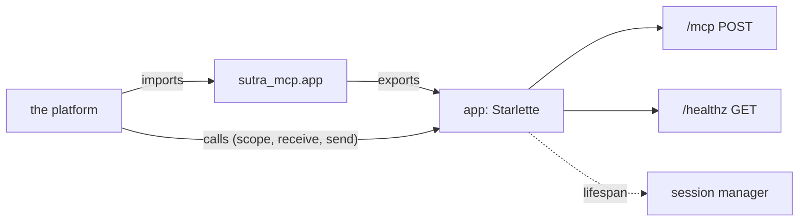

# 5.1 — An object, not a program

## One-line answer

`sutra_mcp/app.py` exports **one name**, an ASGI application object, and starts nothing — because a
platform runs your code by importing it and calling it, not by running your `main`, and the whole
deploy shape follows from that one inversion.

## The story

At the weekly market you rent a pitch, not a shop.

What you bring is a folding table and your stock. What the market provides is the ground, the
electricity, the opening hours, the security guard and the person who tells you where to set up. You
do not decide when the market opens. You do not put up the fence. You arrive, unfold the table in the
square marked with your number, and sell.

The first time somebody moves from running their own shop to renting a pitch, the adjustment is not
about the goods. It is about the surprising number of decisions that are no longer theirs — and the
matching relief that they are also no longer their problem. What is left is one clear obligation:
**the table has to fold out, on the spot they give you, whichever spot that is.**

A trader who has built their stall into the ground at one corner of the square has not got a market
stall. They have got a shop, in a market.

## The idea in plain language

Two words, and then this part is mostly consequences.

**ASGI** — Asynchronous Server Gateway Interface — is a Python convention with one rule: an
application is a callable that accepts three arguments (`scope`, `receive`, `send`) and does the
work asynchronously. `scope` describes the request, `receive` gets incoming data, `send` produces the
reply. Anything that follows that rule can be run by anything that knows how to call it.

An **ASGI server** is the thing that does the calling. `uvicorn` is one. It opens the socket, speaks
HTTP, and for each request builds a `scope` and calls your application.

The important word in that arrangement is **calls**. Your module does not run a server. Your module
is *imported*, and something else calls the object it exported. This is an inversion of the shape you
have been writing all curriculum:

| | a program | an ASGI module |
| --- | --- | --- |
| entry point | `if __name__ == "__main__":` | a module-level name |
| who starts it | you, with a command | the platform, by importing |
| how the port is chosen | an argument you parse | an environment variable the platform sets |
| what the file does at import | nothing | **builds the whole application** |
| how it stops | you press a key | the platform sends a signal |

The last row of the "what it does at import" column is the part that catches people, and it is worth
being blunt about: an ASGI module is a file whose *entire job* happens at import time. Everything
this day has said about import-time work is still true — it is per process, it happens once, it
cannot be shared. The difference is that here it is deliberate, it is one object, and it holds no
per-caller memory.

[Day 34's 1.2](../../../day-34-building-sutra-mcp-tools/parts/01-the-server-object/1.2-a-server-you-build-not-one-that-runs.md)
built the habit that makes this easy: `build_server()` returns and never blocks. `app.py` is that
decision paying off — the deploy shape needs a builder, and you have one.

## Why Sutra needs it

Because today's build brief asks you to write `sutra_mcp/app.py`, and it is the shortest file in the
package: an import, a call, one assignment, and one assertion.

Every module before it registers something into the server:
[Day 34](../../../day-34-building-sutra-mcp-tools/)'s `server.py` and `tools.py`,
[Day 35](../../../day-35-resources-and-prompts/)'s `resources.py` and `prompts.py`,
[Day 36](../../../day-36-long-jobs-and-tasks/)'s `tasks.py`,
[Day 37](../../../day-37-auth-and-elicitation/)'s `auth.py`,
[Day 39](../../../day-39-database-tools/)'s `db_tools.py`,
[Day 41](../../../day-41-capabilities-and-mcp-apps/)'s `capabilities.py`,
[Day 42](../../../day-42-serving-agents-over-mcp/)'s `agent_server.py`. `app.py` registers nothing.
It is the one module whose job is to be *found*, by name, by something that is not Sutra.

That is why it is also the right place for the assertion from
[1.4](../01-accidental-state/1.4-the-session-your-sdk-keeps-for-you.md). The module the platform
loads is the last honest place to check that what it is about to serve is what you meant to serve.

And it is what makes [Day 45's audit](../../../day-45-the-mcp-audit/) able to say something concrete:
not "the server is stateless" but "the module the deployment imports declares stateless transport,
and here is the two-instance run that agrees".

## The mechanism

The whole file, and it should stay this short:

```python
# sutra_mcp/app.py - you type every line
"""The deploy-shaped entry point: any instance answers any request."""

from sutra_mcp.server import build_server

app = build_server().streamable_http_app()

# The transport must be stateless, or two instances cannot share one URL (day 43, part 1.4).
assert app.state.mcp_stateless, "sutra-mcp must be built with stateless_http=True"
```

**Line by line:**

- `from sutra_mcp.server import build_server` — the only import, and it points at
  [Day 34's builder](../../../day-34-building-sutra-mcp-tools/parts/01-the-server-object/1.2-a-server-you-build-not-one-that-runs.md).
  `app.py` does not construct a `FastMCP` of its own, because a second construction site is a second
  place for the tool list and the flags to be different.
- `build_server()` returns the configured server with every day's registrations already applied. If
  this call blocks, the module never finishes importing and the platform's health check times out
  with nothing in the logs — which is the failure Day 34's 1.2 exists to prevent.
- `.streamable_http_app()` turns the MCP server into an ASGI application. It is the SDK method that
  builds the session manager, mounts the MCP endpoint at `/mcp`, adds any custom routes, and attaches
  the lifespan that runs the manager. Verified by reading
  `.venv/Lib/site-packages/mcp/server/fastmcp/server.py` on 2026-09-05.
- `app = ...` at module level is the export. The name is what a deploy command refers to as
  `sutra_mcp.app:app`, so it is part of your deployment configuration and renaming it is a breaking
  change to something outside this repository.
- The `assert` is the guard, and it needs a decision from you: `app.state` is a Starlette namespace
  the SDK does not populate with this flag, so `app.state.mcp_stateless` does not exist until you set
  it. That is deliberately left unfinished — the hub's build brief asks you to decide where the flag
  is recorded and how it is read back. What must not happen is checking nothing.
- There is **no `if __name__ == "__main__":` block** and no `run()`. A file that both exports an
  application and can start a server has two ways to be run and they will drift.

The port comes from the environment, never from arguments:

```python
# days/day-43-stateless-by-default/lab/leaky_server.py  (extract)
# The deploy-shaped way to choose a port: an environment variable, never sys.argv.
PORT = int(os.environ.get("PORT", "8901"))
```

**Line by line:**

- `os.environ.get("PORT", ...)` reads the variable container platforms set. The name `PORT` is the
  convention, and one specific platform's contract is quoted in
  [5.2](5.2-the-platform-you-are-not-paying-for.md).
- A default is supplied so the file still runs on a laptop with nothing configured. A module that
  raises `KeyError` at import time because an environment variable is missing is a module that cannot
  be imported by a test.
- `int(...)` outside the `get`, so a non-numeric value fails loudly at import rather than being
  passed to a socket call as a string.
- **Not `sys.argv`.** The lab server used to read `sys.argv[1]`, and *When it breaks* shows what
  happened the first time an ASGI server imported it.

What the object actually is, printed without starting anything:

```python
# days/day-43-stateless-by-default/lab/deploy_shape.py  (extract)
    server = build(stateless)
    app = server.streamable_http_app()
    routes = ", ".join(getattr(r, "path", "?") for r in app.routes)
    print(f"   object            : {type(app).__module__}.{type(app).__name__}")
    print(f"   routes            : {routes}")
    print(f"   lifespan attached : {app.router.lifespan_context is not None}")
    print(f"   manager.stateless : {server.session_manager.stateless}")
```

**Line by line:**

- `type(app).__module__` and `__name__` together show that the SDK hands you a plain Starlette
  application. There is nothing MCP-specific about the object itself, which is exactly why any ASGI
  server can run it.
- `app.routes` lists what is mounted. Two entries: the MCP endpoint and the health route — matching
  the specification's requirement, read on 2026-09-05, that a server *"MUST provide a single HTTP
  endpoint path (hereafter referred to as the MCP endpoint) that supports POST"*.
- `app.router.lifespan_context` is the start-up and shut-down hook. It is not decoration: the session
  manager's own `run()` context is attached there, and the SDK's request path begins by raising
  `RuntimeError("Task group is not initialized. Make sure to use run().")` when it was not. An ASGI
  server calls the lifespan; a hand-rolled loop that forgets to will not.
- `server.session_manager.stateless` is the flag as the request path will read it, which is the value
  the assertion in `app.py` should be checking against.



## When it breaks

The first version of the lab server took its port from `sys.argv[1]`. It worked perfectly when run as
a program. Then an ASGI server imported it, on 2026-09-05:

```text
  File "...\lab\leaky_server.py", line 51, in <module>
    port=int(sys.argv[1]) if len(sys.argv) > 1 else 8901,
         ^^^^^^^^^^^^^^^^
ValueError: invalid literal for int() with base 10: 'leaky_server:app'
```

Read the value in that message. `leaky_server:app` is *uvicorn's own argument* — the name of the
application it was asked to import. The module reached for `sys.argv` and found the arguments of the
program that imported it, because in an ASGI deployment there is no such thing as "my arguments".
Everything on the command line belongs to the server.

That failure is loud and instant, which is the good version. The quiet version is a module that reads
`sys.argv` and finds something plausible, and then serves on the wrong port, or with the wrong flag,
for as long as it takes somebody to notice.

With the port taken from the environment, the same module under the same server:

```text
INFO:     Started server process [15436]
INFO:     Waiting for application startup.
INFO:     Application startup complete.
INFO:     Uvicorn running on http://127.0.0.1:8911 (Press CTRL+C to quit)
INFO:     127.0.0.1:59637 - "GET /healthz HTTP/1.1" 200 OK
INFO:     127.0.0.1:59638 - "POST /mcp HTTP/1.1" 200 OK
```

*"Waiting for application startup"* then *"Application startup complete"* is the lifespan running —
the two lines that tell you the session manager was started. Two requests, two routes, both `200`.

Two more breaks worth naming before you write your own file.

**An import that blocks.** Put a `run()` at module level and the platform's import never returns.
There is no error, no traceback and no log line; the container simply fails its start-up check and is
replaced, forever, in a loop.

**Binding to the wrong interface.** The specification says that when running locally, servers
*"SHOULD bind only to localhost (127.0.0.1) rather than all network interfaces (0.0.0.0)"*, read on
2026-09-05, and it is right. A container platform requires the opposite, and
[5.2](5.2-the-platform-you-are-not-paying-for.md) quotes that too. Those two are not in conflict —
they are advice for two different situations — but a default hard-coded for one of them is wrong in
the other, which is why the bind address belongs beside the port, in the environment.

## In production

**What a professional writes instead:** almost exactly the file above, and no more. `app.py` is the
one module that a deployment names, so keeping it to an import, a call and a check is a deliberate
choice rather than laziness — everything that can go wrong there goes wrong at container start-up,
where the diagnostics are worst. The `run()` invocation stays in a development-only script, and the
production command names the module and the object.

**What degrades at scale:** import time. Everything in `build_server()` runs once per container
start, and containers start constantly under autoscaling. A build that opens a database, reads a
large file or fetches a remote configuration turns every scale-up into a slow one, at the moment
traffic is rising. The rule that follows: **import builds objects; it does not do work.**

**The failure mode that only appears with real traffic:** the worker count. Production ASGI servers
run several worker processes per container, and each worker imports your module separately. So the
per-instance state this whole day is about is really *per worker*, and a service with four workers on
each of three containers has twelve copies of every module-level dictionary. The good news is that
this makes the bug findable on one machine; the bad news is that everyone who has convinced
themselves "we only run one container" is already running four processes.

**The review comment a senior engineer leaves:** *"`app.py` builds the app and also has a `__main__`
block that runs it with different settings. Now we have two ways to start this service and they
already disagree about the port. Export the object, delete the block, and put the dev command in the
README."*

**The interview question:** *"what is the difference between a script that serves HTTP and a
deploy-shaped module?"* The honest answer: *"Who calls whom. A script owns `main`, parses its
arguments, and blocks. A deploy-shaped module exports one object and starts nothing — the platform
imports it and calls it per request, so the port and the bind address come from the environment
rather than from arguments, and there is no `__main__` block at all. The mistake I have actually made
is reading `sys.argv` in a module that later got imported by an ASGI server: the argument I got was
the server's own application string, which at least failed loudly. The subtler one is that everything
in the module runs at import, once per worker process, so anything expensive there is paid on every
scale-up."*

## Check yourself

```bash
cd days/day-43-stateless-by-default/lab
uv run python deploy_shape.py
PORT=8911 INSTANCE=A uv run python -m uvicorn leaky_server:app --host 127.0.0.1 --port 8911
```

In another shell, `curl http://127.0.0.1:8911/healthz`. Then stop it and say which two lines of
uvicorn's output correspond to the lifespan in `deploy_shape.py`'s report.

**Out loud, without scrolling up:** say what `app.py` exports, what it must not contain, and where
the port comes from.

**Next:** [5.2 — 🅿️ The platform you are not paying for](5.2-the-platform-you-are-not-paying-for.md).
