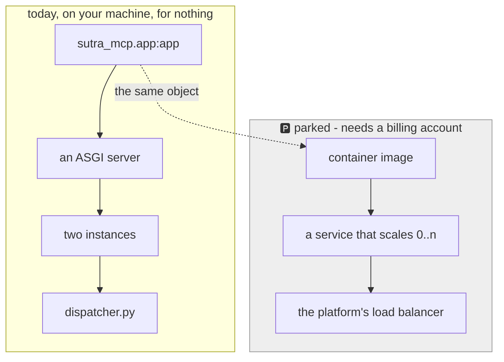

# 5.2 — 🅿️ The platform you are not paying for

## One-line answer

Sutra never deploys to a managed container platform, because every one of them needs a billing
account — but the **contract** those platforms impose is public, short, and exactly the set of rules
this whole day has been deriving, so you can satisfy it, state it and defend it without spending
anything.

## The story

You read the tenancy agreement for the flat before you decide whether to take it.

Six pages, and most of it is boilerplate. But four clauses are the ones that actually change how you
would live there: no pets, no alterations to the walls, rent on the first of the month, and the
landlord may enter with a day's notice. Those four are worth knowing before you sign, and they are
worth knowing even if you decide not to sign, because the next agreement you read will have four
clauses of its own and you now know what kind of thing to look for.

You have not moved in. You have not paid a deposit. You are not pretending to live there. And you can
still say, accurately, what living there would require of you — which is a completely different
position from never having opened the document.

## The idea in plain language

🅿️ **This is a parked topic.** Sutra does not deploy to a managed container platform on this day or
any other, and the reason is Addendum 02: every one of them requires a billing account, and a
curriculum that cannot be completed for nothing has failed a principle rather than saved a paragraph.
Nothing here is a required build step and no command in this part is one you are asked to run.

What is *not* parked is the contract. A container platform runs your image and expects a small number
of specific things from it. The list is short and it is the same list, near enough, on every one of
them.

**Listen on the port you are told, on all interfaces.** From one platform's published container
contract, read on 2026-09-05:

> *"The ingress container within an instance must listen for requests on 0.0.0.0 on the port to which
> requests are sent. Notably, the ingress container should not listen on 127.0.0.1. By default,
> requests are sent to 8080, but you can configure Cloud Run to send requests to the port of your
> choice. Cloud Run injects the PORT environment variable into the ingress container."*

That is [5.1](5.1-an-object-not-a-program.md)'s `PORT` variable, stated as an obligation. And note the
direct collision with the MCP specification's advice, read the same day, that *"when running locally,
servers SHOULD bind only to localhost (127.0.0.1)"*. Both are correct. They are advice for two
different situations, and a bind address hard-coded for either one is wrong in the other — which is
the entire argument for it being configuration.

**Start quickly, and be replaceable.** Instances are created and destroyed constantly: on a scale-up,
on a deploy, when idle, when a machine is reclaimed. Your import-time work is paid on every one of
those.

**Keep nothing on local disk.** The filesystem is per instance and disappears with it. A file written
by one instance is invisible to the others and gone at the next deploy — the same argument as this
whole day, applied to a directory instead of a dictionary.

**Handle several requests at once per instance.** Platforms send more than one concurrent request to
the same container. That is the concurrency half of
[4.2](../04-where-state-goes/4.2-shared-is-not-the-same-as-safe.md): a read-modify-write can now race
*inside* one instance, not just between two.

**Answer a health probe.** The platform decides whether an instance may receive traffic by asking it.
That is [6.1](../06-in-production/6.1-the-health-check-that-says-yes.md), and it is where the answer
being *true* starts to matter.

Read those five together and notice what they are: the requirements this day has been deriving from
first principles, written down by somebody selling infrastructure. That is the useful thing about a
container contract. It is not a product feature list, it is a **specification of what stateless
actually means to somebody who has to run your code**.

## Why Sutra needs it

Because the phase gate asks whether `sutra-mcp` is deploy-shaped, and "deploy-shaped" has to mean
something more precise than "we think it would be fine".

By the end of today it means five checkable things, none of which needs an account:

| The contract says | Sutra's answer | Checked by |
| --- | --- | --- |
| listen on `$PORT`, on `0.0.0.0` | both read from the environment | reading `app.py` |
| start fast, be replaceable | `build_server()` builds and does not work | [5.1](5.1-an-object-not-a-program.md) |
| no local state | scan is clean; state is in the store | [2.4](../02-finding-the-state/2.4-a-scan-that-can-go-red.md), [4.1](../04-where-state-goes/4.1-down-out-or-nowhere.md) |
| concurrent requests per instance | writes are one transaction | [4.2](../04-where-state-goes/4.2-shared-is-not-the-same-as-safe.md) |
| answer a health probe honestly | readiness, not just liveness | [6.1](../06-in-production/6.1-the-health-check-that-says-yes.md) |

[Day 45's audit](../../../day-45-the-mcp-audit/) can assert every row of that table on a laptop. That
is the point of parking the deployment rather than the knowledge: the *evidence* is portable even
though the platform is not.

There is also a Phase 13 promise being kept here. Containers and orchestration arrive much later in
this curriculum, and they arrive as *packaging* rather than as *redesign* — which is only true
because today did the redesign.

## The mechanism

The commands are here to be **read, not run**. Everything below would need a billing account, so
none of it is a step in this day.

```bash
# 🅿️ PARKED - not a step in this day. Requires a billing account (Addendum 02).
# What deploying sutra-mcp would look like, so you can say it out loud:
#   1. a container image whose start command is the ASGI server and the module
#   2. a service that scales instances up and down on demand
#   3. environment variables for the port, the bind address and the store URL
#   4. a health endpoint the platform probes before sending traffic
```

**Line by line:**

- Every line is a comment, and that is the honest shape for a parked topic: a description that cannot
  be pasted into a shell and run up a bill by accident.
- Step 1 is the only one that touches your code, and it is `sutra_mcp.app:app` from
  [5.1](5.1-an-object-not-a-program.md) plus an ASGI server. Nothing in the package changes.
- Step 2 is the platform's job and is exactly what the two-instance probe simulated. The probe used
  two; a platform uses whatever the traffic asks for, including zero.
- Step 3 is why `PORT` and the bind address are read from the environment rather than written into
  the file. The store's location joins them, for the same reason.
- Step 4 is the probe, and it is the one place where a wrong answer is worse than no answer at all.

What you *can* run — the same rules, on your own machine, for nothing:

```bash
cd days/day-43-stateless-by-default/lab
PORT=8901 INSTANCE=A uv run python -m uvicorn leaky_server:app --host 127.0.0.1 --port 8901
```

**Line by line:**

- `PORT=8901` is the platform's variable, set by hand. Setting it yourself is what proves the code
  reads it.
- `uv run python -m uvicorn` runs the ASGI server that is **already installed**: `uvicorn` and
  `starlette` arrive as dependencies of `mcp==1.29.1`, which declares
  `Requires-Dist: uvicorn>=0.31.1` and `Requires-Dist: starlette>=0.27`. Nothing is added today —
  `git diff pyproject.toml uv.lock` must be empty when you finish. The hub's §8 records the versions
  present and what pinning them directly would cost.
- `leaky_server:app` is `module:object`, the same string a deploy command uses, which is why the
  `sys.argv` failure in [5.1](5.1-an-object-not-a-program.md) surfaced here first.
- `--host 127.0.0.1` on a laptop, following the specification's local advice. A container would set
  `0.0.0.0`, following the platform's. Same code, two environments, one variable.
- **Zero model calls**, no account, no image, no registry.



## When it breaks

The parked topic has one failure mode that is entirely about people, and it is the reason this part
is written out rather than left as a line in a table: **a parked topic that was never described
becomes a gap you find out about in an interview.**

The concrete version, in the wrong order: a service is written, tested, reviewed and approved on a
laptop, then handed to somebody to deploy. It binds to `127.0.0.1` because that was the sensible
local default and nobody wrote down that a container needs the opposite. The container starts, the
process is running, the logs are clean, and the platform's probe never gets an answer, because it is
knocking on an interface the process is not listening on. The instance is killed and replaced. Then
again. The logs say nothing at all, because nothing failed inside the program.

That is a whole afternoon, and it is caused by a one-line default that was correct in the environment
it was chosen in.

The second break is the pin. `mcp==1.29.1` brings `uvicorn` and `starlette` with it, so today's
commands work with nothing added — and that means the deployment's HTTP server is chosen by a
transitive dependency rather than by you. It works until a future `mcp` relaxes the requirement or
moves to a different server, and then the deploy command names something that is no longer installed.
Naming it directly is the fix, and it is a decision with a real cost:

```text
uv add "uvicorn==0.52.4" "starlette==1.6.0"
```

Those are the versions installed today, and PyPI's current versions on 2026-09-05, checked live. **It
was deliberately not run.** A day pins only what it installs, and today installs nothing; adding two
direct dependencies for a deployment this repository does not perform would be pinning a decision
before it is taken. The hub's §11 records the row it would need. Take it on the day a container is
actually built.

## In production

**What a professional writes instead:** nothing different in the code — that is the finding. A
service that satisfies the five contract rules runs on any of these platforms and on a plain virtual
machine, because the rules are not platform features, they are what "several interchangeable copies"
requires. What changes is around the code: an image, a start command, a set of environment variables
and a probe path, all of which live in deployment configuration rather than in Python.

**What degrades at scale:** cold starts and connection counts, and both are consequences of things
this day made explicit. Instances are created constantly, so import-time work is paid constantly. And
[1.3](../01-accidental-state/1.3-the-state-that-is-not-a-dictionary.md)'s arithmetic arrives for
real: pool size times instance count times worker count, against a database's connection limit,
where the middle term is chosen by an autoscaler.

**The failure mode that only appears with real traffic:** scale to zero. A platform that shuts your
containers down when idle will destroy an instance between two of a caller's requests — which is
completely fine under the current MCP revision and was impossible to combine with held sessions, as
[Day 32's 2.2](../../../day-32-mcp-stateless-core/parts/02-the-reframe/2.2-three-instances-one-url.md)
said. It also means the first request after a quiet period pays the whole import cost, so a service
nobody is using is a service that feels slow to the person who finally uses it.

**The review comment a senior engineer leaves:** *"the bind address is hard-coded to 127.0.0.1. That
is right on a laptop and it means the container will start, look healthy in our logs, and never
receive a request, because the platform's probe cannot reach it. Read the host and the port from the
environment with local defaults, and put the container values in the deployment config, not in
Python."*

**The interview question:** *"how would you deploy this MCP server?"* The honest answer: *"As a
container running the ASGI app object, behind the platform's load balancer, scaled on demand — and I
would say up front that I have not deployed it, because the project is deliberately zero-budget and
every managed platform needs a billing account. What I did instead was satisfy the container
contract and prove it locally: the port and bind address come from the environment, the module builds
an object and starts nothing, there is no local disk state, every write is one transaction because
the platform sends concurrent requests to one instance, and there is a probe that reports readiness
rather than liveness. Then I ran two instances behind a round-robin and checked the answers agreed.
The contract is the same on every platform, so the deploy step is packaging rather than redesign."*

## Check yourself

```bash
cd days/day-43-stateless-by-default/lab
PORT=8901 INSTANCE=A uv run python -m uvicorn leaky_server:app --host 127.0.0.1 --port 8901
```

In another shell, `curl http://127.0.0.1:8901/healthz`. Then stop it, start it again with
`--host 0.0.0.0`, and confirm the same `curl` still works — so you can say which of the two hosts is
wrong in which environment, and why neither is a code change.

**Out loud, without scrolling up:** give the five things a container platform requires of your
process, and say which one of them contradicts the MCP specification's local advice and why both are
right.

**Next:** [6.1 — 💥 The health check that says yes](../06-in-production/6.1-the-health-check-that-says-yes.md).
