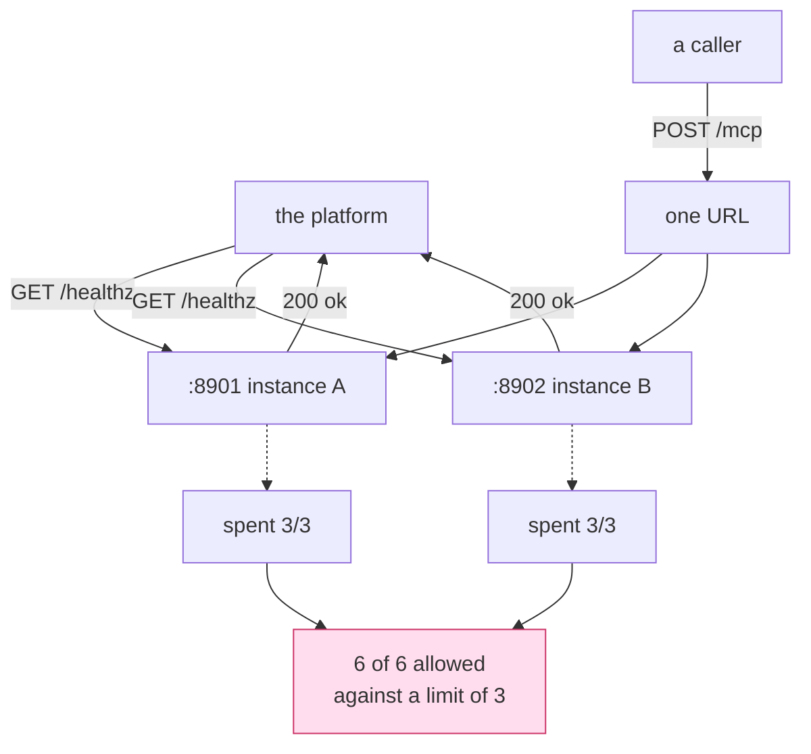

# 6.1 — 💥 The health check that says yes

## One-line answer

A health endpoint that returns `{"status": "ok"}` from inside the process is answering *"am I
running?"*, and every failure in this day happens on a process that is running — so a green health
check is not evidence of anything the day was about.

## The story

The building's standby generator is tested on the first of every month.

Somebody goes down, presses the button, and the generator starts. It runs for a few seconds, it
sounds right, and it is logged as tested. This has happened every month for two years and the log is
a clean column of ticks.

Then the power actually fails one evening, and nothing in the building comes on. The generator
started — it starts every month, it started that night too — but the switch that is supposed to move
the building's load over to it had corroded, and nobody had ever tested *that*, because testing it
means cutting the mains and nobody wants to do that at nine in the morning.

Every test passed. Every test was honestly performed. The tests answered *"does the generator
start?"*, and the question the building needed answered was *"do the lights stay on?"*

## The idea in plain language

A **health check** is an endpoint a platform calls to decide what to do with an instance. There are
two kinds and they answer different questions, and the words are worth getting right because the
consequences differ:

**Liveness** — *is this process alive?* If not, restart it.

**Readiness** — *should this instance receive traffic right now?* If not, stop sending it, and send
it again when the answer changes.

The default implementation of both is the same three lines, and it answers only the first:

    @route("/healthz")
    def healthz(request):
        return {"status": "ok"}

Think about what it takes for that to return `ok`. The process is up. The web server is accepting
connections. The routing table has an entry. That is genuinely useful — a hung process fails it, an
out-of-memory process fails it, a process that never finished importing fails it — and it is exactly
the set of failures that this day is *not* about.

Every failure in section 3 happened on two processes that were both perfectly alive. The stale cache
was on a healthy instance. The over-spent quota was two healthy instances counting correctly. The
lost draft was on a healthy instance that had never been told. There is no code path in the ordinary
health check that touches any of it.

Worse, the green tick is **read as reassurance about the wrong thing**. A dashboard of green
instances is what everybody looks at when something is wrong, and what it means is "all the processes
are running", which was never in doubt.

A readiness check earns its name by depending on the things that requests depend on: can this
instance reach the store? Is the configuration it loaded the one it should have? Is the transport it
is serving the one that lets another instance take over? Those can be false on a process that is
running perfectly, which is the whole point.

## Why Sutra needs it

Because `sutra_mcp/` is about to acquire a health endpoint, and the platform contract from
[5.2](../05-deploy-shape/5.2-the-platform-you-are-not-paying-for.md) makes it the thing that decides
whether an instance gets traffic.

Everything today moved into the shared store — the handles from
[3.5](../03-two-instances/3.5-the-handle-b-had-never-heard-of.md), the budget from
[3.4](../03-two-instances/3.4-three-a-day-per-instance.md),
[Day 39](../../../day-39-database-tools/)'s archive — is a new way for one instance to be useless
while alive. An instance that cannot reach the store answers `ok`, receives traffic, and fails every
request that needs a handle. Under the old design that instance would at least have had its own
memory to work from; the fix from section 4 has *increased* the gap between liveness and readiness,
and the check has to move with it.

And the flag from [1.4](../01-accidental-state/1.4-the-session-your-sdk-keeps-for-you.md) belongs
here too. If `stateless_http` is somehow false, this instance cannot participate in a shared URL —
which is precisely a "should not receive traffic" condition, and precisely the sort of thing nobody
notices until it is on the readiness path.

## The mechanism

The liveness check, as the lab server writes it:

```python
# days/day-43-stateless-by-default/lab/leaky_server.py  (extract)
@mcp.custom_route("/healthz", methods=["GET"])
async def healthz(request: Request) -> JSONResponse:
    """Liveness only. It proves this process is up and nothing else."""
    return JSONResponse({"status": "ok", "instance": INSTANCE})
```

**Line by line:**

- `@mcp.custom_route` is the SDK's way to mount an ordinary HTTP route beside the MCP endpoint. Its
  own docstring names health checks as an intended use, and adds that routes registered this way
  *"will not require authorization"* — correct for a probe, and a reason not to put anything
  sensitive behind it. Read at `.venv/Lib/site-packages/mcp/server/fastmcp/server.py` on 2026-09-05.
- `methods=["GET"]` because a probe is a GET. The MCP endpoint takes POST only, so there is no
  overlap.
- The handler takes a request and ignores it. Nothing is read, nothing is checked, and that is the
  honest description of what a liveness probe does.
- `"instance": INSTANCE` is the one genuinely valuable field here. When something is wrong, the first
  question is *which instance*, and an endpoint that names itself saves a step. In production this is
  the container or pod identifier, and it belongs on every log line as well.
- **What is missing is the point.** No store read, no configuration check, no flag. Adding them turns
  this into a readiness check and changes what a green answer means.

And the demonstration, which asks both questions in one run:

```python
# days/day-43-stateless-by-default/lab/health.py  (extract)
        print("\nliveness, asked of each instance directly")
        for port in (8901, 8902):
            print(f"   :{port}/healthz -> {healthz(port)}")

        print(f"\ncorrectness, asked through the one URL {URL}")
        allowed = sum("allowed=True" in tool("spend_quota") for _ in range(6))
        print(f"   allowed {allowed} of 6 against a limit of 3")
```

**Line by line:**

- The liveness loop asks each instance **directly**, on its own port, which is what a platform does.
  A probe never goes through the load balancer, because the question is about one instance.
- The correctness check goes through **the one URL**, which is what a caller does. Two different
  addresses for two different questions, in one program, is the whole design of this script.
- `sum("allowed=True" in ... for _ in range(6))` counts how many of six requests were allowed against
  a limit of three. It is [3.4](../03-two-instances/3.4-three-a-day-per-instance.md)'s failure,
  reused here as the thing the health check cannot see.
- The two blocks share a process, a rig and a moment in time. Nothing is being contrived: the same
  two instances answer both.



## When it breaks

Both questions, same run, on 2026-09-05:

```text
state = process memory

liveness, asked of each instance directly
   :8901/healthz -> 200 {"status": "ok", "instance": "A"}
   :8902/healthz -> 200 {"status": "ok", "instance": "B"}

correctness, asked through the one URL http://127.0.0.1:8900/mcp
   allowed 6 of 6 against a limit of 3

every instance reports healthy : yes
the quota was respected        : no
```

Two green ticks and a blown budget, at the same moment, from the same two processes.

Nothing in the top half is lying. Instance A is up. Instance B is up. Both would restart correctly,
both are serving, both are answering within a few milliseconds. And the system they add up to has
just spent twice its daily allowance.

The same run with the state shared:

```text
   allowed 3 of 6 against a limit of 3

every instance reports healthy : yes
the quota was respected        : yes
```

The liveness lines are **identical in both runs**, which is the finding. The check that is supposed
to tell you whether things are all right produced exactly the same output for a correct system and a
broken one. It has no discriminating power over anything this day is about, and a dashboard built on
it would have been green through every failure in section 3.

There is a nastier variant worth naming, because it is how this becomes an outage rather than a
missed signal. Suppose the shared store is unreachable from one instance — a network rule, a rotated
credential, a full disk. Liveness still returns `ok`, so the platform keeps that instance in
rotation, and it keeps failing its share of requests. With a **readiness** check that reads the
store, the instance takes itself out, the platform stops sending it traffic, and the service degrades
to reduced capacity instead of a partial outage. Same failure, same code, entirely different
afternoon — decided by which question the endpoint answers.

## In production

**What a professional writes instead:** two endpoints. `/healthz` stays exactly as it is — cheap,
dependency-free, safe to call constantly, and used only to decide whether to restart the process.
`/readyz` checks the things a request needs: one trivial query against the store, the transport flag,
and the configuration values that must be present. It is allowed to be slower, it is called less
often, and it is the one wired to traffic admission.

Two rules keep readiness from becoming its own outage. **Do not check dependencies you can survive
without** — an instance that reports not-ready because an unrelated downstream service is slow will
take the whole fleet out of rotation at once, which is a self-inflicted outage caused by a monitoring
decision. And **cache the result briefly**, because a probe that runs a query on every call, from
every instance, several times a minute, is a load pattern of its own against the store you were
worried about.

**What degrades at scale:** the probe becomes traffic. Fifty instances probed every few seconds is a
constant stream of requests, and if readiness reads the store, it is a constant stream of queries
against the busiest thing you own. This is the reason the cheap liveness check exists as a separate
endpoint rather than being folded in.

**The failure mode that only appears with real traffic:** the check that passes because it was
written against the wrong dependency. A readiness check that verifies a connection can be opened, but
never runs a query, will pass against a database that is accepting connections and refusing work.
This is the generator that starts, in code: the probe tested the part that was easy to test.

**The review comment a senior engineer leaves:** *"`/healthz` returns a literal and is wired to
traffic admission. That means an instance that cannot reach the database stays in rotation and fails
its share of requests, and our dashboard stays green throughout. Split it: keep liveness as it is,
add readiness that does one real query and checks the transport flag, and point the platform's
traffic probe at readiness."*

**The interview question:** *"your health check is green and users are seeing errors. What is
wrong?"* The honest answer: *"Almost certainly that the check answers 'is the process alive' and the
users' problem does not require the process to be dead. Everything I have broken in this system —
a per-process cache disagreeing across replicas, a quota counted twice, a handle minted on one
instance — happens on processes that are perfectly alive and would pass any liveness probe. So I
would separate the two: liveness stays a cheap literal and only decides restarts; readiness does one
real query against the store, checks that the transport is the stateless one, and is what the
platform uses to admit traffic. And I would be careful that readiness only depends on things I cannot
serve without, because a readiness check wired to an optional dependency takes the whole fleet out at
once."*

## Check yourself

```bash
cd days/day-43-stateless-by-default/lab
uv run python health.py; echo "exit: $?"
uv run python health.py --shared; echo "exit: $?"
```

Compare the two `liveness` blocks character by character. They are the same. Then say what one line
you would add to `healthz` to make it a readiness check, and what new way of failing that line
introduces.

**Out loud, without scrolling up:** say the difference between liveness and readiness, and name one
dependency that must **not** be in a readiness check.

**Next:** [6.2 — Sticky sessions, the anaesthetic](6.2-sticky-sessions-the-anaesthetic.md).
