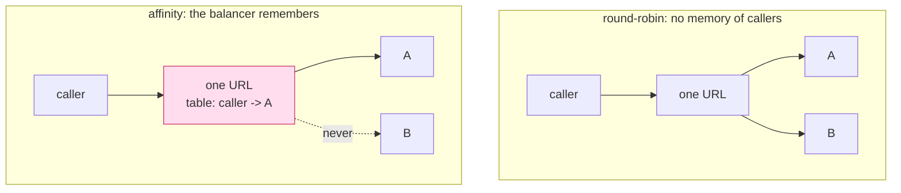

# 6.2 — Sticky sessions, the anaesthetic

## One-line answer

Pinning each caller to one instance makes every failure in this day disappear immediately, which is
exactly why it is dangerous: it removes the symptom, leaves the state in the wrong place, and hands
the bill to whoever is on call during the next deploy.

## The story

You have been going to the same barber for years, and only him.

He knows how you like it, so you sit down and say nothing. It works beautifully and it has worked
beautifully for a long time, and you have gently stopped being able to describe your own haircut.

Then one Saturday he is not there. The other chair is free and the man in it is perfectly competent,
and you discover that you cannot answer his question. You end up saying "the same as usual", which
means nothing to him, and you walk out with a haircut you did not want — not because he is worse,
but because the only copy of the information was in somebody else's head and you had been living off
that copy for years without noticing.

The arrangement was never robust. It was **untested**, which felt exactly the same right up until the
Saturday he was not there.

## The idea in plain language

**Session affinity** — sticky sessions — is a load balancer setting. Instead of picking any instance,
it looks at something identifying about the caller (a cookie, a header, the source address) and
sends that caller to the same instance every time.

It is one checkbox in every cloud console and every ingress configuration, and it fixes today's
failures completely. If every request from one caller lands on instance A, then A's cache is the only
cache the caller sees, A's drafts are all there, and A's counter is the only counter that matters.

Understanding *why* it is not the fix requires separating two claims:

**"It makes the bug go away."** True. Demonstrably, immediately, with no code change.

**"It makes the system correct."** False, and the difference is entirely about what happens when the
pinning does not hold — which it eventually will not, by design, because the whole reason you run
several instances is that any one of them may go away.

Four moments where affinity fails, and none of them is an edge case:

- **A deploy.** Instances are replaced one by one. Every caller pinned to a replaced instance loses
  whatever was in it, during a routine, planned, successful deployment.
- **A scale-up.** New instances receive no traffic from existing callers, because existing callers
  are pinned elsewhere. You have added capacity that cannot be used by the load that caused you to
  add it.
- **A crash.** The instance dies and its callers' state dies with it. This is the original bug, with a
  delay.
- **Scale to zero.** A platform that shuts idle containers down destroys the instance somebody is
  pinned to, between two of their requests.

There is also a quieter cost that shows up before any of those. Affinity routes by *conversation*
rather than by *work*, so load spreads by who is calling rather than by how much they are asking for.
One heavy caller lands on one instance, and no amount of extra capacity relieves it.

And there is a fifth thing, specific to this protocol and worth saying plainly. The 2026-07-28
revision **removed protocol-level sessions**. Affinity exists to protect a session, and at the
protocol layer there is no longer a session to protect. Turning it on now is configuring your
infrastructure to preserve something the specification deleted, in order to shield a dictionary that
should not be there.

The rule that decides real cases: **if affinity failing would produce a wrong answer rather than a
slower one, the design is broken and affinity is hiding it.** A warm local cache of immutable data is
a legitimate use — losing it costs a slow request. A draft, a counter or a session is not.

## Why Sutra needs it

Because this is the fix somebody will propose, and it will be proposed in good faith by someone
competent, at the worst possible moment.

The scene is easy to imagine and it is not a caricature. `sutra-mcp` is deployed. The support desk
reports that ticket status is sometimes wrong. Somebody runs the two-instance probe from
[3.2](../03-two-instances/3.2-the-same-question-twice-one-url.md), sees the disagreement, finds a
runbook entry about session affinity, turns it on, and the reports stop within the hour. Everybody
agrees the problem is solved. The change is small, reversible and well documented.

The next deploy is when it comes back, and by then the connection between the two events is a week
old and nobody makes it.

Sutra needs the argument written down *before* that afternoon, with the demonstration attached, so
the answer is not a matter of anybody's judgement being trusted in a hurry. That is what
`twoup.py --pinned` is for: the same rig, the same broken server, one routing change, and a clean
run.

## The mechanism

Affinity in its purest form is one line, and the lab makes it a flag rather than a code change:

```python
# days/day-43-stateless-by-default/lab/twoup.py  (extract)
# --pinned is session affinity in its purest form: two instances exist and one caller
# always reaches the same one. Part 6.2 is what that hides.
URL = "http://127.0.0.1:8901/mcp" if "--pinned" in sys.argv else "http://127.0.0.1:8900/mcp"
```

**Line by line:**

- `8901` is instance A directly; `8900` is the dispatcher. Nothing else in the probe changes — same
  requests, same order, same servers, same broken server code.
- Talking straight to one instance is a *perfect* implementation of sticky sessions: a real balancer
  approximates this and can lose the pinning, while this cannot. So the run below is affinity working
  better than it ever works in production, which makes it the strongest possible case for it.
- The choice is a conditional expression at module level rather than a value reassigned inside a
  function, so it stays a constant and
  [the scan](../02-finding-the-state/2.4-a-scan-that-can-go-red.md) has nothing to say about it.
- The comment names the part that explains it, because a flag whose purpose is to mislead you
  temporarily should say so where it is defined.

What the load balancer is being asked to do, in the two configurations:



Look at what moved. The state did not go away; it was **joined by more state, one layer further
out**. The balancer now remembers which caller belongs to which instance, and that table has all the
same problems: it is per balancer, it has to survive an instance being replaced, and it is now on the
path of every request in the system.

## When it breaks

First, affinity doing its job. The leaky server, unchanged, with every request pinned to instance A,
on 2026-09-05:

```text
state = process memory   routing = pinned to instance A

who answered   : A A A A

-- the cache: one ticket, one status change, two answers --
   A cached=False 4521: printer offline since Tuesday [status=open]
   A wrote 4521 -> resolved
   A cached=True 4521: printer offline since Tuesday [status=open]
   A cached=True 4521: printer offline since Tuesday [status=open]

-- the handle: minted by one instance, used by the next --
   minted: draft-A-1
   Sorry about the delay. Line 2.
   Sorry about the delay. Line 2. Line 3.

-- the quota: a limit of 3, asked for 6 times --
   A allowed=True spent=1/3
   A allowed=True spent=2/3
   A allowed=True spent=3/3
   A allowed=False spent=4/3
   A allowed=False spent=5/3
   A allowed=False spent=6/3
   allowed 3 of 6 against a limit of 3

behaviours that did not survive: 0
```

Zero failures. The draft is complete. The quota holds at three. Compare it with the round-robin run
of the *same server*, which failed three of four. Nothing in the code changed. This is the entire
persuasive power of session affinity, and it is why the argument has to be made carefully rather than
loudly.

Now read the cache block again, because it contains the case against.

The two `lookup` calls agree — and they agree on `[status=open]`, **after** the status was changed to
`resolved` in the same run. Round-robin gave you two answers, one of them right. Affinity gives you
one answer, and it is wrong, and it will stay wrong for as long as instance A lives. The
inconsistency became a consistency, which reads as a fix on a dashboard and is a ticket that says the
wrong thing to a customer for a day.

**Affinity did not make the cache correct. It made the cache the only thing you can see.**

The quota block hides the same trick. `spent=4/3`, `5/3`, `6/3` — the counter is not respecting the
limit, it is running past it and being refused each time by a comparison. With one instance that
arithmetic is invisible and the total is right. With three instances it would be three counters each
running past three, and the total would be nine.

And here is what the run cannot show you, because it needs a deploy: instance A restarts. `DRAFTS`
is empty, `SPENT` is back at one, the cache is cold. Every pinned caller's half-finished work is
gone, and the daily budget is fresh. The pinned run above passes right up until an ordinary,
successful, planned deployment — at which point it fails in a way nobody will connect to a load
balancer setting changed a week earlier.

## In production

**What a professional writes instead:** they turn affinity off and fix the state, and if they need
time, they turn it on **with an expiry date and a ticket**, written down, as an explicit mitigation
rather than a fix. That distinction is the whole professional content of this part: a mitigation you
have named as a mitigation is a decision, and the same setting applied silently is a trap for
somebody who will not know it is there.

The narrow legitimate use is worth knowing so the position does not sound absolutist: affinity for
locality — keeping a caller near a warm local cache of immutable data, where losing the pinning costs
latency and never correctness. That is a performance tuning decision, it is reversible at any moment,
and nothing breaks when it fails.

**What degrades at scale:** capacity utilisation, and it degrades in the direction that hurts.
Affinity distributes conversations, not work, so instances end up unevenly loaded and new instances
start cold and stay empty. The classic shape is a fleet averaging thirty per cent utilisation with
one instance saturated, and a scale-up that does not help because existing callers are pinned to the
instances that already exist.

**The failure mode that only appears with real traffic:** the rolling deploy. Replacing instances one
at a time is the safest deployment strategy there is, and with affinity it becomes the thing that
loses state — a portion of your callers at a time, on a completely successful deploy, with every
health check green throughout. The incident report says "errors during deploy" and the cause is a
setting nobody involved chose.

**The review comment a senior engineer leaves:** *"we are turning on session affinity to fix ticket
status disagreeing between replicas. That will work today and it will lose every in-flight draft on
the next rolling deploy, and it means new instances get no traffic when we scale. If we need it as a
stopgap this week, put it in the ticket with an owner and a date — but the fix is the cache, not the
router."*

**The interview question:** *"when are sticky sessions the right answer?"* The honest answer: *"Almost
never as a fix. As a fix they are an anaesthetic for state that is living in the wrong place, and the
pain comes back on the next deploy, the next scale-up or the next crash — the three things you run
several instances for in the first place. I have measured that: with a per-process cache, a
per-process draft and a per-process counter, pinning the caller to one instance took my failure count
from three to zero without changing a line of the server, and the cache then served a stale answer
consistently instead of inconsistently, which is worse in a support system. The legitimate use is
locality — staying near a warm cache of immutable data — where losing the pinning costs latency and
never correctness. My rule is: if affinity failing would give a wrong answer rather than a slow one,
the design is broken. And with MCP specifically there is nothing left to protect, because the 2026
revision removed protocol-level sessions."*

## Check yourself

```bash
cd days/day-43-stateless-by-default/lab
uv run python twoup.py; echo "exit: $?"
uv run python twoup.py --pinned; echo "exit: $?"
uv run python twoup.py --shared; echo "exit: $?"
```

Three runs of one server: red, green, green. Two of those greens are worth having. Say which, and say
what you would have to do to the pinned run to make it go red — the answer is not a code change.

**Out loud, without scrolling up:** name the four moments at which affinity stops holding, and say
what the pinned run's cache answered after the status changed.

**Next:** back to the hub — [`LESSON.md`](../../LESSON.md), §4 for the build brief and §11 for the
ledger.
