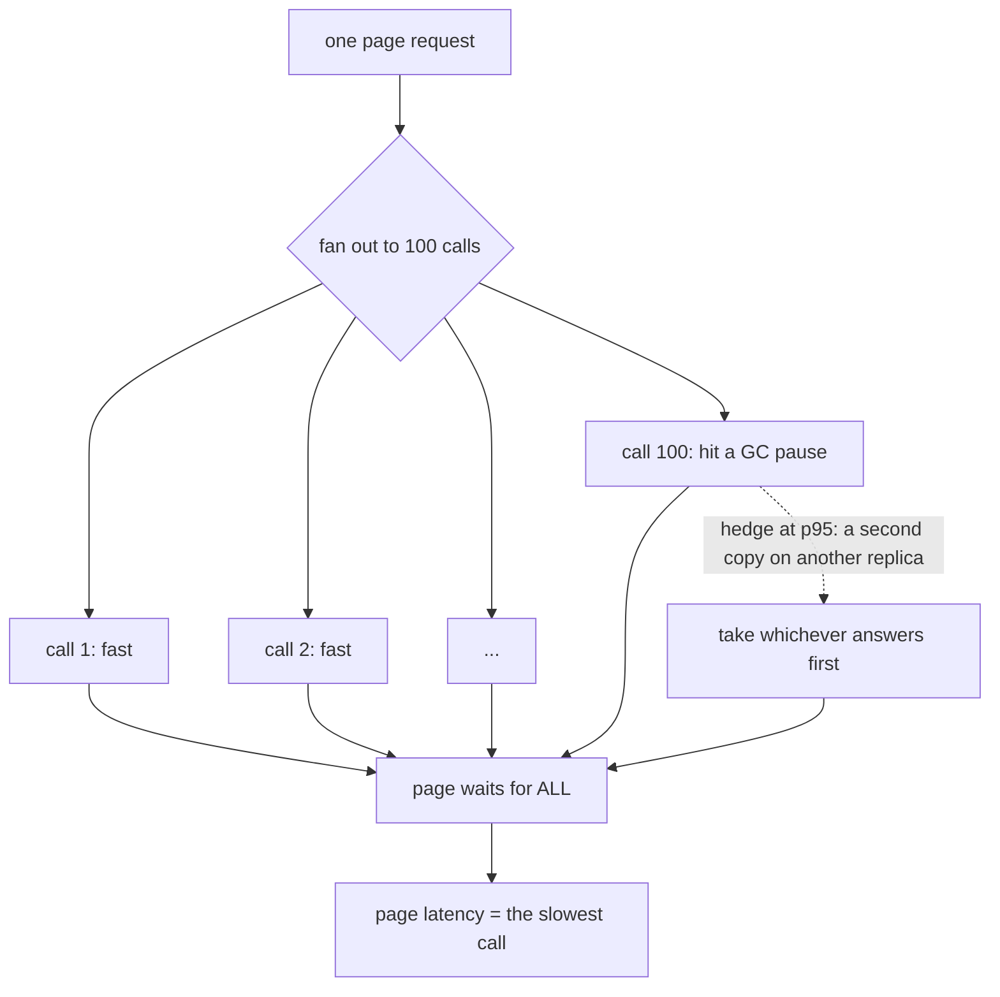

# The tail at scale

## One-line answer

When one user-visible request depends on a hundred internal calls, the slowest of the hundred decides
what the user experiences — so a service where 99% of calls are fast is a service where almost every
*page* is slow, and the fix is not to make the average faster but to stop waiting for the stragglers.

## The story

The form needs ten signatures before it can be filed, and the ten people are all in the building.

Nine of them sign it the moment you put it in front of them. It takes a few seconds each. If you time
any individual signature you would conclude that this is a fast process and that the office is well
run, and you would be right about both.

But every single day, one of the ten is not at their desk. Not the same one — it is a different person
each time, and there is always a reason, and none of the reasons are anybody's fault. Lunch. A
meeting. The dentist. And you cannot file the form with nine signatures.

So the form takes an afternoon, every time, in an office where every individual signature takes
seconds. Nobody in that building believes they are the problem, and every one of them is correct.
The problem is not any of them. It is that you need all ten, and *somebody* is always away.

## The idea in plain language

Start with one number that is easy to say and easy to get wrong: **p99**.

The p99 latency of a service is the value that 99% of its responses come in under. If a service has
a p99 of 400 milliseconds, then one response in a hundred takes longer than that. People read p99 as
"the bad case, which is rare". At scale it is not rare. It is what almost everybody gets.

Here is the arithmetic that makes that true. Suppose your page has to make **n** calls, all of them
must return before the page is ready, and each has an independent 1% chance of being slow. The chance
that the *page* is fast is the chance that none of the calls were slow:

| Calls in the page | Chance the page is fast | Chance the page is slow |
| --- | --- | --- |
| 1 | 99% | 1% |
| 10 | 90.4% | 9.6% |
| 100 | 36.6% | **63.4%** |
| 500 | 0.7% | 99.3% |

A hundred calls turns a one-in-a-hundred event into a coin flip you lose more often than not. And
nothing about the individual service changed — it is still hitting its 99th percentile. **The
service's tail became the page's median**, purely through fan-out.

Why does the tail exist at all? Not because of bugs. The paper's list is of things that are normal
and unavoidable in a shared system: other tenants on the same machine, background jobs like
compaction and index maintenance, queueing behind an unlucky earlier request, garbage collection
pauses, energy management on the processor, and a maintenance operation that had to happen sometime.
Every one is a legitimate activity, and every one occasionally makes one request slow. You cannot
remove them; you can only stop waiting for the request they landed on.

That reframing is the paper's contribution, and it is worth saying plainly because it sounds obvious
only after you have heard it: **the way to build a predictable system out of unpredictable parts is
not to make the parts predictable.** It is to design the caller so a slow part does not become a slow
answer — the same intellectual move as building a reliable network out of unreliable links.

## Why Sutra needs it

Directly, in two parts of this day.

[2.1](../parts/02-the-deadline/2.1-two-clocks-not-one.md) says a call deadline should be derived from
the tool's own latency distribution rather than chosen by feel. This paper is why the distribution is
the right object to look at and why the far end of it is the part that matters.

[4.1](../parts/04-when-to-stop-asking/4.1-the-retry-that-took-it-down.md) measured a retry storm and
found that retries made an overload worse. Hedging — the paper's main technique — looks superficially
like a retry and is the opposite in the way that matters: a retry is sent *after* a failure, when the
system is already in trouble; a hedge is sent *before* one, while the system is healthy, and is
therefore load you are choosing to spend when you can afford it.

And Sutra's own future is a fan-out. Phase 8's triage graph runs several tools per ticket and cannot
answer until they have all returned, which is exactly the table above with a small **n** — small
enough to be survivable, large enough that the arithmetic is already working against you.

## The mechanism

The paper offers techniques at two time scales. The distinction matters: some of them respond to a
slow request that is happening right now, and some of them change the system so fewer requests are
slow in the first place.

**Within a request — the reactive techniques.**

*Hedged requests.* Send the request to one replica. If it has not answered by some threshold — the
paper uses the 95th percentile of the expected latency for that operation — send the same request to
a second replica and take whichever answers first. Because only the slowest 5% are ever duplicated,
the extra load is a few per cent, and the tail improvement is large. The threshold is the whole
design: set it at the median and you have doubled your traffic; set it at p95 and you pay 5%.

*Tied requests.* Send the request to two replicas immediately, and tell each one the identity of the
other. Whichever server *starts* the work first sends a cancellation to its twin. This attacks the
dominant cause of the tail, which is queueing: a request sitting in a queue behind a slow one is
still eligible to be served by a different, idler replica. The cost is a small window in which both
servers may start, so the paper recommends a deliberate short delay before the second send.

*Micro-partitioning.* Cut the data into many more partitions than there are machines — say twenty
partitions per machine — so that the unit of work you can move is small. Then rebalancing is cheap,
and a machine that becomes slow can be relieved gradually rather than by an all-or-nothing failover.

*Selective replication.* Detect the partitions that are hot and make extra copies of those, so that
load on a popular item can be spread. This is micro-partitioning's natural partner: small units make
selective replication affordable.

*Latency-induced probation.* Watch each replica's observed latency, and when one becomes an outlier,
stop sending it work — while continuing to send it occasional probes so it can return when it
recovers. That is a circuit breaker keyed on **slowness** rather than on failure, which is exactly
[4.2](../parts/04-when-to-stop-asking/4.2-the-switch-that-refuses-first.md)'s state machine with a
different trigger. A server that is slow but answering will never trip a failure-counting breaker.

**Across requests — the structural technique.** *Good enough responses.* When a request fans out to
many shards, return once a sufficient fraction have replied rather than waiting for all of them,
marking the answer as partial. This trades completeness for predictability and is only available when
the caller can honestly say what a partial answer means. It is the same instinct as Day 24's
[5.2](../../day-24-token-accounting-and-budgets/parts/05-in-production/5.2-degrading-not-failing.md):
degrade rather than fail.

Here is why hedging works at all, because it is not obvious and it is not "trying twice for luck".
The reason is **independence**. If a call is slow because of a garbage-collection pause on replica A,
that says nothing about replica B, so the second copy's latency is a fresh draw from the distribution
rather than a repeat of the first. Hedging exploits the fact that the *cause* of a slow response is
usually local and transient.

And that tells you exactly when hedging fails: when the slowness is **not** independent. If the
backend is slow because it is overloaded, every replica is slow, the hedge is a fresh draw from the
same bad distribution, and you have added load to an overloaded system. That is
[4.1](../parts/04-when-to-stop-asking/4.1-the-retry-that-took-it-down.md) again, arriving through a
technique that was supposed to be the safe one.



## The paper in one demo

Two files, no model, no framework. A backend with a long tail, a caller that fans out to a hundred of
them, and one switch that turns hedging off.

```text
days/day-44-client-hardening/lab/papers/the-tail-at-scale/
├── backend.py    the latency distribution: fast almost always, awful sometimes
└── fanout.py     the caller, the hedge, and the measurement
```

```python
# days/day-44-client-hardening/lab/papers/the-tail-at-scale/backend.py
FAST_MS = (1.0, 10.0)  # the ordinary response
SLOW_MS = (400.0, 900.0)  # a garbage collection pause, a queue, a slow disk
SLOW_SHARE = 0.01  # one response in a hundred


def latency_ms(rng: random.Random) -> float:
    """Draw one response time in milliseconds.

    Each draw is independent: the same server is slow for *this* request without
    being slow for the next one. That independence is what hedging exploits.
    """
    if rng.random() < SLOW_SHARE:
        return rng.uniform(*SLOW_MS)
    return rng.uniform(*FAST_MS)
```

**Line by line:**

- `SLOW_SHARE = 0.01` makes the slow case exactly one in a hundred, so the demo's p99 is the boundary
  between the two regimes and the arithmetic in the table above applies directly.
- `SLOW_MS` is two orders of magnitude above `FAST_MS`. That gap is what makes a tail a *tail* rather
  than a wide distribution — the paper's whole subject is bimodal behaviour, where the slow case is
  not a slightly slower version of the fast case but a different thing happening.
- `latency_ms` takes an `rng` rather than using the module-level `random`, so the caller controls the
  stream and both arms of the demo are reproducible.
- **Each call is an independent draw.** This is the modelling assumption the whole paper rests on,
  and the docstring says so out loud, because it is also the assumption that fails during an overload
  — see *When it breaks*.
- There is no server, no socket and no thread. The demo measures a distribution, and adding a real
  server would add scheduling noise that obscures the effect being measured.

```python
# days/day-44-client-hardening/lab/papers/the-tail-at-scale/fanout.py
PAGES = 2000  # how many pages we build
FANOUT = 100  # calls one page makes; every one must come back
HEDGE_AFTER_MS = 15.0  # send the second copy once a call has taken this long
SEED = 2013


def one_call(rng: random.Random, hedge: bool) -> float:
    """Milliseconds until this call is answered, hedged or not."""
    global REQUESTS
    REQUESTS += 1
    first = latency_ms(rng)
    if not hedge or first <= HEDGE_AFTER_MS:
        return first
    # Still outstanding at the hedge point: send a second copy and take whichever
    # answers first. The first copy is not cancelled; it may still win.
    REQUESTS += 1
    second = HEDGE_AFTER_MS + latency_ms(rng)
    return min(first, second)
```

**Line by line:**

- `HEDGE_AFTER_MS = 15.0` sits just above the fast range's ceiling of 10ms, which is the paper's rule
  — hedge at roughly the 95th percentile, so that only the calls which are already unusual are
  duplicated. Set it to 5.0 and you would duplicate most calls; set it to 400.0 and you would
  duplicate none of the ones that matter.
- `if not hedge or first <= HEDGE_AFTER_MS: return first` — a call that answers before the hedge point
  is never duplicated. **That single condition is why hedging is cheap**, and it is the difference
  between hedging and simply sending everything twice.
- `REQUESTS += 1` appears twice, once for each copy sent. Counting requests rather than assuming the
  cost is what lets the demo report the real overhead rather than a claim about it.
- `second = HEDGE_AFTER_MS + latency_ms(rng)` — the second copy's total latency is measured from the
  original request, so it includes the time already spent waiting. Forgetting that term would make
  hedging look better than it is.
- `min(first, second)` and **not** a replacement. The first copy is still running and may still win,
  which is exactly the real behaviour: you cannot un-send a request
  ([1.2](../parts/01-what-may-be-repeated/1.2-a-timeout-is-an-unknown.md)). Modelling it as a
  replacement would ignore the case where the hedge is also unlucky.
- `SEED = 2013` is the paper's year, and its only job is to make both arms draw from the same stream.

```python
# fanout.py (continued)
    for _ in range(PAGES):
        page = [one_call(rng, hedge) for _ in range(FANOUT)]
        calls.extend(page)
        pages.append(max(page))  # the page is not ready until the last call is
```

**Line by line:**

- `max(page)` is the entire thesis of the paper expressed as one function call. The page's latency is
  the maximum of its calls, not their average and not their sum, because they run in parallel and all
  of them must return.
- `calls` and `pages` are collected separately so the output can show both distributions side by
  side. Showing only the page distribution would leave a reader unable to see that the individual
  service was fine all along.

Run both arms:

```bash
cd days/day-44-client-hardening/lab/papers/the-tail-at-scale
uv run python fanout.py
uv run python fanout.py --hedge
```

**Line by line:**

- `cd` first, because `fanout.py` imports `backend` by name from the same directory.
- `--hedge` is the ablation switch. It changes one boolean; the distribution, the fan-out and the
  seed are identical.
- **Zero model calls.** There is no model, no network and no server in this demo.

Measured on 2026-09-05:

```text
hedging: False
2000 pages, 100 calls each

                   p50       p95       p99       max
one call          5.5ms      9.6ms    421.2ms    899.7ms
whole page      559.1ms    876.3ms    895.6ms    899.7ms

pages slower than 100ms : 1268 of 2000 (63.4%)
requests sent           : 200000 for 200000 calls
extra load              : 0.0%
```

```text
hedging: True (after 15ms)
2000 pages, 100 calls each

                   p50       p95       p99       max
one call          5.5ms      9.6ms     16.4ms    748.2ms
whole page       18.9ms     24.7ms     25.0ms    748.2ms

pages slower than 100ms : 18 of 2000 (0.9%)
requests sent           : 202082 for 200000 calls
extra load              : 1.0%
```

Read the un-hedged run first, one row at a time.

**One call: p50 of 5.5ms, p95 of 9.6ms.** This service is fast. Any dashboard would say so, and any
engineer looking at it would move on to a different problem.

**Whole page: p50 of 559.1ms.** The median page is a hundred times slower than the median call, and
**63.4% of pages took longer than 100ms** — which is the exact number the arithmetic table predicted
for a hundred calls at a 1% slow rate. Nothing is broken. The service is meeting its p99 and the user
experience is bad anyway.

Now the hedged run. **Page p50 falls from 559.1ms to 18.9ms**, page p99 from 895.6ms to 25.0ms, and
the fraction of slow pages from 63.4% to **0.9%**. The cost is on the last line: **202,082 requests
instead of 200,000, which is 1.0% extra load.**

A thirtyfold improvement in median page latency for one per cent more traffic. That is the paper's
claim, and this is it reproduced on a laptop with two files and no network.

One row deserves a second look because it is the honest limit. The `max` column barely moved: 899.7ms
to 748.2ms. Hedging does not eliminate the worst case — it makes the worst case *rare*. When both
copies of a call are unlucky, you wait. Eighteen pages out of two thousand still took longer than
100ms, and no amount of hedging removes them.

## When it breaks

**When the slowness is not independent.** Everything above rests on the second copy being a fresh
draw. If the backend is slow because it is *overloaded*, every replica is slow, the hedge draws from
the same bad distribution, and the extra load makes the overload worse. Turn `SLOW_SHARE` up to `0.5`
in `backend.py` and re-run the hedged arm: the extra load rises sharply because half the calls now
cross the hedge threshold, and the improvement shrinks because the second copy is usually slow too.
That is [4.1](../parts/04-when-to-stop-asking/4.1-the-retry-that-took-it-down.md) wearing the
paper's clothes, and it is why hedging must be governed by a budget — a cap on the fraction of
requests that may be hedged — rather than being unconditional.

**When the threshold is wrong.** The 1% overhead is entirely a consequence of hedging at p95. Set
`HEDGE_AFTER_MS` to `5.0` and most calls get duplicated: the extra load approaches 100% and you have
built a system that sends everything twice, which is a capacity decision rather than a latency
technique. The threshold has to be derived from the *measured* distribution and re-derived when it
moves, which means hedging is not a thing you configure once.

**When the operation is not idempotent.** A hedge is a second execution of the same request. For a
read that is fine, and for `close_ticket` it is two emails — the whole of
[1.1](../parts/01-what-may-be-repeated/1.1-the-button-you-can-press-twice.md). The paper is written
about read-heavy search infrastructure and says so; applying its techniques to writes without an
idempotency key is a misreading that the demo above would not catch, because the demo measures
latency and not side effects.

**When there is only one replica.** Hedging, tied requests and probation all assume you have
somewhere else to send the work. A single MCP server behind a single URL offers no second copy, and
the technique is simply unavailable. This is the case Sutra is in for `sutra_mcp` until it runs more
than one instance, which is [Day 43](../../day-43-stateless-by-default/LESSON.md)'s subject.

**What the paper assumed that you may not have.** It is written from inside a fleet with thousands of
machines, many replicas of everything, and a fan-out measured in hundreds. At **n = 3** the
arithmetic is much kinder — 97% of pages are fast at a 1% slow rate — so the techniques are not worth
their complexity. Knowing the shape of the curve is what tells you when they become worth it, and for
most systems the answer is "not yet".

## In production

**What survived.** The framing, completely. "Tail latency" is now the ordinary vocabulary of
performance work, and p99 rather than the mean is what teams put on a dashboard and write into a
service level objective. That is not a small thing — before this paper, latency was routinely
reported as an average, and an average is precisely the statistic that hides the phenomenon.

Hedging survived and is in shipped infrastructure. gRPC has hedging as a first-class retry policy
that you configure declaratively, with a hedging delay and a maximum number of attempts, and modern
service meshes expose it too. Envoy ships per-try timeouts and outlier detection — ejecting a host
from the load-balancing pool when its behaviour is anomalous — which is latency-induced probation
under a different name. Micro-partitioning is how essentially every modern distributed data store
does rebalancing, and it is now so standard that it is rarely credited to anything.

**What did not survive, or never spread.** Tied requests are the paper's most elegant idea and are
almost nowhere, because they need the *servers* to cooperate: each must know its twin and be able to
cancel it, which is a protocol change rather than a client change. Clients can adopt hedging alone;
tied requests need everybody. MCP has no notion of it at all, and given that
[5.1](../parts/05-no-held-connections/5.1-the-chair-you-hold-for-nobody.md) is about a protocol that
deliberately holds less rather than more, it is unlikely to acquire one.

"Good enough" partial responses stayed inside search-shaped systems and did not generalise, for the
honest reason that most callers cannot say what a partial answer means. A search that returns 95% of
the shards is a slightly worse search; a ticket lookup that returns 95% of a ticket is not a ticket.

**What the field added afterwards.** Two things the paper does not have. First, the recognition that
hedging without a budget is dangerous — every serious implementation now caps hedged requests as a
fraction of total traffic, precisely because of the correlated-slowness case above. Second,
distributed tracing. The paper describes techniques for surviving the tail; tracing is what tells you
*which* of your hundred calls is producing it, and without that the techniques are applied blind.
Sutra has the beginning of this from Day 22's
[correlation id](../../day-22-structured-logging/parts/02-wiring-the-run/2.2-the-correlation-id.md).

**The review comment a senior engineer leaves:** *"our p50 is fine and our users say the page is slow.
How many backend calls does one page make? If it is more than about twenty, our p99 is the thing they
are experiencing and the mean is telling us nothing."*

**The interview question:** *"your service has a p99 of 400ms and users complain constantly. What is
going on?"* — *"Almost certainly fan-out. If a page makes a hundred calls and each has a one per cent
chance of being slow, then about sixty-three per cent of pages hit at least one slow call, and the
page waits for the slowest — so the service's p99 has become the page's median. I would measure the
page distribution rather than the call distribution first, because those two numbers can be wildly
different and only one of them is what the user feels. The fix is usually hedging: send a second copy
of anything still outstanding at about the p95 mark and take whichever answers first. I have measured
that on a simulation — two thousand pages, a hundred calls each — and it moved the page p50 from 559
milliseconds to 19 for one per cent extra load. The two things I would insist on are a budget capping
what fraction of requests may be hedged, because if the backend is slow through overload the second
copy is slow too and you are adding load to a fire, and that only idempotent operations get hedged,
since a hedge is a second execution."*

## Check yourself

```bash
cd days/day-44-client-hardening/lab/papers/the-tail-at-scale
uv run python fanout.py
uv run python fanout.py --hedge
```

Then set `FANOUT` to `10` and run both arms again. The un-hedged page p50 collapses. Work out from
the arithmetic table why, and say at what fan-out you would start considering hedging in a system you
own.

**Out loud, without scrolling up:** say what this paper claimed in one sentence, then say what we do
differently now — and name the one condition under which hedging makes an incident worse instead of
better.
