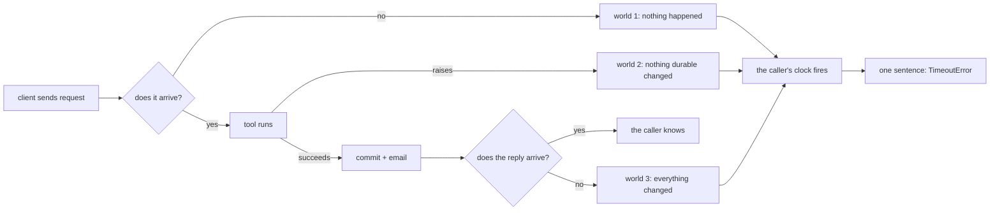

# 1.2 — A timeout is an unknown, not a failure

## One-line answer

When a call times out, the one thing you have learned is that you did not hear back — the work may
never have started, may have started and failed, or may have completed perfectly — and code that
treats "timed out" as "did not happen" is guessing at one of three worlds.

## The story

You put the card in the machine outside the bank and ask for two thousand.

The screen thinks. Then it goes blank, then it shows the bank's logo again, and no money comes out
and no slip prints. You stand there for a while in case something else happens, and nothing does.

Now: has the money left your account?

You genuinely do not know, and this is the interesting part — you have no way of finding out from
where you are standing. The machine is not going to tell you. Nobody inside the branch can see what
that machine did in the last minute. Everything you can observe is the same in the case where the
request never reached the bank, the case where the bank refused it, and the case where the bank
debited you and the machine failed before counting the notes.

So you do the sensible human thing: you do not put the card back in and ask for another two thousand.
You check the balance first. And checking the balance is not being timid — it is refusing to act
until you know which world you are in.

The blank screen was not a "no". It was a silence, and you cannot argue with a silence.

## The idea in plain language

There are two very different sentences that people write with the same word.

- **The call failed.** You know what happened: the server answered, and its answer was a refusal.
  A `404`. A JSON-RPC error. A tool result with `isError: true`. Something came back.
- **The call timed out.** *Nothing* came back. Your own clock fired
  ([Day 38's 1.1](../../../day-38-failure-and-migration-lab/parts/01-the-clock/1.1-the-only-clock-is-yours.md)
  is where you built that clock), and firing a clock tells you about your patience, not about the
  server.

The second one is not a failure. It is an **unknown outcome**, and there are exactly three worlds it
could be hiding:

1. The request never reached the server. Nothing happened.
2. The request reached the server, the work ran, and it failed. Nothing durable changed.
3. The request reached the server, the work ran, **it succeeded**, and the answer was lost on the way
   back. Everything changed.

World 3 is the one everybody forgets, and it is not exotic. Day 38's
[1.2](../../../day-38-failure-and-migration-lab/parts/01-the-clock/1.2-giving-up-ends-the-wait.md)
made you watch a server announce it had finished *after* the client had given up: **giving up ends
the wait, not the work.** Everything the server had already done is still done.

Why can you not just ask? Because asking is another call, over the same wire, with the same three
worlds. There is no message that means *"tell me truthfully whether you did the thing"* which is
itself immune to being lost. That is not a gap in MCP; it is a property of any two machines that talk
over something that can drop messages.

So the practical rule, which is the whole of this part: **a timeout tells you to stop waiting. It
does not tell you what to do next.** What to do next depends entirely on
[1.1](1.1-the-button-you-can-press-twice.md)'s question — could this have happened twice without
hurting anybody?

- Idempotent call, timed out → retry. If you are in world 3, the retry is harmless.
- Non-idempotent call, timed out → do **not** retry. If you are in world 3, the retry is the second
  lorry of cement.

## Why Sutra needs it

Sutra's client is about to grow a retry loop. A retry loop is a piece of code that acts on an
unknown, so the sentence it acts on had better be the true one.

The specific place this bites is `close_ticket`, which has been sutra-mcp's gated write since
[Day 38's 3.2](../../../day-38-failure-and-migration-lab/parts/03-the-quiet-ones/3.2-the-ticket-closed-twice.md).
The reasonable-sounding argument for retrying it goes: *"the call failed, so the ticket is still
open, so closing it again is just… closing it."* Every word of that is an inference from a silence.
Once you can say out loud that a timeout is an unknown, the argument evaporates on its own, and you
do not need a rule to protect you from it.

You also need this to read [2.2](../02-the-deadline/2.2-the-deadline-never-reached.md) correctly.
When a deadline fires early, you have not made the work stop. You have made *yourself* stop, and
increased the number of times you will be in world 3.

## The paper behind it

> **End-to-end arguments in system design** · `doi:10.1145/357401.357402` · 1984 ·
> `https://doi.org/10.1145/357401.357402`

The claim, in one sentence: a function can only be completely and correctly implemented with the
knowledge that sits at the endpoints of a communication system, so the lower layers cannot guarantee
it for you and should not try.

That is exactly the situation here. No transport can tell you which of the three worlds you are in,
because a transport that could would have to have delivered the answer — which is the thing that just
failed. Only the two endpoints, which know what the operation *means*, can settle it: the server by
remembering what it has already done, the client by knowing whether repeating is safe. The paper is
taught on Day 21, at
[`papers/01-end-to-end-arguments.md`](../../../day-21-errors-surface-not-swallow/papers/01-end-to-end-arguments.md).

## The mechanism

Three different things happen on the server. The client is handed one sentence, and it is the same
sentence every time:

```python
# days/day-44-client-hardening/lab/unknown.py
SERVER_LOG: list[str] = []


def request_lost(ticket_id: str) -> None:
    """The request never reached the server."""
    raise TimeoutError("no response within the deadline")


def work_failed(ticket_id: str) -> None:
    """The request arrived, the tool ran, the tool raised, and the error was lost."""
    SERVER_LOG.append(f"close_ticket({ticket_id}) started")
    SERVER_LOG.append(f"close_ticket({ticket_id}) raised DatabaseError")
    raise TimeoutError("no response within the deadline")


def reply_lost(ticket_id: str) -> None:
    """The request arrived, the tool ran, it succeeded, and the reply was lost."""
    SERVER_LOG.append(f"close_ticket({ticket_id}) started")
    SERVER_LOG.append(f"close_ticket({ticket_id}) committed; notice emailed")
    raise TimeoutError("no response within the deadline")
```

**Line by line:**

- All three functions end with the *identical* `raise TimeoutError("no response within the
  deadline")`. That repetition is the finding, not a smell. If you refactored it into a shared helper
  you would be hiding the one fact the script exists to show.
- `SERVER_LOG` is the server's private knowledge. Notice that `request_lost` writes nothing to it and
  `reply_lost` writes two lines to it, including a committed transaction and an email — and the
  client sees neither log.
- `work_failed` raises `TimeoutError` rather than `DatabaseError`, and that is not a mistake. The
  server *did* raise a `DatabaseError`, but the error report is a message like any other and it went
  into the same hole the success would have gone into. **A failure you were not told about is
  indistinguishable from a success you were not told about.**
- `reply_lost` appends `"committed; notice emailed"` — a database commit and an email, in that order,
  both irreversible, both invisible to the caller. This is the world that turns a retry into a
  duplicate.
- The functions take `ticket_id` and mostly ignore it. Keeping the parameter makes the three
  signatures identical, so the driver can call them in a loop without special cases.

Run it:

```bash
cd days/day-44-client-hardening/lab
uv run python unknown.py
```

**Line by line:**

- One command, no flags. There is no ablation here because there is nothing to switch off — the point
  is a fact about the world, not a technique.
- **Zero model calls.**

Measured on 2026-09-05:

```text
what really happened                                 | what the caller was told
-----------------------------------------------------+-------------------------------------------
the request never arrived                            | TimeoutError: no response within the deadline
it arrived and the work failed                       | TimeoutError: no response within the deadline
it arrived, the work succeeded, the reply was lost   | TimeoutError: no response within the deadline

the server's own log for the third world:
  close_ticket(4521) started
  close_ticket(4521) committed; notice emailed

the caller has none of those lines. It has one sentence, and the
sentence does not say which of the three worlds it is in.
```

The right-hand column has one distinct value. That is the entire mechanism of this part: **the
information you would need to decide was never sent.**

Here is the same fact as a picture, because the shape of it is what you want to remember:



Three paths, one exit. The diagram is not a simplification; the funnel at the bottom is the thing
itself.

## When it breaks

The most common breakage is a client that turns the unknown into a confident sentence for the model
to read. It looks like care:

```text
{"content": [{"type": "text", "text": "The ticket could not be closed. Please try again."}],
 "isError": true}
```

"Could not be closed" is a claim about world 1 or 2, asserted from inside world 3. A model reading it
will tell the customer their ticket is still open, and an agent following its instructions will very
reasonably try again. One sentence of misplaced confidence has produced a duplicate write *and* a
false statement to a customer. The honest text is longer and uglier and says *"did not answer within
the deadline; whether the ticket was closed is unknown"*.

The second breakage is a retry that repairs itself into world 3. Day 38's
[2.4](../../../day-38-failure-and-migration-lab/parts/02-the-x-ray/2.4-the-reply-that-arrived-twice.md)
is the anatomy: you re-issue after a timeout, the *first* reply then arrives, and your client matches
it to the second request. You now have an answer to a question you did not ask. The real MCP error
this produces on a session that is still alive is not a timeout at all:

```text
mcp.shared.exceptions.McpError: Timed out while waiting for response to ClientRequest. Waited 1.0 seconds.
```

Read that message carefully. It says `ClientRequest` — the wrapper type — and not `CallToolRequest`.
The SDK's own timeout message **does not tell you which call timed out**. You verified that against
the installed library in [2.4](../02-the-deadline/2.4-the-numbers-your-libraries-chose.md); it is why
Sutra's own wrapper attaches its own label.

The third is the one that gets designed in. Somebody adds a "check before retry": call
`lookup_ticket` first, and only retry `close_ticket` if the ticket is still open. It reduces the
window and does not close it, because the check and the retry are two calls with a gap between them,
and under concurrency another worker can close the ticket in that gap. A smaller window is not a
guarantee, and code that reads as a guarantee will be trusted as one.

## In production

**What a professional writes instead of the teaching version.** The three worlds get names in the
codebase, because a distinction with no vocabulary does not survive a team. Failures are classified
into *definitely did not happen* (a refusal that arrived — a `4xx`, a JSON-RPC error), *definitely
happened* (a result arrived), and *unknown* (a timeout, a connection reset, a broken pipe), and the
retry policy branches on the class, not on the exception type. Day 38's
[2.2](../../../day-38-failure-and-migration-lab/parts/02-the-x-ray/2.2-malformed-is-not-transient.md)
built that classifier; today it acquires a third bucket.

**What degrades at scale or under concurrency.** The unknown bucket grows with load, and it grows
fastest exactly when you can least afford it. A healthy service produces almost none; a service under
pressure produces mostly these, because slow responses trip client deadlines while the work still
completes. So the rate of *ambiguous* outcomes is not a constant small number — it is a function of
how loaded the far side is, which is why an incident that starts as "the service is slow" ends as
"why do these customers have duplicate charges".

**The failure mode that only appears with real traffic.** World 3 requires the reply to be lost after
a success, which on a healthy network is rare enough to never appear in testing. You cannot wait for
it to teach you; you have to construct it, which is precisely what `Wire` in
[1.1](1.1-the-button-you-can-press-twice.md) and this part's three functions are for. A team that has
never simulated world 3 has never tested its own retry policy.

**The review comment a senior engineer leaves:** *"this catch block says the tool failed. It does not
know that. It knows we stopped waiting. Rename the variable, fix the message the model sees, and tell
me what the code does differently in the case where the write actually landed."*

**The interview question:** *"your service calls another service, the call times out, what do you
do?"* The answer that shows experience does not start with retries. *"First I say what I know, which
is less than it looks: I know I did not hear back. The work might not have started, or it might have
completed and the answer got lost. So the decision is not 'retry or fail', it is 'is this operation
one I can afford to have happened twice'. If it is a read, I retry. If it is a write, I do not — I
surface it as an unknown outcome, with the request and the correlation id attached, so a human or a
compensating job can settle it. The thing I try hardest to stop people doing is writing 'the call
failed' in the error message, because it is a claim we cannot support and everything downstream
believes it."*

## Check yourself

```bash
cd days/day-44-client-hardening/lab
uv run python unknown.py
```

Then add a fourth world to `WORLDS` in which the server is still working and will succeed in another
second. Predict what the right-hand column will say before you run it.

**Out loud, without scrolling up:** state the three worlds a timeout could be hiding, then say which
one makes a retry dangerous and why the other two do not.

**Next:** [1.3 — The line drawn through every call Sutra makes](1.3-the-line-through-every-call.md).
