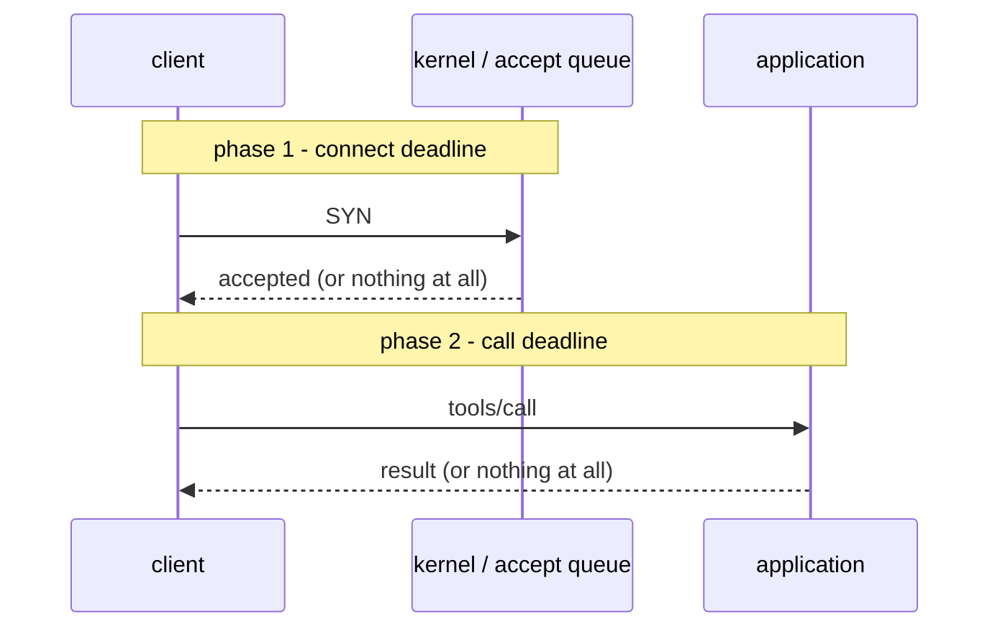

# 2.1 — Two clocks, not one

## One-line answer

"The server is not there" and "the server is there and not answering" are different facts with
different fixes, they fail at different points in the call, and a client with one timeout number is
serving one of them badly.

## The story

You go for passport photographs at the studio near the junction, and there are two completely
different ways the trip can go wrong.

The first: the shutter is down. No lights, no notice, nobody about. You stand there for a bit, look
at your phone, and then leave and try the place by the bus stand. You did not stand there for an
hour — you knew within a minute or two that there was nothing to wait for, because a closed shop is
not going to open harder if you wait.

The second: the shutter is up, the man is in, he takes your name, and then he starts adjusting the
light. He moves the stand. He goes into the back for a different bulb. He comes back and moves the
stand again. You have a train later and you are now in the awkward position of being *inside* a
transaction that is going fine, just slowly, with a growing suspicion that you should have gone to
the other place — except that if you leave now you have wasted the wait and you still have no
photographs.

Two failures. Both are "I did not get my photographs". Nobody sane uses the same amount of patience
for them, because the first one is answered by walking away and the second one is answered by a
decision about how much longer this is worth.

## The idea in plain language

A call to another process has two phases, and each one can hang independently.

- **Connecting.** Getting a channel to the other side at all. Over HTTP that is a TCP connection and
  a TLS handshake to a host that may not be listening. Over stdio it is launching a child process,
  which Day 33's
  [2.1](../../../day-33-client-and-transports/parts/02-stdio/2.1-connecting-is-launching.md) is
  entirely about — on stdio, connecting *is* launching.
- **Calling.** Having got a channel, sending a request and waiting for the answer.

They deserve different numbers because they are different questions:

| | Connect | Call |
| --- | --- | --- |
| What is being waited for | somebody to accept | somebody to finish work |
| Does waiting longer help? | almost never | sometimes |
| A sensible order of magnitude | small and fixed | depends on the tool |
| What a failure means | the server is not reachable | the server is reachable and slow or stuck |
| The right next move | try another instance, fail fast | back off, or hand over to a task handle |

The connect number should be small, because a server that has not accepted your connection is not
getting better while you wait — the accept queue is at the operating-system level and does not depend
on how much work the application has. If it did not accept in a second, another second is unlikely to
change anything, and you have infrastructure that can send you to another instance.

The call number is a per-tool decision, and this is the bit people get wrong by giving every tool the
same one. `lookup_ticket` reading one row and `reindex_archive` walking the whole store do not deserve
the same patience. One global number is either too short for the slow tool — turning a working system
into one that never completes anything — or too long for the fast one, which means a stuck lookup ties
up a worker for the whole of the long tool's budget.

There is a third number people forget, and it belongs to a *stream* rather than a call: how long you
are willing to wait for the **next chunk** of a response that has started arriving. Day 38's
[1.1](../../../day-38-failure-and-migration-lab/parts/01-the-clock/1.1-the-only-clock-is-yours.md)
already showed you the trap — a per-read timeout does not bound a whole request, because a server
sending one byte a second never trips it. [2.4](2.4-the-numbers-your-libraries-chose.md) shows you
exactly which of your installed libraries uses which of these three, and the answer is not the one
you would guess.

## Why Sutra needs it

Day 33 gave `connect_stdio` and `connect_http` a `timeout=5.0` parameter and Day 40's policy module
passes it through. That is one number, and today you find out it is the connect number only — the
per-call clock is a separate argument, on a different object, with a different default, and Sutra has
never set it.

The concrete day this bites is the triage loop. A partner's server is not down; it is slow, because a
re-index is running. Every worker in Sutra is sitting in a call that will return eventually, the
connect timeout never fires because connecting is fine, and the queue stops moving with nothing in
the log. That is the scenario Day 38's 1.1 opened with, and today is where the second clock gets
written down.

## The paper behind it

> **The tail at scale** · `doi:10.1145/2408776.2408794` · 2013 ·
> `https://doi.org/10.1145/2408776.2408794`

The claim, in one sentence: in a system where one user-visible request fans out to many internal
calls, the *slowest* few of those calls decide what the user experiences, so the number that matters
is not the average latency but the far end of the distribution.

That is why a deadline is not a technicality. Choosing a call timeout is choosing which percentile of
responses you are willing to serve and which you convert into an error — and if you choose it from
the average you will convert far more than you meant to. It is taught today, after the parts, at
[`papers/01-the-tail-at-scale.md`](../../papers/01-the-tail-at-scale.md).

## The mechanism

Two real sockets, two different failures, two different numbers:

```python
# days/day-44-client-hardening/lab/clocks.py
CONNECT_DEADLINE = 0.5  # how long to wait for the door to open
CALL_DEADLINE = 1.5  # how long to wait for an answer once it has


def nobody_listening() -> None:
    """Connect to a port with no server behind it, under the connect deadline only."""
    sock = socket.socket()
    sock.settimeout(CONNECT_DEADLINE)
    try:
        sock.connect(("10.255.255.1", 9))  # a reserved address that will not answer
    finally:
        sock.close()


def listening_but_silent() -> None:
    """Connect to a socket that accepts and then says nothing, under both deadlines."""
    server = socket.socket()
    server.bind(("127.0.0.1", 0))
    server.listen(1)
    try:
        client = socket.socket()
        client.settimeout(CONNECT_DEADLINE)
        client.connect(server.getsockname())  # the connect succeeds immediately
        client.settimeout(CALL_DEADLINE)  # a SECOND, different number
        try:
            client.recv(1024)  # the server never writes anything
        finally:
            client.close()
    finally:
        server.close()
```

**Line by line:**

- `10.255.255.1` is an address inside a private range that nothing on your machine routes to, so the
  connection attempt hangs rather than being refused. That distinction matters: a **refused**
  connection comes back instantly with `ConnectionRefusedError` and is not a timeout at all. To
  reproduce a connect *hang* you need somewhere the packets can go and not come back, and port `9`
  (discard) on an unroutable host is the shortest way to get one.
- `sock.settimeout(CONNECT_DEADLINE)` before `connect` is the connect clock. Set it after and it does
  nothing for this phase.
- In `listening_but_silent`, `server.bind(("127.0.0.1", 0))` asks the operating system for any free
  port, so the script never collides with something already running. `listen(1)` is enough: the
  kernel accepts the connection into the backlog without any application code running, which is
  exactly the situation being modelled — **the connection succeeding tells you nothing about whether
  anybody is home.**
- `client.settimeout(CONNECT_DEADLINE)` then `client.settimeout(CALL_DEADLINE)` on the *same socket*
  is the whole point of the script in two lines. One socket, two phases, two numbers. A client that
  sets the timeout once at construction has silently decided the two phases deserve the same
  patience.
- `client.recv(1024)` blocks with nothing to read. This is the hang, and it is the one that matters,
  because it is the one that happens when the far side is healthy but busy.
- Both functions close their sockets in `finally`. A client that times out and leaks the socket has
  traded a hang for a file-descriptor leak, and at scale that is a worse bug —
  [5.1](../05-no-held-connections/5.1-the-chair-you-hold-for-nobody.md) is where that gets counted.

Run it:

```bash
cd days/day-44-client-hardening/lab
uv run python clocks.py
```

**Line by line:**

- One command, no arms. The comparison is inside the output rather than between two runs, because
  both failures happen in the same program.
- **Zero model calls.**

Measured on 2026-09-05:

```text
connect deadline 0.5s   call deadline 1.5s

nothing is listening                0.51s  TimeoutError: timed out
listening, then silent              1.50s  TimeoutError: timed out
```

Same exception type, same message, three times the wait. The client cannot tell them apart from the
error alone — it can only tell them apart from **which clock fired**, which is why the two numbers
have to be separate variables and why the error Sutra raises has to carry a label saying which one
it was.



The two `or nothing at all` branches are two different outages with two different responses, and the
diagram is the argument for two numbers.

## When it breaks

The commonest break is one number used for both, set from the slow case. Somebody notices that
`reindex_archive` needs a generous budget, sets the client's timeout to three hundred seconds, and
now an unreachable host takes three hundred seconds to be declared unreachable:

```text
nothing is listening              300.02s  TimeoutError: timed out
```

Every worker that touches that host is gone for the whole of it. Nothing is broken in the sense that
anybody can point at; the service simply stops.

The second break is the opposite: one number set from the fast case, and a legitimately long tool
becomes impossible.

```text
mcp.shared.exceptions.McpError: Timed out while waiting for response to ClientRequest. Waited 5.0 seconds.
```

The fix here is *not* a bigger number. A tool that genuinely takes longer than a request should wait
is not a timeout problem, it is a shape problem, and the answer is the task handle Day 36 built —
[1.2](../../../day-36-long-jobs-and-tasks/parts/01-the-blocking-call/1.2-the-timeout-ladder.md) is
that argument, and it is where the ladder of timeouts stops being the right tool.

The third break is a connect timeout that is not a connect timeout. Over stdio, "connecting" means
launching a process, and a process launch can be slow for reasons that have nothing to do with the
server: a cold Python interpreter, an antivirus scan of the executable, a package import tree. You
will see this as an initialisation failure rather than a call failure, and the traceback is long
enough to be worth recognising by its last line:

```text
  File "...\mcp\shared\session.py", line 294, in send_request
    raise McpError(
mcp.shared.exceptions.McpError: Timed out while waiting for response to ClientRequest. Waited 1.0 seconds.
```

That was produced by setting a one-second session-wide read timeout and watching it kill
`initialize()` on Windows, in [2.4](2.4-the-numbers-your-libraries-chose.md). A number that is
reasonable for a call is not necessarily reasonable for a handshake, which is a third clock hiding
inside the second one.

## In production

**What a professional writes instead of the teaching version.** Timeouts are configuration, per tool,
not constants — because the right numbers are discovered from production latency data and nobody
wants to ship a build to change one. They are derived from a measured percentile rather than chosen
by feel: take the p99 of the tool's own latency and add headroom, so that the deadline cuts off the
tail rather than the body. And the connect number is global and small, because it is a property of
the network and the fleet rather than of the tool.

**What degrades at scale or under concurrency.** Worker exhaustion, and it is not linear. One hung
call is invisible. At a modest request rate, a dependency that goes from fifty milliseconds to six
seconds will hold a hundred workers in a service that has a hundred and twenty, and the symptom is
that *unrelated* endpoints stop responding. This is the failure that makes people think a timeout is a
nicety: at low traffic it looks like patience and at high traffic it is the difference between a slow
dependency and a dead application.

**The failure mode that only appears with real traffic.** Timeouts that are correct individually and
wrong together. Sutra allows an MCP call generous time; the caller above Sutra allows the whole
request less; the inner number never fires because the outer one has already killed the request. Your
carefully-chosen per-tool numbers are dead code and nothing in a log will tell you.
[2.2](2.2-the-deadline-never-reached.md) is that failure with the numbers attached.

**The review comment a senior engineer leaves:** *"there is one timeout here and it is used for both
the connect and the call. What happens to the pool when this host stops accepting connections? Give
me two numbers, tell me which one you expect to fire in each outage, and make the error say which
one did."*

**The interview question:** *"how do you pick a timeout?"* — *"Not by feel, and not one number. I
separate connect from call: connect is short and global, because a host that has not accepted is not
going to get better and I have other instances. The call timeout is per tool, taken from that tool's
own latency distribution — p99 plus headroom — because the point of the deadline is to cut off the
tail, and if you set it from the mean you convert a large slice of legitimate traffic into errors.
And if a tool's honest p99 is longer than the request I am serving, the answer is not a bigger number,
it is a task handle: the operation is the wrong shape for a synchronous call."*

## Check yourself

```bash
cd days/day-44-client-hardening/lab
uv run python clocks.py
```

Then set `CONNECT_DEADLINE` to `3.0` and run it again. Watch the first row move and the second row
stay exactly where it was. Say which real outage each row corresponds to.

**Out loud, without scrolling up:** name the two phases of a call, say which one waiting longer helps
with, and say why one number for both is wrong in two different directions at once.

**Next:** [2.2 — 💥 The deadline that is never reached](2.2-the-deadline-never-reached.md).
