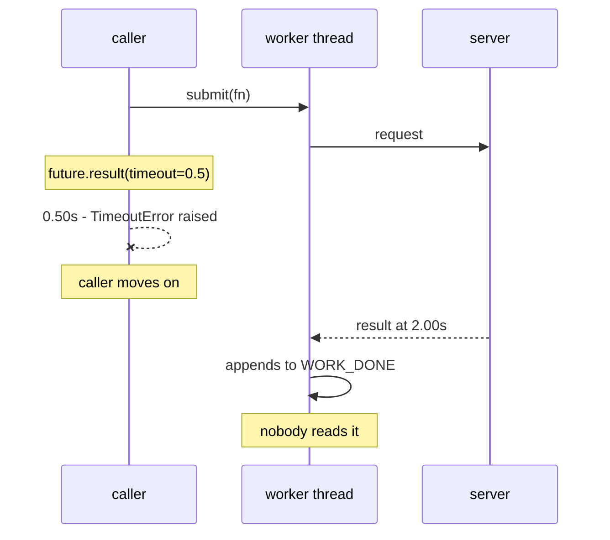

# 2.3 — `with_timeout`, the wrapper that guarantees a clock

## One-line answer

`with_timeout` is the one function in `sutra/mcp/hardening.py` that puts a deadline on a call whether
or not the thing underneath has a timeout parameter — and what it guarantees is that *you* stop
waiting, never that the work stops.

## The story

You lie down for a short rest before the guests arrive, and you set an alarm.

Not because you cannot judge how long you have been asleep. Because you know perfectly well that the
version of you who is asleep is in no position to judge anything, and the whole problem with resting
is that the thing which is supposed to notice the time is the thing that has switched off.

The alarm is not clever. It does not know how tired you are or how the evening is going. It has
exactly one behaviour, and its value comes from the fact that it is *outside* you — it runs on its
own, and it will go off whether or not the sleeping half of you approves.

Two things it cannot do, and you know both when you set it. It cannot make you feel rested at the
time it goes off. And it cannot un-cook anything you left on the stove. It only decides when you stop
being asleep.

## The idea in plain language

Most blocking operations in Python do not take a timeout, and the ones that do often mean something
narrower than you want. `socket.recv` takes one; `subprocess.Popen.stdout.readline()` does not.
`urllib`'s `timeout=` bounds one read, not the whole request. A third-party client library may take
one and thread it into somewhere you cannot see.

So you need a way to put a clock **around** a call rather than **inside** it. That is what a timeout
wrapper is: run the work somewhere you can walk away from, and wait for it with a limit.

In Python there are two shapes of this, and which one you use depends entirely on whether the code
underneath is synchronous or asynchronous.

| | Synchronous | Asynchronous |
| --- | --- | --- |
| Where the work runs | a worker thread | a task in the event loop |
| How you wait with a limit | `future.result(timeout=...)` | `asyncio.wait_for(...)` / `anyio.fail_after(...)` |
| What happens to the work on timeout | **nothing — it keeps running** | the task is cancelled at its next await point |
| What you get back | `concurrent.futures.TimeoutError` | `TimeoutError` |

The row that matters is the third. In the async case you can genuinely cancel: the event loop throws
`CancelledError` into the coroutine, and — if it is written to unwind properly — it stops. In the
sync case you cannot. A thread blocked in a read on somebody else's socket cannot be interrupted from
outside; Python has no safe way to do it, and the reason is not laziness. Killing a thread mid-call
leaves locks held and buffers half-written.

So the honest description of the synchronous wrapper is: **it bounds your waiting, not their working.**
That is not a weakness to apologise for. It is exactly what Day 38's
[1.2](../../../day-38-failure-and-migration-lab/parts/01-the-clock/1.2-giving-up-ends-the-wait.md)
taught — giving up ends the wait, not the work — restated as a design constraint. And it has a real
consequence you have to plan for: every timed-out call leaves an in-flight operation, which is
precisely [1.2's](../01-what-may-be-repeated/1.2-a-timeout-is-an-unknown.md) world 3, and precisely
why the retry rules exist.

## Why Sutra needs it

`sutra/mcp/hardening.py` needs a primitive that every call site can use without knowing what is
underneath it. Some of Sutra's MCP paths go through `ClientSession.call_tool`, which takes
`read_timeout_seconds` ([2.4](2.4-the-numbers-your-libraries-chose.md) has the exact signature). Some
go through ADK's `McpToolset`, which does not expose one per call. Some, in the lab, are raw
subprocess reads with no clock at all.

If each of those is handled differently at each call site, then "does this call have a deadline?" is
a question you answer by reading the code, nineteen times.
[6.2](../06-the-last-word/6.2-one-policy-not-a-hundred.md) is why that is unacceptable and how it is
checked. `with_timeout` is the one door: whatever is underneath, the caller gets a bounded wait and a
labelled error.

## The mechanism

The whole thing is eight lines, and the interesting part is what it does not attempt:

```python
# days/day-44-client-hardening/lab/wrap.py
POOL = ThreadPoolExecutor(max_workers=4, thread_name_prefix="mcp")


def with_timeout(fn: Callable[[], T], seconds: float, *, label: str) -> T:
    """Run `fn` and raise TimeoutError if it has not returned within `seconds`.

    The work is not stopped. Nothing here can stop it: `fn` is a blocking read on
    somebody else's socket. What this guarantees is that *the caller* stops waiting.
    """
    future = POOL.submit(fn)
    try:
        return future.result(timeout=seconds)
    except FuturesTimeout:
        raise TimeoutError(f"{label}: no response within {seconds:.2f}s") from None
```

**Line by line:**

- `fn: Callable[[], T]` takes **no arguments**. The caller closes over whatever it needs with a
  `lambda`, which keeps the wrapper from having to forward `*args, **kwargs` and keeps the type
  signature honest about the return value. `T` flows straight through, so a wrapped call is still
  typed.
- `POOL` is a module-level `ThreadPoolExecutor` rather than one created per call. Creating a pool per
  call means creating an operating-system thread per call, which at any real rate is a much bigger
  problem than the one you are solving.
- `max_workers=4` is a bound, and the bound is a policy: it is the maximum number of MCP calls that
  can be in flight, and therefore the maximum number of *abandoned* calls that can be occupying
  threads. Get this wrong in the generous direction and a slow server exhausts the pool with work
  nobody is waiting for; get it wrong in the tight direction and healthy calls queue behind each
  other. It should be sized against the concurrency the service actually has.
- `thread_name_prefix="mcp"` costs nothing and pays for itself the first time you take a thread dump
  during an incident and can see at a glance that eleven threads are stuck in MCP calls.
- `future.result(timeout=seconds)` is the clock. It returns the value, re-raises whatever `fn` raised,
  or raises `concurrent.futures.TimeoutError` — three outcomes, one call.
- The `except FuturesTimeout` re-raise converts to the built-in `TimeoutError`, because
  `concurrent.futures.TimeoutError` is an implementation detail of the wrapper and no caller should
  have to import it to catch a timeout. On Python 3.11 and later they are in fact the same class, but
  writing the conversion explicitly means the wrapper's contract does not silently depend on that.
- `label` goes into the message. This is the fix for the SDK's own timeout text, which says
  `ClientRequest` and does not name the call
  ([2.4](2.4-the-numbers-your-libraries-chose.md)). An error that cannot tell you which call it was
  is an error you cannot act on at midnight.
- `from None` suppresses the chained "During handling of the above exception" block. The
  `FuturesTimeout` is noise — the caller wants one clean line saying which call ran out of time.
- **There is no `future.cancel()`.** Calling it would return `False` for a task that has already
  started, and writing it would suggest to a reader that the work stops. It does not. Leaving it out
  and saying so in the docstring is more honest than a line that looks like a cancellation.

Run it:

```bash
cd days/day-44-client-hardening/lab
uv run python wrap.py
```

**Line by line:**

- One command. The two arms are inside the script: the same two-second call with a generous deadline
  and then a tight one.
- **Zero model calls.**

Measured on 2026-09-05:

```text
deadline 3.00s ->  2.00s  the ticket
deadline 0.50s ->  0.52s  TimeoutError: lookup_ticket: no response within 0.50s

what the abandoned call did after we stopped waiting:
  slow_tool finished and produced an answer
  slow_tool finished and produced an answer
  (2 completions for 2 calls, 1 of which nobody read)
```

The last block is the part to sit with. **Two completions for two calls, and one of them nobody
read.** The call that "failed" ran to completion, produced a correct answer, and appended to
`WORK_DONE` a second and a half after the caller had given up and moved on. If `slow_tool` had been
`close_ticket`, an email would have gone out at that moment — after the client had reported a
timeout.



## When it breaks

The first break is a pool that is too small, and its symptom is a lie rather than a delay. Set
`max_workers=1` and make three calls whose deadline is shorter than the work:

```text
call 0:  0.50s  TimeoutError: lookup_ticket: no response within 0.50s
call 1:  0.51s  TimeoutError: lookup_ticket: no response within 0.50s
call 2:  0.50s  TimeoutError: lookup_ticket: no response within 0.50s
calls that actually reached the server: 1 of 3
```

Three identical, perfectly punctual timeouts — and two of the three requests **were never sent**. The
single worker was still occupied by the first abandoned call, so calls 1 and 2 sat in the pool's
queue while `result(timeout=0.5)` counted down. Both then reported that the server had not answered,
about a request the server never received.

**A timeout wrapper backed by a saturated pool blames the far side for a queue on this side.** During
an incident that is the difference between investigating your dependency and investigating yourself.
The fix is a bigger pool, or a bounded queue that rejects immediately instead of waiting, or — much
better — pushing the timeout down into the client library where the call actually is, and reserving
the wrapper for calls that have no other way to get one.

The second break is a wrapper around something that is already async. Submitting a coroutine to a
thread pool does not run it:

```text
  File "...\concurrent\futures\thread.py", line 59, in run
    result = self.fn(*self.args, **self.kwargs)
             ^^^^^^^^^^^^^^^^^^^^^^^^^^^^^^^^^^
TypeError: 'coroutine' object is not callable
sys:1: RuntimeWarning: coroutine 'call_tool' was never awaited
```

The `RuntimeWarning` on the last line is the useful one: nothing ran at all. In async code the
wrapper is `asyncio.wait_for` or `anyio.fail_after`, and mixing the two shapes is a bug the type
checker will not catch because `Callable` and "coroutine function" look similar enough at a glance.

The third break is a deadline that outlives the caller. `with_timeout(fn, 30.0)` inside a request that
has two seconds left is [2.2](2.2-the-deadline-never-reached.md) again, and the wrapper cannot know:
it takes a number and believes it. That is why the production signature takes a `Deadline` and
computes `min(seconds, deadline.remaining())` rather than trusting the constant — the wrapper is the
last place that can enforce it, because it is the last place before the call.

## In production

**What a professional writes instead of the teaching version.** The wrapper is not the first choice.
The first choice is always the timeout the client library already offers, because a timeout inside the
library can actually abort the read, close the connection and free the socket, and a wrapper outside
it can do none of those. `with_timeout` exists for the calls that have no such parameter — and Sutra
has those, because ADK's `McpToolset` does not expose a per-call deadline. The production version
takes a `Deadline`, records the elapsed time on both the success and the failure path so that the
timeout distribution is observable, and increments a counter tagged with the label, because "how
often does this specific call time out" is the number that tells you your deadline is wrong.

**What degrades at scale or under concurrency.** Threads. Every abandoned call holds one until the
work finishes, so the pool's occupancy is driven by the *server's* latency and not by your request
rate. A dependency that goes from fifty milliseconds to six seconds multiplies your thread occupancy
by more than a hundred, and the wrapper that was protecting you becomes the bottleneck. This is the
strongest argument for pushing deadlines into the library and for the async form, where an abandoned
call costs a coroutine rather than a thread.

**The failure mode that only appears with real traffic.** Abandoned work arriving late and being
believed. The wrapper raises and the caller moves on, but the underlying client library may still
write the eventual reply into a shared response stream — and if request ids are reused or matched
loosely, that reply can be handed to a later call. Day 38's
[2.4](../../../day-38-failure-and-migration-lab/parts/02-the-x-ray/2.4-the-reply-that-arrived-twice.md)
is that failure in full, and the defence is at the session layer, not in the wrapper.

**The review comment a senior engineer leaves:** *"this runs the call on a thread and raises after two
seconds. What happens to the thread? Say in the docstring that the work continues, because the next
person to read this will assume it is cancelled and will use it around a write."*

**The interview question:** *"how do you add a timeout to a library call that does not support
one?"* — *"You do not add one to the call, you add one to your waiting. Run it on a worker and wait on
the future with a limit, or in async code use `wait_for`. But I say out loud what that buys and what
it does not: the caller stops waiting, the work does not stop. So every timeout leaves an operation
in flight, which is why the retry rules have to be idempotency-based rather than 'it failed, try
again'. And I would rather not need the wrapper at all — a timeout inside the client library can
actually abort the read and free the socket, and mine can only look away."*

## Check yourself

```bash
cd days/day-44-client-hardening/lab
uv run python wrap.py
```

Then set `max_workers=1` and add a third call with a tight deadline. Watch a deadline take longer
than its own number to fire, and say what the reported time is actually measuring.

**Out loud, without scrolling up:** say what `with_timeout` guarantees and what it does not, and name
the one situation in which you would rather not use it at all.

**Next:** [2.4 — The numbers your libraries already chose](2.4-the-numbers-your-libraries-chose.md).
