# 3.1 — Waiting longer each time

## One-line answer

A retry that follows the failure immediately spends the whole attempt budget inside the first
instant of an outage, so the wait between attempts has to grow — doubling is the standard choice
because it covers a long outage in a small number of attempts without waiting long for a short one.

## The story

The number is engaged, so you press redial.

Engaged. You press it again, and again, and after the fifth time in about a minute you accept that
whatever this is, it is not going to clear in the next few seconds, and you put the phone down and go
and do something else. You try again after you have made the tea. Still engaged. You try again after
lunch, and this time it rings.

Nobody taught you that pattern and you were not being strategic. You simply noticed that the first
few attempts were free — the line might have cleared in a second — and that once it had not cleared
in a minute, hammering it every second was not going to help, because whatever is keeping that line
busy is measured in longer units than that.

The person on the other end, if you could see them, would have their own view of your five attempts
in a minute. They are on a call. Your five attempts were five interruptions in their ear.

## The idea in plain language

**Backoff** is waiting between attempts. **Exponential backoff** is multiplying the wait after each
failure, usually by two.

The reason to grow the wait is that you do not know how long the outage is, and outages are not all
the same size. A dropped packet clears in milliseconds. A restarting process clears in seconds. A
failing deploy clears in minutes. A fixed retry interval is tuned for exactly one of those and is
wrong for the other two.

Multiplying gives you a ladder that covers all three orders of magnitude in a handful of steps:

| Attempt | Wait before it | Clock when it fires |
| --- | --- | --- |
| 1 | — | 0s |
| 2 | 1s | 1s |
| 3 | 2s | 3s |
| 4 | 4s | 7s |
| 5 | 8s | 15s |
| 6 | 16s | 31s |

Six attempts reach half a minute. Six attempts of a fixed one-second wait reach five seconds. Same
budget, entirely different coverage — and the early attempts are still fast, so a blip that clears in
a second is still recovered in a second.

Three parameters, and each of them is a real decision:

- **The base** — the first wait. Set it from how long the *fastest recoverable* failure takes. A
  base of ten milliseconds is pointless if nothing in your system ever recovers that fast; a base of
  ten seconds throws away every quick recovery.
- **The multiplier** — almost always 2. It is not sacred; it is the number that changes order of
  magnitude in about three steps, which matches how outages are distributed.
- **The cap** — the longest single wait you will accept. Without one, attempt ten waits for over
  eight minutes, which is longer than anybody is prepared to hold a request open and longer than most
  outages last anyway.

The cap is the parameter people leave out, and leaving it out turns a retry policy into an
unbounded one. Capped exponential backoff — double until you hit a ceiling, then stay there — is what
almost every production client actually does.

And note what backoff is **not**. It is not a substitute for
[1.1](../01-what-may-be-repeated/1.1-the-button-you-can-press-twice.md)'s question. A beautifully
tuned ladder pointed at `close_ticket` sends four cement lorries instead of two.

## Why Sutra needs it

Sutra talks to servers that restart. `sutra_mcp` itself will be deployed and redeployed —
[Day 43](../../../day-43-stateless-by-default/LESSON.md) makes it a thing that any instance can
answer, which also means it is a thing that gets replaced. A deploy takes seconds, not milliseconds,
so a client with a fixed sub-second retry interval will exhaust its attempts inside the deploy and
report an outage for something that was never longer than a rolling restart.

`with_retries` in `sutra/mcp/hardening.py` needs to hold this ladder, with the three parameters as
data rather than as literals in a loop, because the right numbers are different for a local stdio
server and a partner's HTTP endpoint.

## The mechanism

Four ladders, one outage, no sleeping. The script computes when each attempt would land:

```python
# days/day-44-client-hardening/lab/backoff.py
RECOVERS_AT = 8.0  # the server starts answering again eight seconds in
ATTEMPTS = 6


def immediate(_attempt: int) -> float:
    """No wait at all: the loop everybody writes first."""
    return 0.0


def fixed(_attempt: int) -> float:
    """The same wait every time."""
    return 1.0


def exponential(attempt: int) -> float:
    """Double the wait after each failure: 1, 2, 4, 8, ..."""
    return 1.0 * (2 ** (attempt - 1))


def capped(attempt: int) -> float:
    """Exponential, but never longer than four seconds."""
    return min(4.0, 1.0 * (2 ** (attempt - 1)))
```

**Line by line:**

- Each ladder is a **function of the attempt number**, not a hard-coded list. That is how the real
  thing is written: the loop asks the policy how long to wait before attempt *n*, so swapping the
  policy is swapping one object rather than editing a loop.
- `_attempt` with a leading underscore in `immediate` and `fixed` says "this parameter exists to
  satisfy the interface and is deliberately unused". Ruff would otherwise flag it, and more
  importantly a reader can see at a glance that these two do not depend on the attempt number.
- `2 ** (attempt - 1)` and not `2 ** attempt`. Attempt 2 is the first *retry*, and it should wait one
  base, not two. Getting this off by one is the difference between a ladder that starts at 1s and one
  that starts at 2s, and it silently doubles every number in the policy.
- `min(4.0, ...)` in `capped` is the ceiling. Note it caps the *individual wait*, not the total: the
  ladder still grows, it just stops growing. A cap on the total would be a deadline, which is
  [2.2](../02-the-deadline/2.2-the-deadline-never-reached.md)'s job.
- `RECOVERS_AT = 8.0` gives every ladder the same outage to survive, which is the only way to compare
  them.

And the walk:

```python
# days/day-44-client-hardening/lab/backoff.py (continued)
def walk(wait_for: object) -> tuple[bool, int, float]:
    """Return (recovered, requests sent, clock when we stopped) for one ladder."""
    clock = 0.0
    for attempt in range(1, ATTEMPTS + 1):
        if clock >= RECOVERS_AT:
            return True, attempt, clock
        clock += wait_for(attempt)  # type: ignore[operator]
    return clock >= RECOVERS_AT, ATTEMPTS, clock
```

**Line by line:**

- `clock` is a simulated clock, so the script runs instantly. Nothing here sleeps, because sleeping
  would teach the same thing and take half a minute per row.
- The check `if clock >= RECOVERS_AT` happens **before** the wait, because an attempt is made and
  *then* the client waits. Putting it after would credit the last ladder with an attempt it never
  made.
- `attempt` is returned as the request count, so the table can show what each ladder cost the server
  as well as what it achieved.
- The final `return` handles the ladder that used all six attempts without reaching the recovery
  point. It returns `clock >= RECOVERS_AT` rather than `False` so that a ladder which happens to land
  exactly on the boundary is counted honestly.

Run it:

```bash
cd days/day-44-client-hardening/lab
uv run python backoff.py
```

**Line by line:**

- One command; the four ladders are the four rows.
- **Zero model calls.**

Measured on 2026-09-05:

```text
the server answers again at 8s; 6 attempts allowed

ladder                       waits                      requests  gave up at  outcome
---------------------------- -------------------------- --------  ----------  --------------
immediate                    0, 0, 0, 0, 0                     6          0s  still down
fixed 1s                     1, 1, 1, 1, 1                     6          6s  still down
exponential                  1, 2, 4, 8, 16                    5         15s  found it up
exponential, capped at 4s    1, 2, 4, 4, 4                     5         11s  found it up
```

The first row is the loop everybody writes first, and it is worth staring at. **Six requests, all of
them inside the same instant, none of them able to succeed.** The client did the maximum amount of
harm and got the minimum amount of information, and from its own point of view it "tried six times".

Rows three and four both recover, and the capped one recovers sooner — 11s against 15s — for the same
number of requests. That is the argument for the cap in one comparison: once the wait is longer than
the outage, extra doubling is pure latency.

```mermaid
gantt
    dateFormat X
    axisFormat %Ss
    title Four ladders against an outage that ends at 8s
    section immediate
    six attempts :milestone, 0, 0
    section fixed 1s
    attempts :0, 6
    section exponential
    attempts :0, 15
    section capped at 4s
    attempts :0, 11
```



## When it breaks

The first break is a base chosen from the wrong failure. A base of one second against a server whose
only realistic failure is a dropped packet means every blip costs a full second of added latency:

```text
ladder      waits                 requests  gave up at  outcome
fixed 1s    1, 1, 1, 1, 1                6          6s  found it up
```

It "worked", and the user waited a second for something that would have recovered in twenty
milliseconds. Backoff is not free; it is latency you are choosing to spend, and the base is where you
choose how much.

The second break is no cap. Attempt ten of an uncapped ladder waits 512 seconds, and the shape of the
failure is not an error — it is a request that appears to have vanished:

```text
  attempt 9 : waiting 256.00s
  attempt 10: waiting 512.00s
```

Nothing is wrong from the client's point of view. It is retrying, diligently, on behalf of a caller
who gave up long ago and a user who has reloaded the page twice. This is
[2.2](../02-the-deadline/2.2-the-deadline-never-reached.md) again, arriving through a different door,
and it is why a cap and a deadline are both needed and are not the same thing.

The third break is backoff applied to a failure that cannot be waited out. Day 38's
[2.2](../../../day-38-failure-and-migration-lab/parts/02-the-x-ray/2.2-malformed-is-not-transient.md)
is the full argument: a malformed response, a schema mismatch, an authentication refusal or a
`-32602` *"Unknown tool"* will be exactly as wrong in sixteen seconds as it is now.

```text
{"jsonrpc": "2.0", "id": 4, "error": {"code": -32602, "message": "Unknown tool: close_tickett"}}
```

A ladder pointed at that spends thirty-one seconds and six requests proving a typo is still a typo.
Backoff belongs behind a classifier, not in front of one.

## In production

**What a professional writes instead of the teaching version.** The three numbers are configuration
per server, not constants, and they are chosen from evidence: the base from the observed recovery
time of the fastest real failure, the cap from how long the caller's own deadline allows. The policy
object is passed in rather than read from a module global, so a test can construct a policy with a
base of one millisecond and assert the attempt count without the test suite sleeping. And the retry
loop emits one structured log line per attempt with the attempt number, the wait and the reason
([1.3](../01-what-may-be-repeated/1.3-the-line-through-every-call.md) returned that reason for
exactly this purpose), because a retry that happens silently is a latency mystery later.

**What degrades at scale or under concurrency.** Every retry is load, and it is load arriving at the
worst moment. A client fleet with a one-second base sends its entire population's first retry one
second into an outage, which is [4.1](../04-when-to-stop-asking/4.1-the-retry-that-took-it-down.md)'s
subject. Exponential backoff helps because it thins the traffic over time, but it does not fix the
synchronisation — every client's ladder has the same rungs — and that is
[3.2](3.2-the-same-wait-is-the-wrong-wait.md).

**The failure mode that only appears with real traffic.** Backoff turning a partial outage into a
latency cliff for everybody. When one instance in a pool is bad, retries land on a healthy instance
and succeed — but they succeed *after* the ladder's wait, so a small fraction of requests get one
second of extra latency and the p99 moves visibly while the error rate stays at zero. Teams chase this
for days because nothing is failing. It is the reason to record the retry count on every response.

**The review comment a senior engineer leaves:** *"this loop retries three times with no wait. In an
outage that is three requests inside the same millisecond and a report that we tried. Give me a base,
a multiplier and a cap, put them in the policy object, and tell me which real failure the base is
sized against."*

**The interview question:** *"why exponential and not a fixed interval?"* — *"Because I do not know
how long the outage is, and outages come in three orders of magnitude — a dropped packet, a
restarting process, a bad deploy. A fixed interval is tuned for one of them. Doubling covers all
three in about six attempts while still recovering a blip in the first second. I always cap the
individual wait, because without a cap attempt ten is waiting eight minutes for a caller who has
gone, and I always put the ladder behind a classifier, because backing off from a `-32602` unknown
tool is thirty seconds spent proving a typo has not fixed itself."*

## Check yourself

```bash
cd days/day-44-client-hardening/lab
uv run python backoff.py
```

Then change `RECOVERS_AT` to `2.0` and run it again. Watch which ladder now wins and by how much. Say
what that tells you about choosing a base without knowing your failures.

**Out loud, without scrolling up:** name the three parameters of an exponential backoff policy, say
which one is most often left out, and say what goes wrong when it is.

**Next:** [3.2 — The same wait is the wrong wait](3.2-the-same-wait-is-the-wrong-wait.md).
