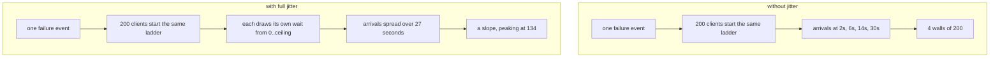

# 3.2 — The same wait is the wrong wait

## One-line answer

Every client that failed at the same instant will retry at the same instant if they all wait the same
number of seconds, so the backoff ladder that was supposed to spread the load reproduces the original
spike at every rung — and the fix is one call to a random number generator.

## The story

The school lets everybody out at three o'clock and the road outside is unusable for a quarter of an
hour.

It is not that there are too many parents. Spread across the afternoon, the same number of cars would
be nothing at all. The problem is that the bell is a single instant, and every single person has
arranged their afternoon around it, so the road gets its entire day's traffic inside about four
minutes.

The school fixed it, and the fix was almost insultingly small. They did not widen the road or build a
car park. They let the youngest classes out ten minutes early and the oldest ten minutes late.
Nothing about the number of cars changed. The bell stopped being one bell.

## The idea in plain language

**Jitter** is deliberately adding randomness to a wait, so that things which failed together do not
retry together.

Here is why it is needed, and it is not obvious until you draw it. Exponential backoff spreads a
*single client's* attempts out over time. It does nothing about the relationship between *different*
clients, because every client is running the same ladder. If two hundred of them get an error at the
same moment — which is what an outage is — then all two hundred wait one second, all two hundred
retry at one second, all two hundred fail again, all two hundred wait two seconds, and so on. The
ladder has faithfully reproduced the spike at 1s, 3s, 7s and 15s.

The standard forms, in the order people discover them:

| Form | The wait before attempt *n* | What it fixes |
| --- | --- | --- |
| No jitter | `base * 2^(n-1)` | nothing; synchronised |
| Equal jitter | `half + random(0, half)` where `half = base * 2^(n-1) / 2` | spreads over the upper half |
| **Full jitter** | `random(0, base * 2^(n-1))` | spreads over the whole interval |
| Decorrelated | `random(base, previous * 3)` | spreads and lets a lucky client retry sooner |

Full jitter is the usual recommendation, and it has a property worth noticing: it *halves the average
wait* as well as spreading it, because a uniform draw from zero to the ceiling averages half the
ceiling. So it is not a trade of latency for smoothness — a jittered client recovers sooner on
average *and* arrives in a thinner crowd.

The thing to be clear about is what jitter does not do. It does not reduce the number of requests.
Two hundred clients with four attempts each send eight hundred requests either way. What changes is
whether they arrive as four walls or as a slope, and a server sheds load by the second, so the shape
is what decides how much of it survives.

## Why Sutra needs it

Sutra will not always be one process. Phase 8's triage graph runs many workers, Day 43 makes
`sutra_mcp` a thing you run several copies of, and the moment there is more than one caller behind
one policy object, that policy's rungs are synchronised across all of them.

The synchronisation is worse than it looks, because the thing that makes clients fail together is the
same thing that makes them retry together: they all failed because of one event on the far side, so
they all started their ladders within milliseconds of each other. **Correlated failure produces
correlated retries by construction.** A retry policy with no jitter is a policy that has quietly
assumed there is only one client.

## The paper behind it

> **New directions in communications** · `doi:10.1109/MCOM.1986.1092946` · 1986 ·
> `https://doi.org/10.1109/MCOM.1986.1092946`

The claim, in one sentence: bursty traffic can be made safe for a shared network by metering it
through a buffer that drains at a fixed rate, so that what the network sees is smooth regardless of
how lumpy the source was.

Jitter is the same idea moved to the other end of the wire. The leaky bucket smooths arrivals at the
receiver; jitter smooths departures at the senders, and both exist because a shared resource is
destroyed by the *shape* of a load rather than by its total. Sutra met the bucket on Day 24, where it
is taught at
[`papers/01-the-leaky-bucket.md`](../../../day-24-token-accounting-and-budgets/papers/01-the-leaky-bucket.md).

## The mechanism

Two hundred clients, four retries each, and one line of difference:

```python
# days/day-44-client-hardening/lab/jitter.py
CALLERS = 200
ROUNDS = 4
SEED = 44  # fixed, so the two arms are comparable and the run is reproducible
CAPACITY = 40  # requests one server can serve in a second before it sheds load


def waits(jitter: bool, rng: random.Random) -> list[float]:
    """The four waits one caller uses. Without jitter every caller gets the same four."""
    out = []
    for attempt in range(1, ROUNDS + 1):
        ceiling = 2.0 * (2 ** (attempt - 1))
        # "full jitter": wait a uniformly random amount up to the ceiling, not the
        # ceiling itself. The average wait halves, and the arrivals spread out.
        out.append(rng.uniform(0.0, ceiling) if jitter else ceiling)
    return out
```

**Line by line:**

- `SEED = 44` fixes the random stream, so re-running the jittered arm gives the same numbers. A demo
  whose output changes every run cannot be compared with anything, and an ablation you cannot compare
  is not an ablation.
- `CAPACITY = 40` is what makes the output mean something. Without a capacity number, "two hundred
  requests in second 2" is a fact with no consequence; with one, it is a hundred and sixty requests
  the server will refuse.
- `ceiling = 2.0 * (2 ** (attempt - 1))` is [3.1](3.1-waiting-longer-each-time.md)'s ladder, and it is
  the *same* in both arms. That is deliberate: the ablation must change jitter and only jitter.
- `rng.uniform(0.0, ceiling)` is full jitter — the whole interval, from zero. Not
  `ceiling/2 + rng.uniform(0, ceiling/2)`, which is equal jitter and spreads over half the range.
- `rng` is passed in rather than using the module-level `random`, so the two arms draw from a stream
  the caller controls. Module-level `random` is shared global state and a second caller anywhere in
  the process would change your results.
- `waits` returns a *list* rather than yielding, because the caller wants all four before it starts
  and because a list is trivially printable when you are debugging a policy.

And the counting:

```python
# days/day-44-client-hardening/lab/jitter.py (continued)
    arrivals: Counter[int] = Counter()
    for _ in range(CALLERS):
        clock = 0.0
        for wait in waits(jitter, rng):
            clock += wait
            arrivals[int(clock)] += 1  # which one-second bucket this retry lands in
```

**Line by line:**

- `clock` accumulates, so bucket membership is by *arrival time*, not by wait length. A retry that
  waited four seconds after already waiting three arrives at second seven.
- `int(clock)` buckets by whole seconds. That is coarse on purpose: a server's capacity is a rate,
  and a rate is only meaningful over an interval.
- `Counter` rather than a dict with `setdefault`, because the whole operation is "count things by
  key" and the standard library already has that.
- The nested loop is per-caller-then-per-attempt, so each caller draws its own four waits. Drawing
  four waits once and reusing them for all two hundred callers would produce the no-jitter result
  while looking like the jittered code — a subtle and very plausible bug.

Run both arms:

```bash
cd days/day-44-client-hardening/lab
uv run python jitter.py
uv run python jitter.py --jitter
```

**Line by line:**

- The first arm is the ladder from [3.1](3.1-waiting-longer-each-time.md), unmodified.
- `--jitter` is the ablation switch: one `rng.uniform` instead of one constant.
- **Zero model calls.**

Measured on 2026-09-05:

```text
200 callers, 4 retries each, jitter=False
a server that can serve 40 requests per second

second  retries arriving    shed  bar
------ -----------------  ------  ----------------------------------------
     2               200     160  ########################################
     6               200     160  ########################################
    14               200     160  ########################################
    30               200     160  ########################################

busiest second : 200 requests
requests shed  : 640 of 800
```

```text
200 callers, 4 retries each, jitter=True
a server that can serve 40 requests per second

second  retries arriving    shed  bar
------ -----------------  ------  ----------------------------------------
     0               134      94  ##########################
     1               133      93  ##########################
     2                54      14  ##########
     3                65      25  #############
     4                55      15  ###########
     5                41       1  ########
     6                34       0  ######
     7                34       0  ######
     8                44       4  ########
     9                28       0  #####
    10                26       0  #####
    11                21       0  ####
    12                11       0  ##
    13                 8       0  #
    14                14       0  ##
    15                 6       0  #
    16                12       0  ##
    17                16       0  ###
    18                12       0  ##
    19                14       0  ##
    20                13       0  ##
    21                13       0  ##
    22                 5       0  #
    23                 2       0  
    24                 2       0  
    25                 1       0  
    26                 2       0  
```

```text
busiest second : 134 requests
requests shed  : 246 of 800
```

The first table has four rows. Four. Two hundred clients running an exponential ladder produce
traffic at exactly four instants, and at each of them the server is offered five times what it can
serve. **640 of 800 requests shed.**

The second table has twenty-seven rows, and from second six onwards the shed column is almost all
zeros. Same clients, same attempt count, same ladder — **246 shed instead of 640**, and the busiest
second is 134 instead of 200. The change was `rng.uniform(0.0, ceiling)`.



## When it breaks

The first break is jitter that is not random per client. A seed derived from something the clients
share — the current second, a deployment id, a hostname pattern — puts them all back in step:

```text
busiest second : 200 requests
requests shed  : 640 of 800
```

Identical to the no-jitter arm, in code that contains the word `uniform`. If you seed a generator at
all in production code, seed it from something per-process; better, do not seed it, and let the
standard library seed from the operating system.

The second break is jitter applied to the wrong thing. Adding a small random amount *on top of* the
ladder — `ceiling + rng.uniform(0, 0.3)` — is a very common shape and it barely helps:

```text
second  retries arriving    shed
     2               200     160
     6               200     160
```

Two hundred clients spread over three hundred milliseconds are still two hundred clients in the same
second, and the server's capacity is per second. Jitter has to be a fraction of the *interval*, not a
sprinkle on top of it, which is why the recommended form draws from zero to the ceiling rather than
adding to it.

The third break is jitter that breaks something else. A test that asserts on timing will start
failing intermittently:

```text
FAILED tests/test_mcp_failures.py::test_backoff_waits_one_second
E       assert 0.43 == 1.0
```

That is a test asserting on the wrong thing. The behaviour worth asserting is *"waited somewhere
between zero and the ceiling"* and *"attempted no more than N times"*, and both are testable with an
injected policy whose base is a millisecond. A test that pins the exact wait is a test that forbids
jitter.

## In production

**What a professional writes instead of the teaching version.** Full jitter, drawn from a generator
that is not seeded in production, with the jitter applied inside the policy object so no call site
can forget it. The realised wait is recorded on the log line for the attempt, because *"how long did
we actually wait"* is the first question during a latency investigation and a computed-but-unlogged
random number is unanswerable afterwards. Many teams go one step further to decorrelated jitter,
where each wait is drawn between the base and three times the *previous* wait, which spreads the
population out further still and lets a lucky client recover early.

**What degrades at scale or under concurrency.** The synchronisation gets tighter as the fleet grows,
not looser, because a bigger fleet is more likely to share a single upstream failure event. A hundred
clients with no jitter is a spike; ten thousand is a denial-of-service attack on your own
infrastructure that restarts every rung of the ladder. This is the mechanism behind the term
*thundering herd*, and it is why [4.1](../04-when-to-stop-asking/4.1-the-retry-that-took-it-down.md)
follows immediately.

**The failure mode that only appears with real traffic.** Synchronisation arriving from outside your
retry policy entirely — cron jobs on the hour, cache entries with identical TTLs expiring together,
token refreshes all timed from one deployment. Jitter belongs on every periodic thing a fleet does,
not only on retries. A cache TTL of exactly sixty seconds set at deploy time means the whole fleet
misses at the same second, forever.

**The review comment a senior engineer leaves:** *"the backoff has no jitter. Every worker that fails
on the same upstream error will retry in the same millisecond and we will have rebuilt the spike four
times. Use full jitter, draw from zero to the ceiling rather than adding a sprinkle, and log the wait
you actually took."*

**The interview question:** *"what is jitter and why does exponential backoff need it?"* — *"Backoff
spreads one client's attempts over time and does nothing about the relationship between clients. In
an outage every client fails at the same instant, so they all walk the same ladder in lockstep and
the spike is reproduced at every rung. Jitter is drawing each wait randomly up to the ceiling instead
of taking the ceiling. I measured it on a fake fleet — two hundred callers, four attempts, a server
doing forty a second — and it moved the shed count from 640 to 246 and the busiest second from 200 to
134 with no change to the number of requests. And the same argument applies to anything periodic a
fleet does: cache TTLs, token refreshes, cron. Anything synchronised by a shared event needs
spreading."*

## Check yourself

```bash
cd days/day-44-client-hardening/lab
uv run python jitter.py
uv run python jitter.py --jitter
```

Then change the jittered line to `ceiling + rng.uniform(0.0, 0.3)` and run the jittered arm again.
Compare the busiest second with the un-jittered arm. Say why a sprinkle is not jitter.

**Out loud, without scrolling up:** say why exponential backoff alone does not stop a herd, and state
what full jitter draws between.

**Next:** [3.3 — The server told you when to come back](3.3-the-server-said-when.md).
