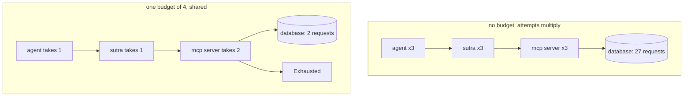

# 3.4 — `with_retries`, and why attempts are a budget

## One-line answer

Retries multiply down a call stack — three layers of "up to three attempts" is twenty-seven requests
at the bottom and nobody chose twenty-seven — so the attempt count belongs to the whole request as a
shared budget rather than to each layer as a local constant.

## The story

The courier tries three times and then the parcel goes back to the depot.

Three is written on the card they put through the door, and it is written there because somebody
decided it: enough attempts that a normal person who was out on Tuesday gets their parcel by
Thursday, few enough that a van is not driving to the same empty house all week. It is a budget, and
it belongs to *the parcel*.

What would be mad is if the driver had three attempts, and the depot also gave the round three
attempts, and the sorting centre also retried the round three times — and nobody anywhere had ever
worked out that this meant twenty-seven visits to one door. Each of the three decisions is defensible.
Nobody made the fourth decision, which is the only one that matters to the person whose doorbell it
is.

## The idea in plain language

A retry policy is written by one person thinking about one layer. It is executed by a stack of them.

The arithmetic is multiplication, not addition:

| Layer | Attempts | Requests reaching the bottom |
| --- | --- | --- |
| the agent retrying its tool | 3 | 3 |
| Sutra retrying the MCP call | 3 | 9 |
| the MCP server retrying its database | 3 | **27** |

Twenty-seven appears in no configuration file, no code review and no runbook. It is an emergent
property of three reasonable local decisions, and it is discovered during an incident when somebody
notices the database is receiving far more traffic while it is down than it does when it is up.

The fix is to make attempts a **budget** rather than a **count**: one number, created at the top of
the request, spent by whoever retries, and empty when it is empty. It is the same move as
[2.2](../02-the-deadline/2.2-the-deadline-never-reached.md)'s deadline in a different currency — time
is a budget too, and both should travel with the request rather than being re-declared at each hop.

Two properties fall out of this, and both are worth stating because they surprise people:

- **The budget is spent by the outer layers too.** If the agent's attempt and Sutra's attempt each
  take one from the pot, a budget of four does not mean four requests at the bottom. That is correct:
  every attempt at every layer is an opportunity for something to go wrong, and pretending only the
  bottom layer counts is how you get back to multiplication.
- **A spent budget is a different failure from a failed call.** "The database refused" and "we ran
  out of attempts" are different sentences with different next steps, and the exception types should
  differ — the same distinction [2.2](../02-the-deadline/2.2-the-deadline-never-reached.md) drew
  between a `TimeoutError` and an `OuterDeadlineExceeded`.

And there is a fourth layer in Sutra's stack that nobody chose at all.
[2.4](../02-the-deadline/2.4-the-numbers-your-libraries-chose.md) found it in the installed source:
ADK's `retry_on_errors` decorator retries every failed `McpTool` call **once**, on any exception,
without consulting idempotency. So a `with_retries(attempts=3)` wrapped around an ADK toolset is six
attempts on the wire, and only three of them are yours.

## Why Sutra needs it

`sutra/mcp/hardening.py` exports `with_retries`, and its signature is the decision this part is
about. If it takes `attempts: int` it is a local count and Sutra has joined the multiplication. If it
takes a budget object, the number is the request's and everybody spends from the same pot.

Sutra sits under an agent loop and over `sutra_mcp`, so it is in the middle of exactly the stack in
the table above. And Phase 8's triage graph will add another layer, because a graph node that fails
gets retried by the graph. Writing the budget in now is cheaper than retrofitting it into a runtime.

## The mechanism

> 🎬 **The scene:** the ticket database goes down for a couple of minutes during a maintenance window
> that overran. Sutra's dashboard shows the tool failing, which is expected. The database team's
> dashboard shows connection attempts at nine times the normal rate, which is not.
>
> 😬 **The naive fix:** turn Sutra's retries down from three to two. It helps a little.
>
> 💥 **Why it fails:** the number that produced nine was never three; it was 3 × 3, and there is a
> third layer under it making it 27. Tuning one factor of a product you have not written down is
> guesswork, and the other two layers belong to other teams.
>
> 💡 **The insight:** the attempt count is a property of the request, not of a function. Create it
> once, pass it down, spend it.

The budget is eight lines:

```python
# days/day-44-client-hardening/lab/attempts.py
class Budget:
    """A count of attempts the whole request tree is allowed to spend, once."""

    def __init__(self, attempts: int) -> None:
        self.left = attempts

    def take(self) -> bool:
        """Spend one attempt. Returns False when the budget is empty."""
        if self.left <= 0:
            return False
        self.left -= 1
        return True


class Exhausted(Exception):
    """Raised when the shared budget is empty and nobody may try again."""
```

**Line by line:**

- `Budget` is a mutable object rather than an integer, because an integer passed down a call stack is
  copied at every frame and each layer would decrement its own copy. Mutability is the mechanism
  here, not an accident.
- `take()` returns a `bool` rather than raising. The caller decides what an empty budget means in its
  context — the outermost layer may want to report differently from the innermost — and a method that
  raises takes that choice away.
- `self.left <= 0` rather than `== 0`, so a budget that somehow goes negative still refuses. Defensive,
  and free.
- `Exhausted` is a distinct exception type. Catching `ConnectionError` and retrying is correct;
  catching `Exhausted` and retrying is an infinite loop, and having them be the same type is how that
  gets written.
- There is no lock. Under concurrency this budget would need one, or better, each concurrent branch
  gets its own sub-budget carved off the parent — sharing one mutable counter across threads is a
  race, and *In production* below says what to do instead.

And the loop:

```python
# days/day-44-client-hardening/lab/attempts.py (continued)
def with_retries(call, *, budget: Budget | None):
    """Retry `call`. With a budget, attempts come out of the shared pot."""
    last: Exception | None = None
    for _ in range(PER_LAYER_ATTEMPTS):
        if budget is not None and not budget.take():
            raise Exhausted("retry budget spent") from last
        try:
            return call()
        except (ConnectionError, Exhausted) as err:
            last = err
    assert last is not None
    raise last
```

**Line by line:**

- `budget.take()` is called **before** the attempt, not after a failure. An attempt that has not been
  paid for is an attempt that escapes the budget, and the difference shows up exactly when the budget
  is nearly spent.
- `raise Exhausted(...) from last` chains the last real error, so the report that reaches the top
  carries both facts: *we ran out of attempts* and *this is what was going wrong*. Without `from last`
  the operator gets "retry budget spent" and no cause.
- `except (ConnectionError, Exhausted)` catches `Exhausted` deliberately, so that an inner layer's
  exhaustion propagates through outer loops rather than triggering a fresh round of outer attempts.
  Getting this wrong turns the budget into a floor rather than a ceiling.
- `PER_LAYER_ATTEMPTS` still applies. The budget is a *ceiling on the whole tree*, and the local count
  is still a ceiling on this layer. Both are needed: without the local count, one layer could spend
  the entire budget on a call that will never work.
- `call` takes no arguments, for the same reason `with_timeout` did in
  [2.3](../02-the-deadline/2.3-with-timeout.md): the caller closes over what it needs and the helper
  stays honest about its return type.
- Notice what is **not** here: the idempotency check. In `sutra/mcp/hardening.py` it belongs at the
  top of this function, and the lab leaves it out only because
  [1.1](../01-what-may-be-repeated/1.1-the-button-you-can-press-twice.md) already showed it in
  isolation. In the real module, `with_retries(call, *, idempotent: bool, budget: Budget)` refuses to
  loop at all when `idempotent` is false.

Run both arms:

```bash
cd days/day-44-client-hardening/lab
uv run python attempts.py
uv run python attempts.py --budget
```

**Line by line:**

- The first arm is three layers each retrying independently, which is what a stack of reasonable
  local decisions produces.
- `--budget` is the ablation switch: one shared object instead of three private counters.
- **Zero model calls.**

Measured on 2026-09-05:

```text
attempts per layer: 3   shared budget: none
the agent finally saw: ConnectionError: database is not accepting connections
requests that reached the database: 27
which is 3 x 3 x 3, and nobody wrote that number down.
```

```text
attempts per layer: 3   shared budget: 4
the agent finally saw: Exhausted: retry budget spent
requests that reached the database: 2
```

**Twenty-seven against two.** And look at the second arm's number carefully, because it is not four:
the agent's attempt and Sutra's attempt each took one from the pot before the MCP server got to
spend the remaining two on the database. That is the honest behaviour of a shared budget, and if it
looks stingy, the correct response is to raise the number rather than to stop sharing it — because a
number you raised is a number you chose.

The exception type differs too. The unbudgeted arm reports the database's own error; the budgeted arm
reports `Exhausted`, chained from it. An operator reading the second one knows immediately that the
policy stopped us rather than the database, which is a different page of the runbook.



## When it breaks

The first break is a budget that is not actually shared. It is a one-word slip:

```python
def sutra_client(budget: Budget) -> str:
    return with_retries(lambda: mcp_server(Budget(budget.left)), budget=budget)
```

A fresh `Budget` constructed from the remaining count, passed down. It reads like propagation and it
is a copy, so the lower half of the tree spends its own pot and the total is back to multiplication.
The symptom is a database request count that is *some* improvement on twenty-seven and stubbornly
refuses to reach the configured number.

The second break is a budget shared across concurrency without a lock. `take()` reads `self.left`,
compares it, and then decrements — three separate operations, with two places where another thread
can run in between. Two branches both read `left == 1`, both pass the comparison, both decrement, and
both proceed, so a budget of four permits more than four attempts. Python's `-=` on an attribute is
not atomic and never has been. The fix is not usually a lock; it
is to **carve** — when a request fans out to *n* branches, each branch gets a sub-budget and the
parent's is reduced by the total. That keeps the ceiling honest without contention, and it is what
the retry budgets in mature RPC stacks do.

The third break is the layer you did not know about. Sutra's budget is spent correctly and the
request count is still double:

```text
INFO google.adk.tools.mcp_tool.mcp_session_manager Retrying _run_async_impl due to error: ...
```

That is ADK's `retry_on_errors` from
[2.4](../02-the-deadline/2.4-the-numbers-your-libraries-chose.md), at INFO level, doubling every
attempt Sutra makes and knowing nothing about the budget. You cannot make it participate. What you
can do is account for it: Sutra's configured attempt count is halved when the call goes through
`McpToolset`, and that fact is written down beside the number rather than discovered.

## In production

**What a professional writes instead of the teaching version.** The budget lives on the request
context alongside the deadline and the correlation id, is created once at the edge, and is *carved*
rather than shared when work fans out. Mature systems express it as a ratio rather than a count — for
example, "retries may add at most twenty per cent to the request volume" — measured over a sliding
window across the whole client, so that a bad minute cannot produce more retry traffic than the
service can absorb regardless of how many individual requests are failing. That form is strictly
better than a per-request count, because it bounds the thing that actually hurts, which is aggregate
load.

**What degrades at scale or under concurrency.** The multiplication is worst exactly when the system
is worst. Under normal conditions almost nothing retries and the layers' counts never interact; during
an outage every layer retries every call and the product appears in full. So the retry amplification
factor is not a constant overhead you can budget capacity for — it is a multiplier that switches on
at the moment capacity is already gone. That is the mechanism behind
[4.1](../04-when-to-stop-asking/4.1-the-retry-that-took-it-down.md).

**The failure mode that only appears with real traffic.** Retry budgets that are per-request when the
damage is per-service. Ten thousand concurrent requests each politely spending a budget of four is
forty thousand attempts against a service that can take four hundred. Every individual request obeyed
the policy. This is why the production form is a rate across the client rather than a count within a
request, and why a circuit breaker is a different and complementary tool rather than the same one.

**The review comment a senior engineer leaves:** *"`with_retries(attempts=3)` — whose three is that?
The graph retries the node, we retry the call, and ADK retries the tool once underneath us. Put the
attempt count on the request context and pass it down, and write down somewhere what the total is at
the bottom, because right now nobody in this repository can tell me."*

**The interview question:** *"you add retries at three layers of a call chain. What happens?"* —
*"They multiply. Three attempts at each of three layers is twenty-seven requests at the bottom, and
nobody wrote twenty-seven anywhere — it is an emergent property of three sensible local decisions.
And it switches on exactly when the system is already failing, so it is not overhead you can
capacity-plan for, it is a multiplier that arrives during the incident. The fix is to stop treating
attempts as a local constant and make them a budget carried on the request, carved rather than shared
when work fans out. At real scale I would go further and express it as a fraction of request volume
across the whole client, because a per-request budget still lets ten thousand concurrent requests
generate forty thousand attempts, and every one of them obeyed the policy."*

## Check yourself

```bash
cd days/day-44-client-hardening/lab
uv run python attempts.py
uv run python attempts.py --budget
```

Then set `SHARED_BUDGET` to `9` and run the budgeted arm again. Work out on paper how many requests
should reach the database before you look. Say why your prediction was wrong if it was.

**Out loud, without scrolling up:** say what twenty-seven is made of, and say the difference between
`with_retries(attempts=3)` and `with_retries(budget=budget)` in terms of who owns the number.

**Next:** [4.1 — 💥 The retry that took the server down](../04-when-to-stop-asking/4.1-the-retry-that-took-it-down.md).
