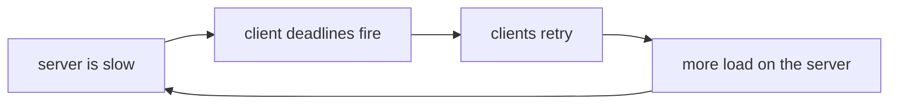

# 4.1 — 💥 The retry that took the server down

## One-line answer

Retrying a slow server adds load to the exact thing that is short of capacity, and because giving up
ends the wait and not the work, the abandoned attempts stay in the queue — so a client fleet that
retries can make an outage last three times longer while answering exactly the same number of people.

## The story

Somebody says the tankers are not coming this week and the pumps will run dry.

Nobody checks. By the afternoon there is a line at the pump on the main road that goes back past the
bakery, and everyone in it has come today for petrol they would otherwise have bought on Friday, and
most of them are topping up a tank that was two-thirds full.

By evening the pump has run dry.

It was true, in the end. It just was not true before everybody acted on it. The station had enough
for a normal week and nothing like enough for a week's demand arriving in an afternoon, and the thing
that emptied it was not the tanker schedule. It was two hundred people each doing something entirely
sensible for themselves, at the same time, in response to the same rumour.

The people who arrived at six had the worst of it: they queued for an hour and got nothing, and their
queueing is part of why the people behind them got nothing either.

## The idea in plain language

A retry is not free. It is a request, and a request costs the server work: a connection, a parse, a
scheduler slot, a database handle. That cost is paid whether or not the request eventually succeeds,
and whether or not anybody is still waiting for the answer.

So there is a feedback loop, and it runs in the wrong direction:



Every arrow in that diagram is a correct local decision. The client is right that a retry often
helps. The server is right to accept the request. Nobody is behaving badly, and the loop still
amplifies.

Two things make it worse than a simple doubling of traffic.

**The abandoned work stays in the queue.** Day 38's
[1.2](../../../day-38-failure-and-migration-lab/parts/01-the-clock/1.2-giving-up-ends-the-wait.md)
proved this: when your deadline fires, the server does not find out. It is still going to run that
tool, produce a correct answer, and write it to a socket nobody is reading. So a retry does not
*replace* the original request, it *joins* it, and the server is now doing two units of work for one
unit of demand — the second of which was queued behind the first and is therefore even more likely to
be abandoned too.

**The retries are synchronised.** [3.2](../03-backing-off/3.2-the-same-wait-is-the-wrong-wait.md) is
the whole story: a shared failure event starts every client's ladder at the same instant, so the
extra load arrives as walls rather than as a slope.

The name for this is a **retry storm**, and its signature is unmistakable once you have seen it:
request volume rises sharply *while* the success rate falls, and it stays high after the incoming
traffic has stopped. The system is now generating its own load.

There are four defences and this day builds three of them. Backoff
([3.1](../03-backing-off/3.1-waiting-longer-each-time.md)) thins the traffic over time. Jitter
([3.2](../03-backing-off/3.2-the-same-wait-is-the-wrong-wait.md)) spreads it. A budget
([3.4](../03-backing-off/3.4-with-retries.md)) bounds it. The fourth — stopping entirely for a while
— is [4.2](4.2-the-switch-that-refuses-first.md).

## Why Sutra needs it

Sutra is about to be given a retry loop, and this part is the argument for why that loop must be
bounded, jittered and eventually switched off rather than merely present.

The concrete scenario is Sutra's own. `sutra_mcp` runs behind an HTTP endpoint after
[Day 43](../../../day-43-stateless-by-default/LESSON.md), and being stateless means it scales by
running more copies of one small server. Small servers have small queues. Phase 8's triage graph will
run many workers, all pointed at the same endpoint, all sharing one retry policy — which is exactly
the fleet in the simulation below.

And there is a Sutra-specific multiplier. [2.4](../02-the-deadline/2.4-the-numbers-your-libraries-chose.md)
found that ADK retries every failed tool call once on its own, so Sutra's fleet generates twice the
retries its own configuration admits to.

## The mechanism

> 🎬 **The scene:** two hundred workers hit `sutra_mcp` in the same second because a batch job
> started. The server is not broken; it is simply slower than the burst, and calls begin to exceed
> the client's deadline.
>
> 😬 **The naive fix:** the retries are working as designed. Some calls are timing out, so they are
> retried, and some of those succeed. Nobody sees a reason to intervene.
>
> 💥 **Why it fails:** each abandoned attempt is still in the server's queue and will still be
> executed. The retries queue behind that dead work, time out in turn, and are retried. The queue is
> now being fed faster than it drains, by a client that believes it is being helpful.
>
> 💡 **The insight:** during an outage, a retry is not a second chance. It is load, added to the one
> resource that has run out.

A queue simulation in tenth-of-a-second ticks — no threads, no sockets, reproducible:

```python
# days/day-44-client-hardening/lab/storm.py
TICK = 0.1
RATE = 40.0  # requests the server completes per second
CLIENTS = 200  # all of them arrive at once
DEADLINE = 1.0  # how long a caller waits before giving up on an attempt
MAX_ATTEMPTS = 3
LIMIT_TICKS = 600  # 60 seconds; if it has not drained by then, say so
```

**Line by line:**

- `RATE = 40.0` and `CLIENTS = 200` put the burst at five times the server's capacity. That ratio is
  the point: the server is not down, it is oversubscribed, which is the situation retries are usually
  aimed at and are worst for.
- `DEADLINE = 1.0` is the client's patience, and it is deliberately shorter than the time it takes
  the queue to drain. That is what makes attempts get abandoned, and abandonment is the mechanism
  this part is about.
- `TICK = 0.1` is the simulation's resolution. Coarse enough to run instantly, fine enough that a
  one-second deadline is ten distinguishable steps.
- `LIMIT_TICKS` is a guard so that a badly-tuned parameter produces a bounded run rather than a hang.
  A simulation that can loop forever is a lab you cannot trust.

The loop, and the one line that models the whole failure:

```python
# days/day-44-client-hardening/lab/storm.py (continued)
        if retry:
            for client, sent_at in list(queue):
                if client in answered or now - sent_at < DEADLINE:
                    continue
                if attempts_left[client] > 0 and not any(
                    c == client and s > sent_at for c, s in queue
                ):
                    attempts_left[client] -= 1
                    queue.append((client, now))  # the abandoned request stays in the queue

        credit += RATE * TICK
        while credit >= 1.0 and queue:
            credit -= 1.0
            client, sent_at = queue.pop(0)
            completed += 1
            if client in answered or now - sent_at >= DEADLINE:
                wasted += 1  # the caller is gone; this answer will never be read
            else:
                answered.add(client)
```

**Line by line:**

- `queue.append((client, now))` **without removing the old entry** is the entire mechanism, in one
  statement. If the retry replaced the original the simulation would be modelling a system with
  cancellation, which MCP over HTTP does not give you for an abandoned request. Day 38's
  [1.3](../../../day-38-failure-and-migration-lab/parts/01-the-clock/1.3-hanging-up-is-the-message.md)
  is why: hanging up is a message the server discovers late, on its next write.
- `now - sent_at < DEADLINE: continue` means a client only retries once its *own* deadline has
  passed, per attempt. That is what a real client does, and it means the retry wave lags the failure
  wave by exactly one deadline.
- The `not any(c == client and s > sent_at ...)` guard stops one client from queuing a fresh retry on
  every tick. Without it the simulation would produce an absurd number and prove nothing.
- `credit += RATE * TICK` is a token bucket, which is Day 24's
  [leaky bucket](../../../day-24-token-accounting-and-budgets/papers/01-the-leaky-bucket.md) in its
  simplest form: capacity accrues at a fixed rate and is spent one request at a time. It is the
  honest way to model "forty per second" at a tick size of a tenth.
- `queue.pop(0)` is FIFO, so requests are served in arrival order. That is the pessimistic and
  realistic choice — a LIFO queue would actually survive this better, which is a real and
  counter-intuitive technique, and is worth knowing about but is not what any default does.
- `if client in answered or now - sent_at >= DEADLINE: wasted += 1` is the accounting that matters.
  The server finishes the work; it simply finishes it for nobody. **`wasted` is the number this
  script exists to print.**
- `answered` is a `set` of client ids, so a client counts once however many attempts eventually
  complete. Counting completions instead of clients would flatter the retry arm enormously.

Run both arms:

```bash
cd days/day-44-client-hardening/lab
uv run python storm.py
uv run python storm.py --retry
```

**Line by line:**

- The first arm gives every caller one attempt. No retries at all.
- `--retry` is the ablation switch: three attempts each, on the same deadline, against the same
  server.
- **Zero model calls.**

Measured on 2026-09-05:

```text
200 callers at once, server does 40/s, caller deadline 1.0s
attempts per caller: 1

callers answered in time      : 40 of 200
requests the server completed : 200
of which nobody was waiting for: 160
queue empty at                : 4.9s
```

```text
200 callers at once, server does 40/s, caller deadline 1.0s
attempts per caller: 3

callers answered in time      : 40 of 200
requests the server completed : 520
of which nobody was waiting for: 480
queue empty at                : 12.9s
```

Read the first line of each result before anything else. **Forty callers answered, in both runs.**

The retries did not help one single person. Not one. And they cost the server 520 requests instead of
200, of which 480 were answers nobody was waiting for, and they turned a five-second episode into a
thirteen-second one. During those extra eight seconds the server is fully occupied producing results
for callers who left, which means every *new* request arriving in that window is also queued behind
dead work.

That is the whole shape of a retry storm: **same outcome, three times the load, three times the
duration.** And every client involved was following a policy somebody had reviewed.

## When it breaks

The most dangerous form of this is the one where the retries appear to work, so nobody stops them.
Change `RATE` to `150.0` — a server only mildly oversubscribed — and the retry arm genuinely does
recover more callers. The technique is not useless; it is *load-dependent*, and that is what makes it
treacherous. It helps when the server has spare capacity and it hurts when the server has none, which
means the mode where it hurts is the mode nobody tests.

The second break is a monitoring one, and it wastes hours. On the server side a retry storm looks
like this:

```text
requests/sec        : 520 (normal: 200)
p99 latency         : 12.9s (normal: 0.05s)
error rate          : 0%
```

**Zero errors.** The server is answering every request it receives, correctly, in order. It is
succeeding at everything except being useful. A dashboard built on error rate reports a healthy
service, and the team spends the incident looking at the wrong system — because the traffic spike
looks like a cause and is actually a symptom.

The third break is the one that outlasts the trigger. Stop the incoming batch job entirely and the
queue keeps draining dead work for another eight seconds, during which new arrivals still time out
and still retry. At larger scale that tail does not converge on its own: the system sustains its own
load after the original cause is gone. This is why the answer at that point is not a better backoff
but a stop, which is [4.2](4.2-the-switch-that-refuses-first.md).

## In production

**What a professional writes instead of the teaching version.** Retries are governed as a fraction of
traffic, not as a count per request. A client-wide retry budget — for example, retries may add at most
ten per cent to the request volume, measured over a sliding window — means that when everything is
failing, almost nothing is retried, which is exactly the right behaviour and the opposite of what a
per-request count produces. Alongside it, the server sheds load explicitly: a bounded queue that
returns `429` immediately rather than accepting work it cannot finish, so a client learns to slow
down ([3.3](../03-backing-off/3.3-the-server-said-when.md)) instead of learning nothing from a
timeout.

**What degrades at scale or under concurrency.** The amplification factor is a multiplier that
switches on at the worst moment. At normal load almost nothing retries, so retry traffic is invisible
in capacity planning; at the moment capacity is exhausted, every layer retries every call and the
product from [3.4](../03-backing-off/3.4-with-retries.md) appears in full. A system provisioned for
its measured peak is provisioned for a world in which the multiplier is one.

**The failure mode that only appears with real traffic.** Metastable failure — the state where
removing the original cause does not restore the service. The queue is full of abandoned work, every
client is timing out and retrying, and the load sustaining the outage is entirely self-generated. The
only exits are shedding load hard, or draining the queue by refusing everything for a while, and both
of them mean deliberately failing requests that could have been served. Teams that have not thought
about this in advance will not do it during the incident, because it feels like giving up.

**The review comment a senior engineer leaves:** *"this retries three times on any failure. What does
this code do when the server is at capacity rather than down? Right now it triples the load on the
thing that is short of capacity and, because we cannot cancel, the first attempt is still being
executed. Add a client-wide retry budget and a breaker, and tell me what fraction of our traffic
retries are allowed to be."*

**The interview question:** *"your dependency gets slow and your retries are on. What happens?"* —
*"They make it worse, and the measurement that convinced me is simple. Two hundred callers, a server
doing forty a second, a one-second deadline: with one attempt each, forty callers are answered and
the queue drains in about five seconds. With three attempts each, exactly the same forty callers are
answered, the server completes 520 requests instead of 200, and the queue takes thirteen seconds.
The retries helped nobody and tripled the duration, because giving up ends your wait and not the
server's work — so the abandoned attempts are still in the queue ahead of the retries. The defences
are jitter so the retries do not arrive as a wall, a budget expressed as a fraction of traffic rather
than a count per request, and a breaker that stops asking altogether. And the thing I watch for on the
dashboard is a request-rate spike with a *zero* error rate, because that is a retry storm and it looks
like a healthy server."*

## Check yourself

```bash
cd days/day-44-client-hardening/lab
uv run python storm.py
uv run python storm.py --retry
```

Then set `RATE` to `150.0` and run both arms again. The retry arm now answers more callers. Say why
that result is more dangerous than the original one.

**Out loud, without scrolling up:** say why a retry during an overload is worse than a retry during
an outage, and say what the server's error rate looks like while a retry storm is happening.

**Next:** [4.2 — The switch that refuses before it asks](4.2-the-switch-that-refuses-first.md).
