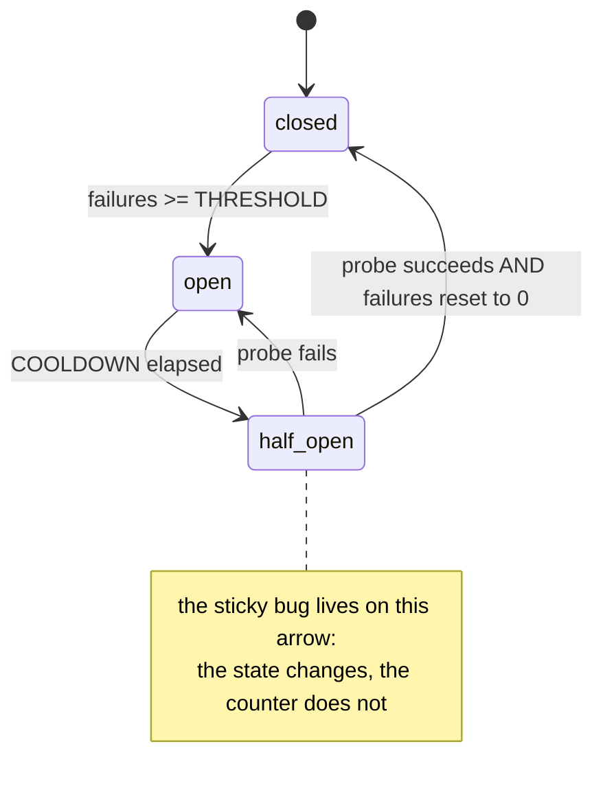

# 4.2 — The switch that refuses before it asks

## One-line answer

After enough consecutive failures a client should stop calling altogether for a while and fail
immediately instead, then let exactly one request through to find out whether the far side is back —
and the hard half is not opening the circuit but making sure it can close again.

## The story

The shop has been ordering the same brand of tinned tomatoes from the same supplier for years, and
this month the supplier has let them down three times running.

The first time, the owner rang and rang and got nothing. The second time he drove out to the depot
himself, which cost him an afternoon and produced a shrug. The third time he did not bother with
either, because by then he had learned something: whatever is wrong at that depot is not the kind of
thing that gets better between Tuesday and Wednesday, and every hour he spends chasing it is an hour
he is not spending finding tomatoes somewhere else.

So he stopped ordering from them. Not forever, and this is the part that matters. He put a note in
the diary for the end of the month, and at the end of the month he placed one small order — a single
case, nothing he could not afford to lose — to find out whether things had changed. If it turns up,
he goes back to normal. If it does not, the note moves to the end of next month.

The one small order is the whole design. A shop that stopped ordering and never checked again would
have lost a good supplier over a bad quarter.

## The idea in plain language

A **circuit breaker** wraps a call and keeps a small amount of state about how it has been going. It
has three states, and the third one is where all the subtlety lives.

| State | What happens to a call | How it got here | How it leaves |
| --- | --- | --- | --- |
| **closed** | passes through normally | the starting state, or a successful probe | too many consecutive failures |
| **open** | refused immediately, without calling | the failure threshold was reached | the cooldown elapses |
| **half-open** | *one* call is allowed through as a probe | the cooldown elapsed | probe succeeds → closed; probe fails → open again |

The name comes from an electrical trip switch: when something is drawing too much current, the switch
opens the circuit so nothing downstream can be damaged, and somebody has to decide to close it again.
The metaphor is exact in one important way — **open means no current flows**, which is the opposite
of what "open" suggests in ordinary English, and it catches everybody once.

Why this is different from backoff. Backoff and budgets
([3.4](../03-backing-off/3.4-with-retries.md)) are about *one request*: they bound how much this
particular caller spends. A breaker is about *the dependency*: it carries knowledge from one request
to the next, so that request number two does not have to rediscover, at the cost of a full timeout,
what request number one already found out.

That is the benefit, and it is worth naming precisely, because people expect the wrong one. **A
breaker does not make failing calls succeed.** What it does is make them fail *cheaply* — instantly,
without a socket, without a worker held for the duration of a deadline, and without adding a request
to a server that is already struggling. It converts a slow failure into a fast one, and under load a
slow failure is the expensive kind.

There is a real cost, and an honest treatment has to say it: while the circuit is open, calls that
*would* have succeeded are refused. A breaker trades some availability for a great deal of stability,
and if you tune it too eagerly you will be refusing traffic that the dependency could have served.

## Why Sutra needs it

`sutra/mcp/hardening.py` is the file that owns "what does a call get to cost". After
[4.1](4.1-the-retry-that-took-it-down.md) the answer cannot be "a full deadline, every time, forever"
— because that is the behaviour that holds every worker in the pool while a dependency is down.

Sutra will talk to more than one server. Day 40's `REGISTRY` in `sutra/mcp/filtering.py` is a list of
them, and the day one of them is unreachable is a day the *other* ones should still work. Without a
breaker, one dead server occupies Sutra's thread pool
([2.3](../02-the-deadline/2.3-with-timeout.md) sized it at four) with calls that are all going to
time out, and every healthy server becomes unreachable too. **A breaker is per dependency, and its
real job is to stop one bad dependency taking the others down with it.**

## The mechanism

Three states, twenty lines, and one deliberate bug you can switch on:

```python
# days/day-44-client-hardening/lab/breaker.py
THRESHOLD = 3  # consecutive failures before the circuit opens
COOLDOWN = 0.5  # how long it stays open before allowing one probe


class Breaker:
    """Three states: closed (calls pass), open (calls refused), half-open (one probe)."""

    def __init__(self, *, sticky: bool) -> None:
        self.failures = 0
        self.opened_at: float | None = None
        self.sticky = sticky  # the bug: never reset the counter

    @property
    def state(self) -> str:
        if self.opened_at is None:
            return "closed"
        if time.monotonic() - self.opened_at >= COOLDOWN:
            return "half-open"
        return "open"

    def before(self) -> None:
        """Raise instead of calling, if the circuit is open."""
        if self.state == "open":
            raise ConnectionError("circuit open; not attempting")

    def on_success(self) -> None:
        """A probe got through. Close the circuit and forget the failures."""
        if self.sticky:
            self.opened_at = None  # closes, but the counter still holds THRESHOLD failures
            return
        self.failures = 0
        self.opened_at = None

    def on_failure(self) -> None:
        """Count the failure and open the circuit once the run is long enough."""
        self.failures += 1
        if self.failures >= THRESHOLD:
            self.opened_at = time.monotonic()
```

**Line by line:**

- The state is **derived**, not stored. `state` is a property computed from `opened_at` and the clock,
  so there is no possibility of a stored state disagreeing with the timestamps. A breaker with an
  explicit `self.state = "half-open"` assignment has a fourth failure mode: a transition somebody
  forgot to write.
- `opened_at is None` means closed. Using `None` as the closed marker rather than a separate boolean
  removes the state where `is_open` is `True` and `opened_at` is `None`.
- `time.monotonic()` again, for [2.2](../02-the-deadline/2.2-the-deadline-never-reached.md)'s reason:
  a clock adjustment must not be able to close a breaker early or hold it open for a week.
- `before()` raises `ConnectionError` rather than returning `False`, so a caller cannot forget to
  check the return value. The failure path is the same shape as a real connection failure, which
  means every layer above already handles it.
- `on_success` resets `failures` to zero. **That single line is the whole difference between a
  breaker and a trap**, and `sticky` removes it.
- In the sticky arm `opened_at = None` still runs, so the circuit really does close — this is not a
  breaker that never reopens the flow. It is worse and more realistic: it closes, and then the very
  next failure re-opens it instantly, because `failures` is still at the threshold. The bug is not
  visible in the state machine, only in the counter.
- `THRESHOLD` counts **consecutive** failures, which is why `on_success` must reset. A breaker that
  counted total failures would eventually open on any long-lived healthy service.
- There is no lock and no shared state between processes. Under concurrency several callers can be in
  `half-open` at once and all send probes; a production breaker admits exactly one.

Run all three arms:

```bash
cd days/day-44-client-hardening/lab
uv run python breaker.py
uv run python breaker.py --breaker
uv run python breaker.py --sticky
```

**Line by line:**

- The first arm has no breaker: every call to a dead backend pays the full timeout.
- `--breaker` is the correct implementation.
- `--sticky` is the ablation switch, and it removes one line: the `failures = 0` reset.
- The backend is down for the first two seconds and then healthy but imperfect — it drops one call in
  seven forever, which is what a real service does and is what makes the sticky bug visible.
- **Zero model calls.**

Measured on 2026-09-05:

```text
policy: no breaker   backend down for 2.0s   call timeout 0.2s

answered              : 29 of 40
timed out             : 11
refused by the breaker: 0
requests the backend saw: 40
seconds the caller spent waiting: 2.22
first success at: 2.11s
```

```text
policy: breaker   backend down for 2.0s   call timeout 0.2s

answered              : 24 of 40
timed out             : 8
refused by the breaker: 8
requests the backend saw: 32
seconds the caller spent waiting: 1.61
first success at: 2.00s
```

```text
policy: sticky breaker   backend down for 2.0s   call timeout 0.2s

answered              : 14 of 40
timed out             : 7
refused by the breaker: 19
requests the backend saw: 21
seconds the caller spent waiting: 1.41
first success at: 2.02s
```

Compare the first two honestly, because the honest comparison is more useful than the flattering one.
The breaker spent **1.61 seconds waiting instead of 2.22**, and sent the struggling backend **32
requests instead of 40** — and it answered **24 callers instead of 29**. It did not win on every
axis. It bought cheapness and load reduction with five refused calls that would have worked. That is
the trade, and a part that hid it would be selling you something.

Now the third arm, which is the failure. Same threshold, same cooldown, one missing line: **14
answered instead of 24, and 19 calls refused instead of 8.** Once the backend recovers, the sticky
breaker still has three failures on its counter, so the very first ordinary blip — the one call in
seven that any healthy service drops — pushes it straight back over the threshold. It spends the rest
of the run flapping between open and half-open, refusing a healthy backend.



## When it breaks

The first break is the sticky one above, and its signature in a log is unmistakable once you know it:

```text
circuit open; not attempting
circuit open; not attempting
circuit open; not attempting
```

repeating long after the dependency's own dashboard shows it healthy. The dependency is fine. The
client will not ask. If you ever see a service that stays broken for one caller after everybody else
has recovered, this is the first thing to check — and the check is not "is the circuit open", it is
"what is the failure counter".

The second break is a threshold that trips on unrelated errors. A breaker that counts *every*
exception will open on a validation failure or a `-32602` *"Unknown tool"*, neither of which says
anything about the server's health:

```text
{"jsonrpc": "2.0", "id": 7, "error": {"code": -32602, "message": "Unknown tool: close_tickett"}}
```

Three of those from a typo in Sutra's own code, and Sutra stops calling a perfectly healthy server.
Only failures that indicate the *dependency* is unwell should count: timeouts, connection errors,
`5xx`, `429`. Day 38's
[2.2](../../../day-38-failure-and-migration-lab/parts/02-the-x-ray/2.2-malformed-is-not-transient.md)
built the classifier that tells them apart, and the breaker should be fed by it rather than by a bare
`except Exception`.

The third break is a breaker at the wrong granularity. One breaker for "MCP" means a single sick
server opens the circuit for every server Sutra talks to:

```text
answered              : 0 of 40
refused by the breaker: 40
requests the backend saw: 0
```

The healthy servers were never called. One breaker per `(server, transport)` is the minimum; some
systems go finer and key on the endpoint, because one pathological tool can be slow while the rest of
a server is fine.

## In production

**What a professional writes instead of the teaching version.** The threshold is a *rate* over a
sliding window, not a consecutive count — "more than half of the last twenty calls failed, and there
were at least twenty" — because a consecutive counter is trivially reset by an interleaved success
and will never open on a dependency that is failing half the time. Half-open admits exactly one probe
using an atomic flag rather than a state check, so a hundred concurrent callers do not all probe at
once. Cooldown grows on repeated failed probes, up to a cap, which is [3.1](../03-backing-off/3.1-waiting-longer-each-time.md)'s
ladder applied to the breaker itself. And every state transition is a log line at WARNING with the
dependency named, because "the breaker opened at 09:14" is the most useful sentence in an incident
timeline.

**What degrades at scale or under concurrency.** The breaker's state is per process. Forty instances
of Sutra each need three failures to learn what one instance already knows, so a fleet costs 120
failed calls to protect itself rather than three. That is usually accepted — sharing breaker state
adds a dependency on the very infrastructure you are trying to protect — but it means the threshold
should be read as a *per-instance* number and the fleet's total exposure calculated from it.

**The failure mode that only appears with real traffic.** Synchronised probing. Every instance opened
its circuit at roughly the same moment, so every instance's cooldown expires at roughly the same
moment, and the recovering dependency receives the entire fleet's probes in one instant — and falls
over again. This is [3.2](../03-backing-off/3.2-the-same-wait-is-the-wrong-wait.md) wearing a
breaker's clothes, and the fix is the same: jitter the cooldown.

**The review comment a senior engineer leaves:** *"the breaker opens on three consecutive failures
and closes on one success, and `failures` is never reset anywhere I can see. Show me the line that
resets it. Also, what counts as a failure here — if a schema error opens this circuit we will stop
calling a healthy server because of a bug in our own arguments."*

**The interview question:** *"what does a circuit breaker actually buy you?"* — *"Cheap failure, not
success. It cannot make a broken dependency work; what it does is stop each request rediscovering the
outage at the cost of a full timeout and a held worker, which is what takes a service down when one
of its dependencies is sick. I measured it on a backend that was down for two seconds: with the
breaker, the caller spent 1.61 seconds waiting instead of 2.22 and the backend saw 32 requests
instead of 40. It also answered five fewer callers, and I would say that out loud, because it is the
trade. The part I care most about in review is the transition back: the counter has to reset on a
successful probe, and if it does not, the breaker closes and then the next ordinary blip re-opens it
instantly and you have a dependency that stays broken for one client after everybody else has
recovered."*

## Check yourself

```bash
cd days/day-44-client-hardening/lab
uv run python breaker.py
uv run python breaker.py --breaker
uv run python breaker.py --sticky
```

Then set `FLAKE_EVERY` to a very large number so the recovered backend is perfect, and run the sticky
arm again. It now looks identical to the correct one. Say why a perfect dependency hides this bug,
and what that implies about where you test breakers.

**Out loud, without scrolling up:** name the three states, say which one lets a call through and how
many, and say what has to happen on a successful probe besides changing state.

**Next:** [5.1 — The chair you are holding for nobody](../05-no-held-connections/5.1-the-chair-you-hold-for-nobody.md).
