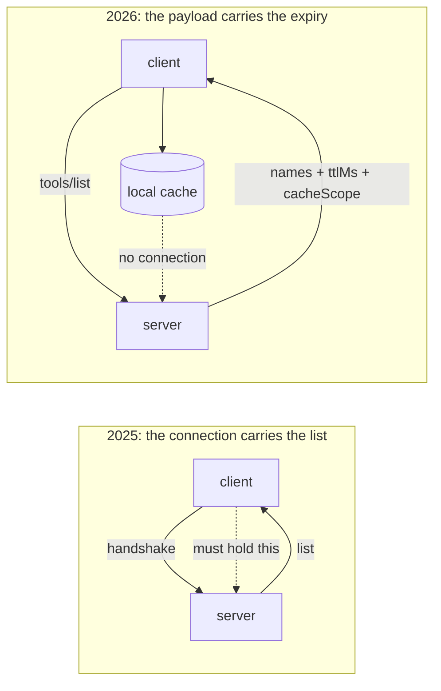

# 5.2 — Keep the catalogue, not the connection

## One-line answer

The reason people held connections was to avoid re-fetching the tool list, and the protocol answered
that directly by putting an expiry on the list itself — so the thing worth keeping between requests
is the catalogue and its `ttlMs`, and the socket can go.

## The story

The hardware shop on the corner has its price board painted on the outside wall.

Sizes of pipe, thread tape, the two grades of cement, all of it in white paint with the prices in
red, and a date in the bottom corner saying when it was last redone. You can read the whole thing
with the shutter down.

Which means you almost never go in to ask. You look on your way past, you work out at home whether
the job is worth doing, and you walk in exactly once, knowing what you want. The shop is not open
longer than it used to be. You are not inside it more. You simply stopped needing the shop to be open
in order to know what the shop sells.

The date in the corner is doing quiet work. Without it you would trust the board for a while and then
start wondering, and eventually you would go in and ask anyway, which is where you started.

## The idea in plain language

A `tools/list` result is a **catalogue**: the names, descriptions and input schemas of what a server
offers. It is the thing a client needs before it can do anything at all, and re-fetching it on every
request is a round trip that buys nothing when it has not changed.

Under the old model there was one way to avoid that round trip: hold the connection and keep the list
you fetched at handshake time. The list belonged to the session. That is the reason people gave for
long-lived connections, and it was a real reason.

The 2026-07-28 revision answered it directly. List results carry two fields:

| Field | What it says | Unit |
| --- | --- | --- |
| `ttlMs` | how long this result may be reused | **milliseconds** |
| `cacheScope` | who may share it — `"public"` or `"private"` | — |

Day 32's [3.3](../../../day-32-mcp-stateless-core/parts/03-headers-and-caches/3.3-lists-you-may-keep.md)
is where those were taught and Day 34's
[3.1](../../../day-34-building-sutra-mcp-tools/parts/03-the-two-calls/3.1-the-list-and-who-may-keep-it.md)
is where `sutra_mcp` was made to send them. This part is the client side of the same fact, and the
consequence is the one sentence worth remembering: **the catalogue's lifetime is now stated by the
server and is completely independent of any connection.**

That decouples two things that used to be welded together:

- *How long may I reuse this list?* — answered by `ttlMs`, in the payload.
- *Do I have a connection open?* — irrelevant to the first question.

So the client keeps a small dictionary from server key to `(names, expires_at)`, opens a connection
when it has actual work, and closes it. The warm feeling that used to come from a held socket now
comes from the cache, and unlike the socket, the cache survives a deploy, a restart of the far side,
and being moved to a different instance — because it is data, not a resource.

Two things the cache must respect, and they are both easy to get wrong:

- **`ttlMs` is milliseconds.** Day 34's traps list carries this one: `3600` is three and a half
  seconds, not an hour. A client that treats it as seconds will cache a list for a thousand times
  too long.
- **`cacheScope: "private"` means it may not be shared between callers.** A list that varies by
  identity — which it can, after Day 37 gave the client one — cached under a single key hands one
  caller's tool list to another. The cache key includes whatever the scope says it must.

## Why Sutra needs it

MCP-23 says no held connections, and a rule that only takes something away is a rule people work
around. This is what replaces it, and the replacement has to be in the client before the rule is
enforceable.

Sutra already has the two halves. Day 33's `list_tools(toolset)` fetches a catalogue. Day 40's
[3.3](../../../day-40-filtering-and-allowlists/parts/03-when-the-server-changes/3.3-the-list-you-kept-is-the-list-you-trust.md)
asked the learner to choose a `ttl_seconds` per server and told them to write the reason beside each
number. What is missing is the thing in between: a cache that reads the server's own `ttlMs` rather
than a number Sutra invented.

There is also a ready-made version of this one layer down.
[2.4](../02-the-deadline/2.4-the-numbers-your-libraries-chose.md) noted that `McpToolset.__init__`
takes `tool_list_cache_ttl_seconds`, and reading
`.venv/Lib/site-packages/google/adk/tools/mcp_tool/mcp_toolset.py` on 2026-09-05 shows it is
`None` by default, must be positive when set, and keys an `OrderedDict` bounded at
`_MAX_TOOL_LIST_CACHE_ENTRIES = 64`. So ADK will cache the list for you — for a number of *seconds*
that **you** supply, not for the `ttlMs` the server sent. That gap is the interesting part, and it is
a `TODO(me)` in the hub.

## The mechanism

> 🎬 **The scene:** Sutra handles twelve requests in a burst. Each one opens a connection, does its
> work, and closes it, exactly as [5.1](5.1-the-chair-you-hold-for-nobody.md) requires.
>
> 😬 **The naive fix:** none is needed, surely — the connection is cheap and correct now.
>
> 💥 **Why it fails:** each of those twelve connections re-fetches the catalogue before it can call
> anything, so "no held connections" has quietly become "twelve `tools/list` round trips for twelve
> requests" — which is precisely the cost people held connections to avoid, and the reason a team
> that adopts the rule without the cache will reverse it in a fortnight.
>
> 💡 **The insight:** the connection was never what you were keeping. The list was. Keep the list.

The server's answer, with the fields that make it keepable:

```python
# days/day-44-client-hardening/lab/catalog.py
TTL_MS = 600  # what the server puts in ttlMs on its tools/list result


def tools_list() -> dict[str, object]:
    """The server's answer to tools/list, with the caching hints Day 32 taught."""
    global LIST_CALLS
    LIST_CALLS += 1
    time.sleep(0.05)  # a round trip is not free
    return {
        "tools": ["lookup_ticket", "search_kb"],
        "ttlMs": TTL_MS,
        "cacheScope": "public",
    }
```

**Line by line:**

- `TTL_MS = 600` is six hundred **milliseconds**, and the variable is named `_MS` for exactly the
  reason in the section above. A constant called `TTL` invites the wrong unit at the call site.
- `LIST_CALLS` is the number the script exists to print. Everything else is scaffolding.
- `time.sleep(0.05)` makes the round trip cost something. Without it, "twelve list calls instead of
  two" is an abstraction; with it, the total time differs and the saving is visible.
- `cacheScope: "public"` is safe here because this list does not vary by caller. It is included so
  the shape of the real response is on the page — and so the point about `"private"` has something to
  point at.

The client's whole cache is fourteen lines:

```python
# days/day-44-client-hardening/lab/catalog.py (continued)
class Catalog:
    """The client's own copy of a tool list, with the expiry the server stated."""

    def __init__(self) -> None:
        self.names: list[str] | None = None
        self.expires_at = 0.0

    def get(self) -> list[str]:
        """Return the tool names, fetching only when the server's own TTL has run out."""
        if self.names is not None and time.monotonic() < self.expires_at:
            return self.names
        result = tools_list()
        self.names = list(result["tools"])
        ttl_ms = result.get("ttlMs")
        self.expires_at = time.monotonic() + (float(ttl_ms) / 1000.0 if ttl_ms else 0.0)
        return self.names
```

**Line by line:**

- `self.names` starts as `None` rather than `[]`, so "never fetched" and "fetched and empty" are
  different states. A server that legitimately offers no tools would otherwise be re-fetched forever.
- `time.monotonic()` for the expiry comparison, for the same reason as everywhere else in this day: a
  wall-clock adjustment must not be able to expire or extend a cache.
- `float(ttl_ms) / 1000.0` is the unit conversion, on its own line, with the `_ms` name right next to
  it. This is the single most likely bug in the file and the code is arranged so a reviewer sees the
  division.
- `if ttl_ms else 0.0` — an **absent or zero** `ttlMs` means do not cache at all, so `expires_at`
  becomes now and the next call re-fetches. That is the correct default: silence from the server is
  not permission. Note this also handles the negative case, since a negative `ttlMs` is falsy only at
  zero — a production version checks `ttl_ms > 0` explicitly, and the hub leaves that as a
  `TODO(me)`.
- `list(result["tools"])` copies. The cache must not hand out a list that a caller can append to.
- There is **no connection anywhere in this class.** That is the point of the part: the thing being
  kept between requests is a list and a timestamp, and neither of them holds an operating-system
  resource.

Run both arms:

```bash
cd days/day-44-client-hardening/lab
uv run python catalog.py
uv run python catalog.py --cache
```

**Line by line:**

- The first arm re-fetches on every request, which is what "no held connections" gives you if you
  stop there.
- `--cache` is the ablation switch.
- **Zero model calls.**

Measured on 2026-09-05:

```text
server ttlMs=600   12 requests, a fresh connection each time

cache in use     : False
tools/list calls : 12 for 12 requests
total time       : 1.81s
last list came from: server
```

```text
server ttlMs=600   12 requests, a fresh connection each time

cache in use     : True
tools/list calls : 2 for 12 requests
total time       : 1.31s
last list came from: cache
```

**Two catalogue fetches for twelve requests**, and the second one happened only because the run is
longer than the server's stated six hundred milliseconds — which is the cache doing exactly what it
was told, not an inefficiency. The connection count is identical in both runs. Nothing was held in
either.



## When it breaks

The first break is the unit, and it is silent in the direction that matters. Treat `ttlMs` as seconds
and a six-hundred-millisecond promise becomes a ten-minute one:

```text
tools/list calls : 1 for 12 requests
```

That looks *better* than the correct answer, which is what makes it dangerous. The consequence
arrives later, when a tool is removed and Sutra keeps calling it for the rest of the wrong TTL — Day
34's [6.1](../../../day-34-building-sutra-mcp-tools/parts/06-in-production/6.1-the-tool-you-deleted-is-still-called.md)
is that failure, and a client with an inflated TTL extends its blast radius by three orders of
magnitude.

The second break is the cache key. One key for a list that varies by caller, and one caller's
catalogue is served to another:

```text
caller A (support role)  : ['lookup_ticket', 'search_kb']
caller B (admin role)    : ['lookup_ticket', 'search_kb']   <- should have had close_ticket too
```

Here the leak goes the safe way. It can equally go the other way, and then an unprivileged caller is
shown an administrative tool and will try to call it. `cacheScope: "private"` is the server telling
you this list is identity-dependent, and Day 32's 3.3 called it a security field wearing a
performance field's clothes.

The third break is the stale entry that outlives a deployment. The cache is correct, the TTL is
honoured, and a tool was renamed inside the window:

```text
{"jsonrpc": "2.0", "id": 3, "error": {"code": -32602, "message": "Unknown tool: search_kb"}}
```

This is not a bug in the cache — it is the cost the TTL buys, and the server chose the number. What a
client owes here is the diff on refresh: when the new list arrives, compare it with the pinned names
from Day 40's
[3.3](../../../day-40-filtering-and-allowlists/parts/03-when-the-server-changes/3.3-the-list-you-kept-is-the-list-you-trust.md)
and log loudly on drift, because a tool that appeared or changed shape is a review request rather
than a routine refresh.

## In production

**What a professional writes instead of the teaching version.** The cache is keyed on
`(server_key, identity_scope)` where the identity part is empty for `cacheScope: "public"` and is the
caller's principal for `"private"`. It is bounded, with least-recently-used eviction, because an
unbounded dictionary keyed on identity is a memory leak with a nice name — ADK's own bound is 64
entries, which is a reasonable order of magnitude to copy. Entries record when they were fetched as
well as when they expire, so a log line can say *"served from a catalogue fetched 0.4s ago"*, and a
refresh diffs against the pinned list before replacing it.

**What degrades at scale or under concurrency.** Two things. First, cache stampede: when a popular
entry expires, every concurrent request misses at once and they all fetch — which is
[3.2](../03-backing-off/3.2-the-same-wait-is-the-wrong-wait.md)'s herd arriving through a cache
instead of a retry. The fixes are to let exactly one refresh proceed while the others serve the stale
value, and to jitter the expiry so entries do not all lapse together. Second, per-identity caching
multiplies entries by users, so a `"private"` scope on a busy server needs a real eviction policy
rather than a dictionary.

**The failure mode that only appears with real traffic.** A server that sends no `ttlMs` at all,
because it predates the revision — and a client that defaults to some invented number rather than to
zero. It works perfectly, for a long time, and then a tool changes and the client is wrong for
however long the invented default was. Absent means do not cache; if you want a default, it belongs
in the client's own configuration per server, with the reason written beside it, which is exactly
what Day 40's 3.3 asked for.

**The review comment a senior engineer leaves:** *"you cache the tool list under the server name.
What happens when the server sends `cacheScope: private`? Right now we would serve one user's tool
list to another. Key on scope, bound the dictionary, and check the units on that TTL — the field is
milliseconds."*

**The interview question:** *"you have stopped holding connections. Does that not cost you a round
trip on every request?"* — *"It would, and that is the objection people actually have. The answer is
that the thing worth keeping was never the socket, it was the catalogue, and the 2026 revision put
an expiry on the catalogue itself — `ttlMs` and `cacheScope` on the list result. So the client keeps a
list and a timestamp, which survives a deploy and a reconnect and being moved to another instance,
and opens a connection only when it has work. I measured it: twelve requests went from twelve
`tools/list` calls to two, with the same number of connections. The two things I watch are the unit,
because the field is milliseconds and treating it as seconds is a thousand-fold error in the
dangerous direction, and the cache key, because `private` scope means the list is identity-dependent
and a single key leaks one caller's tools to another."*

## Check yourself

```bash
cd days/day-44-client-hardening/lab
uv run python catalog.py
uv run python catalog.py --cache
```

Then change `TTL_MS` to `60000` and run the cached arm again. One fetch for twelve requests. Say what
Sutra would now do for a whole minute after a tool is deleted, and who chose that number.

**Out loud, without scrolling up:** say what replaced the held connection as the thing worth keeping,
name the two fields that make it keepable and their units, and say what an absent `ttlMs` means.

**Next:** [5.3 — What reconnecting actually costs](5.3-what-reconnecting-costs.md).
