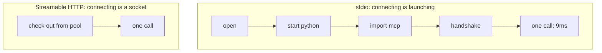

# 5.3 — What reconnecting actually costs

## One-line answer

Over HTTP a reconnect is a socket and is nearly free, but over stdio it is launching an operating
system process, and measured on this machine that is about a second per request against a call that
takes single-digit milliseconds — so the rule is not "always reconnect", it is "nothing on the
connection may be load-bearing", and stdio is where the difference shows.

## The story

The auto driver switches the engine off at the long signal on the main road and starts it again when
the lights change.

He does not do it at every signal. At the short one by the school he leaves it running, because the
starter motor and the extra fuel on restart cost more than idling through forty seconds does, and he
would rather not replace a battery this year. At the long one, where you sit through two cycles, he
switches off without thinking about it.

Nobody handed him a rule saying "switch off". He worked out roughly where the crossover is, from the
cost of starting and the cost of idling, and he applies whichever side of it he is on. Somebody who
had been told "always switch off at signals" would be doing something worse than he does, with more
conviction.

## The idea in plain language

[5.1](5.1-the-chair-you-hold-for-nobody.md) removed the *reasons* to hold a connection.
[5.2](5.2-keep-the-catalogue-not-the-connection.md) removed the main *cost* of not holding one. This
part is the remaining cost, measured honestly, because a rule you cannot price is a rule people
break quietly.

Reconnecting is not one thing. It costs completely different amounts depending on the transport:

| Transport | What "connecting" means | Roughly what it costs |
| --- | --- | --- |
| Streamable HTTP, connection reused from a pool | nothing — an existing socket is checked out | negligible |
| Streamable HTTP, new socket | TCP handshake, and TLS if it is `https` | a network round trip, sometimes two |
| stdio | **launching a process** and waiting for it to be ready | an interpreter start, plus every import |

The third row is the one that breaks the tidy story, and this day is not going to pretend otherwise.
Day 33's [2.1](../../../day-33-client-and-transports/parts/02-stdio/2.1-connecting-is-launching.md)
said it plainly: on stdio, connecting is launching. If Sutra opened a process per request against a
stdio server, it would spend far more time starting Python than doing work.

So the rule needs its scope stated precisely, and here it is:

> **No state that matters may live on a connection.** Whether a connection is *reused* is a
> performance decision, made per transport, and the client must be correct either way.

Read that against the two transports and it resolves cleanly.

- **HTTP** is the deployed shape. Connections are pooled by the HTTP library, the pool may discard
  any entry at any time, and Sutra is correct either way — which is exactly what "stateless" buys.
- **stdio** is a local, single-process arrangement: one child, on this machine, for the lifetime of
  this program. Holding it is not holding a *session*, because there still is not one. It is holding
  a subprocess, the way any program holds a subprocess it is talking to, and it dies with you.

That distinction is why "no held connections" is not "close the pipe after every call". It is
"nothing you keep may be load-bearing".

## Why Sutra needs it

Sutra uses both transports, deliberately. Day 33's
[4.1](../../../day-33-client-and-transports/parts/04-choosing-a-wire/4.1-the-same-errand-two-ways.md)
is the choice: stdio for a server that lives on this machine, Streamable HTTP for one that does not.
Day 43 makes `sutra_mcp` an HTTP application that any instance can serve.

So Sutra's answer has to be per transport, and it has to be written down with a number beside it,
because the next person to read `sutra/mcp/hardening.py` will otherwise apply the rule uniformly and
either make the stdio path unusably slow or leave a genuine dependency on a held HTTP connection.

Day 45's audit will ask two questions about this file: *what does Sutra hold between requests, and
what breaks if it is taken away?* The correct answer is "a subprocess handle on stdio, nothing on
HTTP, and nothing breaks" — and it is only worth having if somebody has measured the alternative.

## The mechanism

Two shapes, one real MCP server, the same five calls:

```python
# days/day-44-client-hardening/lab/cost.py
CALLS = 5
ENV = {**os.environ, "SLEEP": "0"}  # the tool itself does no work; we are timing the plumbing
SERVER = StdioServerParameters(command=sys.executable, args=["slow_mcp_server.py"], env=ENV)


async def reused() -> tuple[float, float]:
    """Connect once, call CALLS times. Returns (setup seconds, calls seconds)."""
    started = time.monotonic()
    async with stdio_client(SERVER) as (read, write):
        async with ClientSession(read, write) as session:
            await session.initialize()
            setup = time.monotonic() - started
            calls_started = time.monotonic()
            for _ in range(CALLS):
                await one_call(session)
            return setup, time.monotonic() - calls_started


async def per_call() -> tuple[float, float]:
    """Connect, call, close — CALLS times. Returns (setup seconds, calls seconds)."""
    setup = 0.0
    calls = 0.0
    for _ in range(CALLS):
        started = time.monotonic()
        async with stdio_client(SERVER) as (read, write):
            async with ClientSession(read, write) as session:
                await session.initialize()
                setup += time.monotonic() - started
                call_started = time.monotonic()
                await one_call(session)
                calls += time.monotonic() - call_started
    return setup, calls
```

**Line by line:**

- `SLEEP: "0"` in the child's environment makes the tool body free, so every measured millisecond is
  plumbing. Leaving the sleep in would measure the sleep.
- `env=ENV` passes the whole environment plus the override. Passing `{"SLEEP": "0"}` alone would
  strip `PATH` and `SYSTEMROOT` and the child would fail to start on Windows — which is itself a
  useful thing to know about `StdioServerParameters`.
- The two functions measure **setup** and **calls** separately, which is the only way to see the
  ratio. A single total would show "5.4s against 1.5s" and hide the fact that the difference is
  entirely in one of the two columns.
- `async with stdio_client(...)` and `async with ClientSession(...)` are nested context managers, and
  their `__aexit__` is the close. This is the exit-stack pattern the adk.dev MCP tools page calls
  *"crucial"*, read on 2026-09-05: leaving either one unclosed leaks the child process.
- In `per_call`, both context managers are **inside** the loop. That single indentation is the whole
  ablation, and it is worth noticing how small the diff is between the two shapes.
- `await session.initialize()` is still called in both. The 2026 revision removed the session, but
  `mcp==1.29.1` speaks `2025-11-25` — Day 32's
  [5.1](../../../day-32-mcp-stateless-core/parts/05-failure-lab/5.1-the-tutorial-from-four-months-ago.md)
  and Day 34's [5.2](../../../day-34-building-sutra-mcp-tools/parts/05-lifecycle/5.2-what-your-server-actually-answers.md)
  established that gap. So this measurement includes a handshake that the revision Sutra targets does
  not have, and the honest reading is that the HTTP number will be *better* than measured here once
  the pin moves, not worse.
- `time.monotonic()` throughout, and accumulation into `setup +=` rather than measuring the whole
  loop, so that the per-call setup cost is a sum of five real measurements rather than a subtraction.

Run it:

```bash
cd days/day-44-client-hardening/lab
uv run python cost.py
```

**Line by line:**

- One command, both shapes measured in one process so the machine's state is the same for both.
- **Zero model calls.** The server is `slow_mcp_server.py` with its sleep set to zero.

Measured on 2026-09-05, on Windows, with `mcp==1.29.1` and Python 3.12.10:

```text
5 calls to the same stdio MCP server, tool body does no work

shape                       connecting   calling    total
-------------------------- ----------- --------- --------
one connection, reused          1.438s    0.046s   1.484s
a fresh connection each         5.359s    0.063s   5.422s

connecting costs about 1.072s per request on stdio,
which is 116x the cost of the calls themselves.
```

**A second per request to connect, against nine milliseconds per call.** The calling column is
almost identical in the two shapes — 0.046s against 0.063s — so nothing about the work changed. The
entire difference is process launches.

That number is the argument for the rule's precise wording. A blanket "reconnect for every request"
would make Sutra's stdio path a hundred times slower for no protocol benefit, because there is no
session on that pipe to avoid depending on. And it is also the argument for why the rule still bites
on HTTP: there, connecting is a socket from a pool, the same measurement would show almost nothing,
and holding one buys you correspondingly little.



## When it breaks

The first break is applying the rule uniformly and measuring the result as a mystery. A team adopts
"no held connections", puts the stdio path inside a per-request context manager, and the service's
latency goes up by about a second with no error anywhere:

```text
p50 latency: 1.10s (was 0.06s)
error rate : 0%
```

Nothing is broken. Every request is spending its time in `CreateProcess`. This is exactly the shape
of [4.1](../04-when-to-stop-asking/4.1-the-retry-that-took-it-down.md)'s dashboard problem — a
healthy service that is not useful — and it is caused by a rule applied without its scope.

The second break is the opposite: keeping an HTTP connection deliberately, for the performance, and
acquiring a dependency on it by accident. It works perfectly until infrastructure intervenes, and
then:

```text
http.client.RemoteDisconnected: Remote end closed connection without response
```

which is the load balancer's idle timeout, and which arrives on the *next* request rather than at the
moment of the disconnection. The client cannot prevent it and should not try. Let the HTTP library
pool, and let the pool discard.

The third break is a stdio child that outlives its usefulness. Holding a subprocess is fine; holding
one that has died is [5.1](5.1-the-chair-you-hold-for-nobody.md)'s empty string. And there is a
narrower version worth knowing about, from
`.venv/Lib/site-packages/mcp/client/stdio/__init__.py`, read on 2026-09-05:

```text
PROCESS_TERMINATION_TIMEOUT = 2.0
```

When the client closes a stdio connection, the SDK asks the child to terminate and waits two seconds
before killing the process tree. A server that ignores the request and takes longer is killed — so a
server holding a write open at that moment loses it, and a client that closes and reopens rapidly can
accumulate terminating processes. It is another reason not to open and close a stdio connection per
request.

## In production

**What a professional writes instead of the teaching version.** The decision is per transport and is
written in the module, not inferred: a stdio server is launched once per process and held for the
lifetime of that process, with an explicit comment saying that nothing on the pipe is load-bearing;
an HTTP server is reached through a pooled client with no application-level caching of connections at
all. The rule that is actually enforced — because it is the one that can be checked — is the negative
one: nothing under `sutra/mcp/` holds a session or client at module scope, which is a grep, and every
toolset is closed, which is a code review item and part of Day 45's audit.

**What degrades at scale or under concurrency.** Process launches do not amortise. Under a burst,
per-request stdio connections mean per-request `CreateProcess` calls, and process creation is a
system-wide serialisation point on every operating system — so the cost is superlinear rather than
the flat second measured here. On HTTP the corresponding failure is a pool that is too small: every
request beyond the pool size waits for a connection, and the symptom is latency that appears at a
concurrency threshold and vanishes when you look at any single request.

**The failure mode that only appears with real traffic.** A cold pool at the wrong moment. After a
deploy, or after a quiet period, every pooled HTTP connection is gone, so the first requests of a
traffic spike each pay a TCP and TLS handshake — at the exact moment when the most requests are
arriving. That is why services warm their pools, and why a latency graph often shows a spike at the
start of every deploy that has nothing to do with the code.

**The review comment a senior engineer leaves:** *"you have wrapped the stdio path in a per-request
context manager. Measure it before you merge — on stdio, connecting is a process launch, and I expect
it to be about a second. The rule is that nothing on the connection is load-bearing, not that the
connection has to be new every time."*

**The interview question:** *"you say you hold no connections. What does that cost you?"* — *"It
depends entirely on the transport, and I measured both shapes rather than guessing. On stdio,
connecting means launching a process: five calls against one held connection cost 1.48 seconds in
total, and the same five calls each with a fresh connection cost 5.42, all of the difference in the
connect column — about a second per request, against nine milliseconds of actual call. So on stdio I
hold the child for the process lifetime. On HTTP, connecting is a socket from a pool and the same
measurement is close to nothing, so there is no reason to hold anything. The rule I actually enforce
is the useful half: nothing on the connection is load-bearing, so the pool can throw any of it away
and we are still correct. That is a grep — no session or client at module scope — rather than a
policy people have to remember."*

## Check yourself

```bash
cd days/day-44-client-hardening/lab
uv run python cost.py
```

Then set `CALLS` to `50` and run it again. Watch which of the two columns grows and which stays flat.
Say what the ratio would look like against an HTTP server instead, and why.

**Out loud, without scrolling up:** state the rule about held connections in the form that is true for
both transports, then say what connecting costs on stdio and why that does not weaken the rule.

**Next:** [6.1 — What you say when all of it has failed](../06-the-last-word/6.1-what-you-say-when-it-all-failed.md).
