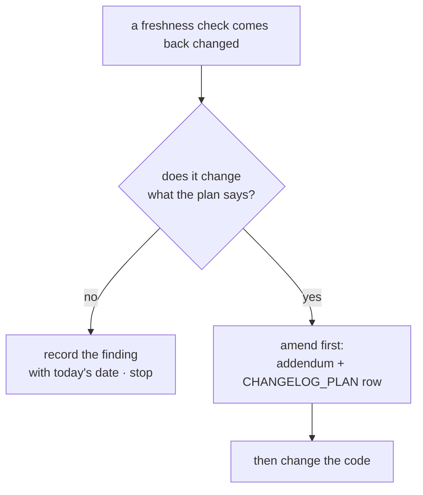

# 7.2 — The freshness re-check

## One-line answer

Four things outside this repository get re-read at the Phase 6 boundary — the framework's releases, the MCP
specification revision, the SDK that speaks it, and the free-model rosters — and on 2026-09-05 three came back
amber, one came back green, and the green one is the load-bearing result.

## The story

You have taken the 34 to work for years, and you were away for a month.

You come back, walk to the same stop at the same time, and the 34 arrives. You get on. Three stops before
where you usually get off, everybody stands up, because the route was shortened while you were away — the
bridge is being repaired and the 34 now terminates early. There is a notice at the stop. It has been there
for three weeks and you walked past it, because you were not reading notices, because you were catching a bus
you have caught a thousand times.

Nothing about you changed. Nothing about the bus changed. What changed was a piece of road, and the only
reason it cost you anything is that your knowledge of the route was formed at a moment and used at another,
with no step in between where you asked whether it still held.

The person who reads the notice is not more careful in general. They have one habit: when they have been away,
they look at the board before they get on.

## The idea in plain language

Everything in `./m check` is a fact about **your repository**. Nothing in it is a fact about the world your
repository depends on.

Those facts move without touching a file you own. A library ships a version. A specification publishes a
revision. A provider drops a model from a free tier. Your gate stays green through all of it, correctly,
because none of it is visible from inside.

So the plan's §15 adds a condition that is not a command but a **look**. Day 31's
[6.2 — The freshness check that fired](../../../day-31-the-quality-gate/parts/06-the-phase-gate/6.2-the-freshness-check-that-fired.md)
ran five of these at the Phase 4 boundary. Phase 6 is an MCP phase, so the list is different: the Agent Skills
specification and the skill provenance pins matter less, and **the SDK that implements the protocol matters
much more**, because Days 33 to 44 were all written against one pinned version of it.

| # | What you re-read | Where | If it moved |
| --- | --- | --- | --- |
| 1 | `google-adk` releases since the last gate | the package index and the release notes | breaking change? → amend the plan first |
| 2 | the MCP specification revision | the specification site | changed since 2026-07-28? → re-read Addendum 01 Part 2 |
| 3 | the `mcp` SDK and what it speaks | the package index and the installed package | a gap between them is a decision, not a bug |
| 4 | the three providers' free rosters | each provider's own page | a pinned model lost its free tier? → amend first |

The word that carries the whole condition is **first**. Principle 14 says that when reality moves, the plan is
amended before any code changes — a versioned addendum, a `CHANGELOG_PLAN.md` row, and only then the edit.
The ordering exists because the alternative is a silent adaptation: somebody bumps a pin, the code works, and
six weeks later nobody can say which decisions were made on purpose and which were made by a dependency
resolver.

And the property that makes a freshness check different from every other check in this day: **a boring result
is a real result.** "No change", written down with a date, is evidence that somebody looked. A blank is
evidence of nothing, and blanks are what a checklist decays into.

## Why Sutra needs it

Because Phase 6 closes on a repository where the gap between what the days teach and what the pin implements
is the largest single fact about the phase, and Phase 7 will not re-examine it.

Days 34 to 41 each measured a piece of that gap against the live specification and recorded it honestly.
Day 41 grepped the SDK for `server/discover` and found zero. Day 36 read the SDK's own deprecation warning
about its tasks API. Day 35 measured a resource error arriving as `code=0`. Every one of those is a filed
finding whose disposition is *"when the pin moves"*, and the gate is the moment somebody has to say whether
the pin is moving.

There is also a second-order reason. Phase 7 is memory and retrieval — `MemoryService`, durable sessions, a
local embedding index. None of that touches MCP, which means nobody will have a reason to look at the SDK
question again until Phase 8 or later. **The gate is the last cheap moment.**

## The mechanism

The four checks, with the exact commands, run on **2026-09-05**. Every result below was read off a live source
on that day.

```bash
# 1 and 3 - everything pinned in pyproject.toml, against the index's current answer
for p in google-adk google-genai mcp ruff pytest; do
  curl -s "https://pypi.org/pypi/$p/json" \
    | python -c "import json,sys; print('$p', json.load(sys.stdin)['info']['version'])"
done
```

**Line by line:**

- One loop over the five pinned packages rather than five separate commands, which is what makes the check
  short enough to actually run at a boundary.
- `curl -s` fetches quietly from the index's own metadata endpoint, which returns JSON and needs no account.
- `info.version` is the index's answer to *"what is the latest release"* — which is the question. What your
  lockfile says is not the question; you already know that.
- What this does **not** tell you is whether the delta matters. That needs the release notes, which is a read
  rather than a command, and it is step two.

Result:

```text
mcp 2.1.1
google-adk 2.8.0
google-genai 2.22.0
ruff 0.16.6
pytest 9.1.1
```

Against `pyproject.toml`'s pins — `google-adk==2.7.1`, `google-genai==2.19.0`, `mcp==1.29.1`, `ruff==0.16.4`,
`pytest==9.1.1` — four of five have moved and one is exact.

Then the release notes, because a version number is a fact and a breaking change is a judgement:

```text
https://github.com/google/adk-python/releases      <- read the notes, do not guess
```

Read on 2026-09-05: the page lists `v2.8.0` above `v2.7.1`, and the only removal named in that range concerns
`pyarrow` moving out of the `gcp` extra into a separate `bigquery-analytics` extra. Irrelevant here — this
repository installs neither extra, and everything Vertex- or BigQuery-shaped is parked under Addendum 02 for
needing a billing account.

**Finding 1: amber.** The pin stays at 2.7.1. Every ADK symbol Phase 5 and 6 use — `McpToolset`,
`StdioConnectionParams`, `StreamableHTTPConnectionParams`, `to_mcp_server` — was verified present in the
installed 2.7.1 and nothing in the notes removes them. Bumping is a decision with no amendment behind it, and
this day installs nothing.

```text
2 - the MCP specification revision
https://modelcontextprotocol.io/specification/latest
```

Read on 2026-09-05: the page states the specification is based on the TypeScript schema at
`schema/2026-07-28/schema.ts`, and every card at the foot links into `/specification/2026-07-28/`. The
revision is **unchanged**.

**Finding 2: green, and this is the one that matters.** Addendum 01 Part 2 stands. Everything Days 32 to 44
teach about the stateless core — no `initialize`, the `Mcp-Method` and `Mcp-Name` headers, cacheable
`tools/list`, state as an explicit payload handle — is current. Had this come back with a newer date, the
correct next action would have been to stop, re-read Part 2 against the new revision, and amend it, and Phase 7
would have waited.

While the specification site is open, the extensions pages are worth one more read, because they are where the
protocol moves between revisions. Read on 2026-09-05, the Tasks extension page documents `resultType: "task"`,
a `CreateTaskResult` carrying `ttlMs` and `pollIntervalMs`, `tasks/update` for mid-flight input, and capability
negotiation through `server/discover`. Day 36 measured every one of those absent from the pinned SDK, and
Day 41 measured `server/discover` absent as well. **The specification did not move; the distance between it
and the pin is unchanged and fully documented**, which is exactly the state [7.3](7.3-the-pin-and-the-amendment.md)
has to make a decision about.

```bash
# 3 - what the installed SDK actually speaks, not what the index offers
uv run python -c "
import importlib.metadata as md
from mcp import types
print('installed  :', md.version('mcp'))
print('LATEST     :', types.LATEST_PROTOCOL_VERSION)
print('SUPPORTED  :', types.SUPPORTED_PROTOCOL_VERSIONS)
"
```

**Line by line:**

- `importlib.metadata.version` reads the installed distribution's version from the environment rather than
  from `pyproject.toml`, so it answers *"what is actually importable"* rather than *"what did we ask for"*. On
  a machine where `uv sync` has not been run those two differ, and that difference is worth catching at a
  gate.
- `types.LATEST_PROTOCOL_VERSION` is the SDK's own statement of the newest revision it implements. It is a
  constant in `mcp/types.py`, so this is not an inference.
- `SUPPORTED_PROTOCOL_VERSIONS` is the full list it can negotiate, which is the more useful number when
  talking to somebody else's server.
- **Zero model calls, no network** — everything printed comes out of `.venv`.

Result on 2026-09-05, matching what Day 36's probe recorded on 2026-09-04:

```text
installed  : 1.29.1
LATEST     : 2025-11-25
SUPPORTED  : ['2024-11-05', '2025-03-26', '2025-06-18', '2025-11-25']
```

**Finding 3: amber, and it is the phase's headline.** The specification says `2026-07-28`. The pinned SDK's
newest revision is `2025-11-25`, and `2026-07-28` is not in its supported list at all. The index offers
`2.1.1`, whose own project description states that v2 exists to support the 2026-07-28 specification and every
earlier revision, keeps v1.x on a branch with security support, and recommends pinning `mcp>=1.28,<2` until
migration is done. That is a complete, documented answer to the gap — which makes it a decision rather than an
unknown. [7.3](7.3-the-pin-and-the-amendment.md) makes it.

```text
4 - the free-model rosters
https://ai.google.dev/gemini-api/docs/rate-limits
```

Read on 2026-09-05: the page publishes rate-limit tables for the paid tiers and for the Batch API, and
**publishes no free-tier table at all** — it directs you to your own project's limits view in AI Studio
instead. That is the same result Day 31 recorded on 2026-09-04, and it confirms what Day 2 recorded: there is
no public quota table for the free tier, and the ~20 requests-per-day figure in `docs/PACKAGES.md` was read
off a live 429 rather than a document.

**Finding 4: green, with a caveat worth writing down.** `gemini-3.7-flash` is still the pinned model and
nothing indicates it has lost its free tier — but the only measurement that would prove it is a live call, and
this day spends zero generations. The honest record is *"no evidence of change; not independently
re-measured"*, which is a better sentence than a tick.

The four findings, as they should appear in your own log:

| # | Check | Finding on 2026-09-05 |
| --- | --- | --- |
| 1 | `google-adk` releases | 2.8.0 against a 2.7.1 pin; no breaking change touching anything this repository installs. **Amber — pin unchanged** |
| 2 | MCP spec revision | still `2026-07-28`. **Green — Addendum 01 Part 2 stands, Phase 7 may open** |
| 3 | `mcp` SDK | pinned 1.29.1 speaks `2025-11-25`; index offers 2.1.1 which speaks `2026-07-28`. **Amber — see 7.3** |
| 4 | free-model roster | no public free-tier table; `gemini-3.7-flash` unchanged. **Green, not independently re-measured** |



## When it breaks

**The check is run and not written down.** No command failed, because there was no command, and next quarter
nobody can tell whether the spec was checked and unchanged or never checked. This is why the output of this
condition is a **table with a date in it** and not a feeling.

**A major version arrives and is treated as routine.** `mcp` 1.29.1 to 2.1.1 crosses a major boundary, which
by convention means breaking changes, and the convention is confirmed by the project's own migration guide.
Reading it as *"we are four patch releases behind"* is how a dependency bump becomes an outage. Day 31 flagged
this exact bump on 2026-09-04 and correctly did nothing about it; doing nothing twice, without a decision, is
different from doing nothing once.

**The page moved and the answer looks green.** A specification site reorganises, the URL you have bookmarked
redirects to an overview page, and the overview page does not carry a revision date. Nothing failed and you
have learned nothing. The tell is that a freshness check should always produce a **quoted fact** — a version
string, a schema path, a sentence off the page — and an entry with no quotation in it was not really read.

## In production

**What a professional writes instead:** the version half of this is automated — a bot opens a pull request for
every dependency update, so the delta arrives as a diff with the changelog attached rather than as a thing
somebody has to remember to look up. What stays human is the **judgement**: whether the delta matters, and
what has to change in the design before the version does. Automating the lookup and keeping the judgement is
the right split, and teams that automate the merge as well end up with a repository whose decisions were made
by a resolver.

**What degrades at scale:** the number of things that need re-checking grows past what anybody reads. Five
pinned packages is a loop; two hundred is a dashboard nobody opens. The response that works is tiering — a
small set of dependencies that define the system's contract get read by a person at every boundary, and the
rest are handled by automation and a policy. For Sutra that small set is exactly two: the framework and the
protocol SDK.

**The failure mode that only appears with real traffic** is the free tier that shrinks without an
announcement. There is no changelog for a quota. The first evidence is a 429 rate that climbs over a week,
and by the time anybody notices, the system's behaviour under quota exhaustion is being discovered in
production rather than designed. That is why Addendum 02 makes quota the currency and why every model call
path handles a 429 with `retry-after` and backoff — the freshness check cannot see this one coming, so the
code has to survive it.

**The review comment a senior engineer leaves:** *"The gate says the freshness check passed. Passed against
what? I want the version strings and the schema path you actually read, with the date, in the commit message
or the ledger. 'Checked, no change' is a sentence anybody can type at the end of a long day, and a quoted
fact is not."*

**The interview question:** *"How do you keep a project from drifting out of date with its dependencies?"*
The honest spoken answer: *"With a scheduled re-read at a boundary rather than continuous vigilance, because
vigilance doesn't survive a busy month. At every phase gate I re-check a small fixed list — the framework's
releases, the protocol specification revision, the SDK that implements it, and the model provider's free
limits — and I write down what I read, including when nothing changed, because 'no change' recorded is
evidence somebody looked and a blank is evidence of nothing. The rule that makes it work is ordering: if
something moved in a way that changes a decision, the plan gets amended before the code changes. Otherwise
you get silent adaptation, where someone bumps a pin, it works, and six weeks later nobody can say which
choices were deliberate and which were made by a dependency resolver."*

## Check yourself

```bash
uv run python -c "
import importlib.metadata as md
from mcp import types
print(md.version('mcp'), types.LATEST_PROTOCOL_VERSION)
"
```

Two strings. Say which one Addendum 01 Part 2 is written against, and say what the gap between them means for
every day from 33 to 44 — then say whether that gap is a bug, a finding, or a decision.

**Out loud, without scrolling up:** name the four things re-checked at this boundary, say which one is
load-bearing for Phase 7 opening, and explain why "no change" has to be written down.

**Next:** [7.3 — The pin and the amendment](7.3-the-pin-and-the-amendment.md).
