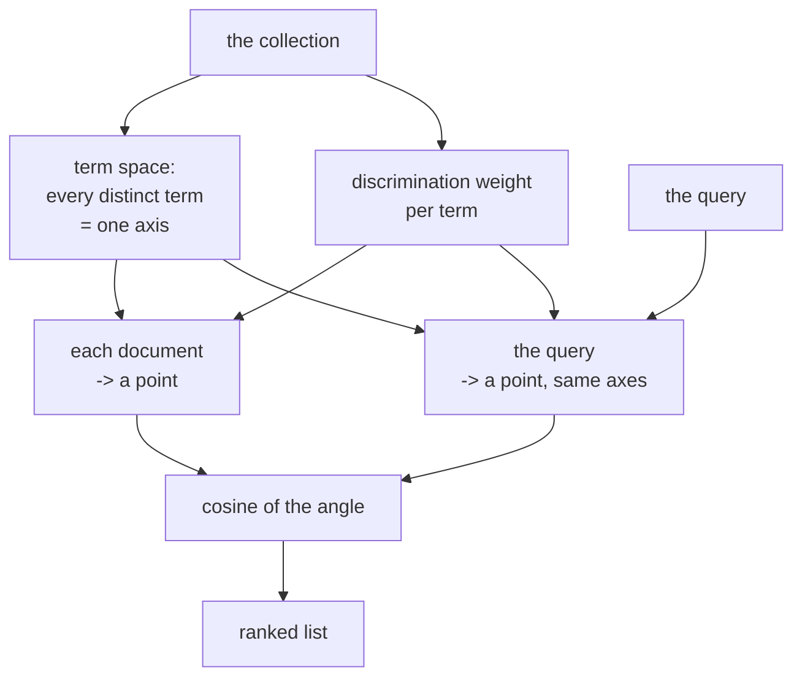

# A vector space model for automatic indexing

## One-line answer

Represent every document and every query as a vector over the same set of terms, and retrieval stops
being a test of whether words match and becomes a measurement of how far apart two things are — which
is what makes ranking, partial matches and a cutoff possible at all.

## The story

The library has a card catalogue in wooden drawers, and it works beautifully as long as you know what
you are looking for.

You want something about how bridges fail. You go to the drawer, and the drawer is alphabetical by
subject heading, and the heading somebody assigned is *Structural engineering — failure analysis*. If
you look under *bridges* you find bridge design and bridge history and nothing about failures. If you
look under *collapse* you find nothing at all, because that is not a heading.

The librarian knows this. She keeps a sheet of paper with the headings that people ask for and the
headings the catalogue actually uses, and she translates. She is very good at it, and she is the only
copy of that sheet.

And notice what the catalogue can and cannot do. It can tell you that a card is filed under a
heading, or that it is not. What it cannot do is tell you that a card is *nearly* what you wanted, or
that this card is closer than that one, or that nothing in the drawer is close at all. There are no
degrees. A card is under the heading or it is somewhere else, and there is no third answer.

## The idea in plain language

The document this part teaches is from 1975, and it proposes replacing the drawer with a map.

Its claim, stated plainly: **a document is a point in a space whose axes are terms**. If your
collection uses ten thousand distinct words, then the space has ten thousand axes, and a document's
position along the axis for *cookie* is how much that document is about cookies. A query is a point in
the same space, placed the same way.

Once both are points, three things become available that the drawer never had.

**Ranking.** Two documents can be compared to a query by which is nearer, so results come out in an
order rather than as a set.

**Partial matching.** A document that shares some of the query's terms and not others is not
excluded; it is placed at a middling distance and ranked accordingly. The drawer's yes-or-no becomes
a continuum.

**A cutoff.** Because there is a distance, you can decide how far is too far. That decision was not
expressible before, and — as [5.1](../parts/05-when-retrieval-lies/5.1-nearest-is-not-near.md)
measured — it turns out to be harder than it sounds. It is still better than not having it.

The second half of the paper is about **weighting**, and it is the half that gets forgotten. Not every
term should count the same. A term that appears in every document in the collection places every
document at the same position on its axis, so it separates nothing and should contribute nothing. A
term that appears in one document is enormously discriminating. The paper reasons about this in terms
of a term's value for **discriminating between documents** — how much the collection's documents
spread apart when that term is included — and concludes that the best index terms are the ones with
middling frequency: common enough to appear, rare enough to distinguish.

Two definitions the paper's own title leans on, because they are not obvious. **Automatic indexing**
means deciding what a document is about by machine, from the document's own words, instead of a
person assigning it a heading from a controlled list. **A vector space model** is the representation
above: the shared axes, the points, and the distance.

## Why Sutra needs it

Because [section 1](../parts/01-text-as-numbers/1.1-the-counter-that-takes-a-description.md) is this
paper, built by hand, in the order the paper argues it.

[1.2](../parts/01-text-as-numbers/1.2-a-ticket-as-a-list-of-numbers.md) is the representation:
documents as vectors over a shared vocabulary.
[1.3](../parts/01-text-as-numbers/1.3-direction-not-size.md) is the similarity: an angle rather than
an overlap. [1.4](../parts/01-text-as-numbers/1.4-the-word-that-tells-you-nothing.md) is the
weighting: a term in every ticket scored exactly `0.000` and removed itself.
[1.5](../parts/01-text-as-numbers/1.5-the-work-you-do-once.md) is the index.

You read it now, after building it, because that is Principle 4 at the scale of a day. A reader who
met this paper first would have a formalism with nothing to attach it to. A reader who has watched
`the`, `fix` and `kb` fall to a weight of zero on their own screen knows exactly which sentence in
this paper they reinvented.

It also matters for [Day 50](../../day-50-chunking-and-top-k/LESSON.md), because a "document" in this
model is whatever you decided to make a point in the space, and deciding that is chunking.

## The mechanism

The method, written out as a procedure rather than paraphrased.

**Step 1 — fix the term space.** Take the collection. Extract the terms — which for this paper means
running text through an automatic process, not a human indexer. The set of all distinct terms across
the collection is the set of axes, and it is fixed for the collection. Every document and every query
will be described in these axes and no others.

**Step 2 — place each document.** For document *d* and term *t*, compute a weight *w(d, t)*. The
simplest weight is the number of times *t* occurs in *d*. The paper's contribution is that this is
not the best weight, which is step 4.

**Step 3 — place the query.** The query is a short document. It is placed by exactly the same
procedure, in the same axes, with the same weighting. **This symmetry is the paper's structural
idea** and it is what makes the comparison meaningful: query and document are the same kind of object.

**Step 4 — weight by discrimination.** A term that is in every document does not separate the
collection at all; a term in exactly one document separates that one from all the rest. The paper
frames this as the value a term has for spreading the collection out, and the practical form the field
settled on is the one [1.4](../parts/01-text-as-numbers/1.4-the-word-that-tells-you-nothing.md)
implements:

```
weight(d, t) = count(t in d) × log(total documents / documents containing t)
```

**Step 5 — measure similarity as an angle.** Compare a query vector *q* and a document vector *d* with
the cosine of the angle between them:

```
similarity(q, d) = dot(q, d) / (length(q) × length(d))
```

Not the dot product, and not the straight-line distance. Dividing by both lengths removes document
length from the comparison, which is what stops a long document being similar to everything —
[1.3](../parts/01-text-as-numbers/1.3-direction-not-size.md) measured that a long complaint's *wrong*
match scored `11.000` under a raw dot product against a short complaint's *right* match at `3.000`,
and that cosine reversed the order.

**Step 6 — rank and cut.** Sort every document by similarity and return the top few, or everything
above a threshold. Both controls exist because step 5 produced a number.

Here is the whole procedure as a picture:



The one thing to read off that diagram is the symmetry: two paths into the same space, and the
comparison happens there. Nothing compares strings.

## The paper in one demo

Two files, no model, no network, no package outside the standard library. A six-document collection
where one term is in every document, and one switch that turns the weighting off.

```text
days/day-49-retrieval-and-embeddings/lab/papers/vector-space-model/
├── corpus.py   six job cards from one brake workshop
└── vsm.py      the term space, the weighting, the cosine, the ablation
```

```python
# days/day-49-retrieval-and-embeddings/lab/papers/vector-space-model/corpus.py
DOCUMENTS: dict[str, str] = {
    "card-1": "brake pads replaced at the front, no noise afterwards",
    "card-2": "brake disc skimmed, customer reported a squeal at low speed",
    "card-3": "brake noise when reversing, dust shield bent against the disc",
    "card-4": (
        "brake fluid flushed and the brake pedal felt soft, so the brake was bled "
        "twice; the brake pedal was checked again, the brake bleed nipples were "
        "cleaned, and the brake fluid was topped up"
    ),
    "card-5": "brake light switch replaced, brake warning lamp stayed on",
    "card-6": "brake caliper seized, wheel hot after a short drive",
}

QUERY = "brake noise when reversing"
ANSWER = "card-3"
```

**Line by line:**

- Six job cards from **one brake workshop**, so the word `brake` is in all six. That is the whole
  design of the corpus: the collection contains a term that cannot discriminate, which is exactly the
  situation step 4 addresses.
- `card-4` says `brake` six times and is much the longest. It is there to be the wrong answer that
  raw counting finds attractive.
- `card-3` is the right answer and it says `brake` once. Under an unweighted scheme its advantage is
  `noise`, `when` and `reversing` against `card-4`'s six repetitions of a word that means nothing.
- `ANSWER` is declared in the corpus so the demo can report whether the method worked rather than
  leaving you to judge by eye.

```python
# days/day-49-retrieval-and-embeddings/lab/papers/vector-space-model/vsm.py
def discrimination(documents: list[str]) -> dict[str, float]:
    """log(N / n): a term in every document scores 0, a term in one scores log(N)."""
    total = len(documents)
    document_count: dict[str, int] = {}
    for text in documents:
        for word in terms(text):
            document_count[word] = document_count.get(word, 0) + 1
    return {word: math.log(total / n) for word, n in document_count.items()}


def weigh(text: str, weights: dict[str, float] | None) -> dict[str, float]:
    """Term frequency, optionally multiplied by each term's discrimination value."""
    counted = terms(text)
    if weights is None:
        return counted
    return {word: count * weights.get(word, 0.0) for word, count in counted.items()}
```

**Line by line:**

- `for word in terms(text)` iterates a **dict**, so each term is seen once per document however often
  it occurs. That is the difference between document frequency and total frequency and it is the most
  common place to get this wrong.
- `math.log(total / n)` is step 4. A term in all six documents gives `log(6/6) = 0.0`; a term in one
  gives `log(6) ≈ 1.792`.
- `weights: dict[str, float] | None` — **`None` is the ablation**. One parameter, two arms, and the
  rest of the file cannot tell which it got.
- `weights.get(word, 0.0)` gives a query term the collection has never seen a weight of zero rather
  than raising. A term outside the term space carries no information about which document to return,
  so zero is the honest value and not a convenience.

```python
# days/day-49-retrieval-and-embeddings/lab/papers/vector-space-model/vsm.py
def cosine(a: dict[str, float], b: dict[str, float]) -> float:
    """The angle between two vectors, as a number between 0 and 1."""
    dot = sum(a[word] * b[word] for word in a.keys() & b.keys())
    size = math.sqrt(sum(v * v for v in a.values())) * math.sqrt(sum(v * v for v in b.values()))
    return dot / size if size else 0.0
```

**Line by line:**

- Step 5, in three lines, exactly as the paper defines it.
- `a.keys() & b.keys()` — only shared terms contribute to the dot product; every other axis has a
  zero on one side.
- The lengths are computed over **all** values, not the shared ones. That is what removes document
  length, and computing them over the intersection would silently defeat the whole point.
- `if size else 0.0` guards the empty vector, so a query of pure punctuation returns a score rather
  than raising.

Run both arms:

```bash
cd days/day-49-retrieval-and-embeddings/lab/papers/vector-space-model
uv run python vsm.py
uv run python vsm.py --no-idf
```

**Line by line:**

- `cd` first, because `vsm.py` imports `corpus` by name from the same directory.
- `--no-idf` is the ablation switch: it passes `None` for the weights and changes nothing else.
- **Zero model calls.** There is no model and no network in this demo at all.

Measured on 2026-09-05, weighted:

```text
weighting: tf x log(N/n)
query    : 'brake noise when reversing'
right answer: card-3

   0.587  card-3  brake noise when reversing, dust shield bent against  <-- right answer
   0.106  card-1  brake pads replaced at the front, no noise afterward
   0.000  card-6  brake caliper seized, wheel hot after a short drive
   0.000  card-5  brake light switch replaced, brake warning lamp stay
   0.000  card-4  brake fluid flushed and the brake pedal felt soft, s
   0.000  card-2  brake disc skimmed, customer reported a squeal at lo

top hit             : card-3
right answer at     : rank 1 of 6
gap to second place : 0.481
cards scoring >= 0.2: 1  (0 of them wrong)
weight of 'brake'     : 0.000  (it is in every card)
weight of 'reversing' : 1.792  (it is in one)
```

And with the paper's weighting switched off:

```text
weighting: raw term counts
query    : 'brake noise when reversing'
right answer: card-3

   0.632  card-3  brake noise when reversing, dust shield bent against  <-- right answer
   0.333  card-1  brake pads replaced at the front, no noise afterward
   0.306  card-4  brake fluid flushed and the brake pedal felt soft, s
   0.302  card-5  brake light switch replaced, brake warning lamp stay
   0.167  card-6  brake caliper seized, wheel hot after a short drive
   0.158  card-2  brake disc skimmed, customer reported a squeal at lo

top hit             : card-3
right answer at     : rank 1 of 6
gap to second place : 0.299
cards scoring >= 0.2: 4  (3 of them wrong)
```

**Both arms rank the right card first.** Say that plainly, because the temptation with an ablation is
to dramatise it. The vector space model works without weighting; the query has three distinctive
words and they win.

The difference is everything else about the two lists.

**`weight of 'brake': 0.000`.** The term in all six documents contributes exactly nothing, and nobody
wrote it on a stopword list. That is step 4, visible as a number.

**Four of six documents score exactly `0.000` weighted, and every document scores something
unweighted.** In the ablated arm, `card-4`, `card-5`, `card-6` and `card-2` are all "similar" to the
query — `0.306`, `0.302`, `0.167`, `0.158` — and their entire similarity is the word `brake`. A
retrieval system built on those numbers would return a brake-fluid job card as the third-best answer
to a question about a reversing noise.

**`cards scoring >= 0.2`: one against four, and three of the four wrong.** This is the line the whole
ablation is for. With the paper's weighting, a cutoff at `0.2` returns exactly the right answer. With
weighting off, the same cutoff returns four documents, three of which are noise. **Weighting is what
makes a threshold mean anything**, which is why the threshold discussion in
[5.1](../parts/05-when-retrieval-lies/5.1-nearest-is-not-near.md) was possible at all.

**The gap: `0.481` against `0.299`.** [5.1](../parts/05-when-retrieval-lies/5.1-nearest-is-not-near.md)
argued that the distance between the first and second score is a better confidence signal than the
first score itself. Weighting improved that gap by 60%, on a query where it did not change the
ranking at all.

## When it breaks

**Term independence.** The model treats every axis as unrelated to every other. *Login*, *sign-in* and
*authentication* are three separate axes with nothing connecting them, so a document about one is, in
this model, at right angles to a document about another. That is the assumption
[2.1](../parts/02-the-meaning-test/2.1-the-score-that-came-back-zero.md) broke on purpose: two
tickets describing one fault scored `0.000` because their only shared term was `the`. The paper's
formalism has no way to express that two axes mean nearly the same thing, and every attempt to patch
it from outside — synonym lists, thesauri, query expansion —
[2.2](../parts/02-the-meaning-test/2.2-the-repairs-that-fix-one-pair.md) measured as fixing exactly
the pairs somebody wrote down.

**Word order is gone before the model starts.** *The browser dropped the cookie* and *the cookie
dropped the browser* are the same point in the space. Negation is invisible for the same reason.

**Small collections make the weights unstable.** `log(N/n)` on six documents means a term seen once
gets the maximum weight available, whether or not it means anything.
[1.4](../parts/01-text-as-numbers/1.4-the-word-that-tells-you-nothing.md) caught this red-handed on
Sutra's eight-ticket archive: a query ranked the right ticket second, and its entire score came from
the preposition `on`, which happened to appear in exactly one ticket. The formalism has no defence.

**The paper's own weighting proposal is not the one that survived.** Its term-discrimination-value
reasoning requires computing how much the collection spreads with and without each term, which is
expensive and fiddly. The field kept the *conclusion* — mid-frequency terms are the best index terms,
weight by rarity — and replaced the *method* with the much simpler `log(N/n)`.

**And the retrieval mode it assumes is not how most search is done.** Scoring every document against
the query is a linear scan. Real term-based systems invert it: keep a map from each term to the
documents containing it, and touch only the documents that share a term with the query. The vector
space is the *scoring model*; the inverted index is the *data structure*, and this paper is only about
the first. [6.1](../parts/06-in-production/6.1-the-store-we-did-not-build.md) measured what it costs
to skip that distinction.

## In production

**What survived — nearly all of it, and mostly invisibly.**

*Documents as vectors* is the foundation of every retrieval system running today, including the ones
that would not describe themselves as using this model. When a vector database advertises `vector(768)`
columns and cosine distance, the representation and the metric are both from here; only the source of
the numbers has changed.

*Cosine similarity* is the default metric in FAISS, pgvector, Qdrant, Chroma, Weaviate, Milvus and
Elasticsearch's k-nearest-neighbour search. It is what
[1.3](../parts/01-text-as-numbers/1.3-direction-not-size.md) implements in seven lines and it has not
changed shape in fifty years.

*Weight by rarity* survived as **tf-idf** and then as **BM25**, which is tf-idf with two corrections
the 1975 paper does not have: saturation, so the twentieth occurrence of a term adds almost nothing
over the fifth, and a tunable length normalisation instead of the fixed division cosine performs. BM25
is the default scoring function in Lucene, and therefore in Elasticsearch and OpenSearch, and it
remains the baseline that every dense retrieval paper has to beat. Fifty years on, the strongest
purely term-based method is a direct refinement of this one.

*Query and document in the same space* survived into dense retrieval unchanged, and it is why the
embedding lane in [3.3](../parts/03-meaning-as-geometry/3.3-the-scale-does-not-know-what-it-weighs.md)
required no new scoring code. The axes stopped being terms; the geometry did not move.

**What did not survive.**

*Term independence* was the assumption everybody knew was wrong and nobody could fix from inside the
model. The fix came from outside, from learning the axes instead of choosing them — the line that runs
through *Efficient Estimation of Word Representations in Vector Space* (`arXiv:1301.3781`, 2013), where
meaning became a learned position rather than a term count, and on to the sentence-level embedding
models [3.2](../parts/03-meaning-as-geometry/3.2-the-model-that-runs-in-your-own-shop.md) uses. That
is precisely what a term-count vector cannot do, and it is the whole reason
[section 3](../parts/03-meaning-as-geometry/3.1-the-dish-you-know-by-taste.md) exists.

*The specific term-discrimination-value method* was dropped for `log(N/n)`, as above.

*Automatic indexing as a controversial claim* is gone entirely, and this is the quiet victory. In 1975
the argument that a machine could decide what a document is about from its own words, better than a
trained human assigning headings from a controlled vocabulary, was a real argument with people on both
sides. Nobody has that argument now. The card catalogue in the story is a museum piece, and the reason
is this paper's family of ideas.

**The review comment a senior engineer leaves:** *"You have implemented tf-idf and called it done.
Use BM25 — Lucene has had it for twenty years and it fixes the two things your version gets wrong on
long documents. And if you are keeping the hand-rolled version, keep it as the brute-force check
against the real index rather than as the thing that serves traffic."*

**The interview question:** *"What is the vector space model and what is still true about it?"* An
honest answer: *"It is the 1975 idea that documents and queries should both be points in a space whose
axes are terms, so that retrieval becomes measuring an angle instead of testing whether words match.
Three things came from that and all three are still standard: ranked results instead of a set, partial
matches, and a threshold. The weighting half is the part people forget — a term in every document
separates nothing, so it should be weighted to zero, which is why a stopword list is unnecessary if
your weighting is right. I built it and measured the ablation: with weighting, one document scored
above a 0.2 cutoff and it was the right one; without, four did and three were wrong. What did not
survive is the assumption that terms are independent, which is exactly the case where my own
implementation scored two tickets about the same bug at 0.000 because they shared no words. That is
what dense embeddings fixed, and the geometry did not have to change to accommodate them — only where
the numbers came from."*

## Check yourself

```bash
cd days/day-49-retrieval-and-embeddings/lab/papers/vector-space-model
uv run python vsm.py
uv run python vsm.py --no-idf
```

Now change `QUERY` in `corpus.py` to `"brake pedal soft"` and run both arms again. The right answer is
`card-4`, the long one. Watch what the length normalisation in the cosine does to it, and say whether
weighting helped or hurt this time.

**Out loud, without scrolling up:** say what this paper actually claimed, in one sentence, and then
say the one assumption in it that the field spent the next fifty years working around.

**Next:**
[Retrieval-Augmented Generation for Knowledge-Intensive NLP Tasks](02-retrieval-augmented-generation.md).
