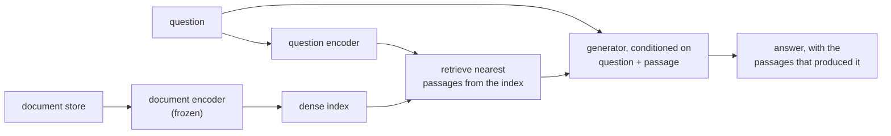

# Retrieval-Augmented Generation for Knowledge-Intensive NLP Tasks

## One-line answer

Put a retriever in front of a generator, so that the model answers from documents fetched at question
time rather than only from what was frozen into its weights — which makes the knowledge replaceable,
inspectable and citable without retraining anything.

## The story

The new person on the desk is very good and has been there three weeks.

He answers everything immediately. Somebody asks what the escalation path is for a payment dispute
and he tells them, fluently, with the confidence of a person who knows. Somebody asks whether the
export bug from last spring was ever fixed and he says yes, it was, and moves on.

He is answering from training week. Everything he was told in those five days he holds perfectly, and
he has not once opened the shared folder where the actual tickets are, because he has never needed to
— he always has an answer.

The escalation path changed in June. The export bug was closed as *cannot reproduce*, twice, and
reopened. He does not know either of those things, and, more to the point, **nobody can tell from his
answer that he does not know**, because his wrong answers sound exactly like his right ones and
neither comes with a ticket number attached.

The person who sat there before him was slower. She would say *"hold on"*, open the folder, find the
ticket, and read from it. Every one of her answers came with a number on it, and if she was wrong you
could see where the wrongness came from.

## The idea in plain language

The paper this part teaches is from 2020, and it is about giving the model the folder.

Two terms, and they are the paper's own framing, so they are worth getting exactly right.

**Parametric memory** is what the model knows in its weights. It was fixed at training time. It is
enormous, it is fast, and it has three properties that cause every problem in the story: you cannot
see what is in it, you cannot change one fact in it without retraining, and it cannot tell you where
anything came from.

**Non-parametric memory** is an external store of documents with an index over it. It is separate
from the model, it can be edited or replaced whenever you like, and every item in it has an address.

The paper's proposal is to use both at once: **retrieve** the documents relevant to the question from
the non-parametric memory, and then **generate** the answer conditioned on both the question and
those documents. The model contributes fluency, reasoning and language; the index contributes facts.

Three consequences follow, and they are the reason this pattern took over.

**The knowledge becomes editable.** Swap the index and the system's knowledge changes, with no
retraining. The paper demonstrates this directly by replacing the document store with a later snapshot
and showing the model's answers update.

**The answers become citable.** The passages that produced the answer are known, so they can be
shown. The story's second person could always say *"ticket 4188"*; this is how a model gets to.

**The model can be smaller.** Facts do not have to be in the weights if they are in the index.

That is the pattern the industry now calls **RAG**, and it is worth being clear that today's RAG is
the *shape* of this paper rather than the *system* in it. The paper trains the pieces together. Almost
nobody does that now, which is the *In production* section.

## Why Sutra needs it

Because Sutra's desk is the person in the story, and Phase 7 exists to give it the folder.

Day 46 filed a session into memory. Day 47 made the store survive a restart. Day 48 decided what is
worth keeping. Today built the retriever and put it behind the interface the agent already uses
([4.2](../parts/04-the-adk-socket/4.2-same-tool-new-answer.md)), so that `load_memory` returns ranked,
scored passages from the archive. That is precisely the retrieve-then-generate pipeline, assembled by
hand over four days, and this paper is where it was named.

It is also, bluntly, the paper you will be asked about. The addendum that created this day says an
interview for an AI engineering role *"asks about RAG almost every time"*. Being able to say what the
original paper actually proposed — and which half of it the field kept — is what separates having read
about RAG from having built one.

## The mechanism

The method, written out.

**The retriever.** Both the question and every passage in the store are encoded into dense vectors by
two encoders — one for questions, one for documents — and the passages nearest the question vector are
retrieved. That is [section 1](../parts/01-text-as-numbers/1.5-the-work-you-do-once.md)'s index with a
model producing the numbers instead of word counts, and it is why
[3.3](../parts/03-meaning-as-geometry/3.3-the-scale-does-not-know-what-it-weighs.md)'s seam matters:
the retrieval code is the same either way. Note the detail that two separate encoders are used rather
than one; a question and a passage that answers it do not look alike, so they are placed by different
functions into a shared space.

**The generator.** A sequence-to-sequence model that takes the question **and** a retrieved passage as
its input and produces the answer.

**The join between them, which is the paper's actual contribution.** The retriever returns several
passages, not one, and the paper treats *which passage is the right one* as unknown — a latent
variable — rather than guessing. The output probability is a sum over the retrieved passages, each
weighted by how relevant the retriever judged it. The paper distinguishes **two ways** of doing that
sum:

| Variant | What is held fixed | The effect |
| --- | --- | --- |
| **RAG-Sequence** | one retrieved passage is used for the **whole** answer | the answer is generated from each passage and the results combined; coherent, one source per answer |
| **RAG-Token** | the passage may **change at every token** | different parts of one sentence can come from different documents |

RAG-Token is the more flexible and is the one that can compose an answer needing two facts from two
documents. RAG-Sequence is simpler and tends to produce answers that are attributable to a single
source.

**Training.** The generator and the question encoder are trained together, end to end, with only
question-answer pairs as supervision — no labels saying which passage was the right one. The document
encoder and the index are kept **frozen**, because re-encoding and re-indexing the whole store during
training is prohibitive. That asymmetry is a practical compromise inside the paper itself, and it
turns out to be the seed of what production kept.



The two arrows into the generator are the whole idea. Remove the lower one and you have the person in
the story answering from training week.

## The paper in one demo

Two files, no model, no network, nothing outside the standard library. A generator whose entire
knowledge is three sentences, an index of eight support tickets it has never seen, and one switch that
removes the index.

The generator here is a **template**, not a language model, and that is deliberate. A template that
quotes what it was given makes the retrieval contribution completely visible — every word in the
answer either came from the retrieved passage or from the frozen memory, and you can see which. A live
model would add fluency and hide the boundary, and it would cost quota this curriculum does not spend
([Addendum 02](../../../docs/02_ADDENDUM_ZERO_BUDGET_MODELS.md)). Both arms run for real.

```text
days/day-49-retrieval-and-embeddings/lab/papers/retrieval-augmented-generation/
├── parametric.py   everything the answerer knows, frozen at "training time"
└── rag.py          the index, the retriever, the generator, the ablation
```

```python
# days/day-49-retrieval-and-embeddings/lab/papers/retrieval-augmented-generation/parametric.py
LEARNED: dict[str, str] = {
    "invoice": "Invoices are generated nightly; ask the customer to re-download the PDF.",
    "refund": "Refunds above 60 days are not possible.",
    "login": "Ask the customer to clear their browser cache and try again.",
}

FALLBACK = "I do not have anything on that."


def answer_from_memory(question: str) -> str:
    """Answer using only what was frozen in at training time."""
    words = question.lower().split()
    for topic, sentence in LEARNED.items():
        if topic in words:
            return sentence
    return FALLBACK
```

**Line by line:**

- `LEARNED` is the **parametric memory made visible**. A real model holds this in its weights and
  cannot show it to you; here it is three lines, so the demo can point at exactly what is inside the
  model and exactly what is not.
- The second entry is stale on purpose. *"Refunds above 60 days are not possible"* was true when the
  answerer was trained; the archive says a refund was granted after two months. **A fact that has
  since changed is the failure mode the paper's editable memory exists to fix**, and it is why the
  parametric arm below is worse than merely unhelpful.
- `FALLBACK` exists so that the ablated arm can be measured on how often it *admits* it does not know
  — which is a real and important property, and one the parametric arm gets right twice out of four.
- `answer_from_memory` is three lines and does no retrieval of any kind. It is the *"nothing else"*
  rule: if this file could be deleted and the claim still landed, it would not be here, and it cannot
  be, because the ablation needs something to fall back to.

```python
# days/day-49-retrieval-and-embeddings/lab/papers/retrieval-augmented-generation/rag.py
def retrieve(question: str, k: int = TOP_K) -> list[tuple[float, str]]:
    """The non-parametric half: the k nearest passages, with their scores."""
    w = weights()
    query = vector(question, w)
    scored = [(cosine(query, vector(text, w)), ref) for ref, text in PASSAGES.items()]
    return sorted(scored, reverse=True)[:k]


def generate(question: str, passages: list[tuple[float, str]] | None) -> str:
    """The generator. Conditions on the retrieved passages when it is given any."""
    if passages is None:
        return answer_from_memory(question)
    best_score, best_ref = passages[0]
    quoted = PASSAGES[best_ref]
    article = re.search(r"KB-\d+", quoted)
    return (
        f'Ticket {best_ref} looks like the same thing: "{quoted}" '
        f"Apply {article.group() if article else 'the fix noted there'}. "
        f"(similarity {best_score:.3f})"
    )
```

**Line by line:**

- `retrieve` is the vector space model from
  [`01-vector-space-model.md`](01-vector-space-model.md) — this demo reuses it rather than an
  embedding model, because the paper's contribution is the **architecture**, not which retriever fills
  the slot, and a demo that needed a running daemon would not be runnable.
- `passages: list[...] | None` — **`None` is the ablation switch.** One parameter, and the generator's
  first line branches on it. That is the paper's own comparison made executable: with a non-parametric
  memory, and without.
- `if passages is None: return answer_from_memory(question)` is the arm that is *not* RAG: a
  generator with parametric memory alone. Nothing else about the two arms differs — same questions,
  same generator function, same output format.
- `passages[0]` uses the top-ranked passage only, which is the **RAG-Sequence** shape: one source for
  the whole answer. Summing over several passages the way the paper does requires a probabilistic
  generator, and this generator is a template, so the honest thing is to take the best one and say so.
- `f'Ticket {best_ref} looks like the same thing: "{quoted}"'` — the answer **quotes the passage and
  names its address**. That is the citability property, and it is the one that makes the two arms
  distinguishable at a glance.
- `re.search(r"KB-\d+", quoted)` pulls the article number out of the retrieved text rather than out of
  the generator, so the actionable part of the answer is demonstrably from the index.

Run both arms:

```bash
cd days/day-49-retrieval-and-embeddings/lab/papers/retrieval-augmented-generation
uv run python rag.py
uv run python rag.py --no-retrieval
```

**Line by line:**

- `cd` first, because `rag.py` imports `parametric` by name from the same directory.
- `--no-retrieval` is the ablation and it changes one boolean. Same four questions, same generator.
- **Zero model calls in either arm.** There is no model in this demo at all.

Measured on 2026-09-05, retrieval on:

```text
retrieval: on
the answerer's frozen memory holds 3 facts: ['invoice', 'login', 'refund']
the index holds 8 passages it was never trained on

Q: the invoice PDF opens empty for one customer
   retrieved  0.453  4402
   retrieved  0.167  4455
A: Ticket 4402 looks like the same thing: "Cannot print an invoice from the portal; the PDF opens empty. Fix KB-201." Apply KB-201. (similarity 0.453)

Q: refund on the annual plan, what did we do
   retrieved  0.486  4455
   retrieved  0.142  4188
A: Ticket 4455 looks like the same thing: "Refund requested for the annual plan after two months. Fix KB-330." Apply KB-330. (similarity 0.486)

Q: the nightly export produced an empty file
   retrieved  0.622  4508
   retrieved  0.237  4402
A: Ticket 4508 looks like the same thing: "Nightly export finishes but the file is empty. Fix KB-512." Apply KB-512. (similarity 0.622)

Q: the dashboard is blank after the upgrade
   retrieved  0.683  4467
   retrieved  0.086  4508
A: Ticket 4467 looks like the same thing: "Dashboard blank after the upgrade because the cached bundle is stale. Fix KB-402." Apply KB-402. (similarity 0.683)

answers citing a source : 4/4
answers admitting nothing is known: 0/4
```

And with the non-parametric memory removed:

```text
retrieval: OFF (parametric only)
the answerer's frozen memory holds 3 facts: ['invoice', 'login', 'refund']
the index holds 8 passages it was never trained on

Q: the invoice PDF opens empty for one customer
A: Invoices are generated nightly; ask the customer to re-download the PDF.

Q: refund on the annual plan, what did we do
A: Refunds above 60 days are not possible.

Q: the nightly export produced an empty file
A: I do not have anything on that.

Q: the dashboard is blank after the upgrade
A: I do not have anything on that.

answers citing a source : 0/4
answers admitting nothing is known: 2/4
```

**4 out of 4 against 0 out of 4 on citation.** Every answer in the first arm names a ticket, quotes
the text it is relying on, and gives the article number that came out of that text. Not one answer in
the second arm can name anything, because there is nothing to name — the parametric memory has no
addresses in it.

**Two of the four ablated answers are refusals**, and that is the good half. *"I do not have anything
on that"* is honest, and it is what a well-behaved parametric model does when the question is outside
its training.

**The other two are the story.** *"Invoices are generated nightly; ask the customer to re-download the
PDF"* is a fluent, professional, entirely useless answer to a ticket about an empty PDF — it is
generic advice where the archive holds the specific fix, KB-201. And *"Refunds above 60 days are not
possible"* is worse than useless: it is a policy statement, delivered with total confidence, that the
retrieved ticket 4455 flatly contradicts — a refund **was** granted after two months. The parametric
memory is stale and there is nothing in the answer that says so.

That contrast is the paper in two runs. The retrieval arm's answers can be checked, because they carry
their sources. The parametric arm's answers cannot be checked at all, and the wrong one is the most
confident sentence in either transcript.

## When it breaks

**When the answer is not in the store.** The paper's whole architecture assumes the retriever can find
something relevant. [5.1](../parts/05-when-retrieval-lies/5.1-nearest-is-not-near.md) measured what
happens when it cannot: top-k returns k passages regardless, the generator conditions on them, and it
produces a confident answer built out of irrelevant documents. A question about SOC 2 evidence
retrieved a refund ticket at `0.369`, and a generator handed that would have written a fluent
paragraph about refunds. **Retrieval-augmented generation with bad retrieval is worse than no
retrieval**, because the wrong facts arrive with citations attached and citations read as evidence.

**When the retriever's notion of relevance is not the question's.** The paper's retriever is dense and
the vocabulary mismatch problem is exactly what dense retrieval fixes — but the reverse case is real
too: an exact identifier, an error code, a product name. Dense retrieval blurs those, and
[2.1](../parts/02-the-meaning-test/2.1-the-score-that-came-back-zero.md)'s production section is why
hybrid search exists.

**The benchmarks it was measured on.** The paper is evaluated on knowledge-intensive tasks —
open-domain question answering and similar — where a short factual answer exists in a passage
somewhere. That is a narrower setting than "chat with your documents": it is not multi-hop reasoning
across many documents, it is not summarising a whole corpus, and it is not answering a question whose
answer is a count. [Day 50](../../day-50-chunking-and-top-k/LESSON.md) is the day that draws the line
around where retrieval is the wrong tool.

**The frozen document encoder.** Inside the paper itself, the document side is not trained, because
re-indexing the store during training is too expensive. So even in the original the "end to end"
claim has a boundary, and follow-up work spent considerable effort on it.

**And the store can be poisoned.** A document that gets retrieved becomes an instruction the model
reads. Non-parametric memory is editable, which was sold as the advantage, and editable means editable
by whoever can write to the store. [Day 40](../../day-40-filtering-and-allowlists/LESSON.md)'s posture
applies here without modification.

## In production

**What survived — the pattern, and almost nothing else from the paper's machinery.**

*Retrieve, then generate* is now the default architecture for any system that has to answer from a
body of documents. It is what Sutra's desk does after today. The two-arrow diagram above is drawn on
whiteboards constantly, and most of the people drawing it have not read the paper.

*The parametric/non-parametric split as the way to think about it* survived as the mental model, and
it is the sentence that makes the pattern make sense to someone new. It is also the framing that tells
you when RAG is the wrong answer: if the knowledge is genuinely general and stable, it is already in
the weights and an index adds a chance of missing it.

*Citing the retrieved sources* survived and hardened into a requirement. Every serious deployment
shows its sources, because it is the only affordance a user has for checking an answer. This day put
the ticket reference and the score into the entry text for exactly that reason
([4.3](../parts/04-the-adk-socket/4.3-the-score-has-to-be-written-down.md)).

**What did not survive.**

*Joint training of the retriever and the generator* is gone from ordinary practice. Production RAG is
overwhelmingly a **frozen off-the-shelf embedding model plus a vector store plus a frozen instruction-
following model**, connected by ordinary code and a prompt. Nobody trains a question encoder against a
generator to build a support desk. The reason is economic rather than scientific: general embedding
models became good and cheap, instruction-following models became good and cheap, and the engineering
cost of joint training buys less than the engineering cost of better chunking and a re-ranker.

*The paper's specific architecture* — that generator, those encoders, the marginalisation over
retrieved passages, RAG-Sequence and RAG-Token — is not what anyone builds. Today's system retrieves
k passages, pastes them into a prompt, and asks a model to answer using them. That is cruder than the
paper and it works well enough that the sophistication was not missed.

**What replaced the dropped half** is worth naming, because it is where the effort actually goes now:
chunking strategy, **hybrid** sparse-plus-dense retrieval with rank fusion, a **re-ranking** second
stage over a generously retrieved candidate set, and query rewriting
([5.3](../parts/05-when-retrieval-lies/5.3-the-question-you-actually-asked.md)). The field moved the
intelligence out of the training loop and into the pipeline.

**The review comment a senior engineer leaves:** *"We have retrieval and a prompt and we are calling
it RAG, which is fine, but there is no re-ranker and no threshold, so every question gets three
passages whether or not any of them are relevant and the model is instructed to answer from them.
Add the floor, add an explicit 'nothing close enough' path, and make the model quote the ticket id it
used — otherwise we have built a machine that produces cited fabrications."*

**The interview question:** *"What did the RAG paper actually propose, and what do we do differently
now?"* An honest answer: *"It proposed combining a model's parametric memory — what is in the weights,
fixed at training time — with a non-parametric memory, an external document index that can be edited
or swapped without retraining. Retrieve the relevant passages for the question, condition the
generator on the question and those passages, and treat which passage is right as a latent variable
rather than guessing, summing over the retrieved set. It distinguished RAG-Sequence, one passage for
the whole answer, from RAG-Token, where the source can change per token. The retriever and the
question encoder were trained jointly with the generator, and the document encoder was kept frozen
because re-indexing during training is too expensive. What survived is the pattern and the framing,
and the requirement to cite sources. What did not survive is the joint training — production RAG is a
frozen embedding model, a vector store and a frozen instruction-following model wired together with
ordinary code — and the effort moved to chunking, hybrid retrieval and re-ranking. I demonstrated the
contribution with the retriever ablated: with the index, four out of four answers cited a ticket and
an article number; without it, zero did, two of the four were honest refusals, and one was a confident
policy statement that the archive contradicted."*

## Check yourself

```bash
cd days/day-49-retrieval-and-embeddings/lab/papers/retrieval-augmented-generation
uv run python rag.py
uv run python rag.py --no-retrieval
```

Now add a fifth question to `QUESTIONS` about something the archive does not contain — *"can we get an
invoice in another currency"* — and run both arms. Read what the retrieval arm produces. Then say which
of the two arms you would rather ship, and what you would have to add before shipping either.

**Out loud, without scrolling up:** define parametric and non-parametric memory in one sentence each,
and say which half of this paper the industry kept.
