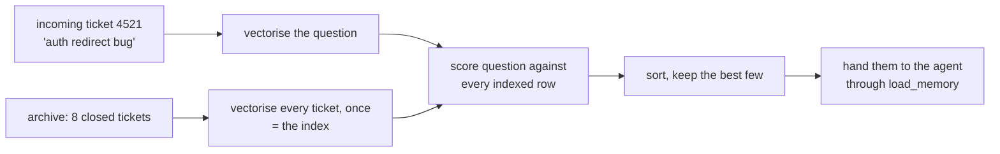

# 1.1 — The counter that takes a description

## One-line answer

**Retrieval** is finding things by describing them instead of naming them, and the only way a
computer can do that is to turn every description into numbers and then measure how far apart the
numbers are.

## The story

You need a part for a mixer that stopped turning. You do not know what the part is called. You do
not have a model number, because the sticker came off years ago.

So you go to the spare-parts shop on the main road and you describe it. *It is the small black
thing at the bottom, plastic, with teeth on it, and it spins the shaft.* You mime the shape with
your hands. You say what it sounds like when it fails: a whirring noise and nothing moves.

The man behind the counter listens, turns around, and comes back with three small boxes. He puts
them on the counter and says: *this one, most likely. This one if yours has a metal collar. This
one if it is the older motor.*

He never asked you for the part number. He could not have used it if you had given him one, because
you would have got it wrong. What he did was match your **description** against everything he knows
is in the drawers behind him, and hand you the three closest.

Now imagine the same shop with a different man behind the counter, one who will only look things up
by name. You describe the black plastic thing with teeth. He says: *we do not stock a "black
plastic thing with teeth".* He is not being difficult. He is doing exactly what he was trained to
do, and it is useless to you.

## The idea in plain language

Those two men are the two ways a computer can answer *"have we seen this before?"*.

The second man is a **lookup**. You give a key — a part number, a ticket id, a dictionary key — and
you get back the one thing filed under it, or nothing at all. Sutra has used lookups since
[Day 17](../../../day-17-state-scopes-and-lifetimes/LESSON.md): `state["severity"]` is a lookup, and
it either returns the value or raises `KeyError`. A lookup is exact and it fails loudly, which are
both good properties.

The first man is a **search by description**, and that is what this whole day is about. The word
the field uses is **retrieval**: given a piece of text you have now, find the pieces of text you
stored earlier that are *about the same thing*.

Two words need defining before anything else, because everything below is built on them.

A **vector** is a list of numbers, in a fixed order. `[3, 0, 1]` is a vector. That is the entire
definition — there is nothing mathematical hiding behind it. What makes a vector useful is that
once two things are lists of numbers of the same length, you can *measure the distance between
them*, and distance is something a computer can sort.

A **similarity score** is one number that says how close two of those lists are. In this day it
always runs from `0.0` (nothing in common) to `1.0` (identical direction). A score is the thing a
lookup does not give you: a lookup answers yes or no, while a score answers *how close*, which is
what lets you put ten candidates in order and show the best three.

So retrieval is three steps, and you will build all three by hand today:

1. turn every stored document into a vector, once, and keep the vectors;
2. turn the incoming question into a vector the same way;
3. score the question's vector against every stored vector, sort, and take the top few.

Nothing about that requires a model, a database, or a network. Steps 1 to 3 are arithmetic over
dictionaries, and by [1.5](1.5-the-work-you-do-once.md) you will have run them on the real ticket
archive.

One more term, because you will meet it in every job description in this field. **RAG** stands for
**retrieval-augmented generation**: retrieve the relevant documents first, then hand them to a
language model and ask it to answer *using those documents*. The retrieval half is today. The
paper that named the pattern is
[`papers/02-retrieval-augmented-generation.md`](../../papers/02-retrieval-augmented-generation.md),
and you read it at the end of the day, not now.

## Why Sutra needs it

Because [Day 46](../../../day-46-sessions-vs-memory/LESSON.md) ended on a broken promise, and this
day is the repair.

Day 46 gave the desk a memory: file a finished conversation, and a later conversation can search
it. Then
[5.1](../../../day-46-sessions-vs-memory/parts/05-failure-lab/5.1-the-past-that-matched-on-nothing.md)
measured what that search actually does. `InMemoryMemoryService` matches on **one shared word** —
the line in the installed source is `any(query_word in words_in_event for query_word in
words_in_query)` — so a normal question matched every ticket in the store, and the results came back
in the order they happened to be filed, with no score anywhere.

Day 46's own conclusion, in its own words, is the sentence this day exists to answer:

> **The cap made the response smaller and no more correct**, because you cannot take the top three
> of a list that has no top.

A cap is a cost control. Ranking is a correctness control, and there is no ranking without a score.
That is why today is not a nice-to-have chapter about a fashionable technique. It is the
correctness fix for a feature the desk already has and currently gets wrong.

You also meet the far end of this on [Day 50](../../../day-50-chunking-and-top-k/LESSON.md), which
takes today's `sutra/retrieval.py` and asks the two questions today deliberately leaves open: how
big a piece of text should be indexed at once, and how many results are worth returning.

## The mechanism

Here is the shape of the whole day in one picture. The left half is what you already have; the
right half is what you build.



The one box that decides everything is *vectorise*. Sections 1 and 2 fill it with word counting and
watch it fail. Section 3 fills it with an embedding model. Section 4 wires the result into ADK so
the desk's existing `load_memory` tool gets ranked answers instead of an unranked pile.

Before any of that, look at the data. Every script in this day imports it from one file:

```python
# days/day-49-retrieval-and-embeddings/lab/_archive.py
ARCHIVE: list[tuple[str, str]] = [
    (
        "4188",
        "Login loop on the staff portal. Session cookie written without SameSite, "
        "so the browser dropped it. Fix KB-104.",
    ),
    # ... six more closed tickets ...
]

INCOMING_ID = "4521"
INCOMING = (
    "Auth redirect bug: after the identity provider hands control back, our user lands "
    "at a blank sign-in screen."
)
```

**Line by line:**

- `ARCHIVE` is a list of `(ticket id, one line of text)` pairs, not a dictionary, because **the
  order is load-bearing**. Day 46 showed that an unranked retriever returns results in insertion
  order, and several parts of this day compare a ranked answer against that order.
- Each entry is a **summary line**, not a full ticket thread. That is how a real archive is written:
  the engineer who closed the ticket typed one sentence in whatever words came to mind that day.
  [Day 50](../../../day-50-chunking-and-top-k/LESSON.md) is where the question of how much text
  belongs in one indexed row gets asked properly.
- `4188` is the entry the rest of the day turns on. It is **the same fault as today's incoming
  ticket**, described in 2025 vocabulary: a login loop caused by a session cookie without
  `SameSite`, which is the fix Day 46 filed as KB-104.
- `INCOMING` is written the way this year's engineer would write it. Read it beside 4188 and notice
  that they share almost nothing except the word `the`. That is not a trick; it is what two people
  describing one bug eighteen months apart actually produce, and it is the entire subject of
  [2.1](../02-the-meaning-test/2.1-the-score-that-came-back-zero.md).

Here is the lookup-versus-description difference, made concrete on this data:

| Question | A lookup can answer it | Retrieval can answer it |
| --- | --- | --- |
| "show me ticket 4188" | yes — the id is the key | badly; it would score text, not match an id |
| "which tickets mention KB-402?" | yes — an exact substring | unnecessarily |
| "has anything like 4521 happened before?" | **no** — there is no key for "like" | this is the question it exists for |
| "how many tickets did we close last month?" | yes, with SQL ([Day 39](../../../day-39-database-tools/LESSON.md)) | **no** — counting is not similarity |

The last row matters as much as the third. Retrieval is not a better lookup; it is a different
instrument, and reaching for it when you needed a count or a key is a mistake
[Day 50](../../../day-50-chunking-and-top-k/LESSON.md) spends a whole day on.

## When it breaks

The first break is not in the code. It is in the expectation.

The man at the counter gave you three boxes. He did **not** say *"there is no such part"*, and he
did not say *"here is your part"*. He said *this one, most likely*. Retrieval always answers like
that, and a system built on top of it must be built to receive an answer like that.

Here is what that looks like when nobody accounts for it. Ask the archive a question about
something it has never seen:

```text
a question the archive CANNOT answer: 'we need SOC 2 evidence for a security questionnaire'
   0.369  4455  Refund requested for the annual plan after two month
   0.000  4188  Login loop on the staff portal. Session cookie writt
   0.000  4239  Password reset mail never reaches the customer. Thei
    returned: 3
```

Three results, top score `0.369`, and the archive contains nothing whatsoever about security
questionnaires. Nothing errored. Nothing was empty. The top result is a **refund ticket**, and it
scored highest because it happens to share the word `for`.

That is the shape of every retrieval failure in this day, and
[5.1](../05-when-retrieval-lies/5.1-nearest-is-not-near.md) takes it apart properly. The reason it
belongs here, in the first part, is that it is the price of admission: the moment you stop asking
for a key and start asking for a description, *"nothing found"* stops being free. A lookup gives it
to you as a `KeyError`. Retrieval will only give it to you if you write the code that decides what
"too far" means.

## In production

**What a professional writes instead of the teaching version.** Nobody hand-rolls a vector index in
a production system, and by [6.1](../06-in-production/6.1-the-store-we-did-not-build.md) you will
have measured exactly why. They reach for a vector store — FAISS, pgvector inside Postgres, Qdrant,
Chroma, or the k-nearest-neighbour support already inside Elasticsearch or OpenSearch — and for a
hosted embedding model. What they do **not** outsource is the decision about what a score means and
what happens below it, because no store will make that decision for you.

The other thing a professional does differently on day one is **write down the questions the system
must answer** before choosing the instrument. Half the retrieval systems in the world exist because
somebody reached for RAG on a question that was a `SELECT COUNT(*)`.

**What degrades at scale.** The counter analogy holds up here too. A man who knows four hundred
parts can hand you the right box from a description. A warehouse with two hundred thousand parts
cannot be searched by one person's memory, and the answers get worse in a particular way: not
"nothing found", but *more* boxes on the counter, more of them wrong, and no signal about which. In
this day's own numbers, an archive of eight tickets returns three plausible-looking neighbours to a
question about a subject it has never covered. At fifty thousand it will return three that look even
more plausible.

**The review comment a senior engineer leaves:** *"Before we add an index, write down the five
questions this is supposed to answer, and mark which of them a `WHERE` clause already answers. Two
of the five in your document are lookups and one is a count. We do not need retrieval for those, and
retrieval will answer them worse than the query we already have."*

**The interview question:** *"What is the difference between search and retrieval, and when would
you not use retrieval?"* An honest answer: *"A lookup takes a key and returns one thing or nothing.
Retrieval takes a description and returns the nearest few things with a score on each, and it always
returns something, which is the part people forget. I would not use it for anything with an exact
key, for anything that is really a count or an aggregate — that is SQL — and I would think hard
before using it on a corpus small enough to fit in the model's context window, because at that size
retrieval only adds a chance of missing the one document that mattered. The rule I use is: retrieval
buys you the ability to ask 'like this', and it costs you the ability to be told 'no such thing'
unless you build that back yourself."*

## Check yourself

```bash
cd days/day-49-retrieval-and-embeddings/lab
uv run python -c "from _archive import ARCHIVE, INCOMING, body, tokenize; print(sorted(set(tokenize(INCOMING)) & set(tokenize(body('4188')))))"
```

That one command prints every word the incoming ticket and its true match have in common. Look at
what comes back before you read the next part.

**Out loud, without scrolling up:** describe the difference between asking for something by name and
asking for it by description, using the shop and not using the words "vector" or "retrieval". Then
say what a description-based answer can never tell you that a name-based answer always can.

**Next:** [1.2 — A ticket as a list of numbers](1.2-a-ticket-as-a-list-of-numbers.md).
