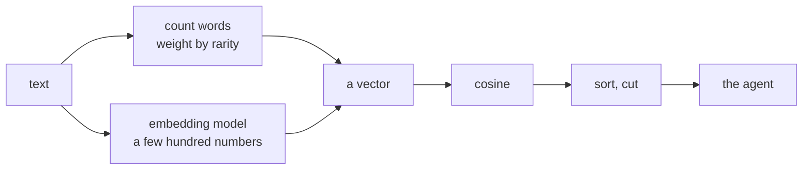

# 3.1 — The dish you know by taste

## One-line answer

An **embedding** is a list of numbers produced by a model that was trained to put texts used in
similar ways close together, so two sentences with no shared words can still have a high cosine —
which is the one thing counting words can never do.

## The story

Somebody puts a bowl in front of you and you taste it and you say: *this is like the thing your mother
makes.*

You could not write down why. You do not have the recipe, you cannot name the spices, and if
somebody asked you to list what is in it you would get three things right and miss the rest. But the
judgement was instant and you are confident about it, and if six bowls came out you could put them in
order of how close each one is to the thing you are thinking of.

What you did was not comparison of ingredient lists. If it had been, you would have failed — the
cook used a different oil, skipped one spice, added something your mother never uses. Comparing the
lists would have said *not the same*.

You compared something else. Call it where the dish sits. Years of eating have given you a sense of
place: this region, this kind of heat, this sourness. Two dishes that sit near each other taste alike
whether or not they were made from the same list, and two dishes made from nearly the same list can
sit far apart if one is fried and one is boiled.

Nobody taught you the axes. Nobody could name them for you now. You have them because you have eaten
a lot of food.

## The idea in plain language

An **embedding model** is a piece of software that takes a piece of text and returns a fixed-length
list of numbers — often a few hundred of them. That list is the text's **embedding**, and the numbers
are its position in a space the model learned.

Three things need saying carefully, because this is where people either understand embeddings or
start believing in magic.

**The numbers are a position, not a description.** No individual number means "how much this text is
about authentication". The axes have no names and no meanings you could look up; they are whatever
the training produced. What is meaningful is only ever **the relationship between two positions**,
measured with the same cosine you wrote by hand in
[1.3](../01-text-as-numbers/1.3-direction-not-size.md).

**Similar usage produces similar positions.** The model was trained on an enormous amount of text
with an objective that pushes texts appearing in similar contexts towards each other. *Login loop*
and *auth redirect* occur in the same kinds of documents, surrounded by the same kinds of sentences,
next to the same words — cookie, session, browser, sign in. So they end up near each other. Nobody
wrote a synonym line ([2.2](../02-the-meaning-test/2.2-the-repairs-that-fix-one-pair.md)); the
geometry absorbed the job.

**Nothing about the retrieval code changes.** This is the part that surprises people who expect
embeddings to be a different technique. You still vectorise the documents once, vectorise the query,
take a cosine, sort, and cut. Every function from [section 1](../01-text-as-numbers/1.5-the-work-you-do-once.md)
survives untouched. The only thing that changes is where the numbers come from, which is exactly
what [3.3](3.3-the-scale-does-not-know-what-it-weighs.md) demonstrates by swapping one for the other
behind a single function.

There is a term for the two families, and you will hear both in interviews. Counting words gives a
**sparse** vector — one number per vocabulary word, almost all zero
([1.2](../01-text-as-numbers/1.2-a-ticket-as-a-list-of-numbers.md) measured 67 zeros out of 80). An
embedding gives a **dense** vector — a few hundred numbers, essentially none of them zero, none of
them corresponding to a word. Sparse and dense retrieval are the two halves of the hybrid search
named in [2.1](../02-the-meaning-test/2.1-the-score-that-came-back-zero.md).

The idea that meaning could be a position in a space is older than the current generation of models.
The paper usually credited with making it work at scale is *Efficient Estimation of Word
Representations in Vector Space* (`arXiv:1301.3781`, 2013), which learned a position for every
**word** such that words used in similar contexts landed near each other. Today's models do the same
thing for a whole sentence or a whole document, which is what makes them usable for retrieval.

## Why Sutra needs it

Because [2.1](../02-the-meaning-test/2.1-the-score-that-came-back-zero.md) produced a `0.000` that no
amount of weighting could move, and [2.2](../02-the-meaning-test/2.2-the-repairs-that-fix-one-pair.md)
showed that the repair which does move it has to be written by hand, one pair at a time, in advance.

The desk needs a vectoriser whose notion of "close" does not run through shared words. That is the
whole requirement, and an embedding model is the only thing in this day that meets it.

It is also the vocabulary you will be asked about. The addendum that created this day says a job
interview for an AI engineering role *"asks about RAG almost every time"*, and every one of those
conversations goes through this part: what is an embedding, why does cosine work on it, and what is
the difference between sparse and dense retrieval.

## The mechanism

You cannot see the inside of an embedding model, and this part will not pretend to. What it can do
is show you the **shape** of the answer, using numbers written by hand, so that when the real
vectors arrive in [3.3](3.3-the-scale-does-not-know-what-it-weighs.md) you know what you are looking
at.

```python
# days/day-49-retrieval-and-embeddings/lab/space.py
AXES = ("signing-in", "money", "display")

# Hand-placed. Read these as "how much is this text about each axis", 0 to 1.
PLACED: dict[str, dict[str, float]] = {
    "login loop on the staff portal": {"signing-in": 0.95, "money": 0.02, "display": 0.10},
    "auth redirect bug, blank sign-in screen": {
        "signing-in": 0.92,
        "money": 0.01,
        "display": 0.25,
    },
    "refund on the annual plan": {"signing-in": 0.02, "money": 0.97, "display": 0.05},
    "dashboard blank after the upgrade": {
        "signing-in": 0.05,
        "money": 0.02,
        "display": 0.95,
    },
}
```

**Line by line:**

- **These numbers were typed by a person — by the writer of this document — and not learned by
  anything.** Say that out loud before reading the output, because the run below proves nothing
  about any model. It proves what a *good* placement would buy you, which is a different and still
  useful thing.
- `AXES` has three entries with human-readable names. A real embedding has a few hundred and **none
  of them has a name**. Three named axes are a lie told for legibility, and the lie is exactly the
  thing that stops being available the moment you use a real model.
- The two authentication texts are placed at `0.95` and `0.92` on the same axis. That is the claim an
  embedding model makes about them and the claim that word counting could not make.
- `"display"` is `0.10` for the login loop and `0.25` for the auth redirect, because the second one
  mentions a *blank screen*. Real texts are about more than one thing at once, and the position
  reflects all of it — which is what will bite in
  [5.1](../05-when-retrieval-lies/5.1-nearest-is-not-near.md).
- The vectors are stored as dictionaries so that `cosine` from `_archive.py` works on them unchanged.
  That is not a convenience; it is the point of the part. **The scoring function does not care where
  the numbers came from.**

Run it:

```bash
cd days/day-49-retrieval-and-embeddings/lab
uv run python space.py
```

**Line by line:**

- One script, one arm. There is no ablation here because there is nothing to switch off — this is an
  illustration, and the honest arms are in [3.3](3.3-the-scale-does-not-know-what-it-weighs.md).
- **Zero model calls, and no model anywhere in the file.**

Measured on 2026-09-05:

```text
axes (chosen by hand, three of them instead of hundreds):
    signing-in
    money
    display

    [0.95  0.02  0.10]  login loop on the staff portal
    [0.92  0.01  0.25]  auth redirect bug, blank sign-in screen
    [0.02  0.97  0.05]  refund on the annual plan
    [0.05  0.02  0.95]  dashboard blank after the upgrade

ranked against 'auth redirect bug, blank sign-in screen':
     0.987  login loop on the staff portal
     0.313  dashboard blank after the upgrade
     0.044  refund on the annual plan

words shared by the top hit and the query: none
the score did not come from the words. It came from where they were placed.
```

`0.987` between two texts that share **no words at all**. Compare that with
[2.1](../02-the-meaning-test/2.1-the-score-that-came-back-zero.md)'s `0.000` on the same pair of
ideas, and you have the entire argument for this section in two numbers.

Look at the second row too. `0.313` for the dashboard ticket — not zero, because the query does
mention a blank screen and the placement says so. A good embedding produces exactly this: a strong
first result, a weak-but-nonzero second, and a near-zero third. That **spread** is what makes a
threshold possible, and it is the property [5.1](../05-when-retrieval-lies/5.1-nearest-is-not-near.md)
will show is not as reliable as it looks.

Here is the whole day's pipeline with the box that changes marked:



Two paths in, one path out. Everything to the right of *a vector* is code you have already written
and will not touch again today.

## When it breaks

The honest limits of this part are three, and they all follow from the same fact: the position was
decided by somebody else's training data, not by your archive.

**Your domain's words may not be in the model's world.** An internal codename, a product released
after the model was trained, an error code — these carry no learned meaning, so the model places them
somewhere arbitrary. Word matching would have found them exactly. This is precisely why hybrid
search exists.

**Opposites sit close together.** *The login worked* and *the login failed* appear in nearly identical
contexts, so a model trained on context alone will place them near each other. Retrieval will happily
hand you the ticket where everything was fine, in answer to a question about a failure. Word counting
had the same weakness for a different reason
([1.2](../01-text-as-numbers/1.2-a-ticket-as-a-list-of-numbers.md)'s bag of words throws away the
`not`), so neither method solves negation and neither will warn you.

**There is no zero any more.** With word counting, "nothing in common" was arithmetically `0.000`
and unmistakable ([2.1](../02-the-meaning-test/2.1-the-score-that-came-back-zero.md)). Dense vectors
are hundreds of non-zero numbers, so the cosine between two unrelated texts is a smallish positive
number, never zero. **The absolute score stops meaning anything and only the gaps between scores
carry information.** That change is the single biggest practical difference between the two lanes,
and it is why [5.1](../05-when-retrieval-lies/5.1-nearest-is-not-near.md) has to talk about
thresholds instead of about zeros.

## In production

**What a professional writes instead of the teaching version.** They never hand-place vectors, and
they never explain an embedding by naming its axes in a design document, because the axes do not mean
anything and a reader who believes they do will make bad decisions later. What they do write down is
the model's **identity and dimension**, in the index file and in the ledger: which model, which
version, how many numbers. That triple is the contract, and changing any part of it invalidates every
vector ever stored.

They also test the property directly. A short **paraphrase set** — five pairs of sentences that mean
the same thing in different words, and five pairs that share words and mean different things — with
an assertion that the first group scores higher than the second, is the cheapest possible guard
against a model swap quietly making retrieval worse.

**What degrades at scale.** Not the model — one text in, one vector out, always the same cost. What
degrades is **drift between your archive and the model's training**. Your product's vocabulary moves,
new features get names, and the model's sense of where those words belong was frozen at training
time. The symptom is that retrieval quality falls slowly on the newest documents, which is the
opposite of where anybody looks.

**The review comment a senior engineer leaves:** *"The design doc says the first dimension captures
topic. It does not capture anything nameable and we must not write that down — somebody will build a
filter on dimension zero. Replace that paragraph with the model name, the dimension count and the
date, and add the paraphrase test so a model change cannot land silently."*

**The interview question:** *"Explain embeddings to an engineer who has never used one."* An honest
answer: *"A model turns a piece of text into a fixed-length list of numbers — a position in a space
it learned from a very large amount of text. Individual numbers mean nothing; only the distance
between two positions does. It works because the training pushes texts that appear in similar
contexts to similar positions, so 'login loop' and 'auth redirect' land near each other even though
they share no words — which is the exact case where my word-counting index scored 0.000. The
retrieval code is unchanged: same cosine, same sort, same top-k. What does change is that scores
stop having an absolute meaning. With sparse vectors, zero really meant no overlap; with dense
vectors, two unrelated texts still score a small positive number, so you have to reason about the gap
between the first and second result rather than the value of the first."*

## Check yourself

```bash
cd days/day-49-retrieval-and-embeddings/lab
uv run python space.py
```

Now change the `"display"` value for `"auth redirect bug, blank sign-in screen"` from `0.25` to
`0.90` and re-run. Watch the ranking change without a single word changing. Say what that tells you
about who is really deciding your search results.

**Out loud, without scrolling up:** explain what an embedding is using the bowl of food, and then say
the one thing about an embedding's individual numbers that you must never claim.

**Next:** [3.2 — The model that runs in your own shop](3.2-the-model-that-runs-in-your-own-shop.md).
