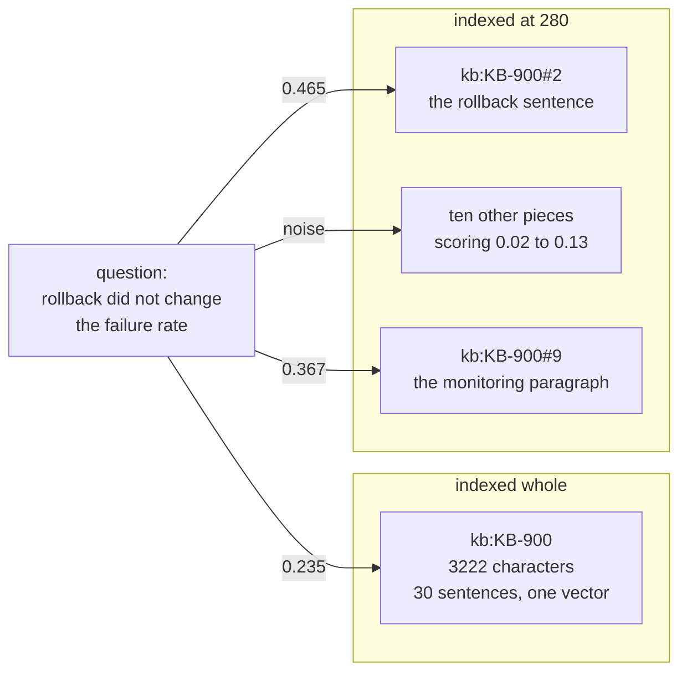

# 1.2 — The document that averages itself away

## One-line answer

One vector is one average, so a long document scores against a question with the meaning of its whole
self and not with the meaning of its best paragraph — measured here, the incident review scores
**0.235** where its own answer-bearing paragraph scores **0.465**.

## The story

You buy a bottle of mixed fruit juice. Ten fruits, it says on the label, and one of them is ginger.

At home somebody asks whether there is ginger in it. You take a mouthful. There is definitely
something — a warmth at the back — but it is sitting under mango and apple and grape, and by the time
you have swallowed you are not sure whether you tasted ginger or expected it. You take another
mouthful. Same answer. The bottle is not going to get any clearer, because the bottle is not ten
flavours, it is one flavour that ten flavours were mixed into.

If the shop had sold you ten small bottles instead, the question would have taken one sip.

The ginger is in there. It was never removed. It was averaged.

## The idea in plain language

A vector has a fixed size. Day 49's tf-idf vectors have one number per word the archive knows, and a
sentence-embedding model produces a fixed list — seven hundred and sixty-eight numbers is common —
whatever you feed it. Two characters or two thousand: same size out.

That is the fact the whole of today's first section rests on. A fixed-size summary of a long text is
an **average of everything in it**. The direction of the vector is pulled by every word in the
document in proportion to how much of the document that word is. In a two-line ticket about signing
out, every word is about signing out and the direction is sharp. In a three-thousand-character
incident review, the two hundred characters that answer your question are about six per cent of the
input, and the other ninety-four per cent — the attendance list, the timeline, the actions with owners
and dates — pull the direction somewhere else entirely.

The word for this is **dilution**. Nothing is lost, exactly. The words are all still in the row. But
the *score* the row earns against a question is computed from the whole average, and the average is
mostly not about your question.

Two things this is worth separating from:

- Dilution is not a **miss**. The row can still come back. It just comes back with a weak score, which
  means it can be beaten by a shorter row that is only vaguely on topic.
- Dilution is not about the *retrieval* code at all. Day 49's cosine similarity is doing exactly what
  it promises. It is comparing the question to what you stored, and what you stored was an average.

**Cosine similarity**, since it decides every number in this part: take the question's vector and the
row's vector, and measure the angle between them. Identical direction scores `1.0`, nothing in common
scores `0.0`. Length does not enter into it — which is precisely why a long document cannot buy a
better score by containing more; it can only spend its direction on more subjects.

## Why Sutra needs it

The desk's archive already contains one document like this. `kb:KB-900` is the March incident review,
three thousand two hundred and twenty-two characters, and it is the single most useful document in the
store: it explains the sign-in loop from symptom to root cause to mitigation, which is the desk's most
common class of question.

It is also the document the store is worst at returning, and Day 49 had no way to see that, because
Day 49 measured whether the right document came back and this document does come back. It comes back
weakly, at a score that a two-line ticket about something adjacent can beat.

[2.2](../02-measuring-the-cut/2.2-one-table-seven-chunk-sizes.md) turns this into the decision about
what the desk actually ships. This part is the mechanism underneath that decision, and it is worth
seeing as a number before it is seen as a table.

## The mechanism

Ask one question with one obvious answer, and score it against the review two ways: as one row, and as
twelve rows.

```python
# days/day-50-chunking-and-top-k/lab/dilution.py
QUERY = "rollback did not change the failure rate"
REF = "kb:KB-900"
SIZE = 280


def score(index, query: str, ref: str) -> float:
    """Cosine between a query and one row of an index."""
    vector, norm = query_vector(index, query)
    row = index.vectors[ref]
    shared = vector.keys() & row.keys()
    dot = sum(vector[term] * row[term] for term in shared)
    return dot / (norm * index.norms[ref])
```

**Line by line:**

- `QUERY` is answered by one sentence of the review: *"At nine forty the rollback was attempted and
  did not change the failure rate."* One sentence, in a document of about thirty.
- `SIZE = 280` is roughly two or three sentences. It is not the size this day ends up shipping — that
  argument is [2.2](../02-measuring-the-cut/2.2-one-table-seven-chunk-sizes.md)'s — it is the size
  that shows the mechanism most clearly, because it puts the answer sentence nearly alone in a row.
- `score` reaches past `search` on purpose. `search` would rank the whole index and tell you who won;
  this part needs the number for **one named row**, including the rows that lose, because the losers
  are the evidence.
- `vector.keys() & row.keys()` is a set intersection: the words the question and the row have in
  common. Terms in only one of them contribute nothing to the dot product, so skipping them is not an
  optimisation, it is the definition.
- `dot / (norm * index.norms[ref])` is cosine written out. The dot product on top rewards shared
  words weighted by how rare they are; the two lengths underneath divide that reward by how much
  *else* each side is carrying. Dilution lives in the denominator: a long row has a large norm, and a
  large norm makes every score smaller.

Run it:

```bash
cd days/day-50-chunking-and-top-k/lab
uv run python dilution.py --whole
uv run python dilution.py
```

**Line by line:**

- `--whole` prints only the control arm: the review indexed the way Day 49 indexed it, as one row.
- With no flag, the script prints the control arm and then every one of the twelve pieces, each with
  its own score, and marks the one containing the answer sentence.
- Both arms build the index over the **whole archive**, not just the review. That matters: the
  weighting of a word depends on how many rows contain it, so scoring the review in isolation would
  produce a number that means nothing.

Measured on 2026-09-05:

```text
question: 'rollback did not change the failure rate'
document: kb:KB-900, 3222 characters, 551 words

  whole document          score 0.235
  cut into 12 pieces of 280 characters:
    kb:KB-900#0    score 0.040   'KB-900 Incident review, March. Summary. This' 
    kb:KB-900#1    score 0.023   ' in the incident folder. Timeline. At nine o' 
    kb:KB-900#2    score 0.465   ' rollback. At nine forty the rollback was at' <-- the answer
    kb:KB-900#3    score 0.056   'd traffic returned to normal after a configu' 
    kb:KB-900#4    score 0.020   'us page was updated late and that is tracked' 
    kb:KB-900#5    score 0.020   'other domain and back, and on that return th' 
    kb:KB-900#6    score 0.035   'uild when the cookie helper omits either att' 
    kb:KB-900#7    score 0.052   's and dates. Communications. The first custo' 
    kb:KB-900#8    score 0.039   ' for sign-in incidents will be added to the ' 
    kb:KB-900#9    score 0.367   'tions would not have prevented this one. Mon' 
    kb:KB-900#10   score 0.131   'used by us, which is why the first twenty mi' 
    kb:KB-900#11   score 0.086   'ta, the escalation path and the list of peop'
```

**0.235 against 0.465.** The paragraph that answers the question scores almost exactly twice what the
document containing it scores. Nothing was added. The same characters, in the same order, weighted by
the same arithmetic — cut differently.

Read down the column and the mechanism is visible. Ten of the twelve pieces score below `0.09`. They
are the attendance list, the impact numbers, the actions with owners. Every one of them is a real part
of the document, and every one of them was in the whole-document average, dragging the direction away
from a question about a rollback.

There is a second, quieter finding in that column: `kb:KB-900#9` scores `0.367`, and it is not the
answer. It is the monitoring paragraph, which says *"the actions would not have prevented this one"*
and talks about failure and detection. Chunking did not only sharpen the right row. It also gave a
wrong row a chance to score highly, because a wrong row that is *entirely* about failure rates now
competes against a right row instead of being buried inside a document that also contained the answer.
That is the first sighting of the tension the whole day is about, and
[4.1](../04-the-floor/4.1-cosine-never-says-it-does-not-know.md) takes it seriously.

Here is the shape of the thing, as a picture:



## When it breaks

Dilution has an obvious-looking fix that does not work, and it is worth reaching for it once so the
reaching is over.

The fix everybody tries is **normalisation** — divide by the length, or use average word weights
instead of totals, so that long documents are not penalised. Day 49's index already does this. The
`tf` in tf-idf is a term's count divided by the document's word count, and cosine divides by the norm
on top of that. The review is not scoring `0.235` because nobody normalised it. It is scoring `0.235`
**after** two separate normalisations, because the problem is not scale. The problem is direction: the
review points at thirty subjects and the question points at one.

The second thing that breaks is trusting the score as a portable number. Try it:

```text
  whole document          score 0.235
```

That `0.235` is not a property of the review and the question. It is a property of the review, the
question **and the other fifty-six documents**, because the weight of every word depends on how many
rows in this archive contain it. Add fifty tickets about rollbacks tomorrow and the word "rollback"
becomes common, its weight falls, and this exact query against this exact document scores lower — with
no change to either. Scores compare rows **within one index at one moment**. A threshold copied from
one archive to another is a number with the units filed off, and
[4.2](../04-the-floor/4.2-there-is-no-floor-that-separates-them.md) has to live with that.

## In production

**What a professional writes instead.** They do not chunk uniformly. Real corpora are mixed — a
hundred two-line tickets and four long runbooks — and cutting the two-line tickets into pieces gains
nothing and costs rows. The production shape is a splitter with a **maximum**, not a fixed size: leave
anything under the maximum alone, cut anything over it, and cut it at the nearest heading or paragraph
break rather than at character 280. In the archive here, that rule leaves fifty-two tickets untouched
and cuts four documents, which is exactly where the entire measured difference comes from.

**What degrades at scale.** Dilution gets worse as documents get longer, and documents get longer over
time on their own. A runbook that was two paragraphs at launch is nine pages after two years of
appended edge cases, and its retrieval quality decays continuously with nothing in any changelog to
explain it. Nobody notices, because the document still comes back, just further down.

**The failure mode that only appears with real traffic.** The long documents are usually the important
ones. Post-mortems, policies and runbooks are long *because* they matter, so an undetected dilution
problem selectively degrades the answers to your hardest questions while leaving the easy ones
perfect. Any dashboard built on average retrieval quality will look healthy.

**The review comment a senior engineer leaves:** *"You have measured this on one query and one
document, and the number is convincing, but a two-times gap on a single hand-picked example is exactly
what a hand-picked example looks like. Before you change the indexer, put it in the sweep with the
whole gold set behind it, and show me the row where cutting made something worse — because at 280 the
monitoring paragraph is now scoring 0.367 against a question it does not answer."*

**The interview question:** *"Why does chunking help retrieval quality?"* An honest answer: *"Because
an embedding is a fixed-size average, so a long document is scored on the meaning of the whole thing
rather than on the meaning of the part you need. I measured it on a three-thousand-character incident
review: the question 'rollback did not change the failure rate' scored 0.235 against the whole
document and 0.465 against the two-hundred-and-eighty-character piece that actually contains the
answer, with ten of the twelve pieces below 0.09. The important qualification is that this is not free
— in the same run, cutting also promoted a monitoring paragraph that does not answer the question from
invisible to 0.367, so chunking sharpens the wrong rows as well as the right ones. That is why the
decision has to come off a sweep with a gold set and not off one query."*

## Check yourself

```bash
cd days/day-50-chunking-and-top-k/lab
uv run python dilution.py --whole
uv run python dilution.py
```

Now edit `dilution.py` and change `SIZE` from `280` to `1600`. Re-run. Write down the new score of the
answer-bearing piece, and say in one sentence why it moved the way it did.

**Out loud, without scrolling up:** explain to somebody who has never heard the word "vector" why a
long document scores badly on a question it answers, and say why dividing by the length does not fix
it.

**Next:** [1.3 — Cut too small to mean anything](1.3-cut-too-small-to-mean-anything.md).
