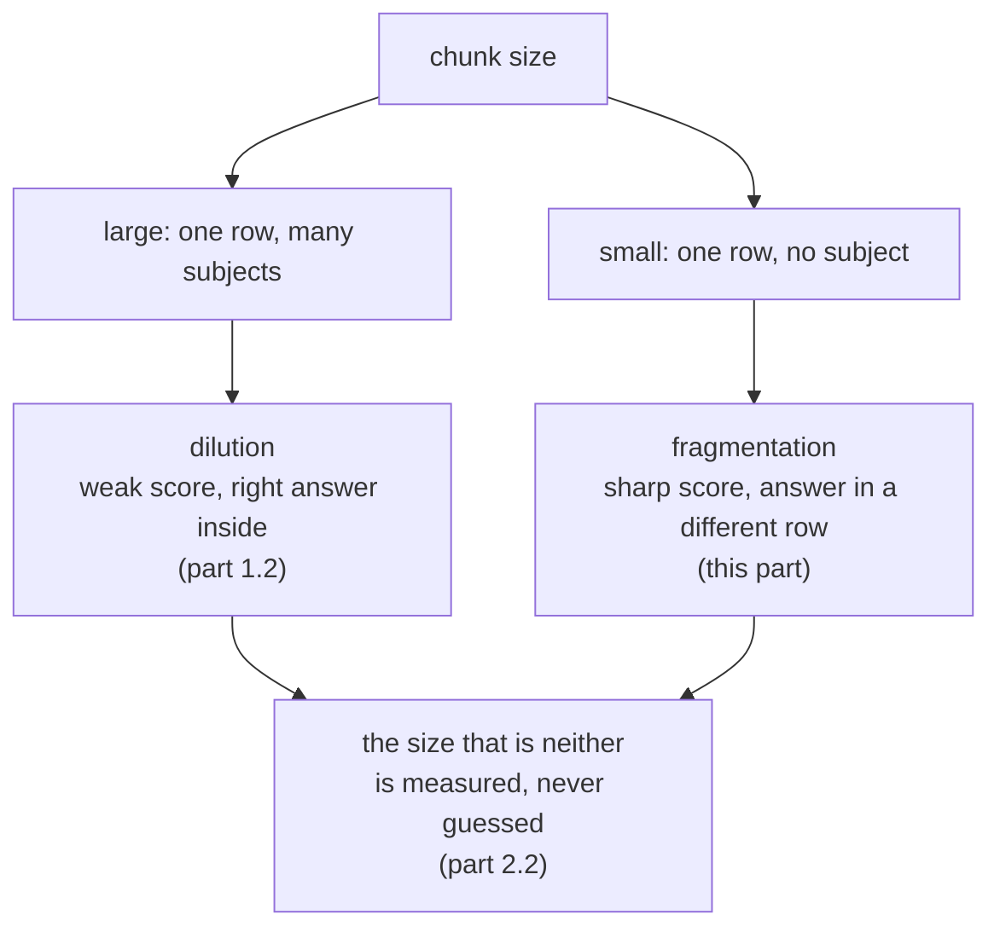

# 1.3 — Cut too small to mean anything

## One-line answer

Below a certain size a row stops being about anything, and the measurement shows it precisely:
cutting the archive at eighty characters keeps the right document in the top three for nine questions
out of ten while the text that comes back contains the answer for only **five**.

## The story

A cousin gives you her mother's recipe on a card, both sides covered in small handwriting. You want to
keep it, so you cut it up and stick each piece into your own notebook on a different page, one line to
a page, so that everything is easy to find.

Months later you are standing in the kitchen and you turn to the page you need. It says:

*"Cook until it separates."*

Until *what* separates. Separates from what. You turn the page. *"Add half of it and keep the rest for
later."* Half of what. You turn back. *"The same as before, but lower."*

Every line is in your notebook. Nothing was lost. Every single line is also useless, because a line of
a recipe is not a unit of meaning — a line is a unit of *paper*. The meaning lived in the sentence
before it and the ingredient list at the top, and you cut both of those away when you decided that one
line was a thing worth storing on its own.

## The idea in plain language

The problem with small chunks is called **fragmentation**, and it is exactly the opposite failure from
the one [1.2](1.2-the-document-that-averages-itself-away.md) measured.

Dilution is a row that is about too many things at once, so the direction of its vector is an average
of subjects and it scores weakly on all of them. Fragmentation is a row that is about **nothing**,
because the words in it only meant something in the company of words that are now in a different row.

Three separate things go wrong, and it is worth having them apart:

1. **Referring words lose what they refer to.** "It", "that", "the same", "this fix", "the customer" —
   these carry meaning by pointing backwards, and a cut in front of them leaves them pointing at
   nothing. The vector for `'Cook until it separates.'` is a vector about cooking and separating,
   which is not what the sentence means.
2. **The subject of the row disappears.** A ticket's subject is stated once, at the top. Cut the
   ticket into twelve pieces and eleven of them never mention what they are about. A piece deep inside
   `ticket:4610` talks about a clean profile and developer tools, and nothing in it says *signing out*.
3. **The row you retrieve is too small to answer with.** This is the one that surprises people, and it
   is the one the measurement below is about. A tiny row can be a perfectly good *match* — it can be
   the highest-scoring thing in the archive — and still not contain enough text to answer the question
   it matched. The retrieval succeeded and the answer did not arrive.

That third one needs two words that this day will use constantly, so here they are, defined once:

- **hit@k** — for a question whose correct source document is written down in advance, did that
  document appear anywhere in the top `k` rows? It is the question *"did retrieval find the right
  place?"*
- **answered@k** — did the **text of those k rows** actually contain the answer? It is the question
  *"could a model have answered from what I sent?"*

They are not the same question, and the whole of section 2 is built on the gap between them.
[2.1](../02-measuring-the-cut/2.1-the-answer-key-you-write-before-you-tune.md) explains how the answer
key that makes both measurable is written.

## Why Sutra needs it

The obvious lesson of [1.2](1.2-the-document-that-averages-itself-away.md) is *cut smaller*. Dilution
falls monotonically as chunks shrink, the scores get sharper, the token bill drops — every arrow points
the same way, and a reader who stopped after that part would go and set the chunk size to something
small and be pleased with the numbers.

This part is the other wall. Sutra needs both walls before
[2.2](../02-measuring-the-cut/2.2-one-table-seven-chunk-sizes.md) can choose a number, because a
choice between two failures is a real choice and a choice with one failure in it is just a direction.

The desk feels this failure specifically. Its job is to hand a support agent something they can act
on. A row that reads *"the browser discards it on the cross-site redirect"* is a fine match for a
question about signing out and tells the agent nothing they can do.

## The mechanism

Cut the archive at eighty characters, look at what the rows are, and then measure both questions:

```bash
cd days/day-50-chunking-and-top-k/lab
uv run python fragment.py
```

**Line by line:**

- `fragment.py` prints the first six pieces of `ticket:4610` at the requested size, so the rows can be
  read rather than described, and then builds the whole index at that size and scores the gold set.
- The default size is eighty characters, which is roughly one printed line. It is deliberately past
  the wall rather than near it: a demonstration of a failure should be unmistakable first and subtle
  later.
- `hit@3` and `answered@3` are printed side by side. Printing only one of them is the mistake this
  whole part exists to prevent.

Measured on 2026-09-05:

```text
ticket:4610 cut into 12 pieces of 80 characters. The first six:

  ticket:4610#0   'Ticket 4610. Signed out mid-form. The customer fills the long onboarding form an'
  ticket:4610#1   'd is returned to the sign-in page before saving, losing the whole form. Reported'
  ticket:4610#2   ' twice this week by the same account, both times in the afternoon, both times on'
  ticket:4610#3   ' the same machine. The desk asked for a screen recording and received one. Inves'
  ticket:4610#4   'tigation notes follow. The account uses the single sign-on flow from their ident'
  ticket:4610#5   'ity provider, which sends the browser off to another domain and back again in th'

  index rows            187
  hit@3                 9/10
  answered@3            5/10
```

Read the rows first, because the numbers only mean something once you have.

`ticket:4610#2` is `' twice this week by the same account, both times in the afternoon, both times on'`.
It is a real row in a real index. It has a vector. It will be scored against every question anybody
ever asks. And it is about nothing at all: it does not name the ticket, the customer, the symptom or
the product. It is a row whose entire meaning was in the sentence that starts two rows earlier.

`ticket:4610#3` ends `'Inves'` and `#4` begins `'tigation'`. The word "investigation" does not exist in
this index. It exists as `inves` in one row and `tigation` in another, and neither is a word, so
neither matches a question that uses it. A blind character cut does not only split ideas; it splits
words, and a split word is worse than a missing word because it also adds a nonsense term to the
vocabulary.

Now the two numbers.

**hit@3 is 9 out of 10.** Retrieval still finds the right document nine times out of ten. If that had
been the only number on the screen, eighty characters would look almost fine — one lost question out
of ten, in exchange for a much smaller token bill.

**answered@3 is 5 out of 10.** Half the time, the three rows that came back do not contain the answer.
The right document was found, a piece of it was returned, and the piece was the wrong piece. That is
fragmentation stated exactly: *finding got slightly worse and answering fell off a cliff*, and only one
of those two facts is visible to a metric that stops at the document.

Put the whole thing beside the same measurement at nine hundred characters:

```bash
uv run python fragment.py --size 900
```

**Line by line:**

- Nine hundred characters is roughly a long paragraph, and it is the size this day ends up shipping —
  the argument is in [2.2](../02-measuring-the-cut/2.2-one-table-seven-chunk-sizes.md).
- Everything else about the run is identical: same archive, same gold set, same arithmetic, same
  `search`. Exactly one number changed.

```text
  index rows            61
  hit@3                 10/10
  answered@3            10/10
```

Ten out of ten on both, from sixty-one rows instead of one hundred and eighty-seven. The archive is
identical. The retrieval code is identical. One constant moved.



## When it breaks

The dangerous version of this failure is not eighty characters. Nobody ships eighty characters. The
dangerous version is a size that looks sensible and a metric that only counts documents.

Here is what that looks like. At four hundred characters, the sweep in
[2.2](../02-measuring-the-cut/2.2-one-table-seven-chunk-sizes.md) reports `hit@3 10/10` — perfect. On
that number alone, four hundred is at least as good as nine hundred and costs forty per cent fewer
tokens, so you would ship it. The other column says `answered@3 9/10`, and
[2.3](../02-measuring-the-cut/2.3-the-cut-that-kept-the-ticket-and-lost-the-fix.md) shows the exact
question it silently loses.

There is also a break you can reach on purpose, and it is worth reaching once. Ask for a size smaller
than the overlap:

```text
Traceback (most recent call last):
  File "<string>", line 3, in <module>
  File ".../days/day-50-chunking-and-top-k/lab/_index.py", line 60, in chunk
    raise ValueError(f"overlap {overlap} must be smaller than size {size}")
ValueError: overlap 60 must be smaller than size 40
```

That is `chunk(text, size=40, overlap=60)`, and it is the shape of every real chunking bug: the two
knobs live as two constants, they were tuned by two different people on two different days, and nobody
checked that they still agree. The guard is the reason it stops here rather than in a loop that never
advances.

And the quiet break, which produces no error at all — `fragment.py --size 40`:

```text
  index rows            347
  hit@3                 9/10
  answered@3            2/10
```

Three hundred and forty-seven rows, still nine hits out of ten, and **two** answers out of ten. The
two columns have now separated completely. Anything reading only the first one would report that
retrieval is working.

## In production

**What a professional writes instead.** They never let a cut land inside a word or a sentence. A
production splitter takes a **maximum** size and a list of separators in preference order — paragraph
break, then sentence end, then word boundary — and only cuts blind when a single unbroken run exceeds
the maximum. That alone removes `inves` / `tigation` from the vocabulary. Beyond that, the common
production move is to give each chunk a small header at index time — the document's title and section
heading, prepended to the chunk text — so that a row deep inside a ticket still knows what it is about.
It costs a few tokens per row and it fixes failure number two in the list above outright.

**What degrades at scale.** Row count grows as the chunk size shrinks, and every row is scored on
every query. It also does something less obvious to the weighting: Day 49's index gives a word a
weight based on how many rows contain it, so cutting the same text into more rows makes common words
look rarer and rare words look more common. The *scores themselves* move when you re-chunk, which is
why a similarity floor tuned at one chunk size is not valid at another
([4.2](../04-the-floor/4.2-there-is-no-floor-that-separates-them.md)).

**The failure mode that only appears with real traffic.** Fragmentation is invisible in aggregate.
Short factual questions — *"what is KB-104"* — are answered perfectly by tiny rows, and they are the
majority of traffic. The questions that fail are the ones where the answer is a *relationship* between
two sentences, which is exactly the class of question a support desk exists for. Your average metric
goes up while your hardest questions quietly stop working.

**The review comment a senior engineer leaves:** *"This is measuring hit@k, which is the metric that
cannot see the bug. Nine out of ten looks fine and half the retrievals do not contain an answer. Add
the answered@k column before you tune anything else, and put both in the same table so nobody can
report one without the other."*

**The interview question:** *"What goes wrong if your chunks are too small?"* An honest answer:
*"Retrieval keeps working and answering stops. I measured my own archive at eighty characters: the
right document was still in the top three for nine questions out of ten, but the text that came back
contained the answer for only five. Small rows match well because they are sharp, and then they are too
small to answer from, and referring words like 'it' and 'the same' point at a row that is no longer
there. The reason it goes unnoticed is that the standard metric stops at the document — if you only
measure hit@k you see a nine and ship it. I added a second column that checks whether the retrieved
text actually contains the answer, and that column is the one that moved."*

## Check yourself

```bash
cd days/day-50-chunking-and-top-k/lab
uv run python fragment.py
uv run python fragment.py --size 900
```

Now run `uv run python fragment.py --size 200` and write down both numbers. Then find, in the printed
pieces, one row that would match a question about signing out and could not answer it.

**Out loud, without scrolling up:** state the difference between hit@k and answered@k, and give an
example of a row that scores well on a question it cannot answer.

**Next:** [1.4 — The margin you pay for twice](1.4-the-margin-you-pay-for-twice.md).
