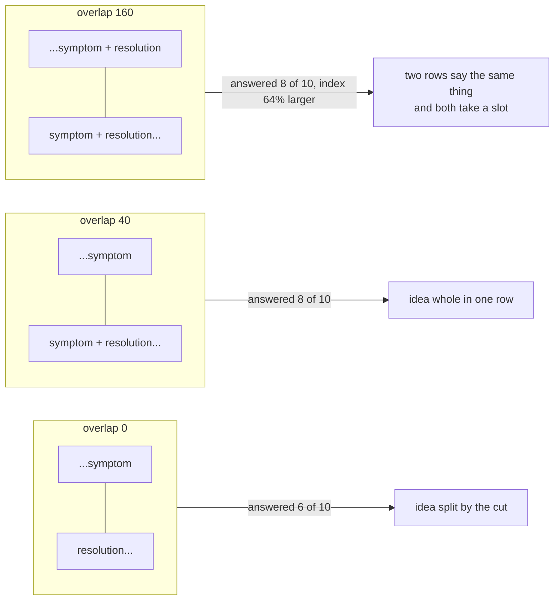

# 1.4 — The margin you pay for twice

## One-line answer

Overlap stores the text near every cut twice so that an idea straddling a boundary still exists whole
somewhere, and it is a purchase with a price tag: at a chunk size of one hundred and sixty
characters, an overlap of forty took answered@3 from **6 out of 10 to 8 out of 10** and made the index
**19% larger**.

## The story

You are papering the back wall of a room. The wall is wider than the roll, so it takes four strips.

The first strip goes up straight. You cut the second to the exact same width and hang it edge to edge
against the first, and from across the room you can see a hairline of bare plaster between them,
because the wall is not perfectly flat and the paper shrank a little as the paste dried. The pattern
does not meet either — a stem runs up the first strip and stops, and the leaf that belongs to it
starts on the second.

So on the third strip you do what the person in the shop told you to do. You cut it wider than it needs
to be and you hang it lapping over the second by a thumb's width. Now there is no gap. The stem and its
leaf are both on one piece of paper, and they meet.

You also used more paper. Four strips became five, and the roll that was going to be enough is not.
That is not a mistake in the method. That is what the method costs.

## The idea in plain language

**Overlap** is a number of characters that two neighbouring chunks share. With an overlap of sixty, a
chunk starts sixty characters before the previous one ended, so those sixty characters exist in the
index twice, in two different rows.

The reason to want it comes straight out of
[1.3](1.3-cut-too-small-to-mean-anything.md). A blind cut lands wherever the arithmetic puts it, which
means it lands in the middle of things: in the middle of a word, in the middle of a sentence, and — the
one that costs you an answer — between a symptom and its resolution. Overlap does not stop the cut
happening. It makes sure that whatever the cut separated is **also** present, whole, in the row on one
side of it.

The reason not to want it is that you are storing the same text more than once. That costs three
things:

1. **Index size.** More rows, and more characters inside them. Both grow.
2. **Query time.** Every row is scored against every question, so more rows is more arithmetic per
   question.
3. **Duplicate results.** Two adjacent rows both containing the same sentence can both score well on
   the same question, so two of your three results are the same text. That is the cost nobody predicts,
   and [3.2](../03-the-k-is-a-budget/3.2-where-the-curve-goes-flat.md) is where it shows up as wasted
   budget.

The trade is a real one and it does not have a universal answer. What it has is a measurement.

## Why Sutra needs it

Sutra's archive contains exactly the documents where this matters: four long documents, each of which
states a symptom in one place and its resolution in another, often several sentences apart. A cut that
lands between them is the failure
[2.3](../02-measuring-the-cut/2.3-the-cut-that-kept-the-ticket-and-lost-the-fix.md) puts on the table.

But Sutra also runs on a free tier where every retrieved character is context spent on every later turn
of the conversation ([3.1](../03-the-k-is-a-budget/3.1-k-is-a-budget-not-a-preference.md)), so paying
nineteen per cent more index for nothing is not a neutral act. The honest answer is that overlap is a
repair for a specific injury, and if you are not suffering that injury you should not be paying for the
repair. This part measures both sides so the day can decide, and
[2.2](../02-measuring-the-cut/2.2-one-table-seven-chunk-sizes.md) decides.

## The mechanism

Hold the chunk size fixed and move only the overlap:

```python
# days/day-50-chunking-and-top-k/lab/overlap.py
OVERLAPS = [0, 20, 40, 80, 160]


def main(argv: list[str]) -> int:
    size = int(argv[argv.index("--size") + 1]) if "--size" in argv else 160
    plain = sum(len(t) for t in DOCS.values())
    print(f"archive: {plain} characters, chunk size {size}\n")
    print("  overlap   rows   indexed chars   growth   hit@3   answered@3")
    for overlap in OVERLAPS:
        if overlap >= size:
            continue
        index = build_index(DOCS, size, overlap)
        print(
            f"  {overlap:>7}   {index.rows:>4}   {index.chars:>13}"
            f"   {index.chars / plain - 1:>6.0%}   {hit_at_k(index, GOLD, 3):>2}/10"
            f"   {answered_at_k(index, GOLD, 3):>7}/10"
        )
    return 0
```

**Line by line:**

- `OVERLAPS` sweeps from nothing to an overlap equal to the chunk size at the default size, so the
  reader can see the whole curve rather than one point. A single overlap value is an opinion; a column
  is a measurement.
- The default `size` is **one hundred and sixty**, not the size this day ships. That is deliberate: at
  nine hundred characters almost nothing straddles a cut and the whole column is flat, which
  demonstrates nothing. Overlap is a repair, so it has to be measured on a corpus that is injured.
- `if overlap >= size: continue` skips the rows that `chunk` would raise on
  ([1.1](1.1-the-unit-you-store-is-the-unit-you-find.md)). Skipping rather than catching keeps the
  table readable, and the guard in `chunk` is still the thing that would stop a caller who meant it.
- `plain` is the archive's real size in characters, computed once from `DOCS`, so the `growth` column
  compares against the text itself and not against some other index.
- `index.chars / plain - 1` formatted as `{:>6.0%}` gives growth as a percentage: `0%` when every
  character is stored once, `19%` when nineteen per cent more characters are stored than exist.
- `hit_at_k` and `answered_at_k` are printed together for the reason
  [1.3](1.3-cut-too-small-to-mean-anything.md) gave: the first one cannot see what overlap fixes.

Run it:

```bash
cd days/day-50-chunking-and-top-k/lab
uv run python overlap.py
uv run python overlap.py --size 280
```

**Line by line:**

- The first arm sweeps the overlap at a chunk size of one hundred and sixty, where
  [1.3](1.3-cut-too-small-to-mean-anything.md) showed the archive is being damaged by the cuts.
- The second arm repeats the sweep at two hundred and eighty, so you can watch the same repair applied
  to a less injured patient and see how much less it buys.

Measured on 2026-09-05:

```text
archive: 12716 characters, chunk size 160

  overlap   rows   indexed chars   growth   hit@3   answered@3
        0     97           12716       0%   10/10         6/10
       20    111           13662       7%   10/10         7/10
       40    137           15089      19%   10/10         8/10
       80    187           20872      64%   10/10         8/10
```

Three things in that table, in order of importance.

**The repair is real.** Answered@3 goes from six to eight. Two questions that could not be answered
from the retrieved text can now be answered, and the only thing that changed is that the text near each
boundary exists twice.

**The repair stops.** Between an overlap of forty and an overlap of eighty, answered@3 does not move —
it stays at eight — while the index grows from nineteen per cent larger to **sixty-four per cent
larger**. Doubling the overlap bought precisely nothing and charged three times as much for it. There
is a knee in this curve and it is between twenty and forty.

**The metric that cannot see any of it.** The `hit@3` column reads `10/10` on every single row. If
overlap had been evaluated on hit rate — which is the metric most retrieval tutorials reach for — the
honest conclusion would have been *"overlap does nothing, do not bother"*, and that conclusion would
have been wrong by two questions out of ten.

Now the same sweep at a larger chunk size:

```text
archive: 12716 characters, chunk size 280

  overlap   rows   indexed chars   growth   hit@3   answered@3
        0     75           12716       0%   10/10         9/10
       20     77           13098       3%   10/10         8/10
       40     80           13557       7%   10/10         8/10
       80     86           14880      17%   10/10         9/10
      160    137           20316      60%   10/10         9/10
```

At two hundred and eighty the answer is different, and it is the answer nobody expects: overlap buys
**nothing at all**, and at twenty and forty it makes things slightly **worse**. Answered@3 starts at
nine, drops to eight, and climbs back to nine for sixty per cent more index than it started with.

That dip is not a typo and it is not something to wave away. Two adjacent rows that share text are two
rows competing for the same slot in the top three. When both score well, one of your three results is a
near-duplicate of another, and the row that would have been third — the one carrying the other half of
the answer — is pushed out. Overlap does not only add insurance. It adds **crowding**, and crowding
costs you a result.

It is also, honestly, at the edge of what ten questions can measure. One question is one tenth of this
column, so a single row moving by one is exactly the resolution of the instrument.
[2.1](../02-measuring-the-cut/2.1-the-answer-key-you-write-before-you-tune.md) says what that means for
how far any of today's tables may be trusted. What survives the noise is the shape: at one hundred and
sixty the repair is worth two questions, and at two hundred and eighty there is no injury left to
repair.



## When it breaks

The break with an error text is the one from
[1.1](1.1-the-unit-you-store-is-the-unit-you-find.md), reached by tuning the overlap without looking
at the size:

```text
Traceback (most recent call last):
  File "<string>", line 3, in <module>
  File ".../days/day-50-chunking-and-top-k/lab/_index.py", line 60, in chunk
    raise ValueError(f"overlap {overlap} must be smaller than size {size}")
ValueError: overlap 60 must be smaller than size 40
```

The break with no error text is in the second sweep above. An overlap of forty at a chunk size of two
hundred and eighty stores seven per cent more text, scores identically on the metric everybody watches,
and answers **one fewer question**. There is no log line, no warning and no exception. The only reason
it is visible at all is that the second column exists.

The break that wastes the most is the last row of the same table. An overlap of one hundred and sixty
at a chunk size of two hundred and eighty stores **sixty per cent more text than the archive contains**
and lands on the same nine out of ten that an overlap of zero achieved for free.

And the break that only shows up when somebody reads the results is duplication. Retrieve at a chunk
size of one hundred and sixty with an overlap of eighty and two of your three rows will routinely
contain the same sentence — you have paid for three results and received two, and the transcript looks
completely normal.

## In production

**What a professional writes instead.** Overlap in a production splitter is expressed as a fraction of
the chunk size rather than an absolute character count, typically ten to twenty per cent, so it stays
sane when the size is retuned. More importantly, a professional prefers a **structural** repair to a
statistical one: if the splitter cuts on paragraph boundaries in the first place, most of what overlap
is insuring against never happens, and the overlap can be small or zero. Overlap is what you use when
you cannot see the structure of the document — scanned text, transcripts, minified content — and a
system that chooses it by default is paying insurance against an accident it could have avoided.

The other production move that removes the need for it entirely is **parent expansion**: retrieve
small, then widen. Store small chunks so that matching is sharp, and when a chunk wins, send the model
the chunk *plus its neighbours*, or the section it came from. That gets sharp matching and whole ideas
at the same time, and it is why production stores keep the parent ref and the character offsets beside
every chunk. Sutra does not build it — the ref format `ticket:4610#2` carries exactly the information
it would need, which is the point of choosing that format in
[1.1](1.1-the-unit-you-store-is-the-unit-you-find.md).

**What degrades at scale.** Storage and query cost both scale with the overlap, and neither scales
gently. At an overlap of eighty on a chunk size of one hundred and sixty the index is sixty-four per
cent larger, which on a real corpus is sixty-four per cent more vectors to store and to compare. On a
managed vector database that is a line on an invoice.

**The failure mode that only appears with real traffic.** Duplicate results. It does not appear in
tests because tests ask questions whose answers are in one place. It appears when a user asks something
broad, three near-identical rows come back, and the model's answer reads as though it is repeating
itself — because it is being handed the same sentence three times and has no way to know.

**The review comment a senior engineer leaves:** *"Overlap is set to a fixed sixty characters and the
chunk size is a constant somebody will change next quarter. Make it a fraction of the size and assert
the relationship at import time, and put the growth column in the sweep output permanently — this
config stores nineteen per cent more text than the corpus contains and I would like that number to be
in front of whoever changes it next."*

**The interview question:** *"Do you use chunk overlap, and how do you pick it?"* An honest answer:
*"I measure it, and on my corpus the answer changed with the chunk size, which is the part I would not
have guessed. At a chunk size of one hundred and sixty, an overlap of forty took answered@3 from six
out of ten to eight out of ten for nineteen per cent more index — clearly worth it. At two hundred and
eighty it bought nothing, and at an overlap of eighty it cost me an answer, because two overlapping
rows both scored well and crowded a third result out of the top three. So I treat overlap as a repair
for a splitter that cuts blind, not as a default. If I can cut on paragraph boundaries instead, or
widen a small chunk back out to its neighbours after it wins, I would rather do that and keep the
overlap at zero."*

## Check yourself

```bash
cd days/day-50-chunking-and-top-k/lab
uv run python overlap.py
uv run python overlap.py --size 280
```

Now run `uv run python overlap.py --size 900` and write down what happens to every column. Say why the
whole table went flat, using the phrase "how many documents are longer than nine hundred characters".

**Out loud, without scrolling up:** name the thing overlap buys and the two separate things it costs,
and say why the second sweep in this part came out differently from the first.

**Next:** [2.1 — The answer key you write before you tune](../02-measuring-the-cut/2.1-the-answer-key-you-write-before-you-tune.md).
