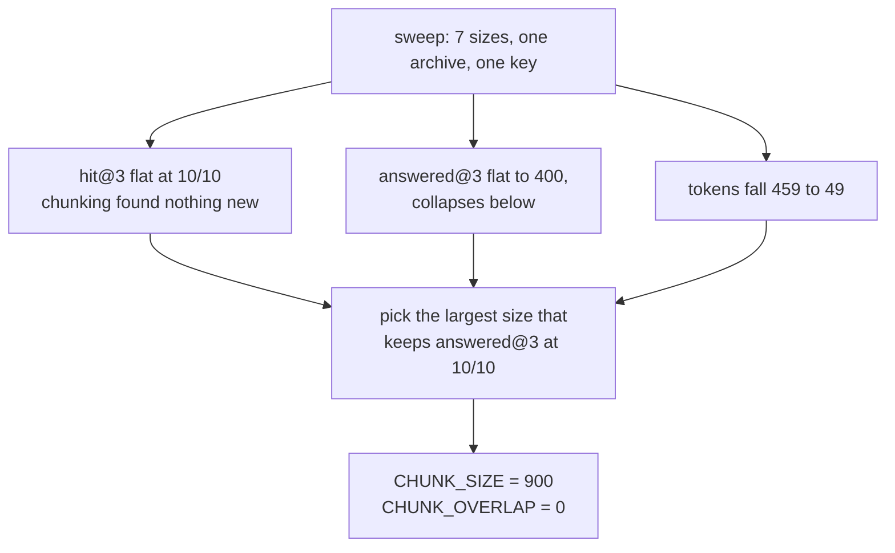

# 2.2 — One table, seven chunk sizes

## One-line answer

Swept across seven settings on the same archive and the same key, chunking bought Sutra **no extra
recall at all** and cut the retrieved context from **459 tokens to 279** for the same ten answers out of
ten — so the size that ships is **900 characters**, and it ships because a table said so and not
because it sounded reasonable.

## The story

A tailor is making up a jacket and you ask about the seam down the back.

He does not tell you what the right allowance is. He pins it one way, has you put the jacket on, and
walks round you. Then he unpins it, takes it in, and has you put it on again. Then once more, wider
than either. Three times on, three times off, and the third one is obviously wrong the moment you have
your arms in it, in a way that no amount of discussion beforehand would have settled.

He has done this for years. He could have picked a number. He does not pick a number, because the
number depends on the cloth and the shoulders in front of him, and trying it on takes less effort than
being right by argument.

## The idea in plain language

A **sweep** is the tailor's method written down: hold everything fixed except one setting, try every
value of that setting, and put the results in one table where they can be compared.

Sections [1.2](../01-the-unit-you-index/1.2-the-document-that-averages-itself-away.md) and
[1.3](../01-the-unit-you-index/1.3-cut-too-small-to-mean-anything.md) established the two walls. Large
chunks dilute, so scores get weak. Small chunks fragment, so the text you get back stops carrying the
answer. Both are true, both push the size in opposite directions, and neither one tells you where to
stand. Only a measurement over the whole range does that.

Four columns are needed to make the decision, and it is worth being clear about why each one is there:

- **rows** — how many entries the index has. It is the size of the thing you have to store and the
  amount of arithmetic every question costs.
- **hit@3** — the right document is somewhere in the top three. This is the metric the field usually
  reports.
- **answered@3** — the text of those three rows actually contains the answer. This is the metric that
  can see chunking bugs
  ([2.1](2.1-the-answer-key-you-write-before-you-tune.md)).
- **tokens at k=3** — what one question's retrieved context costs, in the unit Day 24 taught the
  project to count in. A **token** is roughly four and a half characters of English prose, measured
  against the provider's own tokenizer in Day 24's
  [1.1](../../../day-24-token-accounting-and-budgets/parts/01-what-a-request-costs/1.1-a-ticket-id-costs-five-tokens.md).

The fourth column is the one that turns a quality question into an engineering decision. Two settings
that answer equally well are not equivalent if one of them costs half as much, and on a free tier
where every retrieved character is re-sent on every later turn
([3.1](../03-the-k-is-a-budget/3.1-k-is-a-budget-not-a-preference.md)), half as much is the whole
argument.

## Why Sutra needs it

Because the chunk size is going into `sutra/retrieval.py` as a constant today, and Sutra's rule for a
constant is that it carries the measurement it came from in a comment beside it. A number without a
receipt is a guess that has been promoted, and six months later nobody can tell the difference between
a value that was measured and a value somebody liked the look of.

There is a second reason, and it is the harder one. The honest result of this sweep is that **chunking
did not improve Sutra's recall**. Ten out of ten before, ten out of ten after. A day that had decided
its conclusion in advance would not report that. This part reports it, and then shows what chunking did
buy, which is worth having and is not what the day set out to find.

## The mechanism

One script, one archive, one key, seven sizes:

```python
# days/day-50-chunking-and-top-k/lab/sweep.py
SIZES: list[int | None] = [None, 900, 600, 400, 280, 160, 80]


def chars_at_k(index, k: int) -> float:
    """Mean characters of retrieved text one gold question pays for at this `k`."""
    total = sum(
        sum(len(index.texts[ref]) for _, ref in search(index, query, k)) for query, _, _ in GOLD
    )
    return total / len(GOLD)
```

**Line by line:**

- `SIZES` begins with `None`, which is the control arm: the index exactly as Day 49 built it, one row
  per document. A sweep whose first row is not the thing you are already running cannot tell you
  whether to change.
- The sizes descend rather than ascend so the table reads from *least cut* to *most cut*, which is the
  direction the two failures arrive in.
- `chars_at_k` sums the length of every retrieved row across every gold question and divides by the
  number of questions, giving a mean per question. Mean rather than total, because the total is a
  property of the key's size and the mean is a property of the setting.
- It measures `index.texts[ref]` — the text that would actually be pasted into a prompt — and not the
  parent document. That is the real bill, and the difference between the two is precisely what
  chunking is for.
- The division by `CHARS_PER_TOKEN` happens at print time rather than here, so the character count
  stays available. Characters are what the archive is made of; tokens are what the provider charges
  for; keeping both means the table can be argued with.

Run both arms:

```bash
cd days/day-50-chunking-and-top-k/lab
uv run python sweep.py
uv run python sweep.py --overlap
```

**Line by line:**

- The first arm sweeps the size with **no overlap**, so exactly one thing varies.
- `--overlap` re-runs the whole sweep with an overlap of one fifth of the chunk size, which is the
  fraction [1.4](../01-the-unit-you-index/1.4-the-margin-you-pay-for-twice.md) landed on as a sensible
  default shape. Two arms rather than a second axis: a two-dimensional sweep printed as one table is a
  table nobody reads.
- Neither arm calls a model, touches the network, or reads anything outside `_archive.py`.

Measured on 2026-09-05:

```text
archive: 57 documents, 12716 characters
gold set: 10 queries; overlap: 0

  chunk size   rows   indexed   hit@3   answered@3   chars at k=3   tokens at k=3
   whole doc     57     12716   10/10        10/10           2090             459
         900     61     12716   10/10        10/10           1270             279
         600     65     12716   10/10         8/10            899             198
         400     69     12716   10/10         9/10            746             164
         280     75     12716   10/10         9/10            614             135
         160     97     12716   10/10         6/10            439              97
          80    187     12716    9/10         5/10            223              49
```

Read the `hit@3` column first, top to bottom: `10 10 10 10 10 10 9`. It is flat. **Chunking bought
Sutra nothing on the metric the field reports.** Six of the seven settings are indistinguishable, and
the seventh is worse. If this table had only that column, the correct action would be to change nothing
and go home.

Now read `answered@3`: `10 10 8 9 9 6 5`. It is not flat. It falls off, and it falls off fast below
about four hundred characters, exactly as
[1.3](../01-the-unit-you-index/1.3-cut-too-small-to-mean-anything.md) predicted — but note that it also
dips at six hundred and comes back at four hundred. Ten questions is ten questions
([2.1](2.1-the-answer-key-you-write-before-you-tune.md)); one row moving by one is the resolution of
the instrument, and the honest reading is *"flat down to four hundred, collapsing below"* rather than
*"four hundred beats six hundred"*.

Now read the last column, which is the one that decides. Whole documents cost **459 tokens** per
question. Nine hundred-character chunks cost **279**, for the same ten answers out of ten. That is
thirty-nine per cent of the retrieval bill removed with no measurable loss of anything.

That is the finding. Not *"chunking finds more"* — it did not. **Chunking finds the same thing and
sends less of it.**

The overlap arm confirms there is nothing more to win here:

```text
  chunk size   rows   indexed   hit@3   answered@3   chars at k=3   tokens at k=3
   whole doc     57     12716   10/10        10/10           2090             459
         900     63     13631   10/10        10/10           1259             277
         600     66     13796   10/10         9/10            965             212
         400     73     13923   10/10         9/10            784             172
         280     84     14086   10/10         8/10            588             129
         160    118     14456   10/10         7/10            442              97
          80    218     15236   10/10         6/10            229              50
```

At nine hundred, overlap changes the token bill by two and the answer count by zero, while storing
nine hundred and fifteen more characters than the archive contains. It earns its keep at one hundred
and sixty, where it takes answered@3 from six to seven, and one hundred and sixty is not a setting this
archive has any reason to use.

**So Sutra ships `CHUNK_SIZE = 900` and `CHUNK_OVERLAP = 0`**, and the comment beside each of them names
this run.

One more thing that has to be said out loud, because it is the difference between reading a table and
understanding one. Look at the `rows` column: fifty-seven documents became **sixty-one** rows at nine
hundred characters. Four extra rows. Fifty-two of the fifty-seven documents in this archive are shorter
than nine hundred characters and were not cut at all. The entire measured saving comes from the four
long documents, and what `CHUNK_SIZE = 900` really means on this corpus is *"leave the tickets alone
and cut the incident review into four"*.

That is not a weakness of the result. It is the result, stated properly, and it is what
[1.2](../01-the-unit-you-index/1.2-the-document-that-averages-itself-away.md) said would happen.



## When it breaks

The sweep breaks in the way every benchmark breaks: it answers exactly the question you asked it, and
people read it as answering a larger one.

**It is one corpus.** Nine hundred characters is right for an archive of short tickets and four long
documents. It says nothing about an archive of hundred-page contracts, where every document is longer
than the window and the interesting sweep runs from two hundred to two thousand.

**It is ten questions.** The dip at six hundred is one question. Reporting *"600 is worse than 400"*
from this table is over-reading it, and the way to stop yourself is to write the sample size next to
the percentage every single time.

**It is one retriever.** These numbers come from tf-idf over word counts. A sentence-embedding model
has a **native input length** — a number of tokens beyond which it truncates — and that number is a hard
constraint the arithmetic here knows nothing about. Chunk longer than the model's input length and the
tail of every chunk is silently dropped, which is a failure with no error message and no visible symptom
except worse answers. Day 49's local embedding lane over Ollama has exactly this property, and the
lookup is a `TODO(me)` in the build brief rather than a number invented here.

And the break with real output is the one that catches everybody: a sweep where nothing moves.

```text
  chunk size   rows   indexed   hit@3   answered@3   chars at k=3   tokens at k=3
   whole doc     57     12716   10/10        10/10           2090             459
         900     61     12716   10/10        10/10           1270             279
```

If your `rows` column does not grow as the size falls, the chunking is not happening — the documents
are all shorter than the window
([1.1](../01-the-unit-you-index/1.1-the-unit-you-store-is-the-unit-you-find.md)). Fifty-seven to
sixty-one is a small growth and it is real. Fifty-seven to fifty-seven would be a bug.

## In production

**What a professional writes instead.** They sweep on a schedule, not once. The corpus changes, the
question mix changes, and a constant chosen in September is a constant nobody has checked since
September. The production version of this file is a job that rebuilds the index at three or four
candidate sizes, scores the current gold set, and posts the table — and the constant in the code has
the date of the last sweep in its comment so that staleness is visible in a diff.

They also **do not sweep a single size**. The realistic production answer to this archive is a maximum
rather than a fixed size, cutting on paragraph boundaries, which leaves fifty-two documents untouched
and cuts four — the same outcome as `CHUNK_SIZE = 900` here, arrived at deliberately instead of as a
side effect of most documents being short.

**What degrades at scale.** The sweep itself. Rebuilding an index seven times is free on twelve
thousand characters and is a serious job on twelve million, especially when each build has to embed
every chunk with a model. That is the point at which teams stop sweeping, and it is exactly the point
at which they most need to: the production compromise is to sweep on a stratified sample of the corpus
and re-validate the winner on the whole thing.

**The failure mode that only appears with real traffic.** The gold set was written against yesterday's
archive. As documents are added, the chunk size that was right becomes wrong slowly, and nothing tells
you, because both metrics are computed against questions whose answers have not moved. The signal to
watch in production is not the sweep at all; it is the distribution of retrieval scores over live
traffic, which drifts down as the corpus grows and the index becomes crowded.

**The review comment a senior engineer leaves:** *"Good — and the headline is not what the title says.
Recall did not move. What moved was cost, by thirty-nine per cent, and that is the sentence that should
be in the commit message. Put the sample size next to every fraction, put the date of this run in the
comment on the constant, and please note in the code that fifty-two of the fifty-seven documents are
not being chunked at all, because the first person to add a corpus of long documents will assume this
number was chosen for them."*

**The interview question:** *"How did you choose your chunk size?"* An honest answer: *"By sweeping it
against a gold set and reading two columns instead of one. On my archive, hit@3 was flat at ten out of
ten across six of seven settings, so chunking bought me no recall at all. What it bought was cost: the
retrieved context for one question fell from four hundred and fifty-nine tokens to two hundred and
seventy-nine, thirty-nine per cent, with answered@3 still at ten out of ten. Below four hundred
characters answered@3 collapsed to six and then five while hit@3 stayed at ten, which is the fragmentation
wall. I ship nine hundred with zero overlap. The caveat I would give with it is that fifty-two of my
fifty-seven documents are shorter than nine hundred characters, so what that constant actually does on
my corpus is cut four long documents and leave everything else alone — and on a corpus of long documents
the sweep would land somewhere completely different."*

## Check yourself

```bash
cd days/day-50-chunking-and-top-k/lab
uv run python sweep.py
uv run python sweep.py --overlap
```

Now add `1200` and `2000` to `SIZES` in `sweep.py` and re-run. Say what happens to the `rows` column and
what that tells you about how many documents in this archive are longer than two thousand characters.

**Out loud, without scrolling up:** state which column decided the chunk size and which column did not
move at all, and say what `CHUNK_SIZE = 900` actually does to this particular archive.

**Next:** [2.3 — The cut that kept the ticket and lost the fix](2.3-the-cut-that-kept-the-ticket-and-lost-the-fix.md).
