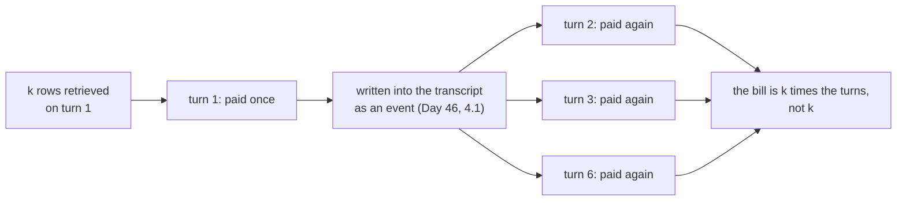

# 3.1 — k is a budget, not a preference

## One-line answer

`k` is the number of rows retrieval pastes into the prompt, and because a tool result is written into
the transcript and re-sent on every later turn, one lookup at `k=20` costs **8,539 tokens over a
six-turn conversation** where the same lookup at `k=2` costs **1,006** — so `k` is a line in a budget
and not a matter of taste.

## The story

You are at the check-in desk with a suitcase and a cabin bag and a paper bag of things that would not
fit in either.

There is a scale set into the floor and a number written on the ticket, and between them they end the
conversation. You had not thought of your luggage as a number until this moment; you had thought of it
as *the things you are taking*. Now it is twenty-three kilograms and you are at twenty-six, and the
paper bag has to be opened on the counter in front of a queue while you decide what actually matters.

The allowance was on the ticket the whole time. Nobody hid it. You simply never converted your
intentions into the unit the airline weighs in, and the desk does that conversion for you at the worst
possible moment.

## The idea in plain language

**k** — usually written `top_k` — is how many rows retrieval returns. Ask for three and you get the
three highest-scoring rows; ask for twenty and you get twenty.

Almost everyone treats it as a quality dial: more results, more chance the right one is in there. That
reading is not wrong, exactly. It is incomplete, in the same way that *"take more luggage"* is not wrong
until somebody weighs it.

Here is what k actually spends, and there are three separate costs stacked on top of each other:

1. **The rows themselves.** k rows of text pasted into the prompt. At Sutra's chunk size that is
   roughly ninety tokens per row.
2. **Every turn afterwards.** This is the one that does the damage, and Day 24's
   [1.2](../../../day-24-token-accounting-and-budgets/parts/01-what-a-request-costs/1.2-charged-again-every-turn.md)
   measured it: a conversation is re-sent in full on every turn, so anything written into the
   transcript on turn one is paid for again on turns two, three and four. Day 46's
   [4.1](../../../day-46-sessions-vs-memory/parts/04-the-choice/4.1-pricing-both-in-tokens.md) applied
   that specifically to memory: a `load_memory` result is a function-response event, it lives in the
   session, and it is re-sent for the life of the conversation. Retrieved chunks arrive through exactly
   that door.
3. **The window.** Tokens are not only a bill; they are room. A retrieval that fills a third of the
   context has taken that third away from the instruction, the skills, the tools and the conversation
   itself — Day 19's
   [1.1](../../../day-19-context-engineering-selection/parts/01-the-binder/1.1-room-is-not-free.md).

The unit matters too. Day 24's
[2.3](../../../day-24-token-accounting-and-budgets/parts/02-two-ceilings/2.3-denominated-in-quota-not-dollars.md)
established that Sutra's free tier rations **requests**, twenty per day, not tokens. So the token
column below is not a bill in currency. It is a measure of how much of a finite window each question
consumes, and of how quickly a conversation becomes too large to continue. Both of those bite long
before any invoice does.

## Why Sutra needs it

Day 46 ended its memory chapter on a specific admission. It priced two memory policies, found that
capping retrieval mattered more than choosing between them, and then said the cap fixes cost and buys
no correctness — *because you cannot take the top three of an unranked list*. Day 49 supplied the
ranking. The cap is now a real choice rather than an arbitrary slice, and choosing it is this section's
job.

`sutra/memory/service.py` already holds a `TOP_K` constant, chosen on Day 48 against a token budget and
nothing else, because there was no way to measure what a larger one would buy. After
[3.2](3.2-where-the-curve-goes-flat.md) there is. That is a `TODO(me)` in today's build brief: decide
which module owns the number, and make the other one import it rather than keep a second opinion.

## The mechanism

Price k the way Day 46 priced its policies: not per question, but over a conversation.

```python
# days/day-50-chunking-and-top-k/lab/price.py
CHUNK_SIZE = 900
KS = [1, 2, 3, 5, 10, 20]
FREE_TIER_REQUESTS_PER_DAY = 20


def mean_tokens(index, k: int) -> float:
    """Tokens of retrieved text one question pays for at this k."""
    chars = sum(
        sum(len(index.texts[ref]) for _, ref in search(index, query, k)) for query, _, _ in GOLD
    )
    return chars / len(GOLD) / CHARS_PER_TOKEN
```

**Line by line:**

- `CHUNK_SIZE = 900` is the size [2.2](../02-measuring-the-cut/2.2-one-table-seven-chunk-sizes.md)
  chose. Pricing k at a different chunk size would price a system nobody is running.
- `KS` includes `1` and `20` deliberately. The interesting part of a cost curve is its ends, and `20`
  is not a straw man — it is a number people really set when retrieval quality disappoints them.
- `mean_tokens` sums the length of every retrieved row over every gold question, then divides twice:
  once by the number of questions to get a mean, once by `CHARS_PER_TOKEN` to change units. Doing the
  unit conversion in one named place is the difference between a table you can check and a table you
  have to trust.
- `CHARS_PER_TOKEN` is `4.55`, measured in Day 24's
  [1.1](../../../day-24-token-accounting-and-budgets/parts/01-what-a-request-costs/1.1-a-ticket-id-costs-five-tokens.md)
  against the provider's own tokenizer. It is quoted, not re-derived: counting tokens for real is a
  network call, and this day's budget for network calls is zero.
- `FREE_TIER_REQUESTS_PER_DAY = 20` is here so the script can print the sentence that stops a reader
  misreading the table as money. It is read off a live 429 on Day 2 and recorded in `docs/PACKAGES.md`.

The multiplication that matters is one line:

```python
# days/day-50-chunking-and-top-k/lab/price.py
    for k in KS:
        once = mean_tokens(index, k)
        # Day 24 part 1.2: a tool result is an event, so it is re-sent on every later turn.
        resent = once * (turns - 1)
        print(f"  {k:>3}   {once:>11.0f}   {resent:>29.0f}   {once + resent:>5.0f}")
```

**Line by line:**

- `once` is the cost people quote when they talk about retrieval cost. It is the smaller half.
- `resent = once * (turns - 1)` is the cost nobody quotes. The retrieved rows are in the transcript
  after turn one, so a six-turn conversation sends them six times: once when they arrive and five times
  afterwards.
- `turns - 1` and not `turns`, because the first send is already counted in `once`. Off by one here
  would overstate the effect, and the effect does not need help.
- The comment names the day and part the multiplication comes from. A number in a script with no
  provenance is the thing this project spends most of its ritual preventing.

Run it:

```bash
cd days/day-50-chunking-and-top-k/lab
uv run python price.py
uv run python price.py --turns 10
```

**Line by line:**

- The default is six turns, which is a short desk conversation: a question, a clarification, an answer,
  a follow-up.
- `--turns 10` is a long one. It changes nothing about retrieval and multiplies the second column.
- Zero model calls in both arms. Every number is a character count divided by a constant.

Measured on 2026-09-05:

```text
index: 61 rows, chunk 900. Conversation: 6 turns,
one retrieval on turn 1, the result kept in the transcript afterwards.

    k   tokens once   re-sent over the conversation   total
    1            95                             474     569
    2           168                             839    1006
    3           279                            1396    1675
    5           415                            2076    2491
   10           739                            3696    4436
   20          1423                            7116    8539
```

Read the first column and k looks cheap. Twenty rows is one thousand four hundred and twenty-three
tokens — on a window measured in tens of thousands, that is nothing, and this is exactly the arithmetic
that leads people to set k to twenty and move on.

Read the last column and it is a different decision. **8,539 tokens against 1,006** — the same
conversation, the same question, the same archive, one constant changed from two to twenty. Eight and a
half times, and none of it appears on the turn where you set the number.

And at ten turns:

```text
index: 61 rows, chunk 900. Conversation: 10 turns,
one retrieval on turn 1, the result kept in the transcript afterwards.

    k   tokens once   re-sent over the conversation   total
    1            95                             853     948
    2           168                            1509    1677
    3           279                            2512    2792
    5           415                            3737    4152
   10           739                            6653    7393
   20          1423                           12809   14232

  Free tier is 20 requests per day, not a token bucket,
  so the token column is a context-window cost, not a bill (Day 24, part 2.3).
```

Fourteen thousand tokens, from one retrieval, on a question the archive answers in ninety-five.

The shape to carry away:



## When it breaks

The measurement breaks in one specific way, and it is worth naming because it makes the numbers above
**optimistic**.

`price.py` assumes **one** retrieval per conversation. A real desk conversation retrieves more than
once: the agent asks a follow-up, the model decides to look again, and a second result joins the first
in the transcript. Day 46's
[4.1](../../../day-46-sessions-vs-memory/parts/04-the-choice/4.1-pricing-both-in-tokens.md) measured
exactly that shape and found five lookups in ten turns costing 7,927 tokens where one lookup cost
3,130. Stack that on top of this table and `k=20` with three lookups in a ten-turn conversation is
comfortably past forty thousand tokens of retrieved text.

The system breaks in a way that has real error text, and Day 24's
[2.2](../../../day-24-token-accounting-and-budgets/parts/02-two-ceilings/2.2-reading-the-ceiling-off-a-refusal.md)
taught you to read it:

```text
429 RESOURCE_EXHAUSTED. {'error': {'code': 429, 'message': '... Quota exceeded for metric: generativelanguage.googleapis.com/generate_content_free_tier_requests, limit: 20, model: gemini-3.7-flash\nPlease retry in 26.45714483s.', 'status': 'RESOURCE_EXHAUSTED'}}
```

Note what that message rations: `generate_content_free_tier_requests`, `limit: 20`. **Requests, not
tokens.** So a large k does not produce this error directly, and that is precisely why it is dangerous
— the cost of a large k does not show up as a refusal you can read. It shows up as a context window
filling, a conversation that has to be restarted sooner, and answers that get worse for reasons
[3.3](3.3-twenty-rows-and-nothing-new-in-nineteen.md) is about.

## In production

**What a professional writes instead.** k is not a constant in a production retriever; it is a
**budget** in tokens, converted to a row count at request time. The code asks for rows until the
accumulated character count reaches the budget, then stops — because rows are not all the same size,
and a fixed k over variable-length chunks gives you a variable bill. The budget itself is a fraction of
the window agreed once, the way Day 19's
[6.2](../../../day-19-context-engineering-selection/parts/06-in-production/6.2-a-budget-per-organ.md)
allocated a budget per organ of the prompt.

**What degrades at scale.** Chunk length variance. This archive's rows are close to uniform, so k and
tokens move together neatly. On a real corpus one row can be a heading and the next a wall of pasted
logs, and `k=3` costs anywhere between fifty and two thousand tokens depending on which three you got.
The mean in the table above is then a number that describes no actual request.

**The failure mode that only appears with real traffic.** Long conversations. Every number in this part
is multiplied by turns, and the turn count in production has a long tail — most conversations are
short, and the ones that matter are the ones where somebody is stuck and keeps going. Those are exactly
the conversations that fill the window and start dropping the earliest and most important context, and
they are the conversations your averages will not show you.

**The review comment a senior engineer leaves:** *"`TOP_K = 3` with no unit next to it is a preference.
Make it a token budget, convert to rows at call time, and log the realised token count per retrieval so
we can see the distribution rather than the mean. Also, `sutra/memory/service.py` has its own `TOP_K`
and now so does `sutra/retrieval.py` — pick one owner before they drift."*

**The interview question:** *"How do you choose top-k?"* An honest answer: *"I price it over a
conversation rather than over a request, because the retrieved rows go into the transcript and get
re-sent on every later turn. On my archive, one retrieval at k equals two costs about a hundred and
seventy tokens once and a thousand over a six-turn conversation; the same retrieval at k equals twenty
costs fourteen hundred once and eight and a half thousand over the same conversation. Eight and a half
times, from one constant. In production I would not ship k as a count at all — I would ship a token
budget and fill it, because chunk lengths vary and a fixed k gives you a variable bill. And I would say
plainly that on a free tier the binding limit is requests per day, not tokens, so the cost of a big k
shows up as a full context window rather than as an error you can read."*

## Check yourself

```bash
cd days/day-50-chunking-and-top-k/lab
uv run python price.py
uv run python price.py --turns 10
```

Now edit `price.py` so that `resent` uses `turns` instead of `turns - 1`, re-run, and say by how much
the `k=20` total moves and why that version overstates the cost.

**Out loud, without scrolling up:** say what the second column of that table is, and name the earlier
part that established why a retrieval result is charged more than once.

**Next:** [3.2 — Where the curve goes flat](3.2-where-the-curve-goes-flat.md).
