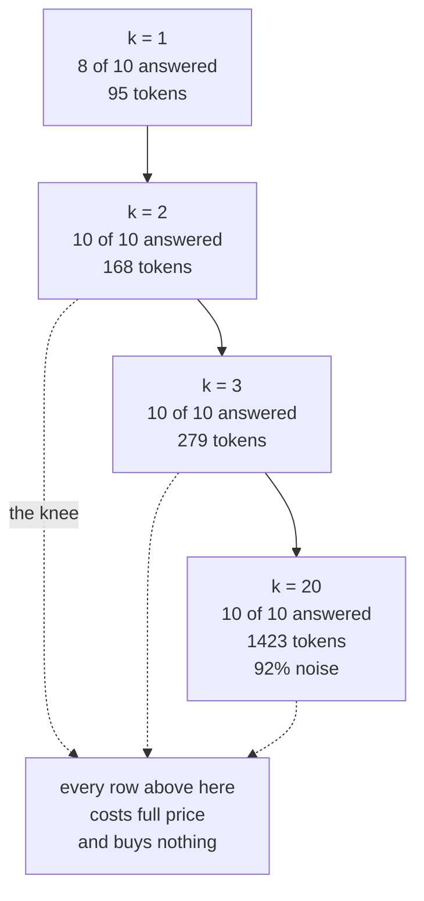

# 3.2 — Where the curve goes flat

## One-line answer

On Sutra's archive the answer rate reaches its maximum at **k = 2** and never improves again, so every
row above two is pure cost — at `k = 20` the retrieval is **92% noise** and answers exactly the same
ten questions out of ten that two rows answered.

## The story

It is a cold night and you fetch a blanket.

It helps immediately, so you fetch a second one, and that helps too. You add a third and you are warm.
You add a fourth because the logic that got you here has not stopped, and now you are lying under a
weight that presses on your chest, and you are exactly as warm as you were with three.

The fourth blanket is not doing nothing. It is doing something you did not want.

Nobody tells you where to stop. There is no line printed on the blankets. You find the number by
noticing that the last one you added did not make any difference, and the only way to notice is to have
paid attention when you added it.

## The idea in plain language

Retrieval quality against k is a **curve with a knee**. It rises steeply, then it flattens, and past
the flattening every additional row costs the full price of a row and buys nothing.

The rising part is easy to understand: the answer might be ranked second, so asking for two rows
instead of one catches it. The flat part is the part that gets ignored, and it is where almost every
deployed system sits.

Three columns say where the knee is:

- **answered@k** — how many gold questions get back text containing the answer
  ([2.1](../02-measuring-the-cut/2.1-the-answer-key-you-write-before-you-tune.md)). This is the column
  that plateaus.
- **useful rows** — of the k rows returned, how many came from the document the answer key names. It
  measures whether the extra rows are *anything*.
- **noise** — one minus useful rows divided by k. The fraction of what you sent that nobody needed.

The third column is worth dwelling on because it behaves in a way people find counter-intuitive. Noise
does not stay flat as k grows. It **rises**, and it rises fast, because the number of genuinely relevant
rows in an archive is a property of the archive — usually one or two — while k is a number you chose.
Ask for twenty rows from an archive that contains one relevant one and nineteen twentieths of what you
send is, by construction, irrelevant.

That is not a retrieval failure. There is no better set of twenty. Twenty was the wrong question to ask.

## Why Sutra needs it

`TOP_K` is going into `sutra/retrieval.py` today, and Sutra's rule is that a constant carries the
measurement it came from. This part is that measurement.

It also settles the sentence Day 46 left open. Day 46's
[4.1](../../../day-46-sessions-vs-memory/parts/04-the-choice/4.1-pricing-both-in-tokens.md) found that
capping retrieval mattered more than the choice of memory policy — a factor of six against a factor of
two — and then admitted the cap was a guess, because *"you cannot take the top three of an unranked
list"*. Day 49 ranked the list. So the cap can now be chosen the way a cap should be chosen: by finding
where more stops helping.

The answer turns out to be smaller than the number Sutra has been carrying, which is the useful kind of
surprise.

## The mechanism

Hold the index fixed at the chunk size
[2.2](../02-measuring-the-cut/2.2-one-table-seven-chunk-sizes.md) chose, and sweep k:

```python
# days/day-50-chunking-and-top-k/lab/curve.py
CHUNK_SIZE = 900
CHUNK_OVERLAP = 0
KS = [1, 2, 3, 4, 5, 8, 10, 20]


def useful_rows(index, k: int) -> tuple[float, float]:
    """Mean useful rows per question, and the mean position of the first answer-bearing row."""
    useful = 0
    positions = []
    for query, want, answer in GOLD:
        found = search(index, query, k)
        useful += sum(1 for _, ref in found if parent(ref) == want)
        for position, (_, ref) in enumerate(found, start=1):
            if answer in index.texts[ref]:
                positions.append(position)
                break
    return useful / len(GOLD), (sum(positions) / len(positions) if positions else 0.0)
```

**Line by line:**

- `KS` is dense at the bottom — one, two, three, four, five — and sparse at the top. The knee is at the
  bottom, so that is where the resolution is needed; nobody needs to know what happens between eleven
  and twelve.
- `useful` counts rows whose `parent` is the document the key names, so a chunk counts for its
  document. It is a count and not a boolean: at k equals twenty, several rows can come from the right
  document, and knowing that is how you tell *"the extra rows are duplicates of the answer"* from
  *"the extra rows are unrelated"*.
- `positions` records where the **first answer-bearing row** sits in the returned list, and `break`
  stops at the first one. That number is [3.3](3.3-twenty-rows-and-nothing-new-in-nineteen.md)'s
  subject and it is collected here because it costs nothing to collect while the loop is already
  running.
- `enumerate(found, start=1)` counts ranks from one rather than zero. A rank is something a human
  reads, and rank zero is not a thing anybody says.
- The `if positions else 0.0` guard exists because at a high similarity floor the list can be empty for
  every question, and a mean over an empty list raises. Section 4 runs exactly that configuration.

Run it:

```bash
cd days/day-50-chunking-and-top-k/lab
uv run python curve.py
```

**Line by line:**

- One arm, because there is one thing to vary and it is already the rows of the table.
- The index is built once, outside the loop over k, so every row of the table is the same index — which
  is the definition of a controlled sweep.
- No model, no network.

Measured on 2026-09-05:

```text
index: 61 rows at chunk size 900, overlap 0
gold set: 10 queries

    k   hit@k   answered@k   chars   tokens   useful rows   noise   answer at rank
    1    8/10         8/10     431       95           0.8     20%             1.0
    2   10/10        10/10     763      168           1.1     45%             1.2
    3   10/10        10/10    1270      279           1.2     60%             1.2
    4   10/10        10/10    1689      371           1.2     70%             1.2
    5   10/10        10/10    1889      415           1.2     76%             1.2
    8   10/10        10/10    2857      628           1.3     84%             1.2
   10   10/10        10/10    3364      739           1.4     86%             1.2
   20   10/10        10/10    6476     1423           1.5     92%             1.2
```

**The knee is at two.** Going from one row to two takes both quality columns from eight out of ten to
ten out of ten. Going from two to twenty takes them from ten out of ten to ten out of ten.

That is the whole finding, and it should be uncomfortable, because three is the number almost everybody
uses and Sutra has been carrying three since Day 46. Three is not wrong here — it costs a hundred and
eleven more tokens per question than two and it buys a margin of safety against a gold set that only
has ten questions in it. But it is not measured, and two is.

Now read `useful rows`, which is where the honest picture is. At k equals two it is `1.1`: on average,
one and a bit of the two rows returned came from the right document. At k equals twenty it is `1.5`. In
other words, going from two rows to twenty found **four tenths of one extra relevant row per question**,
on average, and shipped eighteen more rows to get it.

And `noise` says the same thing from the other end: **20% at k equals one, 92% at k equals twenty**. At
twenty, more than nine tenths of the text you paste into the prompt is text nobody needed. It is not
wrong text — it is the twentieth-best match in an archive of sixty-one rows, which is to say it is
whatever happened to share a word or two.

Set that beside [3.1](3.1-k-is-a-budget-not-a-preference.md)'s conversation arithmetic and the decision
makes itself. Going from two to twenty costs an extra seven and a half thousand tokens over a six-turn
conversation, and buys nothing that this key can detect.



**So Sutra ships `TOP_K = 2`**, with the comment beside it naming this run — and with the honest note
that a ten-question key cannot distinguish two from three, so the choice between them was made on cost.

## When it breaks

The curve is a property of **this archive and this key**, and it breaks in three directions.

**A bigger, denser archive moves the knee up.** Here, most questions have exactly one document that
answers them. In an archive with genuine near-duplicates — four tickets describing the same fault, three
versions of the same runbook — the useful rows column would keep climbing and the knee would be further
right. If your `useful rows` column is still rising at your chosen k, you have cut too early.

**A weaker retriever moves the knee up too**, and this is the trap. When retrieval is poor, the answer
is often at rank five, so a large k rescues it, and the large k *looks* like the fix. It is a bandage on
an indexing problem, paid for on every request forever. The tell is `answered@1`: at eight out of ten
here, ranking is working, and there is nothing for a big k to rescue.

**A ten-question key cannot see small differences.** The plateau from two to twenty is flat because the
key has ten questions and all ten are answered. A key of two hundred questions would show a slow rise
across that range, and the knee would be a curve rather than a corner. Everything above should be read
as *"the shape is a knee near two"* and not as *"two is optimal"*.

There is also a break with real output, and it is the one that makes k look free. This is the header
and the last row of the table above, lifted out of it:

```text
    k   hit@k   answered@k   chars   tokens   useful rows   noise   answer at rank
   20   10/10        10/10    6476     1423           1.5     92%             1.2
```

Every quality column on that row is perfect. A dashboard built on hit rate and answer rate reports k
equals twenty as the best configuration available, tied with five other configurations, and a tie is
usually broken by whichever number somebody typed first. The two columns that make it a bad row are
`noise` and `tokens`, and neither of them is a quality metric, which is why neither is usually on the
dashboard.

## In production

**What a professional writes instead.** They do not ship a scalar k at all. Two patterns are standard,
and both come straight out of this table:

- **A score gap cut-off.** Take the top row, then keep taking rows while the score is within some
  fraction of the top score, up to a maximum. It adapts: a question with one obvious answer returns one
  row, a question with three near-equal candidates returns three, and neither case is padded to a fixed
  number.
- **A token budget**, as [3.1](3.1-k-is-a-budget-not-a-preference.md)'s production section described.
  Fill until the budget is spent.

Both are k with the constant taken out, and both need the same thing this part produced: a measurement
saying where more stops helping, so the maximum is a number with a reason.

**What degrades at scale.** The `noise` column. It is a function of k over the number of genuinely
relevant rows, and the numerator is yours while the denominator belongs to the corpus. As the archive
grows, the number of relevant rows per question does not grow with it — most questions still have one
answer — so a fixed k that was 60% noise at sixty-one rows is 60% noise at sixty thousand, except that
now the nineteen irrelevant rows are much better at looking relevant, because with more documents there
is always something that shares more words.

**The failure mode that only appears with real traffic.** k gets raised in an incident and never
lowered. Somebody reports a missed answer, the on-call fix is `TOP_K = 10`, it works, and the constant
stays. There is no alert for *"we are now sending seven hundred and thirty-nine tokens per question
where two hundred would do"*, because nothing is broken. The cost is permanent and invisible, and the
only defence is the comment beside the constant naming the run it came from, so the next person can see
that the current value is not that one.

**The review comment a senior engineer leaves:** *"The knee is at two and you shipped two — good — but
the key has ten questions and every one of them is answered from a single document, so this curve cannot
distinguish two from three and the write-up should say so. Log `useful rows` and `noise` per retrieval
in production. If noise sits above ninety per cent for a week, that is not a tuning issue, it is a
signal that half these questions are not similarity searches at all."*

**The interview question:** *"How do you know your top-k is right?"* An honest answer: *"I sweep it
against a gold set and I look for the plateau, not for the maximum. On my archive the answer rate went
from eight out of ten at k equals one to ten out of ten at k equals two, and then stayed at ten out of
ten all the way to twenty. So everything above two was cost with no return: at twenty, ninety-two per
cent of the rows I was sending came from documents the key does not name, and one lookup cost eight and
a half thousand tokens over a six-turn conversation against a thousand at k equals two. The caveat is
that my key has ten questions, so it cannot tell two from three — I chose two on cost. In production I
would not ship a scalar at all; I would keep rows while the score is within a fraction of the top score,
up to a maximum, so a question with one obvious answer stops at one."*

## Check yourself

```bash
cd days/day-50-chunking-and-top-k/lab
uv run python curve.py
```

Now change `CHUNK_SIZE` in `curve.py` from `900` to `280` and re-run. Say what happens to the
`answered@k` column at small k, and what that tells you about where the knee moves when the rows get
smaller.

**Out loud, without scrolling up:** say what the `noise` column measures, and explain why it rises with
k even when retrieval is working perfectly.

**Next:** [3.3 — Twenty rows, and nothing new in nineteen](3.3-twenty-rows-and-nothing-new-in-nineteen.md).
