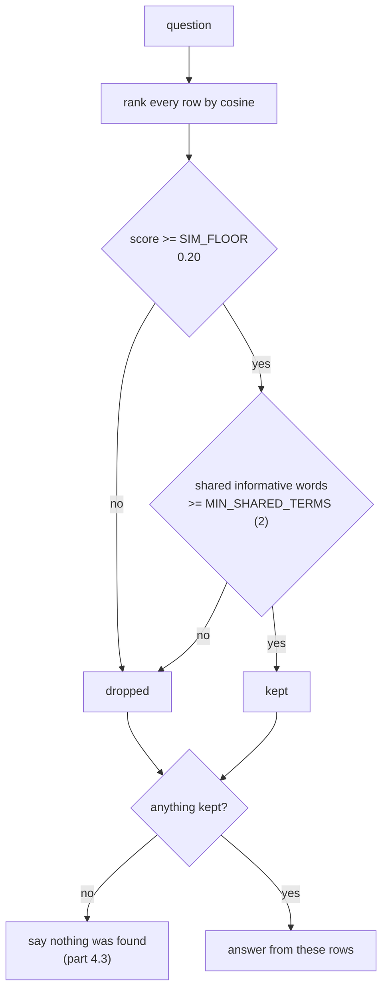

# 4.2 — There is no floor that separates them

## One-line answer

The worst real answer scores **0.180** and the best piece of nonsense scores **0.388**, so the two
distributions overlap and **no similarity floor exists** that keeps every real answer and rejects every
impostor — the working rule needs a second condition, and `SIM_FLOOR = 0.20` with
`MIN_SHARED_TERMS = 2` keeps nine of ten real answers, all three short questions, and lets **none** of
the four impostors through.

## The story

The kitchen scale reads `0.4` with nothing on it.

It has done this for a while. You know it does it, and you have absorbed the correction without ever
saying it out loud: nothing under about half a kilo means anything on this scale, so when you are
weighing four hundred grams of something you use the measuring jug instead.

Then you buy saffron. Half a gram, in a tiny paper twist, and the scale says `0.4`. It said `0.4`
before you put it on. It says `0.4` with the saffron on it.

The correction that worked for months is not a bad correction. It is a correction that assumed
everything you would ever weigh sits above the noise, and the moment something real is smaller than the
noise, no setting of that dial can tell you which is which.

## The idea in plain language

A **similarity floor** — sometimes a threshold, sometimes a cut-off — is a number below which retrieval
returns nothing. It is the obvious repair for
[4.1](4.1-cosine-never-says-it-does-not-know.md): if a wrong answer scores low, refuse anything low.

The repair works only if there is a number with all the right answers above it and all the wrong ones
below. So the honest way to choose a floor is not to pick a round number that feels safe. It is to
measure **two distributions** and look at the gap between them:

- the scores of rows that genuinely carry the answer — the low end of this set is what a floor may not
  cut into;
- the scores that unanswerable questions achieve anyway — the high end of this set is what a floor has
  to clear.

If the lowest real score is above the highest fake score, there is a gap and any number in it works. If
they overlap, **there is no such number**, and the honest thing to do is say so and go and find a second
signal rather than pick a floor and pretend.

This archive overlaps. That is the finding, and it is more useful than a tidy threshold would have been,
because overlapping is the normal case and the tidy version is what tutorials show.

## Why Sutra needs it

`SIM_FLOOR` is going into `sutra/retrieval.py` today and it has to carry the run it came from. More than
that: [4.3](4.3-nothing-is-an-answer.md) is about the desk saying *"nobody has written this up"*, and
that sentence is only safe if the rule that produces it almost never fires on a question the archive
could have answered. A floor that silently swallows real answers is a worse failure than the one it was
introduced to fix, because a wrong answer is at least visible.

It also settles something Day 46's memory work left as an assumption. Day 46's
[4.2](../../../day-46-sessions-vs-memory/parts/04-the-choice/4.2-sutras-memory-policy.md) made *"a miss
is reported, not interpreted"* a rule of the desk. A rule needs a mechanism, and this is where the
mechanism gets measured.

## The mechanism

First, look at the two distributions side by side.

```python
# days/day-50-chunking-and-top-k/lab/floor.py
    real: list[float] = []
    for query, want, answer in GOLD:
        found = search(index, query, TOP_K, floor)
        best = next((s for s, ref in found if answer in index.texts[ref]), None)
        if best is None:
            print(f"    {'-':>6}   {query[:56]}   (not answered at k={TOP_K})")
            continue
        real.append(best)
        print(f"    {best:>6.3f}   {query[:56]}")
```

**Line by line:**

- `best` is the score of the row that **carries the answer**, found with `next(... , None)` over the
  returned rows. Not the top score — the top row is often a near-miss, and a floor that only has to clear
  the top score would be tuned against the wrong number.
- `next(generator, None)` returns `None` when no returned row contains the answer, and that case is
  printed rather than skipped. A question the retriever cannot answer at this k is data, and dropping it
  would flatter the distribution.
- `real.append(best)` collects only the genuine hits, so `min(real)` at the end is *the lowest score a
  correct answer achieved* — the exact number a floor must not exceed.
- The `floor` parameter is threaded through `search` rather than filtering afterwards, so this script
  measures the same code path that production would use.

Run it:

```bash
cd days/day-50-chunking-and-top-k/lab
uv run python floor.py
```

**Line by line:**

- One arm, no floor, so the raw distributions are visible before anything is cut.
- The script prints the answerable questions, then the unanswerable ones, then the three numbers that
  matter: the worst real answer, the best fake one, and the gap between them.

Measured on 2026-09-05:

```text
index: 61 rows, chunk 900, k=3, floor=0.00

  answerable questions - the score of the row that carried the answer
     0.380   customer bounced back to the sign-in page during single 
     0.318   the reset link is already used up before the person clic
     0.180   spreadsheet import breaks because the header keeps movin
     0.236   why would a browser throw away a cookie after a redirect
     0.259   rollback did not change the failure rate
     0.303   the first customer message described it wrongly as a slo
     0.330   download of a big project only contains the header row
     0.543   automation cannot tell how long to wait after being thro
     0.387   a visitor account could see something private
     0.366   reminders arrive in the middle of the night

  questions this archive cannot answer - what comes back anyway
     0.246   how do I claim travel expenses for a client visit   -> ticket:4612
     0.388   the office printer jams on thick paper   -> ticket:4610
     0.239   what is the notice period for resigning   -> ticket:4593
     0.138   which meeting room has the projector   -> ticket:4633

  worst real answer : 0.180
  best nothing hit  : 0.388
  the gap           : -0.209
```

**The gap is negative.** Read that line again, because everything else in this part follows from it. The
best score achieved by a question this archive knows nothing about is **higher** than the score of nine
of the ten real answers. The distributions do not merely touch; they are interleaved.

So a floor forces a trade, and the trade can be measured rather than argued about:

```python
# days/day-50-chunking-and-top-k/lab/nothing.py
def kept(index, query: str, answer: str, floor: float, minimum: int) -> bool:
    """Does the surviving top-k still contain the answer under this floor and this term rule?"""
    return any(
        answer in index.texts[ref]
        for _, ref in search(index, query, TOP_K, floor)
        if shared_informative(index, query, ref) >= minimum
    )
```

**Line by line:**

- Two conditions, applied in sequence: `search(..., floor)` drops rows below the score floor, and the
  `if` drops rows that do not share enough **informative** words with the question.
- `shared_informative` counts the question's rare words that actually appear in the row. Its definition
  lives in `_index.py`, and the word "informative" means a word whose idf is at least `2.0` — rare enough
  that its presence means something. `the` and `on` are not informative;
  [4.1](4.1-cosine-never-says-it-does-not-know.md) showed exactly what happens when a score is built
  entirely out of words like those.
- The second condition uses information the ranking **threw away**. Cosine collapses everything into one
  number; the count of shared meaningful words is a different view of the same match, which is precisely
  why it can catch what the score cannot.
- `any(...)` over the survivors, so a question counts as kept when at least one surviving row carries the
  answer.

Now sweep both conditions:

```bash
cd days/day-50-chunking-and-top-k/lab
uv run python nothing.py
```

**Line by line:**

- The script sweeps five floors against three minimum-shared-term settings, and scores three separate
  populations: the ten long gold questions, three **short** questions a real agent types, and the four
  unanswerable ones.
- The short questions are the honesty check. A rule tuned on ten-word paraphrases will happily refuse to
  answer `logged out`, and a table without that column would recommend exactly such a rule.

Measured on 2026-09-05:

```text
index: 61 rows, chunk 900, k=3

  floor   min terms   long answers kept   short answers kept   nothing answered
   0.00           1                10/10                  3/3                 3/4
   0.00           2                10/10                  3/3                 1/4
   0.00           3                10/10                  0/3                 0/4
   0.10           1                10/10                  3/3                 3/4
   0.10           2                10/10                  3/3                 1/4
   0.10           3                10/10                  0/3                 0/4
   0.15           1                10/10                  3/3                 2/4
   0.15           2                10/10                  3/3                 1/4
   0.15           3                10/10                  0/3                 0/4
   0.20           1                 9/10                  3/3                 2/4
   0.20           2                 9/10                  3/3                 0/4
   0.20           3                 9/10                  0/3                 0/4
   0.25           1                 8/10                  2/3                 0/4
   0.25           2                 8/10                  2/3                 0/4
   0.25           3                 8/10                  0/3                 0/4
```

Four readings, in order.

**A floor alone cannot do it.** Read the `min terms = 1` rows, which is effectively "score floor only".
At `0.15` you keep all ten real answers and still answer two of the four impostors. Push to `0.25` and
you reject all four impostors and have lost two real answers and one short question. There is no row in
that group that reaches ten and zero. That is the negative gap, showing up as a trade.

**One extra condition changes the shape of the problem.** At `min terms = 2`, the floor `0.20` gives
**nine of ten long answers, three of three short answers, and none of the four impostors**. The second
signal did what raising the floor could not, because it is not the same measurement made stricter — it
is a different measurement.

**More is not better.** `min terms = 3` rejects every impostor at any floor, and it also rejects **all
three short questions**. `card declined` has two informative words in it. Demanding three is demanding
that every user write a sentence, and the ten-word paraphrases in the gold set — written by the person
tuning the knob — happily comply while a real agent typing two words does not
([2.1](../02-measuring-the-cut/2.1-the-answer-key-you-write-before-you-tune.md) warned about exactly this
shape of key).

**The cost is named, not hidden.** `SIM_FLOOR = 0.20` loses one real answer: the export-columns question,
whose answer row scores `0.180`. That is a deliberate trade and it goes in the comment beside the
constant. Sutra takes it because of Principle 10 and because of what the desk is for — a miss produces
*"nobody has written this up"*, which is honest and visible, while a false hit produces a confident
paragraph about the wrong ticket, which is neither.

**So Sutra ships `SIM_FLOOR = 0.20` and `MIN_SHARED_TERMS = 2`.**



## When it breaks

**The numbers are not portable.** A cosine score depends on the whole index — how many rows contain each
word ([1.2](../01-the-unit-you-index/1.2-the-document-that-averages-itself-away.md)) — so `0.20` is a
statement about this archive at this chunk size on this day. Re-chunk and it is wrong. Add five hundred
tickets and it is wrong. Switch from tf-idf to an embedding model and it is not merely wrong, it is
meaningless: embedding cosines for unrelated text typically sit in a completely different range, and a
floor of `0.20` there may reject nothing at all.

That break has a shape you can watch for:

```text
  worst real answer : 0.180
  best nothing hit  : 0.388
  the gap           : -0.209
```

Re-run `floor.py` after any change to the index and read those three lines. If the gap moves, the
constants are stale. That is a two-line eval, and it is the reason `floor.py` prints them rather than
just printing the table.

**The rule punishes short questions**, and the sweep shows exactly how much. `min terms = 3` costs three
out of three. Even at two, a genuinely one-word question — `logout` — has one informative term and will
be refused. The production answer is not to lower the rule; it is to expand the question before searching
it, which is what a query-rewriting step does, and Sutra does not have one.

**And the rule can be fooled.** Ask *"how long does a customer have to ask for a refund"* and three
informative words — `how`, `long`, `wait`-adjacent vocabulary — match a ticket about rate limits, so the
rule lets it through with a score of `0.266`. It is not an impostor by the crude test and it is completely
useless as an answer, because the question was never a similarity search in the first place. That is
[5.1](../05-the-wrong-tool/5.1-when-the-answer-is-a-rule.md), and no floor anywhere fixes it.

## In production

**What a professional writes instead.** They do not hard-code an absolute score. Three standard patterns,
all of which survive re-indexing better than a constant:

- **A percentile floor**, computed from the score distribution of recent live queries rather than fixed —
  reject anything in the bottom band of what this index normally returns.
- **A relative gap**, keeping rows within a fraction of the top score, which measures whether the ranking
  discriminated rather than whether the number was big.
- **A calibrated threshold**, chosen against a labelled set exactly like the sweep above, re-run
  automatically whenever the index is rebuilt, with the constants written by the job rather than by a
  person.

All three still need what this part produced: two labelled populations, one of which is questions with no
answer.

**What degrades at scale.** The impostor scores rise. In a bigger archive there is always something that
shares three informative words with any question, so both conditions weaken together, and a rule
calibrated at sixty-one rows will pass nonsense at sixty thousand. The signal to watch is the *rate* of
refusals: if the desk used to say "nothing found" for one question in twenty and now says it for one in
two hundred, the archive did not get better, the floor got easier.

**The failure mode that only appears with real traffic.** Silent misses. A false hit is visible — somebody
reads a wrong ticket and complains. A refusal on a question the archive *could* have answered produces
nothing to complain about, because the user does not know the answer existed. The only way to see it is to
log refused queries and read them, which is a job somebody has to actually be assigned.

**The review comment a senior engineer leaves:** *"The negative gap is the headline and it should be in
the module docstring, not just in the day notes — the next person will assume a threshold separates these
populations because that is what every tutorial shows. Log every refusal with the query and the top score
so we can review what we are turning away, and put the re-run of `floor.py` in the index build so the
constants cannot outlive the index they were measured against."*

**The interview question:** *"How do you set a similarity threshold?"* An honest answer: *"By measuring
two distributions and checking whether they are separable, and on my archive they were not. The lowest
score of a row that actually carried an answer was 0.180, and the highest score achieved by a question
the archive knows nothing about was 0.388 — the gap was negative, so no single threshold keeps every real
answer and rejects every impostor. The fix was a second condition rather than a stricter first one: the
number of the question's informative words that appear in the matched row, which is information the cosine
score throws away. A floor of 0.20 with at least two shared informative terms keeps nine of my ten real
answers, keeps all three short questions I tested with, and rejects all four impostors. I would say two
things with it — I lose one real answer on purpose and that trade is written next to the constant, and the
0.20 is not portable, because scores depend on the whole index and change the moment I re-chunk or swap
the retriever."*

## Check yourself

```bash
cd days/day-50-chunking-and-top-k/lab
uv run python floor.py
uv run python nothing.py
```

Now open `_index.py` and change `INFORMATIVE_IDF` from `2.0` to `3.0`, then re-run `nothing.py`. Say what
happened to the `short answers kept` column and explain why, using the phrase "how rare a word has to be
before it counts".

**Out loud, without scrolling up:** state the two numbers whose difference decides whether a floor is
possible at all, say what this archive's difference was, and name the second condition and what
information it uses that the score does not.

**Next:** [4.3 — Nothing is an answer](4.3-nothing-is-an-answer.md).
