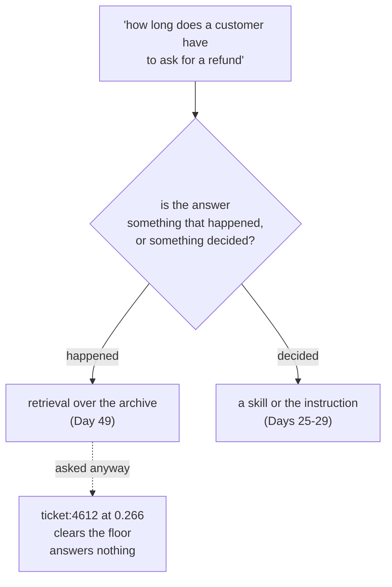

# 5.1 — When the answer is a rule

## One-line answer

An archive records **what happened**, never **what is allowed**, so a question about policy has no
correct answer anywhere in it — asked *"how long does a customer have to ask for a refund"*, retrieval
returns a ticket about API rate limits at `0.266` and clears the floor, because the question was never a
similarity search.

## The story

New starter, first week, and she wants to know when the office closes.

She does what any careful person does with a question about a place she has just joined: she looks for
evidence. She scrolls back through the team's messages. Somebody left at six one day in March. There is
a thread about a delivery arriving at half past five. Somebody once wrote *"still here"* at seven in the
evening with a photograph of the empty car park.

She builds a picture out of all of it, and the picture is wrong, because the answer is not in the
history at all. It is on a laminated sheet by the lift: *building access 07:00–19:00, out of hours by
arrangement*. One sentence, decided by somebody, written down on purpose.

No amount of reading what people did tells you what people are allowed to do. Those are two different
kinds of fact and they live in two different places.

## The idea in plain language

The archive is a record of **events**. Every document in it is a thing that happened: a ticket somebody
opened, an investigation somebody ran, an incident somebody reviewed.

A **rule** is not an event. It is a decision — a policy, a standard, a definition, a limit — and it is
true whether or not anything has ever happened under it. *"Refunds within thirty days"* is true on a day
with no refunds. *"A sign-in outage is severity one"* is true before the first sign-in outage.

Retrieval searches events. Ask it a question about a rule and it does the only thing it can: it finds
the events whose words most resemble your question. There are usually some, because policy questions use
ordinary words, and the result is a confident answer built out of documents that never had authority to
answer it.

The tell is grammatical, and it is a useful thing to be able to hear:

- *"What did we do when X happened?"* — an event question. Retrieval.
- *"What do we do when X happens?"* — a rule question. Not retrieval.

One word of tense apart, and the second one has no correct answer in an archive.

Where does a rule live in Sutra? In a **skill** — the folder of instructions Day 25 introduced
([1.1](../../../day-25-skills-the-open-spec/parts/01-what-a-skill-is/1.1-a-skill-is-a-folder.md)) and
Day 27 taught you to write — or in the agent's instruction itself. Both are text that somebody decided
and that the model is given because it applies, not because it happened to score well against a question.
That difference — *given because it applies* against *retrieved because it resembles* — is the whole
distinction.

## Why Sutra needs it

The desk is a support desk, and support desks are full of rule questions. *When can this be escalated?
What counts as severity one? How long before we chase the vendor? Is this covered under the plan they
are on?* Every one of those is a policy question wearing a support question's clothes, and every one of
them lands in the same text box as *"has anything like this happened before?"*.

Sutra already has the right place to put them.
[`skills/ticket-triage/`](../../../day-27-authoring-first-skills/LESSON.md) was written on Day 27 as
exactly this: rules about what to do, given to the model because they apply. Building a second, worse
answer to the same questions out of retrieval is not an improvement; it is a competing source of truth
with no authority and a confident tone.

## The mechanism

Ask a rule question of the archive and watch what comes back:

```python
# days/day-50-chunking-and-top-k/lab/wrongtool.py
def show(index, query: str) -> None:
    """Print what retrieval says, with no floor and no excuses."""
    print(f"  retrieval, k={TOP_K}:")
    for score, ref in search(index, query, TOP_K):
        print(f"    {score:.3f}  {ref:<14} {index.texts[ref][:64]!r}")


def rule(index) -> None:
    query = "how long does a customer have to ask for a refund"
    print(f"question: {query!r}\n")
    show(index, query)
```

**Line by line:**

- `show` is shared by all four arms of this section, so each of the four wrong-tool questions is asked in
  exactly the same way and the four transcripts are comparable.
- It runs with **no floor**, which is deliberate. Section 4's rule is a defence against questions with no
  answer in the archive; this section is about questions whose answers are not in an archive *at all*,
  and the point is that the defence does not fire. Adding the floor here would hide the finding behind a
  fix that does not apply.
- The query is a real support question, phrased the way a person phrases it. It is not adversarial and it
  does not contain any word designed to confuse the index.
- `index.texts[ref][:64]!r` prints the head of the returned row as a repr, so the reader can judge for
  themselves whether it answers anything.

Run it:

```bash
cd days/day-50-chunking-and-top-k/lab
uv run python wrongtool.py rule
```

**Line by line:**

- `rule` is one of four arms — `rule`, `current`, `count`, `fits` — each of which is one question that
  retrieval is the wrong tool for.
- The index is the shipped one: chunk size nine hundred, the setting
  [2.2](../02-measuring-the-cut/2.2-one-table-seven-chunk-sizes.md) chose. This is not a broken
  configuration failing; it is the good configuration answering the wrong question.

Measured on 2026-09-05:

```text
question: 'how long does a customer have to ask for a refund'

  retrieval, k=3:
    0.266  ticket:4612#0  'Ticket 4612. API returns a rate limit with no retry header. Auto'
    0.184  ticket:4525#0  'Ticket 4525. Export takes an hour and then stops. A large report'
    0.179  kb:KB-900#2    'ease manager will add the cookie check to the release checklist.'

  what the question needed: a rule someone wrote down. The archive holds what
  happened, never what is allowed. Nothing above states a policy, and the top row
  is a ticket about rate limits.
```

The top result is a ticket about an API rate limit, at `0.266`.

Two things about that number are worth sitting with.

**It clears the floor.** [4.2](../04-the-floor/4.2-there-is-no-floor-that-separates-them.md) shipped
`SIM_FLOOR = 0.20`, and `0.266` is comfortably above it. It also clears `MIN_SHARED_TERMS = 2`: the
question and the ticket share three words the index counts as informative — `how`, `long` and `to`.
**Section 4's defence does not fire on this question**, and it should not. That defence was built for
questions with no informative words in them at all, and this question has seven. They are simply
pointing at the wrong kind of thing, and a word count cannot tell you what kind of thing a word points
at.

**It beats real answers.** `0.266` is higher than the score of the row carrying the correct answer for
three of the ten gold questions. There is nothing in the numbers that marks this out as a bad result.

And the content is worse than the number suggests. A model handed *"API returns a rate limit with no
retry header"* and asked about a refund window will not usually say *"this is unrelated"*. It will find
a bridge — *"our documented limits suggest..."* — and produce a sentence about a policy that does not
exist. That is a fabricated result, and it was fabricated out of a correctly functioning retriever
returning its genuinely nearest match.



## When it breaks

The failure is silent, and it has a specific shape that makes it hard to catch in review: **the wrong
answer is topical**. Ask about refunds and you get billing-adjacent tickets. Ask about escalation and you
get tickets that were escalated. The retrieved rows are always *about roughly the right area*, which is
exactly what makes them convincing and exactly what stops anybody noticing that none of them states a
rule.

It is also invisible to every metric this day has built. The gold set contains ten questions and all ten
are event questions, because the archive is an archive of events. `hit@k`, `answered@k`, the floor sweep
— none of them has a rule question in it, so none of them can report this. The measurement that would
catch it does not exist and cannot be built out of the archive; it has to come from a different source of
truth.

Here is the shape of the failure at its most dangerous, which is when the archive *does* contain a
sentence that looks like a rule:

```text
    0.179  kb:KB-900#2    'ease manager will add the cookie check to the release checklist.'
```

That row is a genuine commitment from an incident review — somebody will add a check to a checklist. It
is an action item from one meeting in March. Retrieved as an answer to a policy question, it reads
exactly like a standing rule, and it is not one: it is a record that somebody agreed to do something
once. An archive is full of sentences in the imperative mood that were true for one afternoon.

## In production

**What a professional writes instead.** Rules go in the **system instruction or in a skill**, not in the
index — and the difference is authority, not storage. Instruction text is given to the model on every
relevant turn because somebody decided it applies. Retrieved text is given to the model because it
scored well. When the two disagree, a well-built system has an explicit answer about which wins, and that
answer is always the instruction.

Where a policy corpus genuinely is too large to fit in the instruction — a full terms of service, a
regulatory handbook — the production shape is **two stores with two different retrievers**, not one
store with everything in it. The policy store is versioned, its documents have effective dates, and a
retrieved clause is presented with its version. Mixing policy documents into an archive of tickets so
that one similarity search covers both is the thing that produces a confident answer citing a ticket
from 2024 as if it were a rule.

**What degrades at scale.** The proportion of rule questions rises as a desk matures. Early on everybody
asks *"has this happened before"*; later, once the team is bigger and the newcomers outnumber the
veterans, most questions are *"what are we supposed to do here"*. A retrieval system that was well matched
to its traffic at launch is answering the wrong kind of question two years later, and nothing in it
changed.

**The failure mode that only appears with real traffic.** Users do not label their questions. They type
one sentence into one box and expect the system to know what kind of question it is. So the routing has
to happen inside the system, and if it does not, retrieval answers everything by default — which is
[6.1](../06-in-production/6.1-the-five-questions-in-order.md)'s entire subject.

**The review comment a senior engineer leaves:** *"This returns a rate-limit ticket for a refund policy
question at a score that clears our floor, and there is no test anywhere that would catch it because the
gold set has no policy questions in it. Two things: get the refund rule into the triage skill where it
belongs, and add a fifth list to the gold set — questions the archive should not answer *because they are
not archive questions* — so this failure has somewhere to be measured."*

**The interview question:** *"When would you not use RAG?"* An honest answer: *"The first case is when
the answer is a rule rather than a record. An archive tells you what happened; it does not tell you what
is allowed, and those are different kinds of fact. I tested it: I asked my ticket archive 'how long does
a customer have to ask for a refund' and the top result was a ticket about API rate limits at 0.266,
which cleared my similarity floor and shared three meaningful words with the question, so it passed my second check too.
Nothing in the pipeline flagged it, and a model handed that row will build a bridge to it rather than
say it is irrelevant. The fix is not a better retriever — rules belong in the instruction or in a skill,
where they are given because they apply rather than retrieved because they resemble. The way I hear the
difference is tense: 'what did we do when X happened' is retrieval, 'what do we do when X happens' is
policy."*

## Check yourself

```bash
cd days/day-50-chunking-and-top-k/lab
uv run python wrongtool.py rule
```

Now write two more rule questions a support desk really gets — one about escalation, one about severity —
and run each of them through `search` in a Python shell against the same index. Write down the top score
for each, and say whether either would have been rejected by `SIM_FLOOR = 0.20`.

**Out loud, without scrolling up:** give the one-word grammatical difference between a question retrieval
can answer and one it cannot, and say where a rule lives in Sutra instead.

**Next:** [5.2 — When the answer must be true now](5.2-when-the-answer-must-be-true-now.md).
