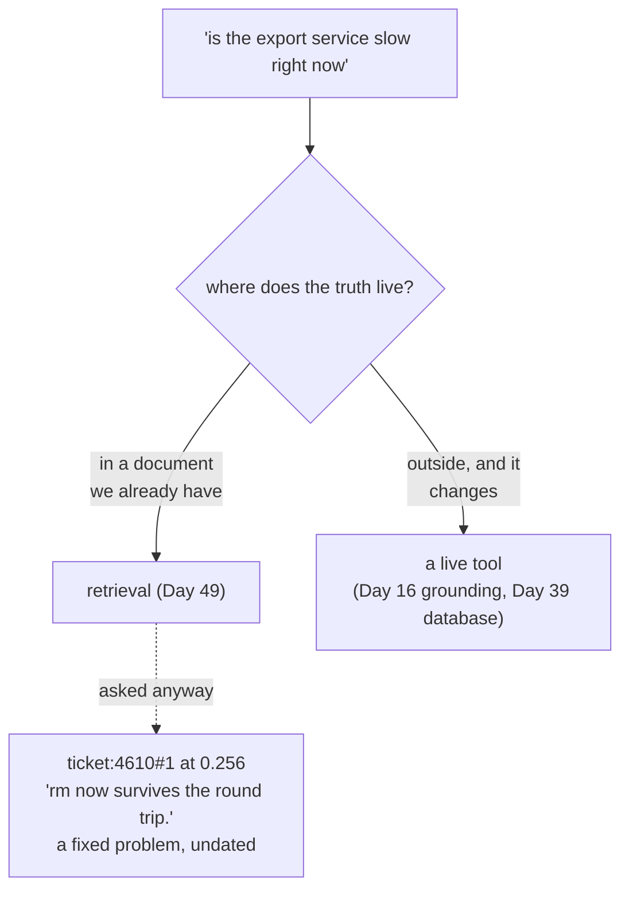

# 5.2 — When the answer must be true now

## One-line answer

**Zero of the sixty-one rows** in the index carry anything resembling a date, so a question containing
the words *"right now"* has nothing to match against — asked *"is the export service slow right now"*,
retrieval answers from a resolved ticket about a form, at `0.256`, with total confidence and no notion
of when anything happened.

## The story

The timetable board at the bus stop is a metal frame with a printed sheet behind glass.

It has been there for years and it is beautifully clear: routes down the side, times across the top,
the 14 every twelve minutes from six in the morning. You stand and read it and you know exactly when
your bus comes.

The route changed in the spring. The 14 does not come here any more; it turns two streets earlier and
the stop it uses is round the corner. Nobody took the sheet down, because taking a sheet down is
somebody's job and it was not anybody's in particular.

The board is not broken. It is doing precisely what it was built to do, and every number on it was
correct when it was printed. It simply has no way to say *"printed in 2019"*, so it cannot tell you the
one thing you would need to know before trusting it.

## The idea in plain language

An index is a **snapshot**. It was built at some moment from some documents, and from then on it answers
every question out of that moment.

That is fine for a whole class of question, because most facts in an archive are stable: what the cause
of ticket 4610 turned out to be is as true today as it was when somebody wrote it down. It is not fine
for the other class, where the answer changes and only the current value is any use:

- *"Is the service degraded?"*
- *"What is this customer's plan today?"*
- *"Has the vendor published a fix yet?"*
- *"How many open tickets are there this morning?"*

Day 16 drew this line and gave it a name. Its
[4.2](../../../day-16-built-in-tools-with-brakes/parts/04-newspaper-or-cabinet/4.2-routing-by-where-the-truth-lives.md)
routes questions **by where the truth lives**: some truths live in a document you already have, and some
live outside your building and have to be fetched. Retrieval is a way of searching the first kind.
Grounding and live tools are how you reach the second.

The failure this part is about is not that retrieval is wrong about time. It is that retrieval has **no
concept of time at all**. It cannot be wrong about something it does not represent. A row has text and a
vector, and neither of them says when.

That is worth separating from a related problem that people confuse it with. **Staleness** — the index
was built last week and three tickets have been added since — is a real issue and it has a real fix:
rebuild more often. This is a different thing. Even a perfectly fresh index, rebuilt one second ago,
cannot answer *"is it slow right now"*, because the answer is not in any document. It is in the world.

## Why Sutra needs it

The desk's most valuable question is *"has anything like this happened before?"* and its most urgent one
is *"is this happening right now?"* They arrive in the same sentence constantly — *"customer says exports
are slow, have we seen this?"* — and they need two different tools, at the same moment, from one input.

Sutra already has the second tool. Day 16 built grounded search with brakes, and Day 39 built database
tools that read the live archive rather than a snapshot of it. What Sutra does not have is anything that
notices which question it is being asked, and [6.1](../06-in-production/6.1-the-five-questions-in-order.md)
is where that gets written down as a procedure.

## The mechanism

Ask the index a question about the present, and then ask the index whether it even has a notion of the
present:

```python
# days/day-50-chunking-and-top-k/lab/wrongtool.py
def current(index) -> None:
    query = "is the export service slow right now"
    print(f"question: {query!r}\n")
    show(index, query)
    stamped = [ref for ref in index.refs if "202" in index.texts[ref]]
    print(f"\n  rows carrying anything like a date: {len(stamped)} of {index.rows}")
```

**Line by line:**

- `show(index, query)` is the shared helper from [5.1](5.1-when-the-answer-is-a-rule.md), so this arm
  asks its question exactly the way the others do.
- `stamped` is the diagnostic, and it is deliberately the crudest possible test: does the row's text
  contain the characters `202`, which would catch any year from 2020 to 2029 written anywhere in it. Not
  a date parser, not a regular expression — the loosest net you could throw.
- Using a crude test is the right choice here because a **negative** result from a loose test is much
  stronger than a negative from a strict one. If even *this* finds nothing, there is definitively nothing
  to find.
- It searches `index.texts[ref]`, the chunk text, because that is all a row is. There is no metadata
  field being ignored — Day 49's index has no metadata at all, which is the finding.

Run it:

```bash
cd days/day-50-chunking-and-top-k/lab
uv run python wrongtool.py current
```

**Line by line:**

- Same index as every other arm: the shipped chunk size of nine hundred, no floor.
- The arm prints the retrieval first and the diagnostic second, in that order, because the retrieval is
  what a caller sees and the diagnostic is what explains it.

Measured on 2026-09-05:

```text
question: 'is the export service slow right now'

  retrieval, k=3:
    0.256  ticket:4610#1  'rm now survives the round trip.'
    0.169  ticket:4621#0  'Ticket 4621. Board takes twenty seconds to open. A board with se'
    0.153  ticket:4627#0  'Ticket 4627. Print view drops the last column. Printing a table '

  rows carrying anything like a date: 0 of 61
  what the question needed: a live check. Every row is undated, so 'right now' has
  nothing to match against and the index answers from whenever.
```

**Zero of sixty-one rows carry a date.** Not few. None. The index has no representation of time
whatsoever, and every fact in it is presented as though it were equally current, which — since some of
these tickets are resolved and some are not — is a claim the archive is in no position to make.

Now look at the top result, because it is one of the more instructive rows in this whole day.

`ticket:4610#1` is the thirty-one-character tail chunk from
[1.1](../01-the-unit-you-index/1.1-the-unit-you-store-is-the-unit-you-find.md):
`'rm now survives the round trip.'` It begins in the middle of the word "form". It scored `0.256` — the
highest score in the archive for this question — because it is a very short row and it contains the word
`now`, so a query containing `now` points almost directly at it.

Three separate failures met on one line:

1. A chunk boundary cut a word in half and created a row that means nothing
   ([1.3](../01-the-unit-you-index/1.3-cut-too-small-to-mean-anything.md)).
2. The word `now` in the question is a **temporal** word, and the index treats it as an ordinary term to
   be matched — which is exactly what a bag of words has to do, having no other option.
3. The retrieved sentence, *"the form now survives the round trip"*, describes a problem that was
   **fixed**. A model handed that row and asked whether exports are slow right now has been given a
   sentence in the present tense about a resolved issue, which is close to the worst possible input for
   a question about current state.

The second and third results are more sensible-looking and no better: two tickets about slowness, both
historical, neither with any indication of whether they are open, closed, from this week or from last
year.



## When it breaks

The break has no error text and it is worse than the transcript above suggests, because the transcript
above at least *looks* odd. The dangerous version looks reasonable.

```text
    0.169  ticket:4621#0  'Ticket 4621. Board takes twenty seconds to open. A board with se'
```

That is a real ticket about a real performance problem, and handed to a model as context for *"is the
service slow right now"*, it produces a fluent, plausible, wrong answer: *"Yes, there are reports of
slowness — boards with several thousand cards take around twenty seconds to open."* Every word of that
is drawn from a genuine document. It is also a sentence about a different feature, from an unknown date,
possibly resolved, presented as current status.

There is no exception, no empty list, no low score to trip the floor from
[4.2](../04-the-floor/4.2-there-is-no-floor-that-separates-them.md) — `0.256` clears it comfortably — and
nothing in the logs distinguishes this from a good answer. The only way to catch it is to notice, before
searching, that the question contained the word *now*.

The related break that people reach for first, and which does not fix this, is **rebuilding the index
more often**. Rebuild hourly and every fact in the archive is at most an hour old, and *"is it slow right
now"* is still unanswerable, because the archive does not contain the current state of the export
service under any freshness policy. Freshness is a different axis from liveness, and confusing them is
how teams end up with an expensive incremental indexing pipeline that has not fixed the reported bug.

## In production

**What a professional writes instead.** Two things, and the first is not about retrieval at all.

**Route on the question.** A cheap classifier, a keyword list, or the model itself decides whether the
question is about the present, and a present-tense question goes to a live tool — a status endpoint, a
database query, a grounded search
([4.3](../../../day-16-built-in-tools-with-brakes/parts/04-newspaper-or-cabinet/4.3-the-question-that-left-the-building.md)).
Words like *now*, *currently*, *still*, *today*, *yet* and *at the moment* are a crude but genuinely
effective signal, and crude signals with high recall are the right shape when the fallback is *ask the
live tool as well*.

**Put dates in the rows.** Every chunk gets its document's date and status written into it, at index
time, as part of the text: *"Ticket 4621, opened 2026-03-04, resolved."* This does three things at once —
the model sees the date and can discount an old row itself, the retriever can be filtered by date range
before ranking, and a question like *"anything like this recently"* becomes answerable. It costs a few
tokens per row and it is the single highest-value piece of metadata an archive can carry.

**What degrades at scale.** The archive gets older. On day one every document is recent and the absence
of dates costs nothing; three years later most of the corpus describes a product that has changed, and
undated retrieval returns confident archaeology. The effect is gradual and there is no moment at which
anybody notices.

**The failure mode that only appears with real traffic.** Incidents. During an outage, every question a
support agent asks is a present-tense question — *is it still down, is it everyone, did the fix land* —
and that is exactly when the desk is most used and its answers are most consequential. A retrieval-only
desk is at its least reliable at the moment of maximum load, and it fails by confidently describing a
similar incident from last year.

**The review comment a senior engineer leaves:** *"Zero of sixty-one rows have a date in them. Before any
more tuning, write the document date and status into the chunk text at index time — it is a few tokens a
row and it lets the model discount stale context on its own. And route anything containing 'now',
'currently' or 'still' to the status tool before it reaches retrieval; I would rather over-route to a
live check than answer an outage question from an archive."*

**The interview question:** *"When is retrieval the wrong tool?"* An honest answer: *"The second case,
after policy questions, is anything that has to be true at this moment. An index is a snapshot, and mine
had no representation of time at all — I checked, and zero of my sixty-one rows contained anything
resembling a date. So when I asked 'is the export service slow right now', the top hit scored 0.256 and
was a fragment of a resolved ticket that happened to contain the word 'now'. It cleared my similarity
floor, nothing logged a problem, and a model reading it would report a fixed problem as current. The
important distinction is that this is not staleness — rebuilding the index every hour does not fix it,
because the current state of a service is not in any document. It is a routing question: present-tense
questions go to a live tool, and past-tense ones go to the archive. The cheap production improvement is
to write the date and status into every chunk's text so the model can discount old context itself."*

## Check yourself

```bash
cd days/day-50-chunking-and-top-k/lab
uv run python wrongtool.py current
```

Now edit `_archive.py` and prepend `"Opened 2026-03-04, resolved. "` to `ticket:4621`. Re-run the arm and
say what changed in the `rows carrying anything like a date` line, whether the ranking moved, and what a
model could now do that it could not before.

**Out loud, without scrolling up:** say the difference between an index being stale and an index having
no concept of time, and give three words in a question that should route it away from retrieval.

**Next:** [5.3 — When the answer has to be counted](5.3-when-the-answer-has-to-be-counted.md).
