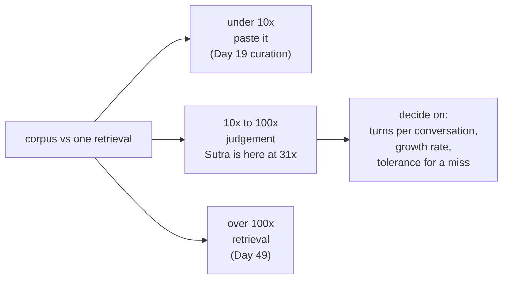

# 5.4 — When the whole archive fits in the prompt

## One-line answer

Sutra's entire archive is **2,795 tokens** — a 32,000-token window holds it eleven times over — so
retrieval here is not saving room, it is adding a way to miss, and the honest question is not *"how do we
retrieve better"* but *"at what archive size does retrieval start earning its place?"*

## The story

Four things to buy on the way home: bread, eggs, coriander, a light bulb.

You could write them on the back of an envelope, but you do not, because four things is not a list, it
is a thing you know. You walk round the shop, you pick up four things, you go home.

Now imagine you had written them down and then, in the shop, worked from the note. Extra steps, and every
one of them a place to lose something: the note in the wrong pocket, one line smudged, the coriander
written so fast it might say cardamom. The note is a machine for remembering, and machines for
remembering are worth having when there is more to remember than you can hold.

At four items the machine has nothing to do except go wrong.

## The idea in plain language

Retrieval exists to solve one problem: **the corpus does not fit in the context window**. That is the
entire justification. Everything else about it — the chunking, the vectors, the k, the floor — is
machinery in service of a selection you are forced to make.

If you are not forced to make it, the machinery has no job, and it does not become free just because it
is not needed. It brings its own failure modes with it, all of which you have now measured:

- it can rank the answer below the cut-off ([3.2](../03-the-k-is-a-budget/3.2-where-the-curve-goes-flat.md));
- it can return the wrong half of the right document
  ([2.3](../02-measuring-the-cut/2.3-the-cut-that-kept-the-ticket-and-lost-the-fix.md));
- it can return confident nonsense
  ([4.1](../04-the-floor/4.1-cosine-never-says-it-does-not-know.md));
- it can refuse a real answer, because the floor that stops the nonsense also cuts a genuine hit
  ([4.2](../04-the-floor/4.2-there-is-no-floor-that-separates-them.md)).

Every one of those is a way to lose information that was sitting in a document you already had. Put the
whole corpus in the prompt and none of them can happen, because there is no selection step to get wrong.

That is not an argument for putting everything in the prompt. It is an argument that **there is a size
below which retrieval is a net negative**, and knowing roughly where that size is for your own system is
the difference between a decision and a habit.

Day 19 is the counterweight and it has to be held at the same time. Its
[4.2](../../../day-19-context-engineering-selection/parts/04-measuring/4.2-curated-against-kitchen-sink.md)
measured a curated prompt against a kitchen-sink one and found the kitchen sink expensive, and
[1.1](../../../day-19-context-engineering-selection/parts/01-the-binder/1.1-room-is-not-free.md) is called
*room is not free*. So "it fits" is not the end of the argument. It is the start of a different one: it
fits, and it is re-sent on every turn
([3.1](../03-the-k-is-a-budget/3.1-k-is-a-budget-not-a-preference.md)), and a long context has its own
accuracy cost.

## Why Sutra needs it

Because Sutra is building retrieval over an archive that fits in a prompt, and that has to be said out
loud rather than assumed away. A curriculum that teaches retrieval without ever asking whether this
particular corpus needs it has taught a habit rather than a decision, and the reader will carry the habit
into a system where it is expensive.

There is also a concrete downstream use. The fourth of the five checks in
[6.1](../06-in-production/6.1-the-five-questions-in-order.md) is *"does the whole relevant corpus fit in
this turn's budget?"*, and it is the only one of the five whose answer is a number rather than a
judgement. This part is where that number gets computed, and where the band around it — under ten times,
between ten and a hundred, over a hundred — gets set, so the check is something you can run rather than
something you can only nod at.

And it is the hinge into tomorrow. Day 51 is caching, and prompt caching is precisely the thing that
moves this line: a large, stable block of context at the front of every request is much cheaper to send
repeatedly than the raw token arithmetic here suggests. Knowing where the line sits today is what makes
tomorrow's change measurable.

## The paper behind it

> **Lost in the Middle: How Language Models Use Long Contexts**
> `arXiv:2307.03172` · 2023
> <https://arxiv.org/abs/2307.03172>

It measured accuracy against the position of the relevant information in a long context and found it
highest at the beginning and the end and significantly degraded in the middle — which is why "the whole
corpus fits" is not the same claim as "the whole corpus will be used".

Taught in full on Day 19:
[`01-lost-in-the-middle.md`](../../../day-19-context-engineering-selection/papers/01-lost-in-the-middle.md).

## The mechanism

Weigh the archive against a retrieval:

```python
# days/day-50-chunking-and-top-k/lab/wrongtool.py
def fits(index) -> None:
    chars = sum(len(t) for t in DOCS.values())
    whole = chars / CHARS_PER_TOKEN
    retrieved = (
        sum(len(index.texts[ref]) for _, ref in search(index, "keeps getting logged out", TOP_K))
        / CHARS_PER_TOKEN
    )
    print(f"  the whole archive      {len(DOCS):>4} documents   {whole:>7.0f} tokens")
    print(f"  one retrieval at k={TOP_K}  {TOP_K:>4} rows        {retrieved:>7.0f} tokens")
    print(f"  ratio                                    {whole / retrieved:>7.0f}x")
```

**Line by line:**

- `chars` sums the archive's real text, from `DOCS` rather than from the index, so overlap and chunk
  boundaries cannot inflate it. This is the size of the thing itself.
- `CHARS_PER_TOKEN` is Day 24's measured `4.55`
  ([1.1](../../../day-24-token-accounting-and-budgets/parts/01-what-a-request-costs/1.1-a-ticket-id-costs-five-tokens.md)),
  so both numbers are in the unit the window is measured in and the comparison is meaningful.
- The retrieval arm uses one ordinary question rather than the whole gold set, because this is a size
  comparison and not a quality measurement. One question is enough to establish the order of magnitude.
- `whole / retrieved` is printed as a ratio, which is the number that actually decides. Absolute token
  counts are archive-specific; the ratio says what retrieval is *for* — it is a compression factor, and a
  compression factor near one is a compressor doing nothing.

```bash
cd days/day-50-chunking-and-top-k/lab
uv run python wrongtool.py fits
```

**Line by line:**

- Same index and same `TOP_K` as every other arm in this section.
- No model, no network. The arithmetic is a character count and a division.

Measured on 2026-09-05:

```text
  the whole archive        57 documents      2795 tokens
  one retrieval at k=3     3 rows             91 tokens
  ratio                                         31x

  A 32,000-token window holds this archive about 11 times over. Retrieval here is
  not saving room; it is adding a way to miss. The arithmetic changes when the
  archive does - see the part for where the line is.
```

**Two thousand seven hundred and ninety-five tokens.** The whole thing. Fifty-seven documents, every
ticket, every KB article, the incident review, all of it, and it fits eleven times over in a window that
is small by current standards.

So a completely reasonable design for the desk as it stands today is: **paste the archive**. No index, no
chunk size, no k, no floor, no dilution, no fragmentation, no confident nonsense about printers. Every
document present, every time, and the model does the selection — which is a thing models are, at this
scale, rather good at.

Now the other side, because "it fits" is not "it is free":

- **It is re-sent on every turn.** 2,795 tokens on turn one, and on turn two, and on turn six.
  [3.1](../03-the-k-is-a-budget/3.1-k-is-a-budget-not-a-preference.md)'s arithmetic applies unchanged: a
  six-turn conversation carrying the whole archive costs about sixteen thousand eight hundred tokens
  against one thousand for a retrieval at k equals two. Sixteen times.
- **It puts the answer in the middle.** The one useful ticket is now surrounded by fifty-six others, at
  whatever position the archive's ordering happens to put it. That is the paper's finding, and it is why
  "the model can find it" is a weaker claim than it sounds.
- **It does not scale, and the scale is not far away.** Ten times this archive is twenty-eight thousand
  tokens and no longer fits comfortably. A support desk reaches five hundred and seventy documents very
  quickly.

The useful output of this part is therefore not *"do not use retrieval"*. It is a **crossover** you can
compute for your own system in one line:

- Retrieval at Sutra's settings costs about **280 tokens** per question
  ([2.2](../02-measuring-the-cut/2.2-one-table-seven-chunk-sizes.md)).
- The whole archive costs **2,795**.
- Below roughly **ten times** the retrieved size, retrieval is buying you a factor of a few in exchange
  for four documented failure modes, and that trade is at best even.
- Above about **a hundred times** — call it a corpus of thirty thousand tokens against a retrieval of
  three hundred — retrieval is unambiguously right, because the alternative does not fit at all.

Sutra's archive sits at **31x**. That is inside the band where it is a genuine judgement call, and it is
worth saying plainly: **retrieval is not yet obviously the right answer for the desk's current archive.**
It is being built because the archive is a ticket archive and ticket archives only grow, and because the
mechanism has to be understood before the day it is needed. That is an honest reason, and it is a
different reason from "retrieval is what one does".



## When it breaks

**The whole-corpus prompt breaks silently as the corpus grows**, and it breaks in the worst possible
order. First it gets slower and more expensive, which nobody acts on. Then the answers get worse in the
middle of the corpus, which nobody attributes to size. Then one day the request exceeds the window and
you get an error — and the error is the *good* part, because it is the first honest signal in the whole
sequence.

**And the retrieval version breaks at small scale in a way that is invisible**, which is this part's
actual point. Here is the failure with no error text:

```text
  the whole archive        57 documents      2795 tokens
  one retrieval at k=3     3 rows             91 tokens
  ratio                                         31x
```

Every number in that block is healthy. Retrieval is working, it is cheap, the compression is real. What
the block does not say is that on this archive, at these settings, retrieval loses one real answer to the
similarity floor ([4.2](../04-the-floor/4.2-there-is-no-floor-that-separates-them.md)) and answers
eight of ten questions at k equals one ([3.2](../03-the-k-is-a-budget/3.2-where-the-curve-goes-flat.md)),
where pasting the archive would have lost nothing to either. You are paying for a factor of thirty-one in
tokens with a real, measured, non-zero miss rate — and on a corpus this size the miss rate is the larger
number.

The third break is the one to be most careful about: **assuming your corpus is the size you think it
is.** The archive here is fifty-seven small documents. A single production runbook can be twelve thousand
tokens on its own, and one such document changes the answer entirely. The crossover is about the corpus,
not about the document count.

## In production

**What a professional writes instead.** They ask the fits question **first**, before designing anything,
and they ask it in tokens rather than in documents. If the corpus fits in a fraction of the window with
room for the conversation, the first version has no retrieval in it at all — the corpus goes in the
prompt, and the system is shipped and measured. Retrieval is added when a measurement says it is needed,
which is usually one of: the corpus crossed the window, the per-turn cost became the dominant line, or
the answers started degrading in a way that correlates with corpus size.

Two production refinements of the same idea, both of which are worth knowing:

- **Prompt caching.** A large, stable block of context at the front of every request can be cached by the
  provider, which changes the economics of pasting the corpus substantially. That is tomorrow's subject
  — Day 51, ADK-31 — and it is the single biggest reason "just paste it" is more viable in production
  than the raw token arithmetic above suggests.
- **Hybrid by size.** Paste the small, stable, always-relevant part of the corpus — the four KB articles
  — and retrieve over the large, growing part. The decision is per collection, not per system.

**What degrades at scale.** Both sides, in opposite directions, which is what makes the crossover real
rather than rhetorical. The paste degrades on cost and position as the corpus grows. Retrieval degrades
on precision as the corpus grows, because the nearest wrong document gets nearer
([4.1](../04-the-floor/4.1-cosine-never-says-it-does-not-know.md)'s production section). There is no
regime where one of them is free.

**The failure mode that only appears with real traffic.** Conversations. The whole-archive prompt is
priced per request in every design document and paid per turn in production, and the turn count is the
number nobody estimates correctly. A desk conversation that was assumed to be three turns is eight when
somebody is genuinely stuck, and eight turns of a 2,795-token archive is twenty-two thousand tokens of
context before anybody has said anything.

**The review comment a senior engineer leaves:** *"Put the fits number in the design document. The whole
archive is 2,795 tokens and we are building an index over it, and I am fine with that decision as long as
it is written down as a decision about where this corpus is going rather than as an assumption about
where it is. Add the ratio to the index build output so it shows up in a log every time — the day it goes
past a hundred, this argument is over, and the day it is still at thirty in a year we should have another
look."*

**The interview question:** *"When would you not use RAG?"* An honest answer: *"The case people miss is
when the corpus fits in the window. Retrieval exists to solve one problem, which is that you cannot send
everything, and if you can send everything then all it does is add ways to miss — the answer ranked below
k, the wrong half of a chunked document, a confident match on nothing, a threshold that cuts a real hit.
I measured my own archive: fifty-seven documents, 2,795 tokens, which fits eleven times over in a
thirty-two-thousand-token window, and one retrieval is ninety-one tokens, so the compression factor is
thirty-one. That is inside the band where it is a genuine judgement call rather than a decision. The
counter-argument is real too: the pasted corpus is re-sent on every turn, so a six-turn conversation
costs sixteen times a small retrieval, and Lost in the Middle says a long context does not get used
evenly. What I would actually do is write the ratio into the build log, ship the simple thing while the
ratio is small, and add retrieval when the number says to — and prompt caching moves that line a long
way, which is why it is worth knowing where it currently sits."*

## Check yourself

```bash
cd days/day-50-chunking-and-top-k/lab
uv run python wrongtool.py fits
```

Now edit `wrongtool.py` to print the ratio a second time with `TOP_K` set to `20` instead of `3`. Write
down the new ratio, and say which side of the ten-times line the archive falls on when k is large.

**Out loud, without scrolling up:** state the one problem retrieval exists to solve, and give two reasons
why "the corpus fits" is still not the end of the argument.

**Next:** [6.1 — The five questions, in order](../06-in-production/6.1-the-five-questions-in-order.md).
