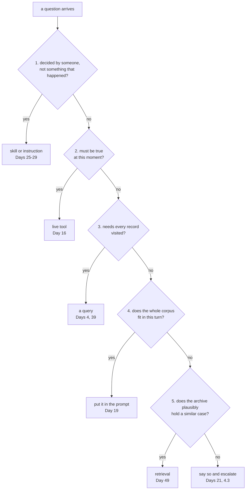

# 6.1 — The five questions, in order

## One-line answer

Five yes-or-no questions asked **in a fixed order** route any desk question to the tool that can actually
answer it, and the order is the design: run them on twelve real questions and all twelve route correctly,
drop the first question and two of them silently become retrieval.

## The story

The tap under the sink is leaking and the plumber arrives.

He does not open anything. He asks four questions from the doorway, in the same order he always asks
them. Is the water off at the main. Is it dripping or running. Has anyone been at it already. Is it wet
under the cupboard or only around the tap.

The order is not arbitrary and it is not habit. If the water is not off, nothing else matters and that
is the first thing to fix. If somebody has already been at it, half of what he would otherwise conclude
from the evidence is wrong. Each answer removes a whole branch of the tree, and asking them in the wrong
order means opening the cupboard to find out something the doorway would have told him.

He is not being clever. He is being ordered.

## The idea in plain language

Section 5 gave four ways retrieval is the wrong tool, and a list of four failures is not usable. Somebody
reading it will nod, and then the next question that arrives will go to retrieval, because retrieval is
what is wired up and nothing stopped it.

A **decision procedure** is the same knowledge in a usable shape: a fixed sequence of questions with an
answer at the end of each branch. Sutra's has five, and each one is section 5's finding stated as a test:

1. **Is the answer something somebody decided, rather than something that happened?**
   → a skill or the instruction. [5.1](../05-the-wrong-tool/5.1-when-the-answer-is-a-rule.md).
2. **Must the answer be true at this moment?**
   → a live tool. [5.2](../05-the-wrong-tool/5.2-when-the-answer-must-be-true-now.md).
3. **Does answering require visiting every record?**
   → a query. [5.3](../05-the-wrong-tool/5.3-when-the-answer-has-to-be-counted.md).
4. **Does the whole relevant corpus fit in this turn's budget?**
   → put it in the prompt. [5.4](../05-the-wrong-tool/5.4-when-the-whole-archive-fits-in-the-prompt.md).
5. **Does the archive plausibly hold a similar case?**
   → retrieval. If not: say so and escalate.
   [4.3](../04-the-floor/4.3-nothing-is-an-answer.md).

**The order carries as much information as the questions.** Every question after the first is only asked
because the ones before it said no, so the sequence encodes a set of priorities: authority beats
recency, recency beats aggregation, aggregation beats convenience, and retrieval is the **last** resort
rather than the default. Shuffle it and you get a different system with the same five rules in it.

Two properties are worth stating because they are what makes this a procedure and not a checklist:

- **It terminates.** Every question has an answer, including *no to all five*, which routes to *say so
  and escalate*. A decision procedure with no exit for "none of these" is the failure of
  [4.1](../04-the-floor/4.1-cosine-never-says-it-does-not-know.md) at the level of the whole system.
- **It is for you, at design time.** These five questions are answered by a person about a *class* of
  question, and the answers are written down. This is not a runtime classifier, and pretending it is
  would be building exactly the confident guess this day has spent nineteen parts arguing against.

## Why Sutra needs it

Phase 8 gives Sutra a researcher agent holding several tools — retrieval, SQL over the archive, grounded
search, the skills shelf — and it will have to choose between them, per question, on its own. An agent
can only be taught to choose by being given the choice in a form somebody has already made explicit.
This procedure is that form, and the tool descriptions the researcher reads are written from it
([5.3](../05-the-wrong-tool/5.3-when-the-answer-has-to-be-counted.md)'s production section).

It is also the day's answer to its own title. *When is RAG the wrong tool* is a question with four
findings behind it and one usable output, and this is the output: something a person can run on a
whiteboard, in an interview, or in a design review, without looking anything up.

## The mechanism

The procedure is data plus one loop, and the loop is three lines:

```python
# days/day-50-chunking-and-top-k/lab/decide.py
ORDER = ["rule", "current", "computed", "fits", "neighbour"]


@dataclass(frozen=True)
class Question:
    """One desk question, answered against the five checks by a human, once, in advance."""

    text: str
    rule: bool  # is the answer something somebody decided, rather than something that happened?
    current: bool  # must the answer be true at this moment?
    computed: bool  # must every record be visited to answer it?
    fits: bool  # does the whole relevant corpus fit in this turn's budget?
    neighbour: bool  # does the archive plausibly hold a similar case?
    expect: str


def route(question: Question) -> str:
    """The first check that fires wins. Order is the whole design; a set of rules is not a procedure."""
    for name in ORDER:
        if getattr(question, name):
            return name
    return "none"
```

**Line by line:**

- `ORDER` is a plain list, and it is the only place the priority is written. Changing the procedure means
  changing one line, which is the property that lets the ablation below exist at all. A priority
  scattered across five `if` statements cannot be reordered as an experiment.
- `Question` is a frozen dataclass, so a question and its five answers are one immutable record. Frozen
  because these are **judgements somebody made**, and a judgement that code can quietly mutate is a
  judgement nobody can audit — the same reasoning Day 48 used for policy as data
  ([2.1](../../../day-48-memory-design/parts/02-policy-as-data/2.1-a-rule-someone-else-can-read.md)).
- The five fields are `bool` and each carries its question as a comment on the same line. The comment is
  not decoration: it is the definition of the field, and without it `current` is a word that three people
  will read three ways.
- `expect` is the routing somebody wrote down as correct. Its presence is what turns this file from a
  demonstration into a test that can go red.
- `route` iterates `ORDER` and returns on the **first** true field. Not the best match, not a score —
  the first. That is what "in order" means mechanically, and it is why a question that is both a rule
  question and a counting question goes to the rule.
- `return "none"` is the terminating branch. It is a route like any other, and it points at *say so and
  escalate*.

Run it, and then run it wrong:

```bash
cd days/day-50-chunking-and-top-k/lab
uv run python decide.py; echo "exit: $?"
uv run python decide.py --skip-rule; echo "exit: $?"
```

**Line by line:**

- The first arm is the procedure as designed, over twelve questions a desk really gets.
- `--skip-rule` removes the first check from `ORDER` — the ablation. It changes nothing else: same
  questions, same judgements, same code.
- `echo "exit: $?"` prints the exit code, because this script is an eval (Principle 11) and its verdict is
  a number the shell can act on, not a paragraph a human has to read.

Measured on 2026-09-05:

```text
  routed to      expected       question
  rule           rule           how long does a customer have to ask for a refund
  rule           rule           what severity do we give a sign-in outage
  current        current        is the export service slow right now
  current        current        did the vendor publish a fix this week
  computed       computed       how many tickets are about signing in
  computed       computed       which customer opened the most tickets last month
  fits           fits           summarise everything we know about exports
  fits           fits           what are the four KB articles about
  neighbour      neighbour      has anything like ticket 4610 happened before
  neighbour      neighbour      customer bounced back to the sign-in page
  none           none           the office printer jams on thick paper
  none           none           our new hardware partner returns a 418

  rule       -> a skill or the instruction (Days 25-29)
  current    -> a live tool (Day 16)
  computed   -> a tool or a query (Days 4, 39)
  fits       -> put the whole thing in the prompt (Day 19)
  neighbour  -> retrieval (Day 49)
  none       -> say so and escalate (Day 21)

  misrouted: 0 of 12
exit: 0
```

Twelve questions, twelve correct routes, exit `0`. Look at the left column: **only two of the twelve go to
retrieval.** Two more route to *none* and get an honest refusal. Eight go somewhere else entirely. That
distribution is the day's thesis in one column — a support desk's traffic is mostly not similarity
search, and a system whose only tool is retrieval will answer all twelve of these with three ranked
chunks.

Now the ablation. Remove the first question and nothing else:

```text
  routed to      expected       question
  neighbour      rule           how long does a customer have to ask for a refund   <-- WRONG
  neighbour      rule           what severity do we give a sign-in outage   <-- WRONG
  current        current        is the export service slow right now
  ...
  misrouted: 2 of 12
exit: 1
```

Two questions change their answer, and they change it **to retrieval**, silently, with a plausible score
attached — which is exactly what
[5.1](../05-the-wrong-tool/5.1-when-the-answer-is-a-rule.md) measured happening for real: the refund
question returning a rate-limit ticket at `0.266`, above Sutra's similarity floor.

The exit code moves from `0` to `1`. That is the eval that can go red, and it goes red for the right
reason: not because the code broke, but because the *priorities* changed.



## When it breaks

**A question can be two things at once**, and the procedure resolves that by order rather than by
judgement. *"How many refunds have we given outside the thirty-day window?"* is both a rule question and
a counting question. The procedure sends it to the rule, which is right — you cannot count violations of
a policy you have not stated — but it means the answer is *"first find the rule, then count"* and the
procedure only gives you the first half. Real questions decompose, and a router that returns one tool per
question will sometimes be returning the first of two.

**Question four is not a property of the question**, and this is the honest weak point. *"Does the whole
relevant corpus fit?"* depends on the corpus size, the window, how many turns have already happened and
what else is in the prompt. It is the only one of the five whose answer changes over time without anybody
touching it, and it is the one that quietly becomes wrong as an archive grows
([5.4](../05-the-wrong-tool/5.4-when-the-whole-archive-fits-in-the-prompt.md) computed the current
number: 31x, which is inside the band where it is a judgement call).

**And the file itself is a set of judgements, not a measurement.** Twelve questions, hand-answered by the
person who wrote the procedure. The five booleans are opinions written down honestly, and their value is
that they are written down and can be argued with — not that they are correct. The failure it can catch
is a *reordering*; the failure it cannot catch is somebody answering the five questions wrongly, and
there is no error text for that:

```text
  misrouted: 0 of 12
exit: 0
```

That is what a file of consistent nonsense also prints. The eval checks that `route` implements `ORDER`
and that the expectations agree; it cannot check that a human's `current: True` was a good call.

## In production

**What a professional writes instead.** The procedure ends up in two places, and neither of them is a
runtime `if`.

- **In the tool descriptions.** The model routes by reading descriptions
  ([1.3](../../../day-04-tools-by-hand/parts/01-the-schema/1.3-the-description-is-the-prompt.md)), so the
  five questions become five sentences about what each tool is *for* and what it cannot do: retrieval
  says *"finds past cases similar to a described situation; cannot count, cannot report current state,
  does not hold policy"*. Written that way, the boundary is enforced where the decision is actually made.
- **In the evaluation set.** Each of the twelve rows becomes a test case with an expected tool, and the
  agent is scored on whether it reached for the right one. That is a trajectory evaluation, and Phase 12
  industrialises it; the twelve rows here are the seed.

**What degrades at scale.** The number of tools. Five branches is a procedure a person can hold; a
researcher agent with fifteen tools has a routing problem that no ordered list resolves, because the
questions stop being independent. The production answer at that point is a hierarchy — route to a
*family* of tools first, then within it — and the discipline that keeps it workable is the same one here:
the order is written down in one place and it is tested.

**The failure mode that only appears with real traffic.** Users combine questions. *"Are exports still
slow and have we seen this before, and how many people have reported it?"* is all three of questions two,
three and five in one sentence, and a router that picks one tool answers a third of it confidently. The
production shape is decomposition before routing, and the thing that makes decomposition safe is that
each sub-question then gets the same five checks.

**The review comment a senior engineer leaves:** *"I like that the order is one list and the ablation
flips two rows — that is a real test. Two things: question four is not a property of the question and
will rot as the archive grows, so wire it to the actual ratio rather than to a boolean somebody typed;
and get these twelve rows into the eval suite with the expected tool per row before Phase 8, because
after that the routing is the model's decision and I want a red build when it changes."*

**The interview question:** *"How do you decide whether a problem needs RAG?"* An honest answer: *"I run
five questions in a fixed order, and the order is the important part. Is the answer something somebody
decided rather than something that happened — that is a policy and it belongs in the instruction or a
skill. Does it have to be true right now — that is a live tool, because an index is a snapshot. Does
answering need every record visited — that is a query, because ranking throws away everything outside the
top k. Does the whole corpus fit in the prompt — then put it there, because retrieval is only solving the
problem of not fitting. And only then: does the archive plausibly hold a similar case, in which case it is
retrieval, and if not the honest answer is to say so and escalate. I put twelve real desk questions
through it and only two of them were retrieval questions. The ablation is what convinced me the order
matters: drop the first check and two questions silently become retrieval — and I had already measured
that one of those, a refund policy question, returns a ticket about API rate limits at a score that
clears my similarity floor."*

## Check yourself

```bash
cd days/day-50-chunking-and-top-k/lab
uv run python decide.py; echo "exit: $?"
uv run python decide.py --skip-rule; echo "exit: $?"
```

Now add a thirteenth `Question` to `decide.py` — a real one you have been asked at work — answer its five
booleans honestly and set `expect` to where you think it should go. If the routing disagrees with you,
say which is wrong: your `expect`, one of your five booleans, or `ORDER`.

**Out loud, without scrolling up:** recite the five questions in order, and say what happens to a question
that answers no to all five.

**Next:** [6.2 — 🅿️ Rerankers, hybrid search and a vector database](6.2-rerankers-hybrid-search-and-a-vector-database.md).
