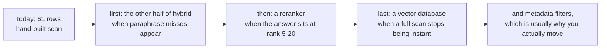

# 6.2 — 🅿️ Rerankers, hybrid search and a vector database

## One-line answer

Three pieces of production retrieval infrastructure are named, priced and **deliberately not built**: a
reranker buys precision at the top of the list, hybrid search buys recall on words a vector misses, and a
vector database buys scale — and Sutra needs none of them at sixty-one rows, which is the only honest
reason to skip anything.

## The story

There is a workshop at the end of the road where a man makes and repairs window frames.

Against the wall there is a mitre saw on a stand, and a router, and a thicknesser under a sheet. Ask him
about the thicknesser and he will tell you what it does and why he does not use it: he plans four or five
boards a month, by hand, and the machine takes twenty minutes to set up and needs the dust extraction
running. He is not against it. He knows exactly what it would save him and exactly at what volume it
would start saving.

The next street has a joinery shop with six people in it, and the thicknesser runs all day.

Neither of them is wrong. What separates them is that both of them know the number.

## The idea in plain language

The master plan excludes production RAG infrastructure by name — *"vector DB ops, rerankers, hybrid
search"* — on the grounds that this curriculum gives you the concept and one honest implementation, and
that production RAG is its own subject. 🅿️ **Parked** in Sutra means exactly that: known well enough to
discuss in a design review or an interview, deliberately not built, with the reason written down.

A reason is what makes a park a decision. *"We did not get to it"* is a gap. *"It buys X, we would need it
at Y, we are at Z"* is a decision. Here are the three, each with its X, its Y and Sutra's Z.

### A reranker

**What it is.** A second scoring pass over the rows retrieval already returned. The retriever compares
two vectors that were computed independently — the question's and the row's — which is fast because the
row's vector was computed at index time. A reranker instead looks at the question and the row **together**,
as one input, and scores how well this row answers this question. That is far more accurate and far more
expensive, which is why it can only run on a shortlist.

**What it buys.** Precision at the top of the list. It is the direct answer to
[3.3](../03-the-k-is-a-budget/3.3-twenty-rows-and-nothing-new-in-nineteen.md): retrieve twenty candidates,
rerank them, send the best two. You get the recall of a large k and the prompt of a small one, and the
answer stays at rank one instead of landing a quarter of the way into a long block.

**When you need it.** When your answer is regularly at rank five to twenty rather than at rank one — the
`answer at rank` column in [3.2](../03-the-k-is-a-budget/3.2-where-the-curve-goes-flat.md) is the
measurement that tells you.

**Why Sutra does not build one.** That column reads `1.2` at the shipped chunk size, and `answered@k` is
already 10/10 at k equals two. There is no rank-five problem to solve. A reranker would also need a
model, per query, on a free tier of twenty requests a day — it would spend the entire daily quota on
sixteen questions.

### Hybrid search

**What it is.** Running two retrievers and combining their results: a lexical one that matches words, and
a dense one that matches meaning. The combination is usually a fusion of the two rankings rather than an
average of scores, since the two produce numbers on incomparable scales.

**What it buys.** Recall on the things each half is bad at. A dense embedding is good at *"logged out"*
matching *"sign-in loop"* and bad at exact tokens — product codes, error strings, `SameSite`,
`KB-104`, a ticket number. A lexical retriever is the opposite. Real corpora contain both kinds of
question, and hybrid is the standard production answer for that reason.

**When you need it.** When your traffic contains identifier lookups and paraphrase questions in the same
box — which is almost every real support desk.

**Why Sutra does not build one.** The honest reason is unusual and worth saying plainly: **Sutra's
hand-built index is already the lexical half.** Day 49's tf-idf retriever matches words, weighted by
rarity. Adding a dense retriever beside it would be building hybrid search, and it needs an embedding
model — Day 49's Ollama lane, which is not installed on this machine and is a `TODO(me)` rather than a
number. So Sutra has half of hybrid search, knows which half, and knows what the other half would buy:
the paraphrase questions in the gold set that share only four ordinary words with their target
([2.1](../02-measuring-the-cut/2.1-the-answer-key-you-write-before-you-tune.md)).

### A vector database

**What it is.** A store that keeps vectors and answers nearest-neighbour queries over them at scale,
usually with an approximate index — it trades a small, bounded amount of accuracy for an enormous amount
of speed, because comparing a question against fifty million vectors one at a time is not a thing anyone
does. FAISS is the library form; pgvector puts it inside Postgres; several managed services do it as a
product.

**What it buys.** Scale, and the operational things that come with it: persistence, concurrent readers,
incremental updates without a full rebuild, and filtering by metadata alongside the vector search — that
last one being how *"similar cases, from this quarter, for this customer"* is answered at all.

**When you need it.** When a full scan stops being instant, roughly in the hundreds of thousands of rows,
or when you need any of the operational properties before then.

**Why Sutra does not build one.** Sixty-one rows. A full scan over sixty-one vectors is arithmetic that
finishes before the disk has been touched, and an approximate index over sixty-one rows would be slower
and less accurate than the loop it replaced. The plan's exclusion is right and the arithmetic agrees with
it.

## Why Sutra needs it

Because "we did not build a reranker" is a sentence you will have to say, and the difference between
saying it as an admission and saying it as a decision is entirely in whether you can finish it: *"...
because our answer is at rank one and a reranker fixes rank five."*

There is a second reason, and it is about this curriculum's shape. Principle 4 is **build first, compare
after**: hand-roll the mechanism, then adopt the framework, so the framework is a convenience and never a
mystery. Sutra has now hand-rolled chunking, ranking, a k, and a refusal rule, and has measured what each
one does. Every one of these three products is a better version of a thing you have now built badly on
purpose, and that is the only vantage point from which their marketing is readable.

## The mechanism

There is no code in this part, and the absence is the subject. What there is instead is the arithmetic
that says when each product starts to pay, set against the numbers this day measured.

| Product | What it buys | The measurement that says you need it | Sutra's number |
| --- | --- | --- | --- |
| Reranker | precision at the top of the list | the answer is regularly at rank 5–20 | rank `1.2` ([3.2](../03-the-k-is-a-budget/3.2-where-the-curve-goes-flat.md)) |
| Hybrid search | recall on exact tokens and on paraphrase | misses split between identifier queries and reworded ones | half of it is already built; the other half is a `TODO(me)` |
| Vector database | scale, persistence, metadata filters | a full scan stops being instant, or you need filtering | 61 rows, full scan ([2.2](../02-measuring-the-cut/2.2-one-table-seven-chunk-sizes.md)) |

Read the right-hand column as a set of trigger conditions rather than as a boast. Each one is a number
that is currently on the wrong side of a threshold and will not stay there: an archive that grows past
tens of thousands of documents crosses the third row, and a corpus with long documents in it crosses the
first, because long documents produce more chunks and more chunks push the answer down the ranking.

The order in which they arrive is also predictable, and worth knowing:



**Hybrid comes first** because Sutra's current retriever is lexical, and the questions it misses are
paraphrases — which is the specific gap a dense retriever fills, and it is the gap Day 49 exists to
close. **The reranker comes second** because it only helps once there are enough candidates for ranking
among them to be a problem. **The database comes last**, and when it comes, it usually comes for the
metadata filtering rather than for the speed — the ability to say *"similar, and from this quarter"* is
what [5.2](../05-the-wrong-tool/5.2-when-the-answer-must-be-true-now.md) found the desk cannot do at all,
with zero of sixty-one rows carrying a date.

## When it breaks

The park breaks in three ways, and all three are worth watching for by name.

**The park expires and nobody notices.** These are decisions with numbers attached, and the numbers move
on their own. Nothing in the repo currently prints the row count or the mean answer rank on a schedule,
so the conditions that justify the park are not observable. A park with no trigger is a park that becomes
a gap without anybody deciding anything.

**The park gets treated as a verdict.** *"Sutra does not use a vector database"* is true and is not a
statement about vector databases. It is a statement about sixty-one rows. Somebody quoting this day as
evidence that vector databases are unnecessary would be misreading it exactly as badly as somebody
adopting one for sixty-one rows.

**And the honest limit of the whole day.** Everything measured here rests on a lexical retriever. Every
number — the chunk-size sweep, the k curve, the floor, the negative gap between the real answers and the
impostors — is a property of tf-idf over word counts. A dense retriever behaves differently in ways that
matter: its scores for unrelated text sit in a completely different range, so `SIM_FLOOR = 0.20` is
meaningless there
([4.2](../04-the-floor/4.2-there-is-no-floor-that-separates-them.md) says so), and it has a **native
input length** beyond which it truncates, which puts a hard ceiling on the chunk size that this day's
arithmetic knows nothing about. Those are not small caveats and they are not hidden: they are the reason
the constants in `sutra/retrieval.py` carry the date and the run they came from, so that the day the
retriever changes, every one of them is visibly stale.

There is no error text in this part because nothing here runs. That is what parked means, and a part with
a fabricated transcript of a product that was never installed would be the exact failure Principle 10
forbids.

## In production

**What a professional writes instead.** They write the park down where the next engineer will find it,
which is not a lesson document. An architecture decision record with three sections — *what we did not
build*, *what it would buy*, *the number at which we revisit* — is the standard artefact, and it is short.
The important half is the third section: a park without a trigger is a preference.

**What degrades at scale.** All three parks, in the order the diagram gives. The one that arrives soonest
in practice is not on the list as a scaling problem at all: **metadata filtering**. Long before a full
scan is slow, somebody asks for *"similar cases from this customer"* or *"similar, but only ones we
resolved"*, and a bare vector index cannot express it. That requirement, rather than latency, is what
moves most teams onto a real store.

**The failure mode that only appears with real traffic.** Query distribution. In testing, questions are
written by engineers and they are well-formed paraphrases. In production a large fraction are identifier
lookups — a ticket number, an error code, a product SKU pasted straight in — and a purely dense retriever
is notably bad at those while a lexical one is perfect. Teams that skip the lexical half discover this
after launch, which is the usual route by which hybrid search stops being optional.

**The review comment a senior engineer leaves:** *"Good, and put the triggers in an ADR rather than in a
lesson — 'revisit the store above fifty thousand rows or when we need metadata filters, revisit the
reranker when mean answer rank goes above three' is two lines and it is the whole value of this section.
Also print the row count and the mean answer rank in the index build output, otherwise nobody will ever
find out that we crossed one of these."*

**The interview question:** *"Would you add a reranker?"* An honest answer: *"Not for my current system,
and I can say why with a number. A reranker fixes precision at the top of the list — you retrieve twenty
candidates and it scores each one against the question properly instead of by vector distance, so you can
send two. That is worth a lot when your answer regularly sits at rank five to twenty. In my system the
mean rank of the answer-bearing row is 1.2 and the answer rate is already ten out of ten at k equals two,
so there is nothing for it to rescue, and on a free tier of twenty requests a day a per-query model call
would spend the whole quota on sixteen questions. What I would add first is the dense half of hybrid
search, because my retriever is lexical and the misses I have are paraphrases. A vector database comes
last, and when it comes it will probably be for metadata filtering rather than for speed — sixty-one rows
scan instantly, but I cannot currently ask for 'similar cases from this quarter' at all, because none of
my rows carry a date."*

## Check yourself

```bash
cd days/day-50-chunking-and-top-k/lab
uv run python curve.py
uv run python sweep.py
```

Read the `answer at rank` column and the `rows` column. Write down, in one sentence each, the number that
would have to change before you would add a reranker and the number that would have to change before you
would add a vector database.

**Out loud, without scrolling up:** say what a reranker does that a retriever cannot, name the two halves
of hybrid search and which one Sutra already has, and give the reason a team usually moves to a vector
database that is not speed.

**Next:** back to the hub — [`LESSON.md`](../../LESSON.md), §4 Build brief. You have the four constants
and every measurement behind them; writing them into `sutra/retrieval.py` with their receipts is yours.
