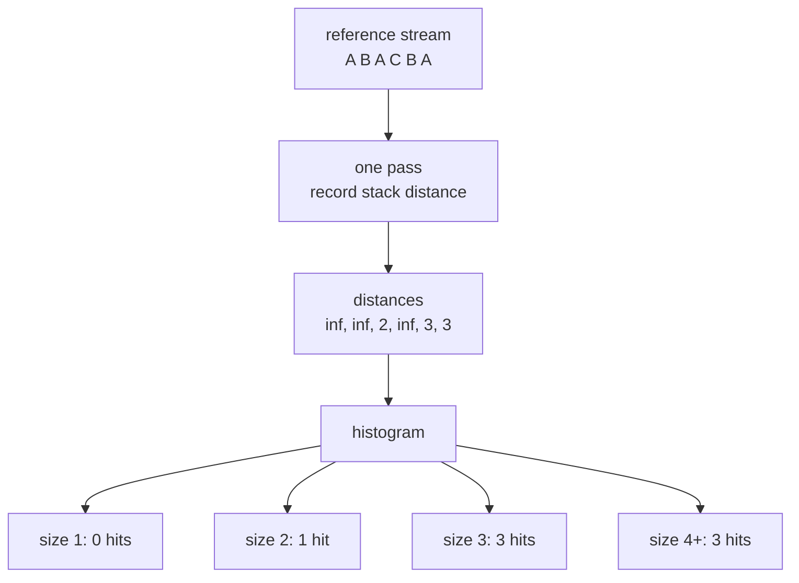

# Evaluation techniques for storage hierarchies

> **Evaluation techniques for storage hierarchies** · `doi:10.1147/sj.92.0078` · IBM Systems Journal,
> 1970, 9(2), 78–117 · <https://doi.org/10.1147/sj.92.0078>
> Record opened on 2026-09-05 via the CrossRef registration for the DOI; the title above is copied
> from that record.

## One-line answer

For a replacement policy with the **inclusion property** — what a cache of size C holds is always a
subset of what a cache of size C+1 holds, and least-recently-used has it — the hit rate at **every**
cache size can be read off a **single pass** over the reference stream, because the answer was always
a property of the stream and not of the cache.

## The story

Somebody has to decide how much memory to put in a machine, and the machine has not been built yet.

Before this paper the way you answered that was to pick a size, write a simulation, feed it a recorded
trace of what the programs actually asked for, and count. Then pick another size and do it again. Then
another. Each run walked the whole trace, and the traces were long — that was the point of them, a
short trace tells you nothing.

So a person who wanted a curve, rather than a point, was asking for a machine to run for a very long
while, and they got one number per run. And the results were not comparable in the way you would hope:
each simulation was its own program, with its own bug surface, and two people asking the same question
about the same trace could get different answers and have no way to find out which of them was wrong.

The uncomfortable part is that everybody in the field could feel that the answers were related.
Obviously a bigger cache hits more. Obviously the same trace is driving all of it. But "obviously
related" is not a method, and until somebody could say *exactly* how they were related, the only
honest thing to do was run the simulation again.

## The idea in plain language

Two definitions first, because the whole result sits on them.

A **reference stream** is the sequence of things asked for, in order. `A B A C B A`. That is the input,
and it is the only input.

**Least-recently-used** — LRU — is a replacement rule: when the cache is full and something new
arrives, throw out whatever has gone longest without being asked for.

Now the observation. Run LRU with a cache of size 3 over some stream, and separately with a cache of
size 4. At every point in time, **everything in the size-3 cache is also in the size-4 cache.** Not
usually. Always. The bigger cache holds the smaller cache's contents plus one more.

That is the **inclusion property**, and a replacement rule that has it is called a **stack algorithm**,
because you can draw the caches as one stack: the top 3 entries are the size-3 cache, the top 4 are the
size-4 cache, and so on down.

Once you see the caches as one stack, the consequence follows in a line. Keep a single stack ordered
by how recently each item was used, most recent at the top. When a reference arrives, find how far
down it is — call that its **stack distance** — and move it to the top.

An item found at distance `d` was in the top `d` entries. So it is a **hit** in every cache of size `d`
or larger, and a **miss** in every cache smaller than `d`. One number, computed once, answers the
question for every cache size at the same time.

Count the distances into a histogram, and the histogram *is* the hit-rate curve. Nothing is simulated.

## Why Sutra needs it

Part [5.1](../parts/05-the-response-cache/5.1-the-traffic-decides-the-hit-rate.md) makes a claim that
sounds like an opinion: *the hit rate is a property of the traffic, not of the cache.* This paper is
where that stops being an opinion. If one pass over the stream determines the answer for every cache
size, then the cache size was never the thing carrying the information — the stream was.

That gives Sutra two concrete things.

It gives part [7.2](../parts/07-in-production/7.2-eviction-shared-stores-and-semantic-caching.md) the
number that parks eviction. The curve says the desk's cache saturates at ten entries, so "how big
should the store be" has an answer and it is small enough not to be a decision.

And it gives the whole day its measuring discipline. Every table in this day sweeps one knob over the
same fixed traffic, which is a version of the same idea: hold the stream still, move the parameter,
read the curve. Day 50 did the same thing to chunk size and top-k, and this is the paper where that method was
first written down properly.

## The mechanism

Take the stream `A B A C B A`, a stack that starts empty, and walk it.

| Step | Reference | Stack before (top first) | Stack distance | Stack after |
| --- | --- | --- | --- | --- |
| 1 | A | — | ∞ (first sight) | A |
| 2 | B | A | ∞ (first sight) | B A |
| 3 | A | B A | 2 | A B |
| 4 | C | A B | ∞ (first sight) | C A B |
| 5 | B | C A B | 3 | B C A |
| 6 | A | B C A | 3 | A B C |

Now read the distances: `∞, ∞, 2, ∞, 3, 3`.

- A cache of size 1 gets zero hits — no distance is ≤ 1.
- A cache of size 2 gets one hit — the single distance of 2.
- A cache of size 3 gets three hits — the 2 and both 3s.
- A cache of size 4 or larger gets three hits. Nothing is left.

That table is the whole method, and the three infinities are the **compulsory misses**: the first sight
of an item cannot be a hit at any size, which is why every hit-rate curve starts below 100% no matter
how much memory you buy.

Two properties are worth naming because they are what make it work rather than merely be clever:

**It requires the inclusion property, and not every policy has it.** LRU has it. Least-frequently-used
has it. **First-in-first-out does not** — there are streams where a FIFO cache of size 4 misses a
reference that a size-3 cache would have hit, a result known as the FIFO anomaly. Run the one-pass
method on a FIFO cache and you get a confident, wrong curve. The method's precondition is a real precondition.

**The cost moved rather than vanishing.** One pass, but each reference searches the stack for the item,
so the work is proportional to the stack depth. The saving is that you pay that once instead of once
per candidate size. Later work replaced the linear search with a balanced tree or a hash plus counting
structure, which is the version in a modern tool; the 1970 result is the reduction from *N passes* to
*one*, and that is the part that never got better because it cannot.



## The paper in one demo

Two files. One computes the curve the paper's way; the ablation flag computes it the way the field did
before, by simulating each size separately. **The two must print the same curve** — the paper's claim
is that the shortcut is exact, not approximate — and the difference is the work done.

It lives in `days/day-51-caching-the-quota-lifeline/lab/papers/storage-hierarchies/`.

```text
lab/papers/storage-hierarchies/
├── trace.py   # the reference stream: 60 support questions, in arrival order
└── stack.py   # both methods, and the ablation switch
```

`trace.py` is the input and nothing else:

```python
"""The reference stream: 60 support questions, in the order they were asked."""

REFERENCES: list[str] = [
    "customer bounced back to the sign-in page during single sign-on",
    "how do i reset a customer's password",
    "what does error 4403 mean",
    "customer bounced back to the sign-in page during single sign-on",
    # ... 56 more, generated from lab/_log.py
]
```

**Line by line:**

- A plain list of strings. No timestamps, no tenants, no answers — the method needs the **order** and
  the **identity** of each reference and nothing else, and including anything more would blur what the
  demo is demonstrating.
- The strings are the normalised questions from `lab/_log.py`, so the curve this demo prints is the
  curve for Sutra's own desk rather than for a synthetic workload.
- It is written out as a literal rather than imported from `_log.py` so that the demo is self-contained:
  two files, no path juggling, runnable from a fresh checkout.

`stack.py` carries both methods:

```python
def stack_distances(references: list[str]) -> tuple[list[int | None], int]:
    """One pass. Returns each reference's stack distance and the references read."""
    stack: list[str] = []
    distances: list[int | None] = []
    examined = 0
    for item in references:
        found: int | None = None
        for position, held in enumerate(stack, start=1):
            examined += 1
            if held == item:
                found = position
                break
        distances.append(found)
        if found is not None:
            stack.pop(found - 1)
        stack.insert(0, item)
    return distances, examined
```

**Line by line:**

- `stack` is the LRU ordering, most recently used first. There is exactly one of them, for all cache
  sizes at once — that single object is the paper's entire contribution made physical.
- `enumerate(stack, start=1)` makes the position **1-based**, so a hit at the very top has distance 1
  and is a hit in a cache of size 1. Zero-based here would be an off-by-one in every row of the curve.
- `found = None` for an item never seen. `None` rather than a large number, because "never seen" is a
  compulsory miss and is categorically different from "seen, but deep".
- `stack.pop(found - 1)` then `stack.insert(0, item)` is the LRU update: remove from where it was, put
  it on top. Doing the insert without the pop would leave duplicates and every later distance would be
  wrong.
- `examined` counts stack entries inspected. It is not part of the method; it is the meter that makes
  the ablation comparison quantitative rather than rhetorical.
- The stack is **never truncated**. That is the point — it is not a cache of any particular size, it is
  the ordering that all sizes are read off.

```python
def curve_from_distances(distances: list[int | None], max_size: int) -> list[int]:
    """Hits at every cache size, from the histogram of distances alone."""
    histogram = [0] * (max_size + 2)
    for distance in distances:
        if distance is not None and distance <= max_size:
            histogram[distance] += 1
    hits: list[int] = []
    running = 0
    for size in range(1, max_size + 1):
        running += histogram[size]
        hits.append(running)
    return hits
```

**Line by line:**

- This function never looks at `references`. It sees only the distances, which is the proof that the
  stream has already been fully consumed: the curve is a transformation of a histogram.
- `histogram[distance] += 1` — one bucket per distance.
- `running += histogram[size]` is the cumulative sum, and it is the paper's claim expressed as three
  lines of arithmetic: a reference at distance `d` is a hit at every size `≥ d`, so hits at size `C` is
  the count of distances `≤ C`.
- The loop is over `max_size`, not over the references, so its cost is the width of the curve and not
  the length of the stream. Doubling the trace does not make this function slower.

```python
def simulate_one_size(references: list[str], size: int) -> tuple[int, int]:
    """The ablation: an ordinary LRU cache of exactly one size."""
    stack: list[str] = []
    hits = 0
    examined = 0
    for item in references:
        found = None
        for position, held in enumerate(stack, start=1):
            examined += 1
            if held == item:
                found = position
                break
        if found is not None:
            hits += 1
            stack.pop(found - 1)
        stack.insert(0, item)
        del stack[size:]
    return hits, examined
```

**Line by line:**

- Almost the same function, with **one line added**: `del stack[size:]`. That is the ablation. Truncating
  the stack to a fixed size turns the paper's universal stack into an ordinary cache of one size, and
  the universality is gone.
- It returns `hits` for that size only. To get a curve you call it once per size, walking the whole
  stream each time.
- Keeping the two implementations this close together is deliberate: the difference between the field's
  method and the paper's is one line, which is exactly the kind of claim that is easy to assert and
  worth showing.

Run it both ways.

```bash
cd days/day-51-caching-the-quota-lifeline/lab/papers/storage-hierarchies
uv run python stack.py
uv run python stack.py --ablate
```

**Line by line:**

- No flag: one pass, then the histogram. The paper's method.
- `--ablate`: `MAX_SIZE` separate LRU simulations, one per cache size. The idea switched off.
- Both print the same three-column table, so the two can be compared by eye and by `diff`.

Measured on 2026-09-05, the paper's method:

```text
the paper: one pass, then the histogram
references in the stream : 60
passes over the stream   : 1
stack entries examined   : 351

 cache size   hits  hit rate
          1      0       0%
          2      0       0%
          3      3       5%
          4     13      22%
          5     19      32%
          6     27      45%
          7     38      63%
          8     46      77%
          9     48      80%
         10     50      83%
         11     50      83%
         12     50      83%
```

And ablated:

```text
ABLATED: one LRU simulation per cache size
references in the stream : 60
passes over the stream   : 12
stack entries examined   : 3226

 cache size   hits  hit rate
          1      0       0%
          2      0       0%
          3      3       5%
          4     13      22%
          5     19      32%
          6     27      45%
          7     38      63%
          8     46      77%
          9     48      80%
         10     50      83%
         11     50      83%
         12     50      83%
```

**The curves are identical, row for row.** That is the claim: the shortcut is exact.

**1 pass against 12. 351 stack entries examined against 3,226.** Nine times the work for the same
answer, on a 60-reference trace and a 12-wide curve. Both factors grow with the width of the curve you
want, which is why the saving was worth a paper in 1970 and is still worth it now.

One more thing this demo makes visible, which is Sutra's own finding rather than the paper's: the
curve flattens at **size 10** and never moves again, because the desk's traffic has exactly ten
distinct questions. Reading that off the graph is how part
[7.2](../parts/07-in-production/7.2-eviction-shared-stores-and-semantic-caching.md) parks eviction with
a number rather than with a shrug.

## When it breaks

**It requires the inclusion property.** The method is not a general trick for caches; it is a
consequence of a specific structural fact about certain replacement policies. FIFO does not have the
property — the FIFO anomaly is the demonstration that a larger FIFO cache can miss where a smaller one
hit — so applying stack distances to a FIFO cache produces a curve that is confidently wrong rather
than noisy. Any modern policy that mixes recency and frequency with an adaptive parameter has to be
checked rather than assumed.

**It assumes the stream does not depend on the cache.** The reference stream is recorded and then
replayed, which quietly assumes that the program would have asked for the same things in the same
order at a different cache size. For the 1970 setting — instruction and data references from a fixed
program — that is close enough to true. For anything with feedback it is not: if a cache miss makes
your service slower, and slower makes users retry, then the stream at size 4 is *not* the stream at
size 8, and no method that replays one trace can see it.

**It is a hit-rate curve and not a cost curve.** The paper measures hits. It says nothing about
whether a hit is cheap, whether a miss is catastrophic, or whether the entries are the same size. A
cache whose misses cost a model call and whose hits cost a dictionary lookup — Sutra's — has a cost
curve shaped very differently from its hit curve, and the hit curve alone would happily recommend a
size that saves nothing worth having.

**The trace is one trace.** The curve is exact for the stream it was computed on and is a prediction
for any other. Day 50's warning applies unchanged: ten questions means one question is ten percentage
points, and a curve computed on an hour of traffic is a description of that hour.

## In production

**What survived.** The core result survived completely and is now infrastructure. Stack distance —
often called **reuse distance** — is how modern cache analysis is done: it is in CPU-simulation
toolchains, in compiler locality analysis, in database buffer-pool sizing, in CDN capacity planning.
Any tool that shows you a "miss ratio curve" is doing this, and doing it in one pass. The reframing
survived too, and is arguably the more valuable half: **the reference stream is the object of study,
not the cache.** That sentence is why part
[5.1](../parts/05-the-response-cache/5.1-the-traffic-decides-the-hit-rate.md) exists.

**What did not.** The linear stack search did not: modern implementations use a tree or a hash with a
counting structure, so the cost is logarithmic per reference rather than proportional to depth, and at
very large scale the exact curve is replaced by a sampled approximation with error bars. The paper's
own worked examples are about instruction and data references in a 1970 storage hierarchy, and that
framing has aged completely — nobody is sizing a drum store. And the assumption that the trace is
independent of the cache, which was reasonable then, is the assumption that most often fails now, in
any system where latency changes user behaviour.

**What it means for a cache in front of a language model**, which is a use the paper could not have
anticipated. The method transfers exactly, because a sequence of prompts is a reference stream and a
response cache under LRU is a stack algorithm. What does not transfer is the interpretation: in 1970
a miss was slower, and today a miss is *slower and costs quota*, while a **hit can be wrong** — a
storage cache returns the same bytes that were stored and a response cache returns a claim about a
world that may have changed
([5.4](../parts/05-the-response-cache/5.4-the-answer-that-was-right-when-it-was-stored.md)). So the
curve tells you the whole truth about the size question and nothing at all about the TTL question,
and the second is the one that can hurt a customer.

## Check yourself

```bash
cd days/day-51-caching-the-quota-lifeline/lab/papers/storage-hierarchies
uv run python stack.py
uv run python stack.py --ablate
diff <(uv run python stack.py | tail -12) <(uv run python stack.py --ablate | tail -12)
```

The `diff` must print nothing. Then compute the stack distances of `A B A C B A` by hand, check them
against the table in *The mechanism*, and say which cache size is the first to get every non-compulsory
hit.

**Out loud, without scrolling up:** *what did this paper actually claim, and what do we do
differently now?* The claim is that one pass over the reference stream gives the hit rate at every
cache size, for any replacement policy with the inclusion property. What we do differently: we compute
stack distance with a tree instead of a linear scan, we sample it at very large scale, and — for a
cache in front of a model — we know the curve answers the size question and says nothing about whether
a hit is still true.

**Next:** back to the hub, [`LESSON.md`](../LESSON.md) §11, for the ledger rows and the commit.
