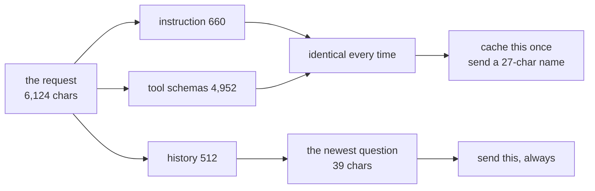

# 1.1 — The same sentence, paid for twice

## One-line answer

Every request the desk sends carries 6,124 characters of instruction, tool schemas and history
that were byte-for-byte identical last time, and caching is the practice of not paying for those
characters again.

## The story

There is a shop near the market that fills in government forms for people. The form for a driving
licence runs to four pages. Three and a half of those pages are the same for everybody: the office
address at the top, the eleven declarations in the middle, the list of accepted documents at the
back. Half a page is you — your name, your father's name, your blood group.

The man at the counter types all four pages, every time, for every customer. He has typed the
eleven declarations perhaps nine thousand times. He charges by the page.

One morning his nephew joins the shop, watches this for an hour, and asks the obvious question:
*why not keep the three and a half pages ready and only type the half page that changes?*

It is such an obvious question that it is worth asking why nobody had asked it. The answer is that
the man at the counter was never charged for the typing. He was charged for the paper, and the
paper is the same either way. Nobody looked at the typing because nobody had ever seen a bill with
"typing" written on it.

Sutra has that bill. It is called the quota, and today is the day we read the line item.

## The idea in plain language

A **cache** is a copy of work you have already done, kept somewhere you can reach it faster or
cheaper than doing the work again. That is the whole idea. Everything difficult about caching is
not the copy — it is deciding **when two pieces of work are the same piece of work**.

Two words that this day will use constantly, defined once here:

- A **hit** is when you ask the cache for something and it has it. You did not do the work.
- A **miss** is when you ask and it does not have it. You do the work, and usually you put the
  result in the cache on your way past, so the next asker gets a hit.

The **hit rate** is hits divided by lookups. It is the number every caching dashboard shows first,
and [5.1](../05-the-response-cache/5.1-the-traffic-decides-the-hit-rate.md) will show you why it is
also the number most likely to be lying to you.

Now the thing being cached here. When Sutra's support desk answers one question, it does not send
the question. It sends a **request**, and a request is four things glued together:

| Piece | What it is | Does it change between questions? |
| --- | --- | --- |
| the system instruction | the desk's standing orders, written on Day 6 | no |
| the tool declarations | the JSON schemas for `search_tickets`, `lookup_ticket`, `escalate_to_human` | no |
| the retrieved rows | the past tickets Day 49's index found for *this* question | yes |
| the conversation | every turn so far, user and model | grows |

Day 24 established the accounting rule that makes this matter. A **token** is the unit a model
charges in — roughly a word-piece, defined on
[Day 2, part 2.1](../../../day-02-llm-mechanics/parts/02-tokens-the-meter/2.1-what-a-token-is.md) —
and [Day 24, part 1.2](../../../day-24-token-accounting-and-budgets/parts/01-what-a-request-costs/1.2-charged-again-every-turn.md)
showed that a conversation re-sends its whole history on every single turn. The instruction is not
sent once at the start of a chat. It is sent again, in full, with every question, forever.

So the shop's four pages are not a metaphor for the request. They are a description of it.

## Why Sutra needs it

Day 46 opened Phase 7 by asking *"has the desk seen anything like this before?"*, and the phase
gate on Day 52 says that question must be answered **at $0**. Days 47 to 50 built the answering
machinery: a persistent session store, a memory design, a retrieval index, and a measured chunk
size and top-k. None of those days spent a model call, because none of them needed one.

The desk itself does. Every answer it gives is a generation, and
[Day 24, part 2.3](../../../day-24-token-accounting-and-budgets/parts/02-two-ceilings/2.3-denominated-in-quota-not-dollars.md)
established that Sutra's budget is denominated in requests per day, not in rupees. The free tier
this curriculum runs on allows **20 generate requests a day** on `gemini-3.7-flash` — a number
read off a live 429 on Day 2 and recorded in `docs/PACKAGES.md`, because no published table
carries it.

Twenty. A support desk with six agents on it will exhaust twenty before the morning tea break.
Caching is not an optimisation for Sutra. It is the difference between a desk that works and a desk
that stops at 11am, and that is why this day sits between the retrieval days and the phase gate
rather than somewhere near deployment.

## The mechanism

The lab has a fixture, `lab/_desk.py`, that builds exactly the request the desk sends: the Day 6
instruction, the three tool declarations, the two rows Day 50's retriever returned at
`CHUNK_SIZE = 900` and `TOP_K = 2`, and a five-turn conversation. Nothing in it is invented; it is
the desk written out in full so the arithmetic runs from a fresh checkout.

Measure the three pieces:

```bash
cd days/day-51-caching-the-quota-lifeline/lab
uv run python prefix.py
```

**Line by line:**

- `prefix.py` builds the request with `_desk.request()` and then asks **ADK's own estimator** for
  the token count, rather than counting characters and dividing by a number of its own. That
  choice matters: the estimator is what ADK uses to decide whether to cache, so its answer predicts
  a decision rather than describing a prompt.
- It prints the instruction, the tools and the contents separately, because the whole day turns on
  which of those three is stable and which changes.
- No flag is needed for the default arm. The `--k` and `--archive` flags are used in
  [3.3](../03-the-floor-we-never-reach/3.3-what-would-have-to-change.md).

Measured on 2026-09-05:

```text
Gemini 3 explicit-cache floor : 4096 tokens
ADK's estimator               : 4 chars a token, floor division

no retrieval         instruction    660 + tools  4952 + contents[:4]
                     whole request  1531 tok   cacheable prefix  1521 tok  (37.1%)  refused, 2575 tokens short

retrieval, k=2       instruction   1222 + tools  4952 + contents[:4]
                     whole request  1671 tok   cacheable prefix  1661 tok  (40.6%)  refused, 2435 tokens short
```

Read the first row and ignore, for now, the words `refused` and `floor` — those belong to
[section 3](../03-the-floor-we-never-reach/3.1-two-floors-and-a-first-turn-rule.md), and this part
is only about the sizes.

**The tool declarations are 4,952 characters.** The instruction is 660. The three JSON schemas that
describe what `search_tickets`, `lookup_ticket` and `escalate_to_human` accept are **seven and a
half times the size of the desk's entire standing orders**, and they are the most rigidly identical
part of the whole request. They were written on Day 4 and Day 39 and they have not changed since.

That is the eleven declarations on the licence form. Every question the desk answers pays for them
again.

Now the same request, measured as characters on the wire before and after a cache hit:

```bash
uv run python shrink.py
```

**Line by line:**

- `shrink.py` calls ADK's `_apply_cache_to_request`, which is the function that actually performs
  the substitution when a cache is in play. It is not a simulation of what a cache does; it is the
  code that does it.
- `CACHE_NAME` is the shape of a real cache resource name, quoted from ADK's own docstring in
  `google/adk/models/cache_metadata.py`. Nothing is created and nothing is sent.
- The before and after rows use the same character-counting function, so the two numbers are
  comparable.

```text
before     instruction    660  tools  4952  contents   512  total   6124  cached_content=None
after      instruction      0  tools     0  contents    39  total     39  cached_content=cachedContents/8fzp2a4k1c9x

contents left on the wire : 1
tools left on the wire    : None
instruction left on wire  : None

the request the desk sends went from 6124 to 39 characters, plus 27 for the cache name
```

Six thousand one hundred and twenty-four characters become thirty-nine, plus a twenty-seven
character receipt. The half page and the ticket number.



## When it breaks

The first way this breaks is by not being measured at all. Here is what that looks like: someone
reads that caching saves money, sets it up, and never runs the equivalent of `prefix.py`. The
number they never saw is the one on the third line of that output — `4952` — and the consequence
is that they spend their effort shortening the *instruction*, which is 660 characters, while the
schemas sit there at nearly five thousand.

The second way is subtler and it is the reason this part exists before any of the mechanism. Run
the estimator on a request whose retrieved rows have been pasted into the instruction, which is
where Day 49 put them:

```text
retrieval, k=2       instruction   1222 + tools  4952 + contents[:4]
                     whole request  1671 tok   cacheable prefix  1661 tok  (40.6%)
```

The instruction went from 660 to 1,222 characters because the two retrieved ticket rows were glued
onto the end of it. That is 562 characters of text that is **different for every question** now
living inside the piece that was supposed to be the stable one.

Nothing has gone wrong yet — the request is still built, still valid, still answerable. But a
design decision made two days ago for a completely unrelated reason has just moved the boundary
between "same every time" and "different every time", and
[1.3](1.3-a-key-is-a-promise-about-sameness.md) is about what that costs.

## In production

**What a professional writes instead.** They do not start by turning caching on. They start by
printing the three sizes, because the sizes decide whether caching is worth doing at all and which
of the two kinds to reach for. A request whose stable prefix is 90% of the payload is a
context-caching problem. A request that is 90% conversation is not, and no amount of configuration
will make it one. `prefix.py` is fourteen lines of real work and it is the first thing to write.

**What degrades at scale.** The tool schemas grow. Every day of this curriculum that adds a tool
adds a few hundred characters to the fixed part of every request the desk will ever send, and
nobody notices because a tool is added for a good reason and the cost is spread over every future
call. Day 39 added database tools; Day 40 added the filtering posture. A team that adds twenty
tools has a five-figure character prefix on every request and usually has no idea, because the
number is never printed anywhere. The review discipline is to print `chars(req)` in the same log
line as the response, so the prefix size is a graph and not a surprise.

**The failure that only appears with real traffic.** One question is cheap. The cost is the
*product* of the prefix size and the request count, and request count is the thing that changes
when a desk goes from one agent to six.
[Day 50, part 3.1](../../../day-50-chunking-and-top-k/parts/03-the-k-is-a-budget/3.1-k-is-a-budget-not-a-preference.md)
made the same argument about retrieved rows and priced it over a conversation rather than over a
request; the arithmetic here is identical and the multiplier is larger, because the prefix is on
every request and the retrieved rows are only on the ones that retrieved.

**The review comment a senior engineer leaves:** *"You've told me caching will help. Show me the
split first. If the instruction is 600 characters and the schemas are 5,000, then the thing to cache
is the schemas, and the thing to stop editing casually is the schemas. Right now I can't tell
whether this is a 10% saving or a 99% one, and those two need different amounts of my attention."*

**The interview question:** *"Where does the money go in an LLM request?"* An honest answer:
*"Almost always into the part that does not change. I measured my own agent: 6,124 characters a
request, of which 4,952 were the JSON schemas for three tools and 660 were the system instruction.
The actual new question was 39 characters. So 92% of every request was a byte-for-byte repeat of the
last one, and it was charged for every time, because a conversation re-sends its whole history on
each turn. That ratio is the first thing I measure before I decide anything about caching, because
it tells me whether I have a caching problem or a prompt-length problem, and those have different
fixes."*

## Check yourself

```bash
cd days/day-51-caching-the-quota-lifeline/lab
uv run python prefix.py
uv run python shrink.py
```

Now open `lab/_desk.py` and delete one of the three `types.FunctionDeclaration` blocks from `TOOLS`.
Re-run `prefix.py` and write down how many characters one tool costs. That number is what every
future day of this curriculum pays each time it adds a tool.

**Out loud, without scrolling up:** name the four pieces of a request, say which of them are
identical between two different questions, and give the ratio of stable characters to new ones for
Sutra's desk.

**Next:** [1.2 — Two caches wearing one name](1.2-two-caches-wearing-one-name.md).
