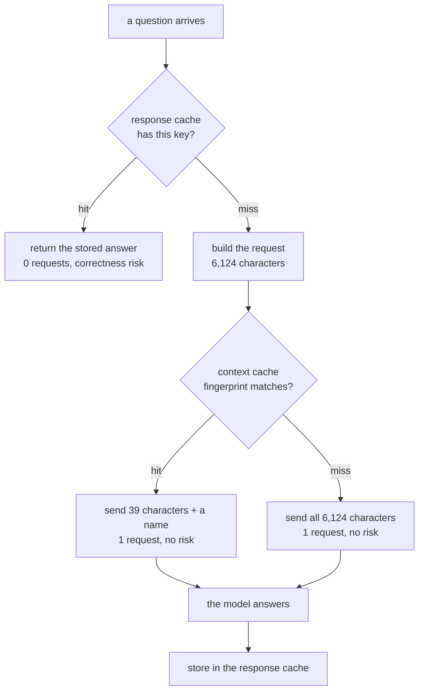

# 1.2 — Two caches wearing one name

## One-line answer

"Caching" names two different mechanisms that save two different currencies — a **context cache**
saves characters inside a request you still send, and a **response cache** saves the request
entirely — and confusing them is why teams report a saving their quota page does not show.

## The story

A canteen near a college serves lunch to four hundred people in one rush. The cook
has two completely different tricks for getting through it, and if you ask her what her trick is
she will name whichever one you happen to be standing next to.

The first trick happens at six in the morning. She chops the onions, boils the dal base, grinds the
masala. None of that is anybody's lunch yet. When an order comes in she still cooks it, still stands
at the pan, still plates it — but the chopping is done. The order takes a fraction of the work it
would have taken.

The second trick happens at eleven. She makes forty plates of the day's thali and stacks them under
a cover. When somebody orders the thali she does not cook at all. She hands over a plate.

Both are "preparing in advance". They are not the same thing at all. The first one still costs her a
turn at the pan for every customer; if four hundred people come, she stands at the pan four hundred
times. The second one costs her nothing per customer, and it carries a risk the first one does not:
a plate under a cover at half past two is not the same plate it was at eleven.

Ask her *"how many times did you cook today?"* and only the second trick changes the answer.

## The idea in plain language

The two tricks have names.

**Context caching** stores the stable front of a request on the model provider's side, and gives you
a short name to send instead of it. You still make the call. The model still runs. What changes is
how many characters you had to push across, and how many tokens the provider charges you for
processing them. This is the chopped onions.

**Response caching** stores the finished answer, keyed by the question. When the same question
arrives again you return the stored answer and **make no call at all**. This is the plate under the
cover.

Set them side by side, because almost every mistake in this day comes from sliding between the two:

| | Context cache | Response cache |
| --- | --- | --- |
| What is stored | the request's stable prefix | the model's finished answer |
| Where it lives | the provider, behind a resource name | your own process, or your own store |
| Who implements it | ADK, via `ContextCacheConfig` (ADK-31) | you, in `sutra/cache.py` |
| A hit saves | tokens, and the work of processing them | **the whole request** |
| A hit costs you | still one request | nothing |
| Can it be wrong? | no — the model still answers your actual question | **yes** — a stored answer can go stale |
| What decides a hit | a fingerprint over the prefix (2.3) | a key you write yourself (1.3) |

Read the last two rows together, because they are the trade. A context cache cannot give you a wrong
answer; the model reads the cached prefix and then reads your new question and answers it fresh. A
response cache can, and will, hand somebody an answer that stopped being true — that is
[5.4](../05-the-response-cache/5.4-the-answer-that-was-right-when-it-was-stored.md), and it is not a
hypothetical.

And now the row that decides Sutra's day. **A hit costs you: still one request.** Sutra's free tier
is metered in requests per day, not tokens — twenty of them, from
[Day 24, part 2.3](../../../day-24-token-accounting-and-budgets/parts/02-two-ceilings/2.3-denominated-in-quota-not-dollars.md).
A context cache can save 99% of the characters in a request and it will not buy the desk a single
extra answer.

That sentence is uncomfortable and it is the honest centre of this day.

## Why Sutra needs it

Because ADK gives you one of these and not the other, and the documentation for the one it gives you
is titled "Model context caching" — a name that a tired reader will map onto whichever cache they
already had in mind.

ADK-31 is the context cache: `ContextCacheConfig`, an `App`-level setting, covered in
[section 4](../04-the-adk-config/4.1-where-the-config-goes.md). OPS-10 is the operations of caching
in general, and the part of it that actually protects Sutra's quota is the response cache, which
**no framework will write for you** because only you know when two questions are the same question.

If the day taught only ADK-31 it would close its ID and leave the desk still dying at twenty
requests. If it taught only the response cache it would ignore the framework surface the plan
assigned. Both, kept apart, is the day.

## The mechanism

The clearest way to see that these are two mechanisms is to price the same working day through each
of them and read the two answers.

```bash
cd days/day-51-caching-the-quota-lifeline/lab
uv run python savings.py
```

**Line by line:**

- `savings.py` runs both arms over the same fixtures: `_desk.py` for the request, `_log.py` for the
  traffic. Nothing differs between the arms except which cache is being priced.
- The context-cache arm calls ADK's real `_apply_cache_to_request`, so the "before / after" numbers
  are the ones ADK would actually produce, not an estimate of them.
- The response-cache arm replays the 60-ask log through the normalised key from `hitrate.py` at a
  TTL of 3600 seconds, then multiplies by `TURNS_PER_ASK = 2` — because one desk answer is a short
  conversation and not a single call, which is
  [Day 50, part 3.1](../../../day-50-chunking-and-top-k/parts/03-the-k-is-a-budget/3.1-k-is-a-budget-not-a-preference.md)'s
  point applied to requests instead of tokens.
- `FREE_TIER_REQUESTS_PER_DAY = 20` is quoted from `docs/PACKAGES.md`, not chosen.

Measured on 2026-09-05:

```text
=== the context cache: tokens ===

the desk as Day 50 left it
    cacheable prefix          1521 tok  (floor 4096)
    request before / after    6124 / 39 characters
    characters not re-sent    6085  (99% of the request)
    requests saved               0
    verdict                 REFUSED, below the floor

=== the response cache: requests ===

asks in the log                        60
requests with no cache                120   (2 a turn)
cache hits at ttl 3600                 27   (45%)
requests with the cache                66
requests saved                         54   (45%)
of the hits, wrong answers              0

=== against the ceiling ===

no cache                      120 requests  =    6.0 days of free tier (20 a day)
response cache, ttl 3600       66 requests  =    3.3 days of free tier (20 a day)

The context cache saved characters and zero requests.
The response cache saved requests and bought a correctness risk to go with them.
```

Three numbers do the whole job.

**99% of the request, and zero requests saved.** The context cache is not weak here; it is
spectacular at what it does. It removes almost the entire payload. It removes exactly nothing from
the count that Sutra's ceiling is measured in.

**54 requests saved out of 120, and 45%.** The response cache halves the day. One working day at the
desk goes from six days of free tier to three and a third.

**`of the hits, wrong answers: 0` — for now.** That column is zero because the key used here happens
to be good enough for this traffic. Change the key and it stops being zero, which is
[5.3](../05-the-response-cache/5.3-the-key-that-dropped-the-field.md). The context cache has no such
column, because it cannot have one.



Follow the arrows and the asymmetry is visible: only the top branch skips the box marked
*1 request*.

## When it breaks

The failure is a sentence in a status update, and it reads like a success.

🎬 **The scene.** A team turns on ADK's context caching. The next standup, someone reports: *"caching
is live, we're seeing a 99% reduction."*

😬 **The naive fix.** Nobody does anything, because 99% is a good number and there is nothing to fix.

💥 **Why it fails.** Two weeks later the service still hits its rate limit at the same point every
afternoon, and now nobody can explain it, because the caching dashboard is green. The 99% was
characters. The limit is requests. The two numbers were never connected, and the green dashboard is
actively making the problem harder to see.

💡 **The insight.** A caching report has to name its unit in the same sentence as its number, and the
unit has to be the one the bill is written in. *"99% fewer characters, 0% fewer requests"* is one
sentence, it is true, and nobody who reads it goes back to their desk relaxed.
[6.1](../06-proving-the-saving/6.1-the-saving-in-the-unit-of-the-bill.md) turns that into a report
format.

There is a second break, which is the same confusion pointed the other way. Somebody writes a
response cache, is delighted, and assumes it also fixed the size of their requests. It did not. Every
miss still sends the full 6,124 characters, and misses are the majority of traffic on any cache with
an honest key. The two mechanisms compose; neither substitutes for the other.

## In production

**What a professional writes instead.** They keep two counters and never one. `requests_saved` and
`characters_saved`, emitted on the same log line, in
[Day 22's](../../../day-22-structured-logging/parts/01-a-line-you-can-query/1.2-one-json-object-per-line.md)
one-JSON-object-per-line format. The moment those two are one field called `savings` the confusion in
this part is unrecoverable, because nobody downstream can tell which cache moved.

**What degrades at scale.** The two caches degrade in opposite directions, which is the argument for
running both. A response cache degrades as your traffic gets more varied — more distinct questions,
fewer repeats, and by
[5.1](../05-the-response-cache/5.1-the-traffic-decides-the-hit-rate.md) there is a ceiling on the hit
rate that your code cannot move. A context cache degrades as your *prefix* gets less stable — a
prompt that includes today's date, or the retrieved rows, or a random ordering — and that one you can
fix, because the prefix is yours. Under growth, the response cache's ceiling comes down and the
context cache's value goes up.

**The failure mode that only appears with real traffic.** Under low traffic, a context cache can cost
more than it saves. Creating one is itself an API call, and so is deleting it; if the entry serves
two requests before the fingerprint moves, you have spent two calls of bookkeeping to save two calls
of payload. [2.4](../02-the-context-cache/2.4-the-three-ways-a-cache-dies.md) counts exactly that,
and `ops.py`'s fourth alarm is the one that catches it.

**The review comment a senior engineer leaves:** *"Which cache is this PR adding? The description
says 'add caching' and the diff touches both a `ContextCacheConfig` and a dict keyed by question.
Those have different failure modes — one of them can serve a wrong answer and one of them can't —
and they need separate tests. Split the PR."*

**The interview question:** *"You added caching and your rate-limit errors didn't go down. What
happened?"* An honest answer: *"Almost certainly I added the wrong one of the two caches. Context
caching stores the stable front of the prompt on the provider's side and sends a handle instead — it
cuts tokens, and in my case it cut 99% of the request, but you still make the call, so it does
nothing at all for a request-per-day quota. The one that moves a request quota is a response cache:
same question, return the stored answer, make no call. I measured both on the same day of traffic —
the context cache saved 6,085 of 6,124 characters and zero requests; the response cache saved 54 of
120 requests. And the second one is the one that can be wrong, so it's the one that needed a TTL, a
tenant in the key and an audit column."*

## Check yourself

```bash
cd days/day-51-caching-the-quota-lifeline/lab
uv run python savings.py
uv run python savings.py --ttl 900
```

The second command lowers the TTL. Write down what happened to `requests saved` and say, in one
sentence, what you bought with the requests you gave back.

**Out loud, without scrolling up:** name the two caches, say what each one stores, and say which of
the two can hand a support agent an answer that is wrong.

**Next:** [1.3 — A key is a promise about sameness](1.3-a-key-is-a-promise-about-sameness.md).
