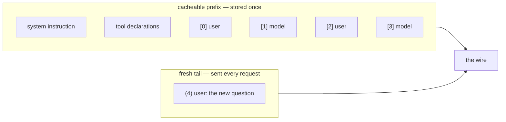

# 2.1 — What ADK is willing to cache

## One-line answer

ADK caches everything in the conversation before the **last unbroken run of user messages**, which
means the cacheable prefix ends wherever the newest question begins — and on the very first turn
that boundary is at zero, so there is nothing to cache at all.

## The story

A child packs her school bag the night before. Some things go in and stay in: the textbooks for
whichever subjects run every day, the geometry box, the water bottle. She does not take them out in
the morning. They live in the bag.

Some things cannot go in the night before. The tiffin box, because it is filled in the morning. The
form her mother has to sign. The homework she has not finished.

The rule she has worked out, without ever saying it, is simple: **anything that is settled goes in;
anything still being decided stays out.** And the boundary moves. On Sunday night, when nothing at
all about Monday is settled, the bag is empty and every single thing is a morning job.

Now watch what happens if she is careless with the boundary. She puts the tiffin box in the night
before, because it is technically a thing that goes to school. In the morning her mother has to open
the bag, take it out, fill it, and put it back. The packing did not save any work. It cost extra.

## The idea in plain language

A conversation, as a model sees it, is an ordered list. Each entry has a `role` — `"user"` for the
person, `"model"` for the reply — and some text. Sutra's desk conversation is five entries:

```text
[0] user   customer bounced back to the sign-in page during single sign-on
[1] model  I found a past case. ticket:4610 had the same loop...
[2] user   does that apply if they are on the desktop app?
[3] model  ticket:4488 records the same symptom on Chrome and Edge...
[4] user   what should I tell them to check first?
```

Everything up to and including `[3]` is settled. It happened. It will never change. Entry `[4]` is
the question being asked right now, and it is the reason we are calling the model at all.

ADK's rule is one sentence: **cache everything before the last unbroken run of user messages.**

"Unbroken run" is doing real work in that sentence. Scan backwards from the end. Keep going while
you see `user`. Stop at the first non-`user` entry. Everything before where you stopped is the
**cacheable prefix**; everything from there on is sent fresh.

Two words to hold, because the rest of section 2 uses them constantly:

- The **cacheable prefix** is the part ADK will store: the system instruction, the tool
  declarations, and `contents[:count]`.
- The **fresh tail** is what goes on the wire every time: `contents[count:]`.

Why *unbroken run* rather than simply "the last message"? Because a person can ask two things in a
row without waiting for an answer, and both of those are the current question. Caching the first of
them would mean sending a request with no new user content in it at all, which the API rejects.

## Why Sutra needs it

This rule is the reason a context cache does not help a desk that answers one question and stops.

Sutra's desk, as it stands after Day 50, is not a long chat. An agent asks something, gets an answer,
and often that is the whole interaction. On that shape the conversation is one entry long, the last
unbroken run of user messages is that one entry, and the cacheable prefix is `contents[:0]` — empty.
The instruction and tools are still cacheable, but there is no *conversation* to cache, and
[3.2](../03-the-floor-we-never-reach/3.2-thirty-seven-per-cent-of-the-way-to-a-cache.md) shows what
that does to the numbers.

Knowing where the boundary sits also tells you where **not** to put things. Day 49 pasted the
retrieved ticket rows into the system instruction. That is inside the cacheable prefix — which sounds
good until you remember that the rows are different for every question, which is the tiffin box in
the bag overnight. [2.3](2.3-the-fingerprint-is-the-key.md) prices that mistake exactly.

## The mechanism

ADK finds the boundary in `_find_count_of_contents_to_cache`. Verified against
`adk.dev/context/caching/` and against the installed `google-adk==2.7.1` on 2026-09-05; the method is
reproduced here from `google/adk/models/gemini_context_cache_manager.py` because the documentation
page states the policy in prose and not in code:

```python
def _find_count_of_contents_to_cache(self, contents: list[types.Content]) -> int:
    """Strategy: find the last continuous batch of user contents, cache everything before it."""
    if not contents:
        return 0
    last_user_batch_start = len(contents)
    for i in range(len(contents) - 1, -1, -1):
        if contents[i].role == "user":
            last_user_batch_start = i
        else:
            break
    return last_user_batch_start
```

**Line by line:**

- `if not contents: return 0` — an empty conversation caches nothing. This is not an edge case to be
  tidy about; it is the first turn of every session, and it is the reason for one of the three
  refusals in [3.1](../03-the-floor-we-never-reach/3.1-two-floors-and-a-first-turn-rule.md).
- `last_user_batch_start = len(contents)` — the initial value is *past the end*, so a conversation
  whose last entry is a model reply caches everything. That case is real: it is what ADK sees when
  a tool has just returned and the model is about to speak again.
- `range(len(contents) - 1, -1, -1)` — the scan runs backwards. Forwards would find the *first* user
  message, which is a different and useless boundary.
- `if contents[i].role == "user": last_user_batch_start = i` — every consecutive user entry moves the
  boundary further back. Two questions in a row and both stay outside the cache.
- `else: break` — the first non-user entry stops the scan. This is what makes the run *unbroken*.
- The return value is a **count**, not an index, and it is used as `contents[:count]` everywhere.
  Confusing count with index here is an off-by-one that silently caches the current question.

Run it over four conversation shapes:

```bash
cd days/day-51-caching-the-quota-lifeline/lab
uv run python cacheable.py
```

**Line by line:**

- `cacheable.py` builds each shape from `_desk.TURNS` and calls ADK's real method — the same object
  the runtime uses, not a reimplementation.
- `[i]r` marks an entry inside the cacheable prefix and `(i)r` marks one sent fresh, so the boundary
  is visible as a position in a line rather than as a number to be interpreted.
- The `u` and `m` are the first letters of the roles.

Measured on 2026-09-05:

```text
[i]r = inside the cacheable prefix   (i)r = sent fresh every time

one question, cold start     (0)u
                             cacheable prefix = contents[:0] of 1

after one exchange           [0]u [1]m (2)u
                             cacheable prefix = contents[:2] of 3

the desk as it stands        [0]u [1]m [2]u [3]m (4)u
                             cacheable prefix = contents[:4] of 5

two questions in a row       [0]u [1]m [2]u [3]m (4)u (5)u
                             cacheable prefix = contents[:4] of 6
```

Read the fourth shape against the third. A sixth entry was added — another user question — and the
cacheable prefix **did not grow**. It stayed at four. Both trailing user messages are the current
question as far as ADK is concerned, and neither can be cached.

Read the first shape and sit with it. `contents[:0] of 1`. On a cold start there is no conversation
prefix at all. Whatever a context cache is going to do for the desk, it cannot do it on the first
question, and a desk whose sessions are mostly one question long is mostly first questions.



## When it breaks

The break is the tiffin box: **something that changes, placed inside the prefix.**

Day 49 built the retrieval index and Day 50 tuned it, and both days put the retrieved rows into the
system instruction, which is the most cacheable thing in the whole request. Watch what that does:

```bash
uv run python prefix.py
```

**Line by line:**

- The first arm builds the request with `with_rows=False` — the instruction as Day 6 wrote it.
- The second arm builds it with `with_rows=True`, which is what the desk actually does, appending
  the two rows Day 50's retriever returned.
- Only the instruction size differs between the arms. The tools and the conversation are identical.

```text
no retrieval         instruction    660 + tools  4952 + contents[:4]
                     whole request  1531 tok   cacheable prefix  1521 tok  (37.1%)

retrieval, k=2       instruction   1222 + tools  4952 + contents[:4]
                     whole request  1671 tok   cacheable prefix  1661 tok  (40.6%)
```

The prefix got **bigger**, which looks like a win, and it is not. Those extra 562 characters are
different for every question. A prefix that changes on every request is a prefix that has to be
created on every request — and creating one is itself an API call. The larger number is a larger
thing being repeatedly built and thrown away.

[2.3](2.3-the-fingerprint-is-the-key.md) shows the fingerprint moving under exactly this edit, and
`fingerprint.py` prints `retrieved rows pasted in ... MOVED` for it.

There is no error message for this failure, which is why it needs a part. The only symptom is a
create-and-delete count that matches your request count, and you will only see that if you are
counting — [2.4](2.4-the-three-ways-a-cache-dies.md).

## In production

**What a professional writes instead.** They put per-request material in the **contents**, not in the
instruction. Retrieved rows belong in a user-role message immediately before the question, or in a
tool result, both of which land in the fresh tail where they cost nothing to change. The system
instruction is reserved for things that are true for every request in the deployment. Said as a rule
someone can apply without thinking: *if it came from this question, it does not go in the
instruction.*

**What degrades at scale.** The boundary is a function of conversation shape, and conversation shape
is a product decision made by someone who has never heard of a cache. A change from "one answer per
question" to "the desk asks a clarifying question first" doubles the number of turns and moves every
prefix. A change to streaming partial answers can produce runs of user messages that never break. The
prefix count is worth logging per request for exactly this reason: it is a number that moves when
somebody changes the product.

**The failure mode that only appears with real traffic.** Long conversations grow their cacheable
prefix, which sounds like caching getting better with time. It is, until the prefix grows past what
the provider will store, or until the conversation is compacted — Day 20's compaction rewrites
history, which moves every fingerprint at once and abandons every cache in flight. A caching design
that has not been reconciled with a compaction design will thrash on precisely the long conversations
it was supposed to help.

**The review comment a senior engineer leaves:** *"You're appending the retrieval results to
`system_instruction`. That's inside the cached prefix, so every question invalidates the cache and
pays a create. Move them into a content just before the user's question. Same tokens, and the prefix
stops moving."*

**The interview question:** *"What exactly gets cached when you turn on context caching?"* An honest
answer: *"Not what people assume. The framework caches the system instruction, the tool declarations
and the conversation up to the last unbroken run of user messages — so the boundary is wherever the
current question starts, and on a cold first turn the conversation part of the prefix is empty. The
practical consequence is that anything you compute per request has to live after that boundary. I had
retrieved RAG rows glued onto the system instruction, which put per-question text inside the cached
prefix, so the cache was recreated on every single call. Moving them into a content just before the
question fixed it without changing a token of what the model sees."*

## Check yourself

```bash
cd days/day-51-caching-the-quota-lifeline/lab
uv run python cacheable.py
uv run python cacheable.py --tool
```

Then open `lab/_desk.py`, add a sixth turn with role `"model"` to `TURNS`, and predict the cacheable
count before you re-run `cacheable.py`. Write your prediction down first.

**Out loud, without scrolling up:** state ADK's caching boundary rule in one sentence, and say what
the cacheable prefix is on the very first question of a brand-new session.

**Next:** [2.2 — What a hit does to the request](2.2-what-a-hit-does-to-the-request.md).
