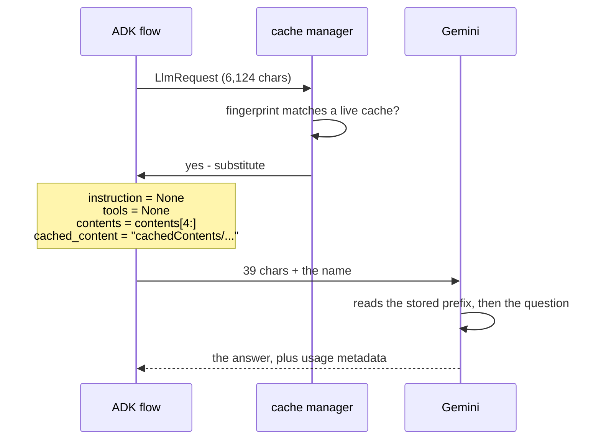

# 2.2 — What a hit does to the request

## One-line answer

A context-cache hit is not a discount applied to your bill — ADK physically deletes the system
instruction, the tools and the cached contents from the outgoing request and puts a single resource
name in their place, so the desk's request goes from 6,124 characters to 39.

## The story

There is a courier office where you send a parcel to the same address every month. The first time,
you fill in the whole form: name, house number, street, landmark, city, pin code, phone. The clerk
copies it into a register and gives you a customer number written on a card.

The next month you walk in with the parcel and the card. You do not fill in the form. You do not read
the address out. You hand over the card, he writes the number on the parcel, and that is the whole
transaction.

Here is the part people get wrong when they describe this. The clerk does not fill in a shorter form
on your behalf. **The form does not exist.** There is no piece of paper with your street on it
anywhere in that transaction. The address is in the register, the parcel has a number on it, and the
two are joined later by somebody who is not you.

That distinction matters because it changes what you have to worry about. You are no longer worried
about writing the address wrong. You are worried about one thing instead: whether the number on the
card still points at the right entry in the register.

## The idea in plain language

When ADK decides a cache applies to a request, it performs a substitution before the request leaves
your process. Four things happen:

1. `config.cached_content` is set to the cache's **resource name** — a string like
   `cachedContents/8fzp2a4k1c9x`.
2. `config.system_instruction` is set to `None`.
3. `config.tools` and `config.tool_config` are set to `None`.
4. The cached contents are **dropped off the front** of `contents`, leaving only the fresh tail from
   [2.1](2.1-what-adk-is-willing-to-cache.md).

The word to hold onto is **substitution**. The request is not annotated, not flagged, not marked as
cacheable. Material is deleted from it and a name is put in place of the deleted material. What
arrives at the provider is a genuinely small request.

A **resource name** is the provider's identifier for a stored object — the courier's customer number.
It is opaque: nothing about the cached content can be read out of it, and it is not a hash of
anything you control.

This is also why a context cache **cannot give you a wrong answer**, the claim made without
justification in [1.2](../01-two-caches-two-currencies/1.2-two-caches-wearing-one-name.md). The model
still runs. It still reads your actual new question. The cached prefix is genuinely the same text you
would have sent, stored on the provider's side. The only thing that can go wrong is the name pointing
at the wrong entry, and preventing that is the entire job of the fingerprint in
[2.3](2.3-the-fingerprint-is-the-key.md).

## Why Sutra needs it

Sutra logs requests. Day 22 built structured logging, one JSON object per line, and Day 44 built the
client hardening around timeouts and retries. Both of those look at a request object.

After a cache hit, **that request object no longer contains the instruction or the tools.** A log line
that records `len(system_instruction)` will record zero. A retry that rebuilds a request from a logged
payload will rebuild an empty one. A test that asserts the tools are present will fail on the cached
path and pass on the uncached one, which is the worst kind of flaky test — it depends on whether the
previous request happened to warm a cache.

Knowing that a hit *deletes* rather than *marks* is what stops those three bugs from being written.

## The mechanism

ADK does the substitution in `_apply_cache_to_request`. Verified against
`adk.dev/context/caching/` and against `google-adk==2.7.1` on 2026-09-05.

`lab/shrink.py` calls that method directly on the desk's request and prints the request before and
after, using the same character-counting function for both:

```bash
cd days/day-51-caching-the-quota-lifeline/lab
uv run python shrink.py
```

**Line by line:**

- `manager()` builds a real `GeminiContextCacheManager` holding a `Client` with a fake key. Nothing
  is sent: the substitution is a pure function of the request object, and the client exists only
  because the fingerprint recipe hashes which backend it would talk to.
- `CACHE_NAME` is the shape of a real name, quoted from ADK's docstring in
  `google/adk/models/cache_metadata.py`. No cache is created, so this is a plausible name rather than
  one this run earned — and the substitution does not care what the string is.
- `count` comes from `_find_count_of_contents_to_cache`, so the boundary is the one
  [2.1](2.1-what-adk-is-willing-to-cache.md) established rather than a number chosen here.
- `chars(req)` is called before and after with no other change in between, which is what makes the
  two rows comparable.

Measured on 2026-09-05:

```text
before     instruction    660  tools  4952  contents   512  total   6124  cached_content=None
after      instruction      0  tools     0  contents    39  total     39  cached_content=cachedContents/8fzp2a4k1c9x

contents left on the wire : 1
tools left on the wire    : None
instruction left on wire  : None

the request the desk sends went from 6124 to 39 characters, plus 27 for the cache name
```

Take the three lines in the middle one at a time, because each is a fact somebody's code depends on.

**`contents left on the wire : 1`.** Five entries went in; one came out. Entries `[0]` to `[3]` are in
the cache. Entry `[4]` — the actual question — is what travels.

**`tools left on the wire : None`.** Not an empty list. `None`. Code that does
`for tool in request.config.tools:` raises `TypeError` on this path and works fine on the uncached
one.

**`instruction left on wire : None`.** Same shape of hazard. The desk's standing orders are not in the
request that gets sent, and any assertion, log field or redaction pass that reads them will see
nothing.

And the arithmetic: 6,124 characters become 39, plus a 27-character name. Ninety-nine per cent of the
payload does not travel.



Notice where the provider joins the two halves: on its side, after the request arrives. That is the
courier's register, and it is the reason nothing in the small request needs to describe the large one.

## When it breaks

Two breaks, and the second is the one that reaches production.

**The first is loud.** Code that assumes the tools are always present:

```python
tool_names = [d.name for t in request.config.tools for d in t.function_declarations]
```

**Line by line:**

- `request.config.tools` is `None` after a cache hit, so the outer comprehension iterates `None`.
- The failure is at the `for t in ...`, before anything is unpacked, so the traceback does not mention
  caching at all.

```traceback
Traceback (most recent call last):
  File "sutra/observability.py", line 41, in log_request
    tool_names = [d.name for t in request.config.tools for d in t.function_declarations]
                                  ^^^^^^^^^^^^^^^^^^^^
TypeError: 'NoneType' object is not iterable
```

The smallest fix is `for t in (request.config.tools or [])`, and the reason it is worth writing that
everywhere rather than only here is that this path is entered only on a cache **hit** — so the bug
appears the second time a question is asked and not the first.

**The second is silent**, and it is a logging bug. A line that records the request size will report
39 characters on a hit and 6,124 on a miss. Averaged over a day of traffic, the "mean request size"
graph shows a number that is neither: it is a blend of two populations with a ratio nobody controls.
Someone will use that graph to argue about prompt length. The fix is to log `cached_content` as its
own field so hits and misses can be separated — one of the five fields
[6.2](../06-proving-the-saving/6.2-the-log-line-and-four-alarms.md) insists on.

## In production

**What a professional writes instead.** They treat `LlmRequest` as two shapes rather than one, and
say so in the type they log. Every place that reads `system_instruction`, `tools` or `contents[0]`
gets a `or []` / `or ""` and a comment naming this substitution. Redaction and PII scrubbing in
particular must run **before** the substitution, because after it there is nothing to scrub and the
scrubber will report a clean request that was never inspected — which is a compliance failure dressed
as a passing check.

**What degrades at scale.** Nothing about the substitution degrades; it is a pure function. What
degrades is everything built on the assumption that a request is self-describing. Replay tooling is
the sharpest case: a logged cached request cannot be replayed, because the 6,085 characters it
depends on live in a provider-side object with a TTL, and by the time anyone replays the incident
that object is gone. Teams that want replay have to log the *pre-substitution* request, which is the
large one, which is the thing they were trying not to move around.

**The failure mode that only appears with real traffic.** Cache hits are the majority path on
successful traffic and the minority path on the first request after any deployment. So a bug on the
cached path has an incidence that is a function of deploy frequency, and it will look like it
correlates with releases rather than with caching. The tell is that it never reproduces on the first
request of a fresh session.

**The review comment a senior engineer leaves:** *"This function reads `request.config.tools` without
a guard. On a context-cache hit that field is `None`, not an empty list — ADK deletes it and puts the
resource name in `cached_content`. Add the guard and add a test that calls this with a substituted
request, otherwise we find out on the second question in production."*

**The interview question:** *"What does the request look like after a cache hit?"* An honest answer:
*"Much smaller than people expect, and structurally different rather than annotated. The framework
deletes the system instruction, the tool declarations and the cached contents from the outgoing
request and sets a resource-name field instead. On my agent that took a 6,124-character request down
to 39 characters plus a 27-character name. The practical consequence is that everything reading the
request has to cope with two shapes — I hit a `TypeError: 'NoneType' object is not iterable` in my
own logging code, because `tools` becomes `None` and not an empty list, and it only fired on the
second question because the first one was a miss."*

## Check yourself

```bash
cd days/day-51-caching-the-quota-lifeline/lab
uv run python shrink.py
```

Now edit `shrink.py` and print `req.config.tool_config` after the substitution as well. Then find one
place in your own notes from Day 22 or Day 44 where a request field is read without a guard, and
write down what it would do on this path.

**Out loud, without scrolling up:** list the four things ADK changes on the outgoing request when a
cache applies, and say why a context cache cannot produce a wrong answer.

**Next:** [2.3 — The fingerprint is the key](2.3-the-fingerprint-is-the-key.md).
