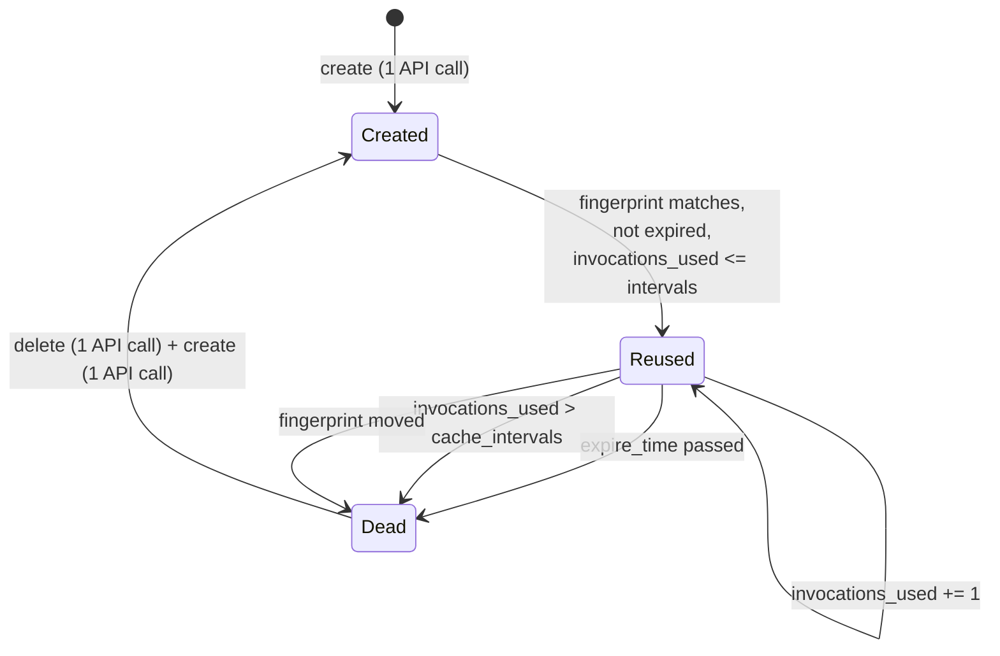

# 2.4 — The three ways a cache dies

## One-line answer

ADK abandons a cache for exactly three reasons — the TTL passed, the reuse count passed
`cache_intervals`, or the fingerprint moved — and whichever limit is tightest is the only one you are
actually tuning, which is why the desk's default settings die 18 times from reuse and 0 times from
expiry.

## The story

The milk booth in a colony issues tokens. You buy a book of them, and each token gets you one litre.

There are three ways a token stops working, and every household learns all three the hard way.

It has a date printed on it, and after that date the booth will not take it. That is the first way,
and it is the one people expect.

The book has ten tokens in it, and after the tenth you are back at the counter buying another book.
Nobody thinks of that as the token "expiring", but it ends the arrangement just as completely. That
is the second way, and it is the one that actually ends most books, because most families finish ten
litres long before the date on the token.

And then one month the booth changes hands, the new owner prints his own tokens, and the ones in your
drawer are worthless with time still on them. That is the third way. It has nothing to do with you.

Ask a household *"how often do you go to the counter?"* and the honest answer is decided by whichever
of those three comes first — and it is almost never the printed date.

## The idea in plain language

A cached prefix on the provider's side is not permanent. ADK checks three conditions before reusing
one, in this order, and the first failure abandons it:

1. **Expiry.** The cache has an `expire_time`. Past it, gone. Controlled by
   `ContextCacheConfig.ttl_seconds`, default 1800 seconds.
2. **Reuse count.** The cache carries `invocations_used`. When that exceeds
   `ContextCacheConfig.cache_intervals`, gone. Default 10.
3. **Fingerprint.** The fingerprint recomputed from the current request must equal the one stored
   with the cache. Different, gone. This is [2.3](2.3-the-fingerprint-is-the-key.md).

The word "gone" is doing something specific. It means the cache is not reused; the next request
creates a fresh one and, on ADK's path, the old one is deleted. **A create is an API call and so is a
delete.** So each death costs you two calls of bookkeeping in exchange for the payload savings on
however many turns the dead cache managed to serve.

That gives the only number in this part worth remembering:

> **turns served per cache** — the payload savings divided by the bookkeeping.
> Below about two, the cache is costing more than it saves.

And now the sentence that surprises people, which the story already gave away: **only the tightest of
the three limits is doing anything.** If reuse runs out after 10 turns and your traffic sends a turn
every 20 seconds, the cache dies at 200 seconds of age and the 1800-second TTL has never once been
consulted. Tuning the TTL in that configuration is tuning a number that does not participate.

## Why Sutra needs it

`ContextCacheConfig` has three fields and it is very easy to set all three to reasonable-looking
numbers and have no idea which one is in charge. The day's build brief asks you to choose them, and
the gate refuses a bare number without a comment naming the run it came from — the same discipline
Day 50 applied to `CHUNK_SIZE` and `TOP_K`.

There is also a Sutra-specific reason. Every create and every delete is a call against the same
provider that answers the desk's questions. On a free tier of 20 requests a day, a caching
configuration that produces 37 extra API calls over 200 turns has spent nearly two days of quota on
bookkeeping. That is not a rounding error; it is the whole budget.

## The mechanism

The three conditions live in `_is_cache_valid`, from `google-adk==2.7.1`, verified against
`adk.dev/context/caching/` on 2026-09-05. The quote is reflowed to this repo's 100-column style;
nothing else is changed.

```python
if time.time() >= expire_time:
    logger.info("Cache expired: %s", cache_name)
    return False
if invocations_used > cache_config.cache_intervals:
    logger.info(
        "Cache exceeded cache intervals: %s (%d > %d intervals)",
        cache_name,
        invocations_used,
        cache_config.cache_intervals,
    )
    return False
current_fingerprint = self._generate_cache_fingerprint(llm_request, cache_metadata.contents_count)
if current_fingerprint != cache_metadata.fingerprint:
    logger.debug("Cache content fingerprint mismatch")
    return False
return True
```

**Line by line:**

- The order is fixed: expiry, then reuse, then fingerprint. It matters for the log, not for the
  outcome — whichever check fires first is the reason that gets written down, so a cache that is both
  expired and stale is logged as expired.
- `time.time() >= expire_time` — wall clock, absolute, on the client side. A machine with a skewed
  clock will abandon caches early or reuse dead ones and get an error from the provider.
- `invocations_used > cache_config.cache_intervals` — strictly greater, so `cache_intervals=10` gets
  you eleven invocations before it dies, not ten. Off-by-one traps like this are exactly why the lab
  drives ADK's own comparison rather than re-implementing it.
- `_generate_cache_fingerprint(llm_request, cache_metadata.contents_count)` — the recomputation uses
  the **stored** contents count, not a freshly computed one. Hashing a different prefix length would
  fail every time, which is the reason `contents_count` is a field on `CacheMetadata` at all.
- `logger.debug` on the fingerprint branch, `logger.info` on the other two — the most expensive
  failure mode is logged at the quietest level. Worth raising in your own configuration.

Now count the deaths over a day of turns:

```bash
cd days/day-51-caching-the-quota-lifeline/lab
uv run python lifecycle.py
```

**Line by line:**

- `lifecycle.py` walks 200 turns, one every 20 seconds, through those three conditions using ADK's
  real `ContextCacheConfig` and `CacheMetadata` objects.
- `--intervals`, `--ttl` and `--drift` move one knob each, so a change in the output has one cause.
- `extra API calls` is `created + deaths`, because each death is a delete and each birth is a create.

Measured on 2026-09-05, with the defaults:

```text
config: ContextCacheConfig(cache_intervals=10, ttl=1800s, min_tokens=0, create_http_options=None)
traffic: 200 turns, one every 20 s, instruction edited every never turns

caches created          : 19
  died, expired         : 0
  died, used up         : 18
  died, fingerprint     : 0

extra API calls (create + delete): 37
turns served per cache           : 10.5
```

**Zero expiries.** The 1800-second TTL — the default, the number in the documentation, the one
everybody tunes first — did nothing at all. Every single death was the reuse count.

Now raise only the reuse ceiling:

```bash
uv run python lifecycle.py --intervals 100
```

**Line by line:**

- One knob moved: `cache_intervals` from 10 to 100. The TTL is untouched at 1800 seconds.
- The traffic is identical, so any change in the table is caused by the ceiling.

```text
caches created          : 3
  died, expired         : 2
  died, used up         : 0
  died, fingerprint     : 0

extra API calls (create + delete): 5
turns served per cache           : 66.7
```

Nineteen caches became three. Thirty-seven extra calls became five. And the deaths **changed kind** —
now that reuse is loose, the TTL is finally the tightest limit and it starts doing the killing.

That is the whole lesson of this part in two runs. The number you tune is not the number you set; it
is whichever one bites first, and you find out which by counting the deaths and not by reading the
config.

For completeness, the third kind, from a drifting instruction:

```bash
uv run python lifecycle.py --drift 30
```

**Line by line:**

- `--drift 30` edits the system instruction every 30 turns, which is what a weekly prompt tweak or a
  periodic policy refresh looks like at this timescale.
- Both other knobs stay at their defaults, so the fingerprint deaths are additive to the reuse deaths.

```text
caches created          : 20
  died, expired         : 0
  died, used up         : 13
  died, fingerprint     : 6

extra API calls (create + delete): 39
turns served per cache           : 10.0
```

Six fingerprint deaths appear and thirteen reuse deaths remain. The two causes coexist, and a report
that gave only a total would hide the fact that one of them is a prompt-hygiene problem and the other
is a configuration choice.



## When it breaks

The break is a caching configuration that costs more than it saves, and it has a threshold you can
compute. Set the reuse ceiling to 1:

```bash
uv run python lifecycle.py --intervals 1
```

**Line by line:**

- `cache_intervals=1` allows two invocations before the cache dies, because the comparison is strictly
  greater than.
- This is not a silly setting to reach for. It is what someone writes when they read "intervals" as
  "how many caches to keep" rather than "how many reuses to allow".

Measured on 2026-09-05:

```text
caches created          : 100
  died, expired         : 0
  died, used up         : 99
  died, fingerprint     : 0

extra API calls (create + delete): 199
turns served per cache           : 2.0
```

One hundred caches for 200 turns and **199 extra API calls** to save payload on 200 requests. The
bookkeeping is very nearly one-for-one with the work. On a metered-by-request free tier this
configuration is strictly worse than having no cache at all, and it produces no error, no warning and
a perfectly healthy-looking hit rate.

This is the fourth alarm in [6.2](../06-proving-the-saving/6.2-the-log-line-and-four-alarms.md):
bookkeeping calls divided by calls saved, with a ceiling of 1.0. It is the alarm that nobody
implements and the only one that catches this.

## In production

**What a professional writes instead.** They log the death reason, not just the fact of a miss. Three
counters — `cache_died_expired`, `cache_died_used_up`, `cache_died_fingerprint` — because the three
have three different owners. Expiry is a config decision. Reuse exhaustion is a config decision.
Fingerprint churn is a **prompt-engineering bug** and belongs to whoever last edited the instruction.
A single `cache_miss` counter merges a config knob with a code defect and guarantees the wrong person
gets paged.

**What degrades at scale.** The reuse ceiling interacts badly with horizontal scaling. `invocations_used`
is per cache object, and a fleet of replicas each creating their own cache for the same prefix
multiplies the create traffic by the replica count while dividing the reuses per cache by the same
number. Ten replicas with `cache_intervals=10` behave like one replica with `cache_intervals=1`, which
is the failure in *When it breaks*, arrived at by an infrastructure change nobody connected to
caching.

**The failure mode that only appears with real traffic.** Bursty traffic defeats the TTL and steady
traffic defeats the reuse count, so a service whose traffic changes shape between weekday and weekend
switches which limit is in charge without anyone touching the config. The tell is a caching cost that
has a weekly seasonality nobody can explain, and it is only visible if the death reasons are counted
separately.

**The review comment a senior engineer leaves:** *"You've set `ttl_seconds=600` and left
`cache_intervals` at the default of 10. At our turn rate the reuse count fires first every time, so
the TTL you just tuned is dead code. Either raise the intervals so the TTL is the binding constraint,
or leave the TTL alone and say in the comment that intervals is the knob."*

**The interview question:** *"Your context caching is enabled but you're still making a lot of API
calls. How do you debug it?"* An honest answer: *"I'd count why the caches are dying, because there
are only three reasons and they have different owners. On my agent the defaults gave 19 caches over
200 turns — 18 deaths from the reuse ceiling and zero from the TTL, so the TTL I'd been tuning was
irrelevant. Raising the reuse ceiling took it to 3 caches and 5 bookkeeping calls instead of 37, and
then the deaths switched to TTL expiries, which told me which knob was actually binding. The one I'd
escalate rather than tune is fingerprint churn — that isn't a config problem, it means something
per-request is inside the prompt prefix, and no setting fixes it."*

## Check yourself

```bash
cd days/day-51-caching-the-quota-lifeline/lab
uv run python lifecycle.py
uv run python lifecycle.py --intervals 100
uv run python lifecycle.py --intervals 1
```

Now find the setting of `--intervals` at which the deaths switch from `used up` to `expired` for this
traffic, and write down what that number tells you about the turn rate.

**Out loud, without scrolling up:** name the three ways a cache dies, say which one is a
prompt-engineering bug rather than a configuration choice, and explain why the TTL can be completely
irrelevant.

**Next:** [3.1 — Two floors and a first-turn rule](../03-the-floor-we-never-reach/3.1-two-floors-and-a-first-turn-rule.md).
