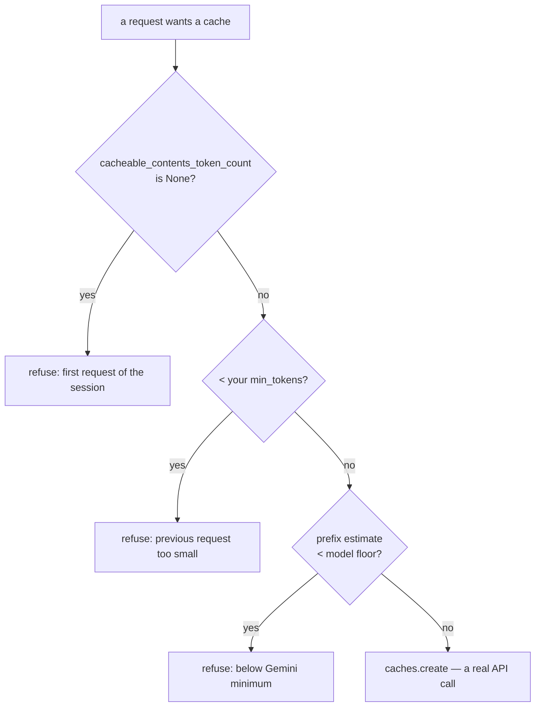

# 3.1 — Two floors and a first-turn rule

## One-line answer

Before a context cache can be created, three gates must open in order — a previous token count must
exist, the prefix must clear **your** `min_tokens`, and it must clear **Gemini's** own floor of 4,096
tokens on a `gemini-3` model — and each refusal writes a different log line that says exactly which
one bit.

## The story

The grain market has two prices on the board. Retail, by the kilo. And bulk, which is roughly a third
cheaper, with `50 kg minimum` written underneath in smaller letters.

A man arrives wanting eighteen kilos. He knows about the bulk price. He has read the board. He asks
for the bulk rate and the shopkeeper says no, and the conversation that follows is the same one every
time: *but I'm a regular customer, but I'll come back next week, but eighteen is nearly twenty.* None
of it works, because the minimum is not a preference the shopkeeper holds. It is a property of how
the sack is packed and moved. Below fifty kilos there is no bulk transaction to have.

What the man actually needs to hear is a number: *you are eighteen of fifty.* Not "no". Not "you
don't qualify". The gap, so he can decide whether the answer is to buy more, to come with a neighbour,
or to accept retail and stop asking.

The rest of this section is Sutra hearing that number about itself.

## The idea in plain language

Creating a context cache is not free for the provider. It has to store the prefix, index it, and keep
it warm. Below a certain size that is not worth doing, so there is a **minimum cacheable size**, and
below it the create request is refused.

There are two such minimums in play, and they belong to different people.

**Yours** is `ContextCacheConfig.min_tokens`. It defaults to `0`. It exists so that you can decline
to cache small requests where the saving would not repay the create-and-delete bookkeeping from
[2.4](../02-the-context-cache/2.4-the-three-ways-a-cache-dies.md).

**The provider's** is not configurable and not published as a number on the documentation page —
`adk.dev/context/caching/` says only that "Gemini applies its own minimum cacheable size, which
varies by model". The number lives in ADK's source, because ADK has to know it in order to avoid
sending a request that will fail:

| Model family | Floor |
| --- | --- |
| `gemini-2.5-*` | 2,048 tokens |
| `gemini-3*` | 4,096 tokens |
| anything else | none that ADK knows about |

And in front of both there is a third gate that no configuration switches off: **the first request of
a session cannot create a cache.** ADK decides whether a prefix is big enough using
`cacheable_contents_token_count` — the token count reported by the *previous* response. On the first
request of a session there has not been a previous response, so the field is `None` and ADK declines
rather than guessing.

That is a defensible choice and it has a consequence worth stating plainly: **a context cache never
helps the first question.** It helps the second one onwards.

## Why Sutra needs it

The desk's request is 1,521 tokens of cacheable prefix. `gemini-3.7-flash` is a `gemini-3` model, so
its floor is 4,096. Those two numbers decide the whole of Sutra's relationship with ADK-31, and
[3.2](3.2-thirty-seven-per-cent-of-the-way-to-a-cache.md) is the part that sits with the answer.

Getting there honestly requires knowing which gate refuses, because the three have completely
different responses:

- *No previous token count* — nothing is wrong. Ask again.
- *Below your own floor* — you set that. Change it, or accept it.
- *Below Gemini's floor* — you cannot change it. The prefix has to grow or context caching is not
  available to you at all.

A team that sees only "caching didn't happen" will spend a week tuning `min_tokens` against a limit
that is not theirs.

## The mechanism

The three gates are the first thirty lines of `_create_new_cache_with_contents` in
`google-adk==2.7.1`, verified against `adk.dev/context/caching/` on 2026-09-05. The quote is
reflowed to this repo's 100-column style; nothing else is changed.

```python
if llm_request.cacheable_contents_token_count is None:
    logger.info("No previous token count available, skipping cache creation for initial request")
    return None
if llm_request.cacheable_contents_token_count < cache_config.min_tokens:
    logger.info(
        "Previous request too small for caching (%d < %d tokens)",
        llm_request.cacheable_contents_token_count,
        cache_config.min_tokens,
    )
    return None
cacheable_prefix_tokens = self._estimate_cacheable_prefix_tokens(llm_request, cache_contents_count)
minimum_cache_tokens = _minimum_cache_tokens(llm_request.model)
if minimum_cache_tokens is not None and cacheable_prefix_tokens < minimum_cache_tokens:
    logger.info(
        "Cacheable prefix below Gemini minimum cache size (%d < %d tokens)",
        cacheable_prefix_tokens,
        minimum_cache_tokens,
    )
    return None
```

**Line by line:**

- `cacheable_contents_token_count is None` is checked **first**, before any size comparison. `None` is
  not zero and must not be compared with `<`; the distinction is "we have not measured" against "we
  measured and it is small".
- The second gate compares against `cacheable_contents_token_count` — the **measured** count of the
  whole previous prompt, from the provider's own usage metadata. It is a real count, not an estimate.
- The third gate compares against `_estimate_cacheable_prefix_tokens` — an **estimate**, characters
  divided by four. The two gates use two different numbers deliberately: the whole previous prompt can
  clear Gemini's floor while the cached prefix alone does not, and ADK's own comment says this is what
  produced `400 INVALID_ARGUMENT` before the third gate was added.
- `_minimum_cache_tokens(llm_request.model)` does a prefix match on the model string:
  `gemini-2.5-` gives 2,048, `gemini-3` gives 4,096, anything else gives `None` and the gate is
  skipped entirely. A model string with a provider prefix is handled by `rsplit("/")` first.
- Every refusal is `logger.info` and `return None`, never an exception. Caching is an optimisation, so
  its failure must not fail the request — which is correct, and is also why nobody notices.

Drive all three:

```bash
cd days/day-51-caching-the-quota-lifeline/lab
uv run python floors.py
```

**Line by line:**

- `floors.py` sets `logging.getLogger("google_adk").setLevel(logging.INFO)` so ADK's own refusal lines
  appear. They are `info` level, which most applications do not print, and that is why this failure is
  usually invisible.
- Each arm sets `req.cacheable_contents_token_count` by hand to the value that trips one specific
  gate, so the three refusals can be produced deliberately rather than waited for.
- It calls the real `_create_new_cache_with_contents`. Arms 1 to 3 all return before any network call,
  which is why the default run is offline and free.

Measured on 2026-09-05:

```text
1. the first request of a session
    previous prompt = None, min_tokens = 2048, prefix estimate = 0
    log: No previous token count available, skipping cache creation for initial request
    returned: None

2. a previous prompt below your own floor
    previous prompt = 500, min_tokens = 2048, prefix estimate = 496
    log: Previous request too small for caching (500 < 2048 tokens)
    returned: None

3. above your floor, below Gemini's
    previous prompt = 3000, min_tokens = 2048, prefix estimate = 2980
    log: Cacheable prefix below Gemini minimum cache size (2980 < 4096 tokens)
    returned: None
```

Those three `log:` lines are the entire diagnostic surface of this feature. Learn to recognise them
by shape:

| The line says | Who owns it | What to do |
| --- | --- | --- |
| `No previous token count available` | nobody | nothing; it is the first turn |
| `Previous request too small for caching (A < B)` | you | B is your `min_tokens` |
| `Cacheable prefix below Gemini minimum cache size (A < B)` | the provider | B is 4,096 or 2,048; grow A or stop |

Note the asymmetry in the second and third lines, because it is a real trap: the second compares the
**whole previous prompt** against your floor, and the third compares the **prefix estimate** against
Gemini's. Two different measurements of two different things, in two lines that look alike.

Now raise your own floor above the provider's and watch which line changes:

```bash
uv run python floors.py --min 8000
```

**Line by line:**

- Only `min_tokens` moves, from 2,048 to 8,000. The traffic and the request are identical.
- Arm 3's previous prompt is still 3,000, which now fails **your** gate before it ever reaches
  Gemini's.

```text
3. above your floor, below Gemini's
    previous prompt = 3000, min_tokens = 8000, prefix estimate = 2980
    log: Previous request too small for caching (3000 < 8000 tokens)
    returned: None
```

Same arm, same refusal, **different reason**. The header still says "above your floor" because the
script's labels were written for the default run, and that is a fair illustration of the confusion
this part exists to prevent: the outcome did not change, so nothing in a dashboard would move, and the
owner of the problem changed completely.



## When it breaks

The break is a fourth arm that this lab **can** run and deliberately does not, and it is worth being
explicit about why.

`floors.py --live` sets the previous prompt to 6,000 tokens, which clears both floors, so ADK proceeds
past every gate and calls `caches.create` for real. That is a network call with a real key against a
real quota, and it is the only thing in this entire day that opens a socket.

```bash
uv run python floors.py --live
```

**Line by line:**

- `--live` adds arm 4 and nothing else; arms 1 to 3 still run offline first.
- It will use whatever `GOOGLE_API_KEY` is in your `.env`, so it also proves your key works.
- The interesting outcome is not success. It is the failure you get when the estimate and the real
  count disagree, because ADK's floor check uses characters divided by four and Gemini counts real
  tokens.

```text
TODO(me): run `uv run python floors.py --live` once, with a real key, and paste the output here.
Expect either a `cachedContents/...` name, or a 400 INVALID_ARGUMENT naming the true token count.
```

That block is a `TODO` and not a transcript on purpose. Principle 10 outranks the shape of the
document: an output nobody ran is completed by one run and is obvious to everyone, while an invented
one is undetectable. This day was written with zero model calls, so this is the one number it does not
have.

What you should expect, and what makes it worth running once: ADK's estimator is four characters per
token, integer division. The real tokenizer is not. Day 24 measured Sutra's own text at **4.55**
characters per token, which means ADK's estimate is systematically **high** — it thinks the prefix is
bigger than it is. A prefix that ADK estimates at 4,100 tokens may be 3,600 real ones, clear ADK's
gate, and be refused by Gemini with a `400 INVALID_ARGUMENT`. The gate is not exact; it is a cheap
filter in front of an expensive refusal.

## In production

**What a professional writes instead.** They set `min_tokens` to at least the provider's floor for the
model they pinned, and they write the number and its source in a comment beside it. Leaving
`min_tokens=0` while running a `gemini-3` model means every under-4,096 request walks all the way to
the third gate before being refused — harmless, but it produces a log full of provider-floor refusals
that look like a provider problem when they are a configuration one. The day's gate,
`lab/gate.py`, has a finding for exactly this.

**What degrades at scale.** The floors are per model, and the model is a config field that people
change. Moving from a `gemini-2.5` model to a `gemini-3` one **doubles** the floor from 2,048 to
4,096, and a prefix that was comfortably cacheable becomes uncacheable with no code change and no
error — just a caching feature that quietly stops working after a model upgrade. This is the same
shape as Day 9's lesson that a model name is a lookup, applied to a limit rather than a capability.

**The failure mode that only appears with real traffic.** Sessions are short in production and long in
testing. A developer testing a chat agent has a twenty-turn conversation and sees caching work
beautifully from turn two. Real users ask one question and leave, so a large share of real requests
are first requests, where the cache can never apply. The measured hit rate in production is
structurally lower than the one in testing, and the gap is the share of sessions with exactly one
turn — a number the product team already has.

**The review comment a senior engineer leaves:** *"`min_tokens=0` with a gemini-3 model pinned. That
means we rely on ADK's estimate to catch what Gemini would reject, and the estimate is 4 chars a
token against a real 4.55, so it's optimistic. Set `min_tokens=4096` and cite the source in the
comment, so a model change makes us re-read the line."*

**The interview question:** *"Why isn't your context caching doing anything?"* An honest answer:
*"Three gates, and they log differently, so I'd read the log before touching config. The first request
of a session can never cache, because the framework sizes the prefix from the previous response's
token count and there isn't one — so short sessions get very little from context caching regardless of
configuration. Then there's my own `min_tokens`, and then the provider's floor, which for gemini-3
models is 4,096 tokens and isn't configurable. In my case the third one was biting: my whole cacheable
prefix was 1,521 tokens, so the answer wasn't a setting, it was that my prompt was too small to be
worth caching."*

## Check yourself

```bash
cd days/day-51-caching-the-quota-lifeline/lab
uv run python floors.py
uv run python floors.py --min 8000
```

Now change `MODEL` in `_desk.py` to `"gemini-2.5-flash"` and re-run `floors.py`. Write down which arm
changed its verdict and why. Change it back.

**Out loud, without scrolling up:** name the three gates in order, say which one you own and which one
you cannot change, and explain why a context cache can never help the first question of a session.

**Next:** [3.2 — Thirty-seven per cent of the way to a cache](3.2-thirty-seven-per-cent-of-the-way-to-a-cache.md).
