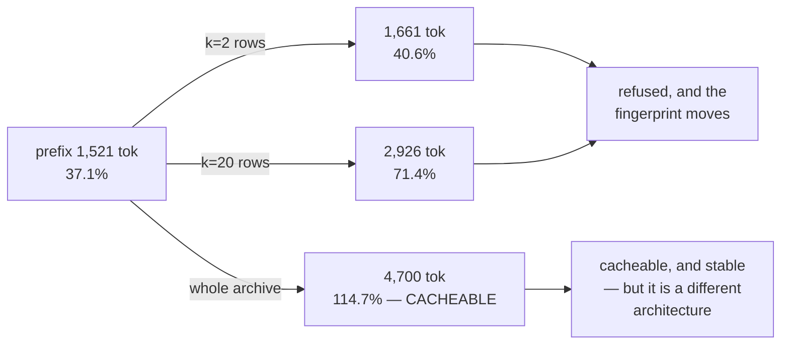

# 3.3 — What would have to change

## One-line answer

There is exactly one change to Sutra that clears the 4,096-token floor honestly — putting the whole
12,716-character ticket archive in the instruction, which takes the prefix to 4,700 tokens — and it is
the same architecture Day 50 identified as a real alternative to retrieval, which turns "enable
caching" into a design question rather than a configuration one.

## The story

A plumber is called to a flat on the ninth floor. The lift is out and the building charges him for
parking by the trip.

He can guess which three tools he needs from what the customer said on the phone, carry those up, and
come back down when the guess is wrong. Most days the guess is right and the trip is light. Some days
he makes it twice.

Or he can carry the whole toolbox up once. It is heavy and most of it he will not touch. But he never
goes down again.

Which is correct depends on numbers he actually has: how often the guess is wrong, how heavy the box
is, how bad the stairs are. It is not a matter of taste, and it is not a matter of what a better
plumber would do. On a two-storey building with a working lift the answer is obviously the three
tools. On the ninth floor with no lift, the whole box starts winning.

The archive is the toolbox. Retrieval is the guess. Day 50 said the numbers were closer than anybody
expects; today the caching floor pushes them one step closer.

## The idea in plain language

The desk's cacheable prefix is 1,521 tokens and needs 4,096. That is a shortfall of 2,575 tokens,
which is roughly 10,000 characters of stable text.

There are only four places stable text can come from, and it is worth listing all four because three
of them are bad:

| Where the 10,000 characters would come from | Verdict |
| --- | --- |
| padding — filler added to reach the floor | dishonest; [3.2](3.2-thirty-seven-per-cent-of-the-way-to-a-cache.md) |
| more tool schemas | real, but arrives on its own schedule; not a decision available today |
| more retrieved rows per question | not stable — moves the fingerprint every request |
| **the whole ticket archive, pasted once** | stable, honest, and Day 50 already priced it |

Only the fourth is both large enough and genuinely unchanging.

Day 50, part
[5.4](../../../day-50-chunking-and-top-k/parts/05-the-wrong-tool/5.4-when-the-whole-archive-fits-in-the-prompt.md)
measured Sutra's whole ticket archive at **12,716 characters, about 2,795 tokens**, and made an
uncomfortable argument: at that size, "just paste the whole thing" is a real alternative to retrieval,
not an obviously worse one. It came out at roughly 31 times the token cost of a single retrieval,
which put it inside the band where judgement is required rather than outside it.

Today adds a term to that comparison. If the archive is in the instruction, the prefix crosses the
floor, context caching applies, and those tokens are **stored once and not re-sent**. The 31× cost
does not disappear — the model still processes the cached content, and on a paid tier cached tokens
are still billed, at a lower rate. But the *transmission* and much of the *processing* of it stop
being per-request.

## Why Sutra needs it

This is the closing argument of Phase 7, and it is why this day sits where it does rather than near
deployment.

Phase 7 spent seven days building the machinery to answer *"have we seen this before?"* — sessions,
memory, an index, a chunk size, a k, a similarity floor. Every one of those days was correct. And the
honest position at the end of it, which Day 50 started and this part finishes, is that for an archive
of this size the retrieval architecture is a *choice* rather than a necessity, and today's floor is
one more number on the other side of the scale.

That belongs in an ADR, not in a config file, and the build brief asks for it.

## The mechanism

`prefix.py` has an arm for exactly this:

```bash
cd days/day-51-caching-the-quota-lifeline/lab
uv run python prefix.py --archive
```

**Line by line:**

- `--archive` appends `ARCHIVE_CHARS` characters to the system instruction. The constant is `12_716`,
  quoted from Day 50 part 5.4's measurement of the real corpus rather than re-counted here.
- The filler is `"x" * ARCHIVE_CHARS` because only the **size** affects the gate; using the real text
  would change nothing in this arithmetic and would make the script depend on Day 50's fixtures.
- The verdict column compares against `GEMINI_3_MIN_CACHE_TOKENS`, the same 4,096 the third gate uses.

Measured on 2026-09-05:

```text
no retrieval         instruction    660 + tools  4952 + contents[:4]
                     whole request  1531 tok   cacheable prefix  1521 tok  (37.1%)  refused, 2575 tokens short

retrieval, k=2       instruction   1222 + tools  4952 + contents[:4]
                     whole request  1671 tok   cacheable prefix  1661 tok  (40.6%)  refused, 2435 tokens short

the whole archive    instruction  13376 + tools  4952 + contents[:4]
                     whole request  4710 tok   cacheable prefix  4700 tok  (114.7%)  CACHEABLE
```

**4,700 tokens. 114.7%. `CACHEABLE`.**

That is the first and only `CACHEABLE` verdict in this entire day, and it took a whole architecture to
get it.

And now the other arm, for completeness, because it is the one people reach for first:

```bash
uv run python prefix.py --k 20
```

**Line by line:**

- `--k 20` is Day 50's *rejected* top-k, the one that part 3.2 of that day measured as 92% noise.
- It is here as a control: it is the largest amount of retrieved text anyone would plausibly send.

```text
retrieval, k=20      instruction   6280 + tools  4952 + contents[:4]
                     whole request  2936 tok   cacheable prefix  2926 tok  (71.4%)  refused, 1170 tokens short
```

Seventy-one per cent, and still 1,170 tokens short. Even at a `k` this curriculum has already rejected
on quality grounds, retrieval cannot fill the gap — and every one of those 6,280 instruction
characters is per-question, so a prefix built that way would be recreated on every request even if it
did clear the floor.



## When it breaks

The break here is doing the arithmetic and stopping, because the arithmetic is only half the decision.
Pasting the archive is not free, and Day 50 named four costs that today does not remove:

- **It does not scale with the corpus.** 12,716 characters fits. A hundred times that does not, and
  the day it stops fitting is a rewrite rather than a tuning change.
- **It re-opens the lost-in-the-middle problem**, which Day 19 taught and Day 50 cited: a model uses
  the middle of a long context least reliably. Retrieval puts the answer near the front. A pasted archive puts it
  wherever it happens to be.
- **It removes the citation.** Retrieval returns `ticket:4610#2` with a score, which is what lets the
  desk quote a reference. A model reading the whole archive can quote a reference too, and can also
  invent one, and nothing in the response distinguishes the two.
- **It removes the refusal.** Day 50's part 4.3 gave the desk the right to say *"I found no past case
  matching that"* on the basis of an empty retrieval result. With the archive in the prompt there is no
  empty result to detect, and "nothing matched" becomes a judgement the model makes rather than a fact
  the system knows.

The failure, then, is a caching decision that quietly reverses four correctness decisions from the day
before. Nothing errors. The desk still answers. It answers slightly differently and the reasons are
now nowhere.

The smallest honest response is the one the build brief asks for: an ADR that records the trade with
both columns, so a future day changes the architecture on purpose or not at all.

## In production

**What a professional writes instead.** They write the trigger, not the change. Something like:
*"Revisit the pasted-archive architecture when the corpus exceeds 40,000 characters — below that,
retrieval is a choice; above it, retrieval is required and context caching over the archive is off the
table."* A condition can be checked by a script; an intention cannot.

**What degrades at scale.** The pasted-archive design has an inverted scaling curve compared with
everything else in this phase. Retrieval gets *better* as the corpus grows, because the index becomes
more discriminating and the alternative becomes more absurd. The pasted archive gets worse and then
becomes impossible. So a team that adopts it because it made caching work has optimised for today's
corpus and committed to a rewrite whose date is set by the growth rate of a database nobody is
watching.

**The failure mode that only appears with real traffic.** Cache **cost** at scale, on a paid tier.
Cached tokens are cheaper than fresh ones but they are not free, and storage is charged for the
duration it is held. A large cached prefix held with a long TTL across many tenants is a standing
charge that scales with tenants rather than with requests — which is a completely different cost shape
from the per-request one everybody is used to reasoning about, and it does not appear on a free tier
at all. Sutra will not meet this; a reader's employer will.

**The review comment a senior engineer leaves:** *"Enabling caching by moving the archive into the
system prompt is a retrieval architecture change wearing a caching PR's clothes. It changes what the
model sees, it removes our ability to cite a source, and it removes the empty-result path we use to
refuse. Write it as an ADR with the four costs listed and get it reviewed by whoever owns answer
quality, not by me."*

**The interview question:** *"Could you have made context caching work?"* An honest answer: *"Yes, and
I decided not to. The floor was 4,096 tokens and my stable prefix was 1,521. The only honest way to
clear it was to stop retrieving and put the whole 12,716-character archive in the system instruction,
which measures at 4,700 tokens and is comfortably cacheable. But that's a retrieval architecture
change, not a caching change — it re-opens the lost-in-the-middle problem, it removes my ability to
quote a ticket reference, and it removes the empty-retrieval signal I use to say 'I found no past
case' instead of guessing. My corpus is small enough that it's genuinely close, so I wrote it up as an
ADR with a size trigger rather than deciding it inside a caching ticket."*

## Check yourself

```bash
cd days/day-51-caching-the-quota-lifeline/lab
uv run python prefix.py --archive
uv run python prefix.py --k 20
```

Now compute the corpus size at which the pasted archive would exceed a 32,000-token context window
altogether, and write it down. That number is the hard end of the design, and it belongs in the ADR
next to the softer trigger.

**Out loud, without scrolling up:** state the one change that gets Sutra's prefix over the floor, and
name two correctness properties from Day 50 that the change would cost.

**Next:** [4.1 — Where the config goes](../04-the-adk-config/4.1-where-the-config-goes.md).
