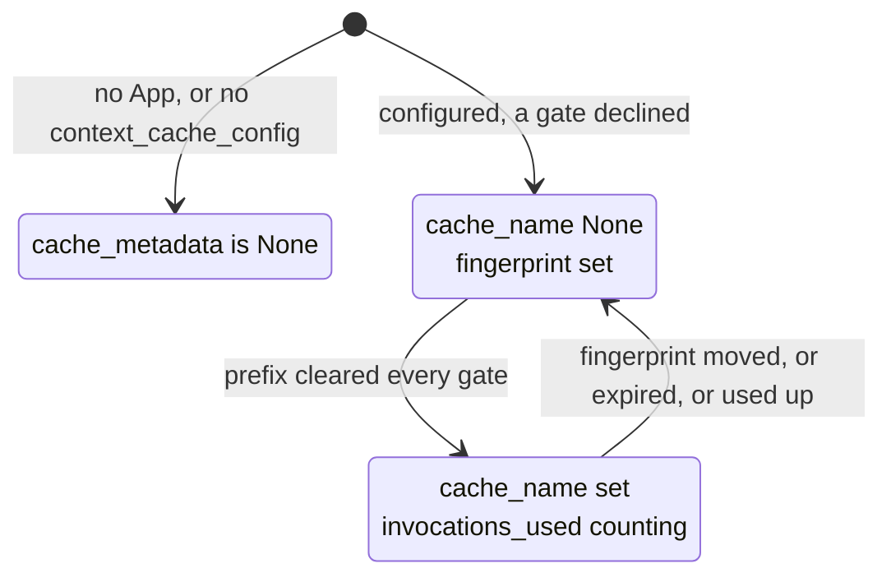

# 4.2 — What the metadata says, and what it does not

## One-line answer

Every event carries a `cache_metadata` in one of exactly two states — **active**, with a cache name
and an expiry, or **fingerprint-only**, with neither — and the second state is the one worth reading,
because it is how ADK tells you *"I measured your prefix and declined"* rather than *"caching is off"*.

## The story

A school report card comes home at the end of term. Six subjects, a letter beside each, a total, and a
line at the bottom for the class teacher.

Maths says `C`. Last term it said `A`.

The parent reads it four times. There is nothing else on the paper. Not which topics, not which tests,
not whether it slipped in October or fell off a cliff in November. The card is complete, correct,
signed, and answers a different question from the one the family now has.

So somebody goes in on the parents' day, waits, and is told in half a minute: he missed three weeks
with a fractured wrist, and the chapter they did in those weeks is the one everything after it builds
on.

That was always knowable. It was in the attendance register and in the teacher's head. It simply was
never going to arrive on its own, because a report card is a summary and what the family needed was a
diagnosis, and those are two different documents.

## The idea in plain language

After each model call, ADK attaches a `CacheMetadata` object to the response and to the resulting
event. It has six fields and **two legal states**, and the states are the point.

**Active** — a real cache was used:

| Field | Value |
| --- | --- |
| `cache_name` | `cachedContents/8fzp2a4k1c9x` |
| `expire_time` | a Unix timestamp |
| `invocations_used` | how many calls this cache has served |
| `fingerprint` | the sixteen hex characters from [2.3](../02-the-context-cache/2.3-the-fingerprint-is-the-key.md) |
| `contents_count` | how many contents are in the cache |
| `created_at` | a Unix timestamp |

**Fingerprint-only** — no cache was used, but ADK measured the prefix anyway:

| Field | Value |
| --- | --- |
| `cache_name` | `None` |
| `expire_time` | `None` |
| `invocations_used` | `None` |
| `fingerprint` | present |
| `contents_count` | the size of the cacheable prefix it *would* have cached |

The three active fields are all-or-nothing; ADK's model validator enforces it, and *When it breaks*
shows the error. There is no half state.

Now the sentence that makes this part worth reading. **Fingerprint-only is not the same as caching
being off.** It means ADK ran, computed the boundary, computed the fingerprint, and then one of
[3.1](../03-the-floor-we-never-reach/3.1-two-floors-and-a-first-turn-rule.md)'s three gates declined.
The fingerprint is still there, so you can still tell whether your prefix is stable across requests —
which is the single most useful piece of caching diagnostics there is, and it is available on exactly
the deployments where caching is not working.

If `cache_metadata` is `None` altogether, *that* is caching being off: no `App`, or no
`context_cache_config` on it.

Three states, three different actions:

| `cache_metadata` | Meaning | What to do |
| --- | --- | --- |
| `None` | the feature is not configured | [4.1](4.1-where-the-config-goes.md) |
| fingerprint-only | configured, measured, declined | read the `info` log for which gate |
| active | working | watch `invocations_used` against your `cache_intervals` |

One more thing the object deliberately does **not** carry: token counts. ADK's own docstring says so —
*"Token counts (cached and total) are available in the `LlmResponse.usage_metadata` and should be
accessed from there to avoid duplication."* So the answer to *"how many tokens did the cache save?"*
is on a different object, and a report built only from `cache_metadata` cannot contain it.

## Why Sutra needs it

Day 22 built structured logging and Day 45 audited what Sutra emits. `cache_metadata` is a ready-made
set of log fields that costs nothing to attach, and the alternative to attaching it is the report card:
a grade, and a trip to the school.

There is a specific Sutra use for the fingerprint-only state.
[3.2](../03-the-floor-we-never-reach/3.2-thirty-seven-per-cent-of-the-way-to-a-cache.md) established
that the desk's prefix is below the floor, so **every** event Sutra produces will carry
fingerprint-only metadata. That is not a disappointment; it is a live measurement. If someone later
adds a policy paragraph to the instruction and the prefix crosses 4,096, the state flips to active on
its own, and the log will show it on the day it happens. The comment in `sutra/cache.py` names a
trigger condition; this is the instrumentation that fires it.

## The mechanism

Verified against `adk.dev/context/caching/` and against `google-adk==2.7.1` on 2026-09-05.
`CacheMetadata` is importable from `google.adk.models.cache_metadata`, and both
`LlmResponse.cache_metadata` and `Event.cache_metadata` exist as fields.

Build both states by hand, which is the fastest way to learn to read them:

```python
import time

from google.adk.models.cache_metadata import CacheMetadata

declined = CacheMetadata(fingerprint="834f3574ce20ab7b", contents_count=4)

active = CacheMetadata(
    cache_name="cachedContents/8fzp2a4k1c9x",
    expire_time=time.time() + 1800,
    fingerprint="834f3574ce20ab7b",
    invocations_used=3,
    contents_count=4,
    created_at=time.time(),
)

print("declined :", declined)
print("active   :", active)
print("expiring :", active.expire_soon)
```

**Line by line:**

- `declined` sets only `fingerprint` and `contents_count`. Those two are the required fields on the
  model; everything else is optional precisely so this state can exist.
- `contents_count=4` on the declined object is the count from
  [2.1](../02-the-context-cache/2.1-what-adk-is-willing-to-cache.md) — the prefix ADK *would* have
  cached. It is real information about a cache that was never created.
- `expire_time=time.time() + 1800` is a Unix timestamp, not a duration. Anything reading it must
  compare against wall clock, and a machine with clock skew will misjudge it.
- `created_at` is optional even in the active state, so code reading it needs a `None` guard.
- `active.expire_soon` is a **property**, not a field. It is `True` when the expiry is within a
  120-second buffer, and that buffer is hard-coded in ADK rather than configurable.
- `print(... , declined)` uses `CacheMetadata.__str__`, which ADK defines differently for the two
  states — a nice touch, and the fastest way to eyeball which state you are in.

Measured on 2026-09-05:

```text
fingerprint-only : Fingerprint-only: 4 contents, fingerprint=834f3574...
active           : Cache 8fzp2a4k1c9x: used 3 invocations, cached 4 contents, expires in 30.0min
expire_soon      : False
expire_soon (60s): True
```

Two different sentences from one class. The first says *measured, not cached*. The second says
*cached, and here is how much life is left in it*.

And here is where the documentation and the implementation part company, which is worth knowing before
you write code against the page rather than against the package. `adk.dev/context/caching/`, fetched
on 2026-09-05, lists the reported fields as `cacheName`, `expireTime`, `invocationsUsed`, `isActive`,
`expireSoon` and `contentsCount`. In Python 2.7.1:

| adk.dev names | In `google-adk==2.7.1` Python |
| --- | --- |
| `cacheName`, `expireTime`, `invocationsUsed`, `contentsCount` | present, snake_case |
| `expireSoon` | present as the `expire_soon` **property** |
| `isActive` | **not present** — test `cache_name is not None` |
| — | `fingerprint` and `created_at` are present and not listed on the page |

The page's field list is written for the Kotlin surface. Nothing is wrong with the page and nothing is
wrong with the package; they are describing two implementations of one feature. The practical rule is
Principle 8 with the emphasis where it belongs: check the docs page for the *concept*, and the
installed package for the *names*.



## When it breaks

The break is constructing the object half-populated, which is what happens when somebody writes their
own `CacheMetadata` for a test fixture and copies only the fields they care about:

```python
CacheMetadata(cache_name="cachedContents/x", fingerprint="a" * 16, contents_count=4)
```

**Line by line:**

- `cache_name` is set, which claims an active cache.
- `expire_time` and `invocations_used` are not, which claims a fingerprint-only one.
- The model validator refuses the contradiction rather than accepting an object that would make every
  downstream `expire_soon` check meaningless.

```traceback
pydantic_core._pydantic_core.ValidationError: 1 validation error for CacheMetadata
  Value error, cache_name, expire_time, and invocations_used must all be set (active cache) or all be None (fingerprint-only state) [type=value_error, input_value={'cache_name': 'cachedCon...a', 'contents_count': 4}, input_type=dict]
    For further information visit https://errors.pydantic.dev/2.13/v/value_error
```

The message is unusually good: it names all three fields and both legal states. The smallest fix is to
supply all three or none.

The quieter break is reading `is_active`, from the documentation page:

```traceback
AttributeError: 'CacheMetadata' object has no attribute 'is_active'
```

The fix is `metadata.cache_name is not None`, and the lesson is the one in the table above.

## In production

**What a professional writes instead.** Four fields on every request's log line, taken straight from
the metadata: `cache_state` (`none` / `fingerprint` / `active`), `cache_fingerprint`,
`cache_invocations_used`, and `cached_tokens` from `usage_metadata`. That is enough to answer every
caching question anyone will ask for the next year, and it is a dozen lines of code written once, in
the Day 22 logging format.

**What degrades at scale.** `invocations_used` is the field that goes bad quietly. It is per cache
object, so across a replica fleet it counts a fraction of the real reuse, and an operator reading it
as "how often is this prefix reused" will underestimate by the replica count. The number that answers
that question is distinct fingerprints per hour, not invocations per cache.

**The failure mode that only appears with real traffic.** `expire_soon` uses a fixed 120-second
buffer against the client's wall clock. On a fleet where one machine's clock has drifted, that machine
will consider caches expired early and create replacements, so a single bad node produces a
create-and-delete storm that shows up as a cost anomaly with no code change behind it. Clock skew is
the sort of thing that is monitored on databases and not on application servers, and this is one of
the few application-level features that depends on it.

**The review comment a senior engineer leaves:** *"We're logging `cache_hit: true/false`. That
collapses three states into two — 'not configured' and 'configured but declined' both become false,
and they need completely different responses. Log the state as a string and log the fingerprint, so we
can tell a config problem from a prompt-stability problem without redeploying."*

**The interview question:** *"How do you know whether your context cache is actually being used?"* An
honest answer: *"The framework attaches cache metadata to every response, and it has three states, not
two. `None` means it isn't configured at all. Fingerprint-only means it is configured, it measured my
prefix, and a gate declined — and crucially the fingerprint is still there, so I can see whether my
prefix is stable even though nothing is being cached, which is exactly the diagnostic I need in that
situation. Active means a cache is in use, and then `invocations_used` tells me how close I am to the
reuse ceiling. I log the state as a string rather than a boolean, because collapsing 'off' and
'declined' into 'false' hides which team owns the problem. And the token counts aren't on that object
at all — they're on the usage metadata, which the docstring says explicitly."*

## Check yourself

```bash
python -c "from google.adk.models.cache_metadata import CacheMetadata as C; print(sorted(C.model_fields)); print([n for n in dir(C) if n in ('expire_soon','is_active')])"
```

Then construct a fingerprint-only `CacheMetadata` yourself, print it, and try to add `cache_name`
without the other two fields. Read the validator message all the way through.

**Out loud, without scrolling up:** name the three states of `cache_metadata`, say which one means
"configured but declined", and say where the token counts actually live.

**Next:** [4.3 — Choosing the three numbers](4.3-choosing-the-three-numbers.md).
