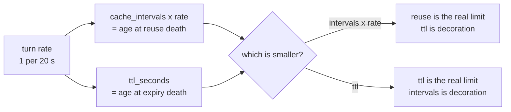

# 4.3 — Choosing the three numbers

## One-line answer

`cache_intervals`, `ttl_seconds` and `min_tokens` are chosen by running the traffic against them and
reading which one kills the caches, not by picking round numbers — and on the desk's traffic the
default `cache_intervals=10` is the only one of the three that does anything at all.

## The story

A housing society has a meeting about the water tank. The agenda item is *"how often should the tank
be cleaned?"* and it has been on the agenda for three meetings.

The arguments are all reasonable. Every month, says one flat, because the water tastes off. Every six
months, says another, because the cleaning costs four thousand rupees and disrupts supply for a day.
Every three months, says the secretary, because three is between one and six.

Nobody in that room has been up to the tank. There is a lid, there is a ladder, and it takes about
four minutes to climb up and look. If somebody had, the meeting would be over: either there is sludge
in it or there is not, and the answer to *"how often"* falls straight out of *"how quickly does it get
like that"*.

The meeting is not stuck because the question is hard. It is stuck because the people arguing are
arguing about a number instead of about the tank.

## The idea in plain language

The three fields, and what each is really asking you:

| Field | The question behind it | What answers it |
| --- | --- | --- |
| `cache_intervals` | how many calls should one cached prefix serve? | the create-and-delete cost against the payload saved |
| `ttl_seconds` | how long should the provider hold it? | how long a session stays warm before going quiet |
| `min_tokens` | below what size is caching not worth attempting? | the provider's floor for your model |

Two of those have measurable answers and one of them does not need choosing at all.

**`min_tokens` is not really a choice.** Its only sensible value is the provider's own floor for the
model you pinned — 4,096 for `gemini-3`, 2,048 for `gemini-2.5`. Setting it lower does nothing except
move where the refusal is logged. Setting it higher declines caching you could have had. The one
reason to set it higher is if your create-and-delete bookkeeping outweighs the saving at small sizes,
which is the same arithmetic as `cache_intervals` and is better fixed there.

**`cache_intervals` and `ttl_seconds` are a pair, and only one of them is ever in charge.** A cache
dies at whichever limit it reaches first. If your traffic sends a turn every 20 seconds and the reuse
ceiling is 10, the cache dies at roughly 200 seconds of age, and any TTL above that is decoration.
That is what [2.4](../02-the-context-cache/2.4-the-three-ways-a-cache-dies.md) measured, and it is why
tuning them independently is how people waste an afternoon.

So the procedure is not "choose three numbers". It is:

1. Set `min_tokens` to the provider's floor. Write down where the floor came from.
2. Run your traffic and read **which limit is killing the caches**.
3. Move that one. Re-run. Watch the deaths change kind.
4. Stop when `turns served per cache` is comfortably above the point where bookkeeping repays.

## Why Sutra needs it

The build brief asks for three constants in `sutra/cache.py`, and `lab/gate.py` refuses a bare number:
every one must carry a comment naming the run it came from. That is the same rule Day 50 applied to
`CHUNK_SIZE`, `TOP_K` and `SIM_FLOOR`, and it exists because a tuning constant with no provenance is
indistinguishable from a guess six weeks later.

There is a Sutra-specific twist that makes the exercise honest rather than theoretical. The desk's
prefix is below the floor
([3.2](../03-the-floor-we-never-reach/3.2-thirty-seven-per-cent-of-the-way-to-a-cache.md)), so none of
these three numbers currently changes anything for Sutra. Choosing them anyway, with the measurement
written down, is what makes the configuration correct **on the day the prefix crosses the floor** —
which, per [3.3](../03-the-floor-we-never-reach/3.3-what-would-have-to-change.md), is a day that
arrives on its own as tool schemas grow.

Configuring for a future condition and saying so beats configuring for nothing and hoping.

## The mechanism

`lifecycle.py` is the ladder to the tank. It walks a fixed traffic pattern through ADK's real validity
conditions and counts which limit killed each cache.

```bash
cd days/day-51-caching-the-quota-lifeline/lab
uv run python lifecycle.py
uv run python lifecycle.py --intervals 100
```

**Line by line:**

- The traffic is fixed at 200 turns, one every 20 seconds, so the only thing changing between runs is
  the knob named on the command line.
- `--intervals 100` raises the reuse ceiling and leaves the TTL at 1800 seconds.
- The output's three death counts are the diagnosis; `turns served per cache` is the verdict.

Measured on 2026-09-05, both runs:

```text
                        default        --intervals 100
caches created          19             3
  died, expired         0              2
  died, used up         18             0
  died, fingerprint     0              0
extra API calls         37             5
turns served per cache  10.5           66.7
```

Read the two `died, expired` cells. In the left column the TTL killed **nothing**. In the right column
it kills everything. The TTL did not change between the runs — the *other* limit got out of its way.

Now sweep the ceiling to find where control passes from one limit to the other:

```bash
for i in 40 50 60 70 80 90; do
  printf "%s -> " "$i"
  uv run python lifecycle.py --intervals $i | grep -E "died, (expired|used up)" | tr '\n' ' '
  echo
done
```

**Line by line:**

- A shell loop rather than a flag in the script, because the sweep is a question you ask once and the
  script should stay a single-purpose thing.
- `grep -E "died, (expired|used up)"` keeps the two competing causes and drops the fingerprint row,
  which is zero throughout because the instruction is stable in this run.
- `tr '\n' ' '` puts both causes on one line so the crossover is visible by scanning down.

Measured on 2026-09-05:

```text
40 ->   died, expired  : 0   died, used up  : 4
50 ->   died, expired  : 0   died, used up  : 3
60 ->   died, expired  : 0   died, used up  : 3
70 ->   died, expired  : 0   died, used up  : 2
80 ->   died, expired  : 0   died, used up  : 2
90 ->   died, expired  : 2   died, used up  : 0
```

**The crossover is between 80 and 90.** Below it, reuse is in charge. Above it, the TTL is. And that
number is not a property of caching at all — it is a property of the *traffic*: at one turn every 20
seconds, 90 turns is 1,800 seconds, which is exactly the TTL. The knob and the clock met.

That is the finding worth carrying out of this part. `cache_intervals` and `ttl_seconds` are two ways
of expressing the same limit in different units, and which one binds is decided by your turn rate. A
team whose turn rate changes has silently switched which of its two settings is real.



For the constants themselves, the build brief's `sutra/cache.py` wants them shaped like this, with the
provenance that `gate.py` insists on:

```python
# lab/lifecycle.py, 2026-09-05: at the desk's turn rate the reuse ceiling binds
# below ~90 and the TTL binds above it. 40 gives 4 deaths over 200 turns and
# turns-served-per-cache of 40, which repays the create+delete comfortably.
CACHE_INTERVALS = 40
# The provider holds it this long. Left at ADK's default: above the crossover
# it would bind, and below it this number never participates.
CACHE_TTL_SECONDS = 1800
# The gemini-3 explicit-cache floor, from ADK's _GEMINI_3_MIN_CACHE_TOKENS.
# Not a preference - matching it puts the refusal in our log, not the provider's.
CACHE_MIN_TOKENS = 4096
```

**Line by line:**

- Each comment names a **file, a date and a number**, not an intention. `gate.py` finding 3 fails on a
  constant with no comment at all, and a comment saying `# reasonable default` passes the script and
  fails the review.
- `CACHE_INTERVALS = 40` is a choice with a trade in it, and the comment states the trade rather than
  the value. Forty is not special; the reasoning is.
- `CACHE_TTL_SECONDS = 1800` explicitly records that it is ADK's default and that it is currently
  inactive. A default you have decided to keep is different from one you never read.
- `CACHE_MIN_TOKENS = 4096` names the source constant inside ADK, so the day someone pins a
  `gemini-2.5` model there is a string to grep for.

## When it breaks

The break is tuning the number that is not in charge, and the reason it is worth doing on purpose is
that it produces no evidence of itself.

```bash
uv run python lifecycle.py --ttl 300
```

**Line by line:**

- The TTL is cut from 1800 seconds to 300 — a six-fold reduction, the kind of change that would be
  described in a commit message as "tighten cache TTL".
- `cache_intervals` is left at its default of 10.

Measured on 2026-09-05:

```text
caches created          : 19
  died, expired         : 0
  died, used up         : 18
  died, fingerprint     : 0

extra API calls (create + delete): 37
turns served per cache           : 10.5
```

**Identical to the default run.** Nineteen caches, thirty-seven calls, zero expiries. The TTL was cut
by 83% and not one number moved, because at this turn rate the reuse ceiling fires at 200 seconds and
the TTL never gets a turn.

There is no error here and nothing to notice. A commit landed, a config changed, a graph did not move,
and the next person to read the code will believe the TTL is doing something. The only defence is the
death-reason counters — with them, "expired: 0" is right there and the change is obviously inert.

## In production

**What a professional writes instead.** They tune one knob and delete the other. Genuinely: if the
reuse ceiling is the binding limit for your traffic, set the TTL to something long and obviously
inactive, and say so in the comment. Two live knobs that express the same limit invite a future
engineer to change the wrong one, and the cost of that mistake is an afternoon plus a wrong belief
that persists.

**What degrades at scale.** Turn rate is not one number in a real system; it is a distribution. A
long-tail session that sends a turn every few minutes lives under the TTL, and a busy session that
sends four turns in a row lives under the reuse ceiling — simultaneously, in the same deployment,
under the same config. So "which limit binds" is a per-session property, and the honest configuration
is the one that behaves acceptably at both ends rather than the one tuned to the mean. Reading
`invocations_used` from [4.2](4.2-what-the-metadata-says.md) across real sessions is how you get that
distribution.

**The failure mode that only appears with real traffic.** Long TTLs and multi-tenancy interact badly
in a way that has nothing to do with correctness: a cached prefix held for 1,800 seconds across many
tenants is provider-side storage held for the duration, and on a paid tier that is charged. A TTL
chosen purely for hit rate can produce a storage bill that scales with concurrent sessions rather than
with requests, which is a cost shape nobody's dashboards are built for. Free-tier Sutra never sees
this; a reader's employer will.

**The review comment a senior engineer leaves:** *"This PR lowers `ttl_seconds` from 1800 to 300 to
'reduce stale caches'. A context cache can't be stale — it's the same prefix the model would have read
anyway. And at our turn rate the reuse ceiling fires first, so this change does nothing. If you want
fewer caches held, lower `cache_intervals`; if you want to reduce provider-side storage, say that and
show the storage number."*

**The interview question:** *"How did you pick your cache TTL?"* An honest answer: *"I didn't pick it
in isolation, because it turned out not to be the binding constraint. The framework kills a cache at
whichever comes first — the TTL, or a reuse ceiling counted in invocations — and at my turn rate of
about a turn every 20 seconds, the default ceiling of 10 fired at roughly 200 seconds of age, so the
1,800-second TTL was never consulted. I ran a sweep and found the crossover: below about 90
invocations the reuse count binds, above it the TTL does, and 90 turns at 20 seconds is exactly 1,800
seconds, so the two knobs are the same limit in different units. I raised the ceiling to 40, which
took me from 19 caches and 37 bookkeeping calls over 200 turns down to a handful, and I left the TTL
at the default with a comment saying it's currently inactive so nobody tunes it by mistake."*

## Check yourself

```bash
cd days/day-51-caching-the-quota-lifeline/lab
uv run python lifecycle.py --ttl 300
uv run python lifecycle.py --intervals 90
```

Now change `SECONDS_BETWEEN_TURNS` in `lifecycle.py` from 20 to 5 and find the new crossover. Write
down the relationship between turn rate, `cache_intervals` and `ttl_seconds` as a single inequality.

**Out loud, without scrolling up:** say which of the three numbers is not really a choice and why, and
explain how you would find out which of the other two is actually in charge.

**Next:** [5.1 — The traffic decides the hit rate](../05-the-response-cache/5.1-the-traffic-decides-the-hit-rate.md).
