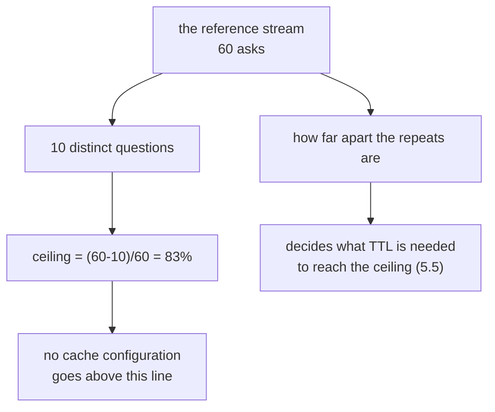

# 5.1 — The traffic decides the hit rate

## One-line answer

A cache's hit rate is a property of the stream of requests it sees, not of the cache — the desk's
60-ask day contains only 10 distinct questions, so the hit rate stops improving at 83% no matter how
large the store gets.

## The story

A tea stall outside a factory gate sells about four hundred glasses a day. The owner keeps a big pot
on the boil from six in the morning.

Ask him why he does not also keep coffee ready, and he does not talk about the pot. He talks about the
gate. *"They come out at the same three times. They ask for the same thing. Two in a hundred want
coffee and they will wait."*

He has never used the word, but he is describing his hit rate, and he is describing it correctly: it
is a fact about the men coming out of the gate, not about his pot. A second pot would not create
coffee drinkers. A bigger pot would not create more tea drinkers than there are men.

The stall two streets away, outside a college, has completely different arithmetic with an identical
pot.

## The idea in plain language

Everyone's instinct is that a cache's hit rate is something you improve by improving the cache — a
bigger store, a longer TTL, a cleverer eviction rule. Those help, up to a point that is fixed by
something else entirely.

The thing that fixes it is the **reference stream**: the actual sequence of requests, in the order
they arrive. Two properties of that sequence set the ceiling, and no amount of cache does anything
about either:

- **How many distinct things get asked.** If there are only ten distinct questions, then in a stream
  of sixty asks at most fifty can be repeats. Fifty out of sixty is 83%, and that is a hard ceiling.
- **How far apart the repeats are.** Two asks of the same question separated by a long gap need the
  entry to survive that gap. That is what a TTL decides, and it is
  [5.5](5.5-a-ttl-is-a-bet.md)'s subject.

So the first thing to do with a cache is not to configure it. It is to **look at the traffic**, count
the distinct requests, and compute the ceiling. If the ceiling is 12%, no configuration will save you
and the effort belongs elsewhere. If it is 83%, you have a real opportunity and the question becomes
how close to it you can get.

The word for how deep in the recently-used ordering a repeat is found is **stack distance**, and the
paper below turned it into a way of getting the whole curve — the hit rate at *every* cache size —
from a single pass over the stream.

## Why Sutra needs it

Because Sutra's traffic is unusually favourable and it is important to know that, rather than to
conclude that caching is generally this good.

A support desk has an extreme repeat rate. Six agents, one product, one set of things that break. The
day in `lab/_log.py` has sixty asks and ten distinct questions, and that is not a fixture chosen to
flatter the cache — a real desk is more repetitive than that, which is why the same three articles are
at the top of every knowledge base.

The desk's ceiling being 83% is what justifies spending this day's second half on a response cache at
all, after [3.2](../03-the-floor-we-never-reach/3.2-thirty-seven-per-cent-of-the-way-to-a-cache.md)
established that the context cache does not apply. And it is what tells Day 52's phase gate what "at
$0" can realistically mean.

## The paper behind it

> **Evaluation techniques for storage hierarchies** · `doi:10.1147/sj.92.0078` · IBM Systems Journal,
> 1970, 9(2), 78–117 · <https://doi.org/10.1147/sj.92.0078>

It showed that for a replacement policy with the inclusion property — of which least-recently-used is
one — the hit rate at **every** cache size can be computed from a **single pass** over the reference
stream, because the answer was always a property of the stream rather than of the cache.

Taught in [`papers/01-storage-hierarchies.md`](../../papers/01-storage-hierarchies.md), which is
written to be read after the parts.

## The mechanism

`lab/hitrate.py` replays the 60-ask log through four key recipes. Nothing about the store changes
between them — same dict, same replacement, same code. Only the definition of "the same question"
moves.

```bash
cd days/day-51-caching-the-quota-lifeline/lab
uv run python hitrate.py
```

**Line by line:**

- `LOG` is 60 `(seconds, agent, tenant, question, answer_id)` rows from `_log.py`, in arrival order.
  `answer_id` is the answer key: two rows share an id exactly when one reply is correct for both.
- `exact` keys on the question byte for byte — the strictest thing a cache can do.
- `normalised` case-folds, collapses whitespace runs and drops trailing punctuation, which is the
  `cache_key` from [1.3](../01-two-caches-two-currencies/1.3-a-key-is-a-promise-about-sameness.md).
- `per_tenant` and `per_agent` prefix the normalised question with a scope, which is
  [5.2](5.2-scoping-the-key.md).
- `run()` returns `(hits, misses, wrong)`, and `wrong` counts a hit whose stored `answer_id` differs
  from the asked one. It is zero for all four recipes here, and that is a fact about these recipes
  rather than about caches in general — [5.3](5.3-the-key-that-dropped-the-field.md) moves it.

Measured on 2026-09-05:

```text
60 asks, ttl = none (an entry never expires)

key recipe              hits  misses  hit rate   wrong
exact question text       47      13      78%       0
normalised question       50      10      83%       0
tenant + normalised       35      25      58%       0
agent + normalised        22      38      37%       0
```

Four numbers from one traffic pattern, and the spread is enormous: 37% to 83%, a factor of more than
two, with **no change to the cache**.

Now the ceiling. `normalised` gets 50 hits out of 60. There are exactly 10 distinct normalised
questions in the log, so the first ask of each is necessarily a miss and everything after is a hit:
60 − 10 = 50. **That is not a good result; it is the arithmetic maximum.** The normalised key is
already perfect for this stream, and no configuration exists that beats it.

Which means `exact` at 78% is not "a slightly worse cache". It is a key that fails to recognise three
repeats — a trailing question mark, a capital H, a trailing space, all present in the log because
real agents type them.

To see the ceiling as a curve rather than as one number, the paper's method:

```bash
cd papers/storage-hierarchies
uv run python stack.py
```

**Line by line:**

- `stack.py` makes one pass over the same 60 references, recording how deep in the least-recently-used
  ordering each one was found.
- `curve_from_distances` turns that histogram into the hit count at every cache size, because a
  reference found at depth `d` is a hit in every cache of size `d` or larger.
- No cache is simulated. The curve falls out of the stream.

Measured on 2026-09-05:

```text
 cache size   hits  hit rate
          1      0       0%
          2      0       0%
          3      3       5%
          4     13      22%
          5     19      32%
          6     27      45%
          7     38      63%
          8     46      77%
          9     48      80%
         10     50      83%
         11     50      83%
         12     50      83%
```

The curve rises and then stops dead at ten. Sizes 11 and 12 are identical to 10, and so is size 10,000
— there is nothing left to store. **The cache size that matters is the number of distinct questions,
and after that the graph is flat forever.**

Read the low end too, because it is the more useful half. A cache holding **eight** entries gets 77% of
the 83% available. The last two entries buy six percentage points. If entries were expensive — memory,
a network round trip to a shared store — eight would be the obvious choice, and you can only see that
from the curve.



## When it breaks

The break is reporting a hit rate without the ceiling beside it, and it breaks in both directions.

🎬 **The scene.** A team ships a cache. The dashboard says 58%.

😬 **The naive fix.** 58% looks mediocre, so someone spends a week on eviction policy and store size.

💥 **Why it fails.** 58% is `tenant + normalised` on this traffic, and the ceiling for that key is
58% — every single repeat that key can recognise, it already caught. The week produced nothing,
because there was nothing to produce, and the team's conclusion was "caching does not help much here"
when the truth was "this key's ceiling is 58% and you are at it".

💡 **The insight.** A hit rate is meaningless without its ceiling. `58% of a possible 58%` is a
finished piece of work; `58% of a possible 83%` is a bug in the key. Same number, opposite actions,
and you cannot tell which you have without counting distinct keys in the traffic.

The other direction is worse and it is [5.3](5.3-the-key-that-dropped-the-field.md): a hit rate
*above* the honest ceiling. If your key produces 87% on a stream whose distinct-question count says
the maximum is 83%, the extra hits are collisions — two different questions sharing an entry — and
each one is a wrong answer served fast.

**A hit rate above the ceiling is not a triumph. It is a defect report.**

## In production

**What a professional writes instead.** They compute the ceiling from a day of real traffic before
writing the cache, and they keep computing it. `distinct_keys / total_requests` over a rolling window
is one query against the log line from
[6.2](../06-proving-the-saving/6.2-the-log-line-and-four-alarms.md), and it turns the hit-rate graph
from a number into a number with a target line drawn on it. Everyone reading the dashboard then knows
whether there is work to do.

**What degrades at scale.** The ceiling falls as a product grows, and it falls for good reasons. More
customers means more distinct accounts in the key. More features means more distinct questions. More
languages means the same question is many keys. So a cache that was excellent at launch degrades on a
schedule set by the sales team, and nobody connects the two. The number to watch is not the hit rate;
it is the distinct-key count, because that one moves first.

**The failure mode that only appears with real traffic.** The distribution is not uniform. Real
question traffic is heavily skewed — a handful of questions are most of the volume and a long tail is
asked once each. That means the hit rate is carried almost entirely by the head, and the tail
consumes cache entries that will never be read again. A store sized from the *distinct* count will be
mostly full of single-use entries, which is why real caches evict by recency and why the size that
matters is the size of the head, not of the whole key space.

**The review comment a senior engineer leaves:** *"Before we tune this, put the ceiling on the
dashboard. Count distinct cache keys per hour over total requests. If we're at 58% against a ceiling
of 58% there is nothing to do here and this ticket should be closed; if the ceiling is 83% then the
key is dropping repeats and that's a five-line fix, not a week of eviction work."*

**The interview question:** *"Your cache hit rate is 60%. Is that good?"* An honest answer: *"I can't
tell without the traffic. The hit rate is a property of the request stream, not of the cache — the
ceiling is one minus distinct requests over total requests, and no configuration goes above it. On my
support desk, 60 asks contained 10 distinct questions, so the ceiling was 83% and I was at 83% with a
simple normalised key, which meant there was genuinely nothing left to win. When I scoped the key by
tenant it dropped to 58%, and that was also its ceiling, so the drop was correctness I'd bought rather
than performance I'd lost. The number I'd actually be worried about is a hit rate **above** the
ceiling — that means two different questions are sharing an entry, and every one of those hits is a
wrong answer."*

## Check yourself

```bash
cd days/day-51-caching-the-quota-lifeline/lab
uv run python hitrate.py
cd papers/storage-hierarchies && uv run python stack.py
```

Count the distinct normalised questions in `_log.py` yourself and check that the ceiling matches. Then
add three new distinct questions to `LOG` and predict, before re-running, what happens to both the
hit rate and the flat part of the curve.

**Out loud, without scrolling up:** state what fixes a cache's maximum hit rate, and say what it means
if your measured hit rate is higher than that maximum.

**Next:** [5.2 — Scoping the key](5.2-scoping-the-key.md).
