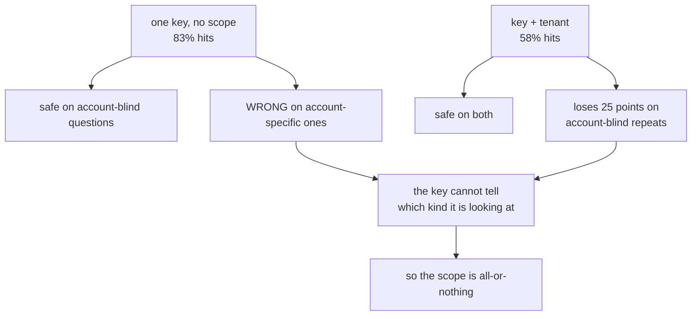

# 5.2 — Scoping the key

## One-line answer

Adding a scope to the key — the customer account, the agent, the locale — always costs hit rate, and
the only question worth asking is whether the answer genuinely differs across that scope: the tenant
costs the desk 25 percentage points and is mandatory, the agent costs a further 21 and buys nothing.

## The story

An old building has one letterbox for six flats. Everyone's post goes into it and the residents sort
it out on the stairs. It works, mostly, because the names are on the envelopes.

Then a family moves in whose surname is the same as the family on the second floor. Now the sorting
does not work — not sometimes, not for hard cases, but structurally, because the only field anybody
was sorting by no longer distinguishes them.

The obvious answer is six letterboxes. It costs money, it costs wall space, and it means the postman
does six insertions instead of one. Nobody in the building argues that six boxes is *free*. They argue
about whether the shared one is still good enough, and the moment two families share a surname, it is
not.

What nobody in that building would ever say is *"let us keep one box because sorting is faster"*.
Speed was never the thing the boxes were for.

## The idea in plain language

**Scoping** a key means adding a field that partitions the cache: instead of one entry for
`"what is the refund window"`, there is one per account, or per agent, or per language.

Every scope you add does exactly two things, and they always both happen:

- It **prevents** hits between entries that should not have been shared.
- It **loses** hits between entries that could safely have been shared.

There is no scope that only does the first. So the decision is never "is this scope good" — it is
*does the answer actually differ across this field?* If yes, the scope is mandatory and the hit-rate
cost is the price of correctness. If no, the scope is pure loss.

That question has a shape you can test on your own traffic, and it is the same test the answer key in
`_log.py` encodes: **find two rows with the same question and different values of the field, and look
at whether their answers differ.** If they never differ, the field is not in the answer, and putting
it in the key is superstition. If they ever differ, it is mandatory.

The three scopes on the desk's table:

| Scope | Does the answer differ across it? | Verdict |
| --- | --- | --- |
| tenant (customer account) | for account-specific questions, yes | mandatory |
| agent (who asked) | never — two agents on one account get one answer | pure loss |
| locale | if the desk ever replies in more than one language, yes | not yet applicable |

## Why Sutra needs it

Sutra's desk serves multiple customer accounts, and Day 40 built the filtering posture that keeps one
account's data away from another. A response cache is a hole straight through that posture if the
account is not in the key, because a cache is a place where one request's output is handed to a
different request.

That is worth stating starkly: **an unscoped response cache is a data-boundary violation wearing a
performance optimisation's clothes.** Day 69 will take up data boundaries properly; today's job is to
not build the hole in the first place.

And the day's gate enforces it — `lab/gate.py` finding 4 fails if
`cache_key(question, "acme") == cache_key(question, "borex")`.

## The mechanism

Same log, same store, four keys, and the two scoped ones are the subject here:

```bash
cd days/day-51-caching-the-quota-lifeline/lab
uv run python hitrate.py
```

**Line by line:**

- `per_tenant` returns `f"{row[2]}|{normalised(row)}"` — the account slug, a separator, the normalised
  question.
- `per_agent` returns `f"{row[1]}|{normalised(row)}"` — same shape, different field.
- Both use `normalised` underneath, so the difference between the rows is purely the scope and not the
  normalisation.

Measured on 2026-09-05:

```text
key recipe              hits  misses  hit rate   wrong
exact question text       47      13      78%       0
normalised question       50      10      83%       0
tenant + normalised       35      25      58%       0
agent + normalised        22      38      37%       0
```

**Tenant costs 25 percentage points**, from 83% down to 58%. Fifteen hits gone. Those fifteen were
real hits — the same question, asked about different accounts, where the answer happened to be the
same. The scope threw them away because it could not tell which repeats were safe.

**Agent costs a further 21 points**, down to 37%. Six support agents, so the same question asked by
six people is six entries instead of one, and the log's `answer_id` column says the answers were
identical every time. That is 21 points of hit rate spent on a distinction the answers do not make.

Now the test that decides which of those two is worth it. `_log.py` carries a second, smaller fixture
built for exactly this: twelve asks of one question whose answer genuinely depends on the account.

```bash
uv run python collide.py
```

**Line by line:**

- `TENANT_LOG` is twelve rows of `"what is this account's api rate limit"` across three accounts, with
  three different `answer_id`s — `limit-acme`, `limit-borex`, `limit-corvid`.
- The 60-ask log deliberately contains no such question, which is why the tenant scope looks like pure
  cost there. Real desks have both kinds.
- The `wrong` column counts hits whose stored answer does not match the asked one.

Measured on 2026-09-05:

```text
2. the same question, three accounts  (12 asks)
key recipe                    hits  hit rate  wrong  wrong of hits
tenant dropped from key         11      92%      8            73%
tenant kept in key               9      75%      0             0%
```

There is the whole argument in two rows. On the traffic where the tenant matters, dropping it gives a
**higher** hit rate — 92% against 75% — and 73% of those hits are another account's answer.

So the tenant scope's true cost is not 25 points. It is 25 points on the questions where accounts do
not matter, in exchange for correctness on the questions where they do, and you cannot have the first
without the second because **the key cannot tell which question it is looking at.**

That last clause is the part worth sitting with. A key is computed before you know the answer. It
cannot know whether *this* question is account-sensitive. So a scope is all-or-nothing across the
whole cache, and its cost is paid on every question to protect the subset that needs it.



## When it breaks

The break is a scope added for a field that does not change the answer, and it is common because it
feels safe.

```bash
uv run python hitrate.py
```

Read the `agent + normalised` row: **37%**. Against the 83% ceiling, more than half of all available
hits are gone.

Now put that in the day's real unit. From
[6.1](../06-proving-the-saving/6.1-the-saving-in-the-unit-of-the-bill.md)'s arithmetic, each ask is two
requests, so 60 asks with no cache is 120 requests:

Using the no-expiry arm above, where an entry never dies:

| Key | Hits | Requests spent | Days of a 20-a-day free tier |
| --- | --- | --- | --- |
| `normalised` | 50 | 20 | 1.0 |
| `tenant + normalised` | 35 | 50 | 2.5 |
| `agent + normalised` | 22 | 76 | 3.8 |

Scoping by agent costs **26 extra requests a day** against the tenant-scoped key — more than a whole
day of free tier — and buys nothing, because the answer key says the answers were identical.

There is no error, no wrong answer and no alarm. This failure is only visible as a hit rate that is
lower than it should be, which is why [5.1](5.1-the-traffic-decides-the-hit-rate.md)'s ceiling
calculation is the prerequisite for noticing it at all.

## In production

**What a professional writes instead.** They justify each scope in the key function's docstring with
the sentence *"the answer differs across this field because…"*, and they delete any scope that cannot
complete the sentence. Where a field is genuinely only sometimes relevant — an account-specific
question among account-blind ones — the production move is not a cleverer key but **two caches**: a
shared one for questions classified as account-blind, and a scoped one for the rest. That requires
classifying the question, which costs something, and is only worth it when the hit-rate gap is large.

**What degrades at scale.** Scopes multiply, and they multiply the key space rather than adding to it.
Tenant times locale times product version times prompt variant is a key space thousands of times larger
than the question count, and the hit rate falls towards the reciprocal. This is the mechanism by which
a cache that worked at launch does nothing at Series B while every individual decision along the way
was correct.

**The failure mode that only appears with real traffic.** Tenant distribution is skewed. One large
account can be most of your traffic, so a tenant-scoped cache is effectively that account's private
cache with a long tail of one-entry caches for everyone else. The aggregate hit rate looks acceptable
and the experience of a small account is uncached. If your latency percentiles are computed per
request rather than per account, this is invisible; per-account p95 is where it shows.

**The review comment a senior engineer leaves:** *"Why is `agent_id` in this key? Show me two rows
where the same question from two agents on the same account has different answers. If you can't, take
it out — it's costing us more than half our available hits, and 'it feels safer' isn't a reason,
because it isn't safer, it's just smaller."*

**The interview question:** *"How do you decide what goes in a multi-tenant cache key?"* An honest
answer: *"By finding two requests that differ only in that field and checking whether the answers
differ. On my desk the tenant qualified — I had a question whose answer was per-account, and with the
tenant dropped the key had a higher hit rate, 92% against 75%, with 73% of those hits serving another
account's answer. So the tenant is mandatory even though it costs 25 points of hit rate on the
questions where accounts don't matter, because the key is computed before you know the answer and
can't tell the two kinds apart. The agent id didn't qualify — same account, same answer, every time —
and having it in the key was costing me more than a day of free-tier quota for nothing."*

## Check yourself

```bash
cd days/day-51-caching-the-quota-lifeline/lab
uv run python hitrate.py
uv run python collide.py
```

Now add a `locale` field to `_log.py`'s rows, give two accounts different locales, and decide from the
answer key whether it belongs in the cache key. Write the docstring sentence for it either way.

**Out loud, without scrolling up:** state the test for whether a field belongs in a cache key, and
explain why a scope's cost is paid on every question rather than only on the ones that need it.

**Next:** [5.3 — 💥 The key that dropped the field](5.3-the-key-that-dropped-the-field.md).
