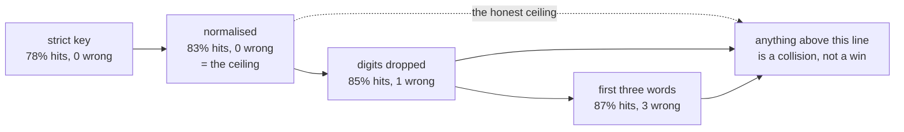

# 5.3 — 💥 The key that dropped the field

## One-line answer

A key that throws away information raises the hit rate and starts serving wrong answers at the same
time — dropping digits takes the desk from 83% to 85% with one wrong answer, keeping only the first
three words takes it to 87% with three — so a rising hit-rate graph is not evidence that anything is
working.

## The story

A chemist reads a prescription. The handwriting is bad, as it always is, and he has been doing this
for twenty years, so he does not read every character. He reads the shape of the word and the first
letters and he knows what it is.

`Metformin 500` and `Metformin 50` have the same shape. So does `Amoxicillin 250` and
`Amoxicillin 125`. He is right almost every time, and being right almost every time is precisely what
makes the practice survive: nothing corrects him, nobody comes back, the queue moves faster than at
the shop next door where they read every character.

The customer cannot tell. The strip looks the same. The tablets look the same. The only person who
would know is the doctor, and the doctor is not in the shop.

There is no moment in this story where anything goes visibly wrong. That is the story.

## The idea in plain language

A **lossy key** is one that maps two genuinely different requests to the same string. It happens for
good-sounding reasons:

- *"Normalise the question so small differences do not cost us a hit."* Reasonable. Case, whitespace,
  trailing punctuation are genuinely noise.
- *"Ticket numbers vary, so strip the digits and reuse the answer."* Also sounds reasonable, and it is
  where it goes wrong, because sometimes the digits **are** the question.
- *"Just key on the first few words, it is basically the same question."* This is the one everybody
  writes at some point, usually while calling it a cheap semantic cache.

Each step trades information for hits. And here is the property that makes this the most dangerous
thing in the day:

> **A lossier key always produces a hit rate greater than or equal to a stricter one.**

It cannot go down. Collapsing two keys into one can only turn a miss into a hit. So the metric that
everyone watches moves in the direction everyone wants, at exactly the moment the cache starts lying.

[5.1](5.1-the-traffic-decides-the-hit-rate.md) gave the defence: the honest ceiling. On the desk's
traffic the ceiling is 83%, because there are 10 distinct questions in 60 asks. **Anything above 83%
is a collision.** Not a suspicion, not a heuristic — an arithmetic certainty.

## Why Sutra needs it

Because the desk answers questions where a digit is the whole question, and it has two of them
already.

`_log.py` writes them down as `TRAPS`:

- `"what is the refund window"` and `"what is the refund window for annual plans"` — different
  answers, `refund-window` and `refund-annual`.
- `"what does error 4403 mean"` and `"what does error 4404 mean"` — different answers, `err-4403` and
  `err-4404`.

A support desk is *full* of this shape. Error codes, ticket numbers, plan tiers, API versions. The
questions differ by a few characters and the answers are unrelated, which is the exact combination
that a similarity-flavoured key handles worst.

The desk's promise, from Day 6, is to quote a ticket reference for every claim. A cached answer served
under a collided key quotes a reference — a real, correct, verifiable reference to the wrong ticket.
That is worse than a hallucination, because it survives checking.

## The mechanism

`lab/collide.py` runs four keys of decreasing strictness over the same 60 asks and prints the `wrong`
column that [5.1](5.1-the-traffic-decides-the-hit-rate.md)'s four recipes all left at zero.

```bash
cd days/day-51-caching-the-quota-lifeline/lab
uv run python collide.py --show
```

**Line by line:**

- `no_digits` applies `re.sub(r"\d+", "#", normalised(row))` — every run of digits becomes a single
  `#`. This is a real recipe people write, to share one answer across many ticket numbers.
- `first_three_words` takes `" ".join(normalised(row).split()[:3])`. Three is arbitrary; any prefix
  length has the same shape.
- `--show` prints, for each lossy recipe, the actual pairs it merges, taken from `TRAPS`. Reading the
  merged pairs before the table is the point: the numbers only mean something once you have seen what
  got merged.
- `run_on` counts a hit as `wrong` when the stored `answer_id` differs from the asked one, which is
  only possible because the fixture carries an answer key.

Measured on 2026-09-05:

```text
the pairs a lossy key merges:
  first three words            'what is the'
                               <- 'what is the refund window'
                               <- 'what is the refund window for annual plans'
  normalised, digits dropped   'what does error # mean'
                               <- 'what does error 4403 mean'
                               <- 'what does error 4404 mean'
  first three words            'what does error'
                               <- 'what does error 4403 mean'
                               <- 'what does error 4404 mean'

1. one lossy key at a time  (60 asks)
key recipe                    hits  hit rate  wrong  wrong of hits
exact question text             47      78%      0             0%
normalised question             50      83%      0             0%
normalised, digits dropped      51      85%      1             2%
first three words               52      87%      3             6%

2. the same question, three accounts  (12 asks)
key recipe                    hits  hit rate  wrong  wrong of hits
tenant dropped from key         11      92%      8            73%
tenant kept in key               9      75%      0             0%
```

Read the hit-rate column downwards: **78, 83, 85, 87.** It rises monotonically. Every step is an
improvement on the only graph anybody has.

Now read the `wrong` column downwards: **0, 0, 1, 3.**

Those two columns are the whole part. A team watching the first one shipped three wrong answers and
celebrated. And the ceiling from [5.1](5.1-the-traffic-decides-the-hit-rate.md) was sitting there the
whole time saying 83%, which means the 85% and the 87% were arithmetically impossible without
collisions.

Look at what `'what does error # mean'` actually is. It is one cache entry holding the answer to
`error 4403`, and it will be served to every question about every error code the desk ever sees. On
this small log it produces one wrong answer. On a real desk with two hundred error codes it produces
one right answer and a hundred and ninety-nine wrong ones, at a 99%+ hit rate.



## When it breaks

It has already broken; the point of this section is that there is nothing to show. So here is the
absence, deliberately produced.

```bash
uv run python ops.py --break-key
```

**Line by line:**

- `--break-key` swaps the key recipe from `normalised` to `first_three_words` and changes nothing
  else — same log, same TTL, same store.
- `ops.py` emits the structured log line from
  [6.2](../06-proving-the-saving/6.2-the-log-line-and-four-alarms.md) and then runs the four alarms
  over it.

Measured on 2026-09-05:

```text
{"t": 420, "decision": "hit", "key_recipe": "first_three_words", "age_s": 325, "saved_calls": 1}
... 54 more lines

alarms
    ok    1 hit rate 50% against floor 30%
  FIRING  2 wrong-hit rate 10% (3 of 30 hits)
    ok    3 p95 served age 3490 s against ceiling 7200 s
    ok    4 bookkeeping/saved = 0/30 = 0.00
```

Compare with the same command without the flag: hit rate **45%**, wrong-hit rate **0%**. Shipping the
broken key **raised** the headline metric from 45% to 50% and fired the only alarm that can see the
damage.

And notice what the log line itself shows: `{"decision": "hit", "age_s": 325, "saved_calls": 1}`. That
is a perfectly healthy line. Nothing in it is false. A wrong hit and a right hit are the same JSON
object, which is why alarm 2 needs an **answer key** — a sampled set of questions whose correct answer
is known — and cannot be computed from the log alone.

That is the honest limitation to carry away: **the log can tell you a cache is fast; only an answer
key can tell you it is right.**

## In production

**What a professional writes instead.** They put the ceiling on the dashboard next to the hit rate,
computed from the same log — distinct keys over total requests, over a rolling window. Then a hit rate
above the ceiling is visible as a crossing on a graph rather than as a number nobody can interpret.
And they sample: a small set of known-answer questions replayed through the cache on a schedule, which
is the only way `wrong` is ever anything but a hypothesis in production.

**What degrades at scale.** Collisions scale with the *density* of near-identical questions, and that
density rises as a product matures. Two error codes collide rarely; two hundred collide constantly.
So a lossy key that was measured as safe at launch becomes unsafe without the code changing, on a
schedule set by how many error codes the product has shipped. This is the caching version of a
correctness regression with no commit behind it.

**The failure mode that only appears with real traffic.** Head-and-tail. The high-traffic questions
are asked so often that they are almost always in the cache and almost always correct, because they
populate the entries. The collisions land on the tail — the rare, specific, high-stakes question — and
get served the head's answer. So the wrong answers are concentrated exactly on the queries where being
wrong matters most, and they are a small enough fraction of volume to be invisible in any aggregate.

**The review comment a senior engineer leaves:** *"This normalisation strips digits from the question
before hashing. Our error codes are digits. That means `error 4403` and `error 4404` are one cache
entry, and whichever is asked first wins for the lifetime of that entry. I'd rather have a 78% hit
rate I can defend. And add the distinct-key ceiling to the dashboard — this PR would have shown up as
an improvement."*

**The interview question:** *"How would you know if your cache was serving wrong answers?"* An honest
answer: *"Not from the hit rate, because a broken key makes that go up. I'd compute the honest ceiling
first — one minus distinct keys over total requests — because anything above it is arithmetically a
collision. On my desk the ceiling was 83%, and a key that stripped digits scored 85% with one wrong
answer, and a first-three-words key scored 87% with three. Every step looked like an improvement on
the graph. Beyond the ceiling check, the only real answer is sampling: a set of questions with known
correct answers, replayed through the cache on a schedule, because a wrong hit and a right hit produce
identical log lines. The log tells you a cache is fast; only an answer key tells you it's right."*

## Check yourself

```bash
cd days/day-51-caching-the-quota-lifeline/lab
uv run python collide.py --show
uv run python ops.py --break-key
```

Now add a third trap to `TRAPS` in `_log.py` — two questions that differ only in a plan name — and add
enough rows to `LOG` for it to collide. Predict which recipes merge it before you re-run.

**Out loud, without scrolling up:** explain why a worse cache key produces a higher hit rate, and give
the one number that lets you detect it without an answer key.

**Next:** [5.4 — 💥 The answer that was right when it was stored](5.4-the-answer-that-was-right-when-it-was-stored.md).
