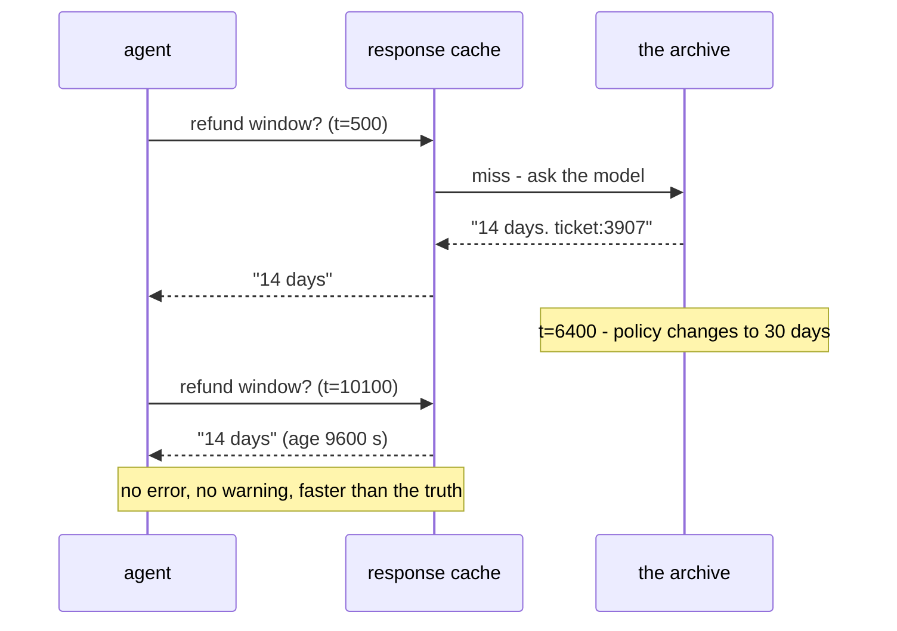

# 5.4 — 💥 The answer that was right when it was stored

## One-line answer

With entries that never expire, the desk serves 17 cached answers about two topics and **five of them
are wrong** — not because the cache broke, but because the refund policy changed and the stored answer
did not, and nothing in the system is capable of noticing.

## The story

There is a bus stop with the timings painted on a metal board bolted to the pole. Four buses,
morning and evening, painted neatly in white on green.

Two years ago the route was changed and one of the four buses stopped coming to that stop at all. The
board was not repainted. Nobody decided not to repaint it; there was simply no step in anybody's job
that involved going back to a bolted metal board.

People still read it. New people especially — the ones who do not know the route, which is exactly who
a timings board is for. They stand and wait for the 8:40 and eventually somebody who has lived there
long enough says *"that one doesn't come here any more"*.

The board is not damaged. It is clean, legible, and firmly attached. Every single thing about it is in
good order except that it is not true, and there is nothing about a board that can tell you which of
those two it is.

## The idea in plain language

A **stale** cache entry is one that was correct when it was stored and is not correct now, because the
world changed underneath it.

This is the failure mode a response cache has and a context cache does not, promised back in
[1.2](../01-two-caches-two-currencies/1.2-two-caches-wearing-one-name.md) and now due. A context cache
stores the prompt prefix, and the model still answers your live question. A response cache stores the
**answer**, and an answer is a claim about the world at the moment it was made.

Three things make staleness uniquely hard to catch:

1. **There is no error.** The entry is intact. The key matched. The lookup succeeded. Every layer did
   its job correctly.
2. **It is faster than the correct behaviour.** A stale hit returns immediately; a miss costs a model
   call. So the wrong path is also the fast path, and any latency-based monitoring rewards it.
3. **The system does not know the world changed.** The cache holds an answer and a timestamp. It does
   not hold a subscription to reality. Nothing arrives to tell it.

The only two defences are guessing and being told, and it is worth naming them now because
[5.5](5.5-a-ttl-is-a-bet.md) is about the first and production systems need the second:

- **Expiry (a TTL)** — throw the entry away after a fixed period, on the guess that the world does not
  change faster than that. Cheap, requires no cooperation, and always wrong in both directions.
- **Invalidation** — when the underlying thing changes, delete the entries that depended on it.
  Correct, and requires the thing that changed to know which cache entries existed.

## Why Sutra needs it

Because the desk's answers are grounded in an archive that changes, and Day 49 and Day 50 built
exactly that pipeline.

Two kinds of change matter, and Sutra will meet both:

- **A policy changes.** The refund window goes from 14 days to 30. There is a new ticket in the
  archive saying so, and the old one is still there.
- **A fix ships.** Error 4403 stops meaning "API key revoked" and starts meaning "over seat limit".
  The old ticket was correct at the time and is now actively misleading.

Both are ordinary. Neither is a system failure. And a support agent who quotes a 14-day refund window
to a customer who is entitled to 30 has created a real problem for a real person, with a correct
ticket reference attached to it.

Day 50's part 5.2 already raised the shape of this — *"when the answer must be true now"*, and the
finding that zero of 61 index rows carried a date. Caching takes that problem and adds a second copy
of it.

## The mechanism

`lab/ttl.py` counts stale hits. Counting is not reading, and this failure survives review because
nobody ever reads one. So `lab/stale.py` prints the text the desk actually sends, turn by turn, across
the moment the policy changed.

```bash
cd days/day-51-caching-the-quota-lifeline/lab
uv run python stale.py
```

**Line by line:**

- `ANSWERS` holds what the archive says before and after each change, with the change times — `6400`
  for the refund window, `12000` for error 4403 — imported from `ttl.CHANGES` so the two scripts
  cannot disagree.
- `truth(answer_id, clock)` returns what the archive says **at that moment**, which is the thing a
  cache cannot compute.
- The script only follows the two questions that have a change behind them; the other eight are
  filtered out so the output is readable.
- A `!!` in the left margin marks a hit whose text differs from the truth. It is the script's marker,
  not the system's — nothing in a real deployment prints it.

Measured on 2026-09-05, at the default TTL of 21600 seconds:

```text
ttl = 21600 s, revalidate = False
the world changes at t=6400 (refund window) and t=12000 (error 4403)

   t=  180 asha   MISS  -> model
       Error 4403 means the API key was revoked. Issue a new key. ticket:4110.
   t=  500 bilal  MISS  -> model
       Refunds are accepted within 14 days of purchase. ticket:3907.
   t=  610 chen   HIT   (stored at t=180, age 430)
       Error 4403 means the API key was revoked. Issue a new key. ticket:4110.
```

Three ordinary lines. Two misses that cost a model call, one hit that did not. This is the cache
working.

Now the same run, later:

```text
!! t=10100 farid  HIT   (stored at t=500, age 9600)
       Refunds are accepted within 14 days of purchase. ticket:3907.
       the archive now says: Refunds are accepted within 30 days of purchase. ticket:4902.
   t=11300 dev    HIT   (stored at t=180, age 11120)
       Error 4403 means the API key was revoked. Issue a new key. ticket:4110.
!! t=14750 eve    HIT   (stored at t=180, age 14570)
       Error 4403 means the API key was revoked. Issue a new key. ticket:4110.
       the archive now says: Error 4403 now means the account is over its seat limit. ticket:4955.
!! t=15500 dev    HIT   (stored at t=500, age 15000)
       Refunds are accepted within 14 days of purchase. ticket:3907.
       the archive now says: Refunds are accepted within 30 days of purchase. ticket:4902.
!! t=18800 farid  HIT   (stored at t=180, age 18620)
       Error 4403 means the API key was revoked. Issue a new key. ticket:4110.
       the archive now says: Error 4403 now means the account is over its seat limit. ticket:4955.
!! t=21500 bilal  HIT   (stored at t=500, age 21000)
       Refunds are accepted within 14 days of purchase. ticket:3907.
       the archive now says: Refunds are accepted within 30 days of purchase. ticket:4902.

served from cache : 17
of those, wrong   : 5
model calls spent : 2
```

**Seventeen served, five wrong, two model calls.** That is an 89% hit rate on these two questions and a
29% wrong rate among the hits.

Look at the line at `t=11300`. It is a `HIT`, it has no `!!`, and it is serving the **same text** as
the wrong ones at `t=14750` and `t=18800`. The only difference is that the change had not happened
yet. Nothing about the entry changed at `t=12000`; the world moved and the entry stayed where it was.
An entry does not become stale. It stays the same and the truth walks away from it.

And read the ages: `age 21000`, `age 18620`, `age 15000`. The last correct thing anybody put in that
box was six hours before it was read. `age_s` is the field in
[6.2](../06-proving-the-saving/6.2-the-log-line-and-four-alarms.md)'s log line that makes this visible
at all, and it is the field people leave out.

Now the cheap defence:

```bash
uv run python stale.py --ttl 1800
```

**Line by line:**

- One knob: entries expire after 1800 seconds instead of 21600.
- Same log, same changes, same answers.

```text
served from cache : 5
of those, wrong   : 0
model calls spent : 14
```

Zero wrong. And the model calls went from 2 to 14 — a **sevenfold** increase — to prevent five wrong
answers. That is the trade in its rawest form, and [5.5](5.5-a-ttl-is-a-bet.md) is the sweep that
prices every point on it.



## When it breaks

It broke above. This section is for the two *repairs* and the honest limits of each, because both are
usually described more confidently than they deserve.

**Repair 1: revalidate on every hit.**

```bash
uv run python stale.py --revalidate
```

**Line by line:**

- On every hit, the entry is re-checked against the truth and replaced, and a call is counted for it.
- The TTL stays at 21600 seconds, so nothing expires.

```text
served from cache : 17
of those, wrong   : 0
model calls spent : 19
```

Zero wrong, and **19 model calls for 19 asks**. Every hit spent a call. This is not a cache; it is a
cache-shaped object that costs exactly what having no cache costs, and it is worth running once so
that "just revalidate" stops sounding free.

**Repair 2: invalidation, and what the lab is actually modelling.**

`ttl.py --revalidate` reports a much better result — 48 hits, 0 stale, 12 calls at a TTL of 21600 —
and it is important to say exactly why, because the number is doing something the code in front of
you cannot do in production:

```text
   ttl (s)   hits  hit rate  stale  calls
     21600     48      80%      0     12
      none     48      80%      0     12
```

`ttl.py` re-checks **only the entries it already knows are stale**, using `CHANGES` — the times the
world moved. That is an oracle. No cache has one.

What it models honestly is not revalidation but **invalidation**: a system where the thing that
changed tells the cache. If the archive publishes "ticket:4902 supersedes ticket:3907" and the cache
is subscribed, then exactly the affected entries are dropped and nothing else is. Those numbers are
what invalidation buys — a hit rate of 80% with zero stale answers, which no TTL achieves at any
setting.

Reporting the oracle's numbers as if a TTL produced them would be the fabrication this curriculum
exists to avoid. They are the target, not the result.

## In production

**What a professional writes instead.** They cache the **inputs**, not the conclusion, wherever they
can. Caching the retrieval result for a question is much safer than caching the desk's final answer,
because a retrieval result is a set of document references and its staleness is bounded by the index
build rather than by the world. Where the answer itself must be cached, they store the **source
references alongside it** — `ticket:3907` in this case — so that an invalidation signal about a
document can find every entry that depended on it. An answer stored without its provenance cannot be
invalidated by anything except time.

**What degrades at scale.** Change rate is not uniform across your key space. Error-code meanings
change rarely; pricing and policy change on a schedule somebody else owns; per-account facts change
constantly. A single TTL across all of them is tuned to the average and is simultaneously too long for
the volatile keys and too short for the stable ones. The production answer is a TTL **per class of
question**, which requires classifying the question, which is why real systems end up with a small
taxonomy rather than one number.

**The failure mode that only appears with real traffic.** Staleness clusters around exactly the events
that generate traffic. A policy change or an incident is *why* people are asking, so the questions
most likely to be served stale are the ones being asked most, right at the moment the answer changed.
The wrong-answer rate is not spread evenly over the day; it spikes precisely when the desk is busiest
and the stakes are highest.

**The review comment a senior engineer leaves:** *"We're caching the final answer with a 21600-second TTL.
That means for up to six clock hours after a policy update we tell customers the old policy, confidently, with
a ticket reference. Either drop the TTL to something shorter than our policy-update cadence, or cache
the retrieval instead of the answer and store the ticket refs so we can invalidate on document change.
'Nobody has complained' is not evidence — this failure produces no complaints, it produces wrong
advice."*

**The interview question:** *"What's the risk of caching model responses?"* An honest answer: *"Serving
something that was true when it was stored. It's the one failure mode a response cache has that a
prompt cache doesn't, and it's nasty because there's no error, it's faster than being correct, and the
system has no way to learn that the world moved. I measured it: with entries that never expired, 17
answers served on two topics and 5 of them wrong after a policy change, all with correct-looking
ticket references. Dropping the TTL from 21600 seconds to 1800 took the wrong answers to zero and
took my model calls from 2 to 14, so it isn't free. The real fix isn't a TTL at all — it's storing the
source references with the answer so a document change can invalidate exactly the entries that
depended on it, and using the TTL only as a backstop."*

## Check yourself

```bash
cd days/day-51-caching-the-quota-lifeline/lab
uv run python stale.py
uv run python stale.py --ttl 1800
uv run python stale.py --revalidate
```

Now add a third change to `ANSWERS` and `ttl.CHANGES` — pick one of the eight other questions — and
find the TTL at which it produces exactly one wrong answer.

**Out loud, without scrolling up:** explain why a stale hit is harder to detect than a wrong key, and
name the two defences against it and what each costs.

**Next:** [5.5 — A TTL is a bet](5.5-a-ttl-is-a-bet.md).
