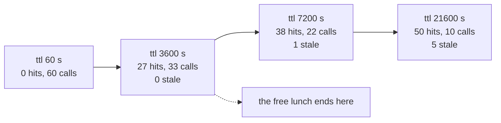

# 5.5 — A TTL is a bet on how long the world stays still

## One-line answer

Sweeping the TTL from 60 to 21600 seconds moves the desk from 0 hits and 60 calls to 50 hits and 10
calls, and the stale answers appear at 7200 — so the honest way to choose is to read both columns and
say out loud which wrong answers you are buying.

## The story

A newspaper comes out once a day. A magazine comes out once a week. Neither is more careful than the
other; they have made different bets about how fast their subject changes.

A daily is betting that a day is short enough. That bet is wrong on the day something happens in the
evening — the paper on the doorstep next morning is already behind, and everybody knows it, and
everybody reads it anyway because it is right about the other three hundred and sixty-four days.

A weekly is betting that a week is short enough, and it buys something for that: it can check things,
lay out properly, print better. Its readers accept that they will hear about the big events elsewhere
first.

What nobody sensible does is argue about which frequency is *correct*. They ask what the subject does.
A cricket score needs the radio. A land-records notice can be a monthly. The frequency is not a
property of the publisher; it is a property of how fast the world moves in that particular subject.

A TTL is that decision, made by a programmer, usually in one line, usually without asking what the
subject does.

## The idea in plain language

**TTL** stands for *time to live*: the number of seconds after which a stored entry is thrown away
without being consulted.

The one sentence to hold: **a TTL is not a storage setting, it is a claim about the world.** Setting
it to 3600 seconds is saying *"I believe the correct answer to this question does not change more
often than that, and where I am wrong, I accept serving the old one."*

Written that way, three things follow that are not obvious from the config file.

**It cannot be tuned by hit rate alone.** Every increase in TTL raises the hit rate. The curve is
monotonic. So "tune the TTL for hit rate" has one answer — infinity — and it is the answer that
produced [5.4](5.4-the-answer-that-was-right-when-it-was-stored.md)'s five wrong answers.

**The relevant comparison is against the change interval, not against latency.** A TTL shorter than
how often the underlying facts change is safe and wasteful. Longer, and it serves stale answers in
proportion to the overshoot. Latency and cost never enter the correctness half of the decision.

**The right number is a property of the question, not of the cache.** "What does error 4403 mean" and
"what is this account's current usage" have change intervals that differ by orders of magnitude, and
a single TTL over both is tuned to neither.

## Why Sutra needs it

Sutra's build brief asks for `CACHE_TTL_SECONDS` in `sutra/cache.py`, and `lab/gate.py` refuses it
without a comment naming the run it came from. This part is that run.

But the deeper reason is Day 52, tomorrow, which is the Phase 7 gate: *"seen anything like this
before?" answered at $0*. A gate that counts only requests saved can be passed by setting the TTL to
infinity, and it would be passed with a desk that quotes withdrawn policies. The gate has to be read
with both columns, and this part produces both.

## The mechanism

`lab/ttl.py` replays the 60-ask log at eight TTLs. The world changes twice during the day, at known
times, so every stale hit is countable rather than estimated.

```bash
cd days/day-51-caching-the-quota-lifeline/lab
uv run python ttl.py
```

**Line by line:**

- `CHANGES = {"refund-window": 6400, "err-4403": 12000}` are the two moments the archive changed.
  They are the same constants `stale.py` imports, so the two scripts cannot drift apart.
- `TTLS = [60, 300, 900, 1800, 3600, 7200, 21600, None]` spans a minute to six clock hours plus a
  never-expires arm, so the shape of the curve is visible rather than two points on it.
- An entry is stale when it was stored before a change and served after it:
  `entry[1] < changed_at <= clock`. That is the definition, written once.
- `calls` counts model calls spent, which is the column the free tier is measured in.

Measured on 2026-09-05:

```text
60 asks, two changes in the world, revalidate = False

   ttl (s)   hits  hit rate  stale  calls
        60      0       0%      0     60
       300      2       3%      0     58
       900      7      12%      0     53
      1800     16      27%      0     44
      3600     27      45%      0     33
      7200     38      63%      1     22
     21600     50      83%      5     10
      none     50      83%      5     10
```

Read the `stale` column first, because it is the one that decides.

**Zero, zero, zero, zero, zero, then 1, then 5.** Staleness is not a gradual tax. It is nothing at all
up to 3600 seconds and then it starts. The first wrong answer appears at 7200, and by 21600 there are
five.

Now read the `calls` column against it. Going from 3600 to 21600 seconds saves **23 model calls** — a
real saving, more than a whole day of free tier — and costs **five wrong answers**. Going from 1800 to
3600 saves 11 calls and costs **nothing**.

That asymmetry is the finding, and it is the reason to sweep rather than to pick:

| Step | Calls saved | Wrong answers bought |
| --- | --- | --- |
| 900 → 1800 | 9 | 0 |
| 1800 → 3600 | 11 | 0 |
| 3600 → 7200 | 11 | 1 |
| 7200 → 21600 | 12 | 4 |

**3600 seconds is where the free lunch ends.** Everything up to it is cost saved for nothing;
everything after it is cost saved by accepting wrong answers. That is a decision a human can make and
defend, and it is only visible because the two columns were printed side by side.

Look at the top of the table too. A TTL of 60 seconds gives **zero** hits — not few, zero. The
closest two repeats in the log are **240 seconds** apart, so a minute-long TTL is a cache that never
once succeeds while costing exactly as much as no cache. A TTL that is shorter than the gap between repeats
is not a conservative setting; it is an off switch with extra steps.

And the last two rows are identical: 21600 seconds and never-expires give the same 50 hits. The log
spans 21500 seconds, so beyond that the TTL has nothing left to expire. **A TTL longer than your
traffic window is infinity, whatever the number says.**



## When it breaks

The break is choosing the TTL from the hit-rate column alone, and it is worth doing on purpose to see
how reasonable it looks.

```bash
uv run python ttl.py | head -4
```

**Line by line:**

- `head -4` shows the header and the first two rows, which is roughly what a dashboard shows: the
  metric and not the audit.

```text
60 asks, two changes in the world, revalidate = False

   ttl (s)   hits  hit rate  stale  calls
        60      0       0%      0     60
```

Zero per cent. Somebody now has a ticket that says "improve cache hit rate", and there is exactly one
knob. Every increase improves the number. There is no point on the way up at which the metric says
stop, so the process terminates at whatever value somebody gets bored at, and 21600 is as likely as
3600.

The failure is not the number chosen. It is that **the process had no stopping rule**, and the
stopping rule can only come from a column the dashboard does not have.

Now the harder version, which is the one that reaches production. Suppose the desk had no answer key —
no `CHANGES`, no `ANSWERS`, no way to compute the `stale` column at all. That is the normal situation.
What then?

The honest answer is that you do not measure staleness; you **bound** it. You find the thing that
changes — the policy document, the ticket archive, the pricing table — and you find out how often it
changes from whoever owns it. If policy updates ship weekly, a TTL of 3600 seconds is safe by a wide
margin and you can say why. If nobody knows how often it changes, that is the finding, and it is a
better use of the afternoon than tuning.

Watch the run that has no stale column at all, because a real deployment's does not:

```bash
uv run python ttl.py --revalidate
```

**Line by line:**

- `--revalidate` re-checks entries the script already knows are stale, using `CHANGES`. It is an
  **oracle**, and it is in the lab to show what perfect invalidation would buy, not what revalidation
  costs.

```text
   ttl (s)   hits  hit rate  stale  calls
     21600     48      80%      0     12
      none     48      80%      0     12
```

Eighty per cent with **zero** stale answers, at 12 calls. No TTL in the previous table gets near that:
the best zero-stale row was 3600 seconds at 45% and 33 calls. That gap — 80% against 45%, 12 calls
against 33 — is the value of being **told** that something changed rather than guessing, and it is
what an invalidation signal buys.

It is also, exactly, why this table cannot be reported as a TTL result. It is the target.

## In production

**What a professional writes instead.** A TTL per class of question, with the class named. Something
like `TTL_POLICY = 900` (policy changes ship weekly, but a wrong policy answer is expensive),
`TTL_ERROR_CODE = 86400` (meanings change with releases and a wrong one is embarrassing rather than
harmful), `TTL_ACCOUNT_STATE = 0` (do not cache; it changes constantly and is per-customer). Three
constants with three sentences beats one constant with none, and the classification is usually
already implicit in how the questions are routed.

**What degrades at scale.** TTLs interact with deployment cadence in a way nobody plans. If entries
live for 3600 seconds and you deploy a prompt change, the old behaviour keeps being served for up to
3600 seconds after the deploy — so your A/B test's early minutes are contaminated, and a rollback does
not take effect immediately either. Any cache keyed on something that a deploy changes needs the build
identifier in the key, which is the model-name argument from
[1.3](../01-two-caches-two-currencies/1.3-a-key-is-a-promise-about-sameness.md) applied to your own
code.

**The failure mode that only appears with real traffic.** Synchronised expiry. If a large number of
entries were populated at the same moment — a deploy, a restart, a traffic spike — they expire at the
same moment too, and every one of them misses simultaneously. That is a self-inflicted version of
[6.3](../06-proving-the-saving/6.3-the-stampede-on-a-cold-key.md)'s stampede, arriving on a timer. The
standard fix is to jitter the TTL by a small random percentage per entry, which costs nothing and
turns a cliff into a slope.

**The review comment a senior engineer leaves:** *"The TTL went from 1800 to 21600 in this diff with
the message 'improve hit rate'. It does improve the hit rate. Show me the change rate of what we're
caching — if refund policy updates ship weekly then six clock hours is defensible and I want that
sentence in the comment; if they can ship any afternoon then this diff means we quote withdrawn
policies for the rest of the day."*

**The interview question:** *"How do you pick a cache TTL?"* An honest answer: *"Not from the hit rate,
because that's monotonic in the TTL — tuning it for hit rate has one answer, infinity, and that's the
setting that serves stale answers. A TTL is a claim about how fast the underlying facts change, so I
start from the change rate of the thing I'm caching and treat the TTL as comfortably shorter than it.
When I could measure both columns I saw the shape clearly: on my traffic, going from 1800 to 3600
seconds saved 11 model calls and cost zero wrong answers, and going from 3600 to 21600 saved another
23 and cost five wrong answers. So 3600 was where the free lunch ended, and past it I'd be making a
trade I'd have to defend rather than an optimisation. I'd also jitter it, because entries populated
together expire together and that's a self-inflicted thundering herd."*

## Check yourself

```bash
cd days/day-51-caching-the-quota-lifeline/lab
uv run python ttl.py
uv run python ttl.py --revalidate
```

Now move `CHANGES["refund-window"]` from 6400 to 2000 and re-run. Write down the new TTL at which the
first stale answer appears, and say in one sentence what that tells you about the relationship between
a TTL and a change interval.

**Out loud, without scrolling up:** state what a TTL is a claim about, explain why it cannot be tuned
from the hit rate, and name the TTL at which the desk's free lunch ends.

**Next:** [6.1 — The saving, in the unit of the bill](../06-proving-the-saving/6.1-the-saving-in-the-unit-of-the-bill.md).
