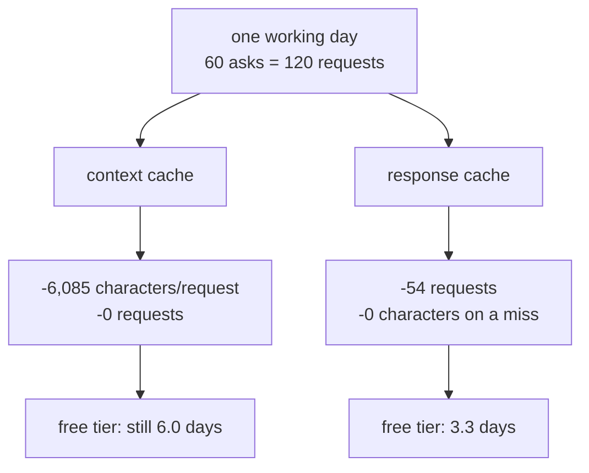

# 6.1 — The saving, in the unit of the bill

## One-line answer

A caching report has to be denominated in whatever the provider actually rations — for Sutra that is
requests per day, so the honest sentence is *"6,085 of 6,124 characters and zero of 120 requests from
the context cache; 54 of 120 requests from the response cache"*, and any single-number version of it
is misleading.

## The story

A prepaid phone plan gives you unlimited data and one hundred minutes of calls a month.

Somebody in the house discovers a setting that compresses images, and announces they have cut the
family's usage by seventy per cent. They have. The data graph on the app is visibly lower and the
number is real.

On the twenty-second, the calls stop working.

Nothing they did was wrong and nothing they measured was false. They optimised the resource that was
not rationed. The graph they were watching had a big number on it because data is measured in
gigabytes and calls are measured in minutes, and the app put the impressive one on the front screen.

Anyone who has run out of something while looking at a dashboard that was green has met this.

## The idea in plain language

Every provider rations *something*, and it is rarely the thing that is easiest to measure:

| The provider limits | The saving that matters |
| --- | --- |
| requests per day (free tiers) | requests skipped |
| tokens per minute | tokens not sent |
| rupees per month | rupees, weighted by input, output and cached rates |
| concurrent requests | overlapping calls avoided |

Sutra's constraint is the first row: **20 generate requests a day** on `gemini-3.7-flash`, a number
read off a live 429 on Day 2 and recorded in `docs/PACKAGES.md`. That is the denominator on every
statement this day makes about savings.

And by [1.2](../01-two-caches-two-currencies/1.2-two-caches-wearing-one-name.md), the two caches save
in two different units:

- The **context cache** removes characters from a request you still send. It saves **tokens**.
- The **response cache** skips the request. It saves **requests**.

So a report that says "we saved 71%" without saying of what has communicated nothing, and a report
that says "99% fewer characters" to an organisation rationed in requests has communicated something
worse than nothing: it has communicated safety.

The rule that falls out is short enough to remember:

> **Report the saving in the unit the limit is written in, or report both units in the same
> sentence.**

## Why Sutra needs it

Tomorrow's phase gate says *"seen anything like this before?" answered at $0*. That gate is a claim
about a number, and this part decides which number.

If the gate is read in tokens, today's context-cache work would pass it and the desk would still stop
answering after twenty questions. If it is read in requests, the response cache is what passes it and
the context cache contributes zero. The gate is only meaningful once the unit is named, and naming the
unit is this part's whole job.

There is also Day 70, the Quota-Router, which routes to whichever provider has headroom. It reasons in
requests-remaining-per-window. Any caching report that is not denominated the same way is unusable by
it.

## The mechanism

`lab/savings.py` prices both caches against both units over the same fixtures — `_desk.py` for the
request, `_log.py` for the traffic.

```bash
cd days/day-51-caching-the-quota-lifeline/lab
uv run python savings.py --archive
```

**Line by line:**

- The context-cache arm calls ADK's real `_apply_cache_to_request` and its real prefix estimator, so
  the before/after and the verdict are ADK's numbers.
- `--archive` adds the second arm from
  [3.3](../03-the-floor-we-never-reach/3.3-what-would-have-to-change.md), which is the only
  configuration in which context caching is allowed at all.
- The response-cache arm replays the 60-ask log through the `normalised` key at a TTL of 3600 seconds
  — the point where [5.5](../05-the-response-cache/5.5-a-ttl-is-a-bet.md) found the free lunch ends.
- `TURNS_PER_ASK = 2` converts asks to requests, because one desk answer is a short conversation and
  not a single call.
- `FREE_TIER_REQUESTS_PER_DAY = 20` is quoted from `docs/PACKAGES.md`.

Measured on 2026-09-05:

```text
=== the context cache: tokens ===

the desk as Day 50 left it
    cacheable prefix          1521 tok  (floor 4096)
    request before / after    6124 / 39 characters
    characters not re-sent    6085  (99% of the request)
    requests saved               0
    verdict                 REFUSED, below the floor

the desk with the whole archive pasted in
    cacheable prefix          4700 tok  (floor 4096)
    request before / after   18840 / 39 characters
    characters not re-sent   18801  (100% of the request)
    requests saved               0
    verdict                 allowed

=== the response cache: requests ===

asks in the log                        60
requests with no cache                120   (2 a turn)
cache hits at ttl 3600                 27   (45%)
requests with the cache                66
requests saved                         54   (45%)
of the hits, wrong answers              0

=== against the ceiling ===

no cache                      120 requests  =    6.0 days of free tier (20 a day)
response cache, ttl 3600       66 requests  =    3.3 days of free tier (20 a day)

The context cache saved characters and zero requests.
The response cache saved requests and bought a correctness risk to go with them.
```

Three readings, in the order they should be made.

**`requests saved: 0` appears twice in the context-cache section.** Once on the refused arm and once on
the *allowed* arm. That is the point: even where context caching works perfectly, saving 100% of the
payload, it saves zero requests. The zero is not a consequence of the refusal.

**`requests saved: 54 (45%)`** for the response cache — and note it is the same 45% as the hit rate,
because every hit removes one ask's worth of requests. Two columns that happen to agree, for a reason
worth being able to state.

**`6.0 days` against `3.3 days`.** This is the only line in the output a non-engineer can act on. One
working day at the desk costs six days of free tier without a cache and three and a third with one.
Neither is "fits in a day", which is the honest headline: **caching does not make the desk viable on
this free tier; it roughly halves how badly it overruns.** That is a finding for Day 52 and for Day
70's router, and it is invisible in any percentage.

The report shape that follows, and the one the build brief asks you to write into the ledger:

| Claim | Value | Unit | Where it came from |
| --- | --- | --- | --- |
| characters not re-sent | 6,085 of 6,124 | characters/request | `savings.py`, 2026-09-05 |
| requests saved by the context cache | 0 of 120 | requests/day | `savings.py`, 2026-09-05 |
| requests saved by the response cache | 54 of 120 | requests/day | `savings.py`, ttl 3600 |
| wrong answers bought | 0 | answers | `ttl.py`, ttl 3600 |
| free-tier days consumed | 6.0 → 3.3 | days | 20 requests/day, `docs/PACKAGES.md` |

Five rows, every one with a unit and a source. Nobody reading that table can walk away with the wrong
impression, which is the entire specification for a caching report.



## When it breaks

The break is one number with no unit, and it survives because it is short enough to fit in a status
update.

🎬 **The scene.** A weekly update needs a line about the caching work. The engineer picks the biggest
true number: *"caching is live — 99% reduction."*

😬 **The naive fix.** None, because nothing looks broken. The number is true and large.

💥 **Why it fails.** Two people read it. The product manager hears "we can serve a hundred times the
traffic". The finance analyst hears "our model bill drops by 99%". Neither is what happened, and both
will plan against it. The engineer who wrote it will not find out until a capacity conversation goes
badly in a month.

💡 **The insight.** The unit is not a detail appended to the number; it is what makes the number a
claim. *"99% fewer characters per request, and zero fewer requests"* is the same measurement, is
equally short, and cannot be misread.

Here is the same failure produced deliberately, by reading only the first section of the output:

```bash
uv run python savings.py | head -12
```

**Line by line:**

- `head -12` truncates at the context-cache arm, which is exactly what happens when someone screenshots
  the top of a report.

```text
=== the context cache: tokens ===

the desk as Day 50 left it
    cacheable prefix          1521 tok  (floor 4096)
    request before / after    6124 / 39 characters
    characters not re-sent    6085  (99% of the request)
    requests saved               0
    verdict                 REFUSED, below the floor
```

Even truncated, this output cannot be misread, because `requests saved: 0` sits directly under
`characters not re-sent: 6085`. That adjacency is a deliberate design choice in the script and it is
the cheapest defence available: **put the number that disappoints people next to the number that
impresses them.**

## In production

**What a professional writes instead.** A saving is reported as a pair — `requests_saved` and
`characters_saved` — never as a scalar, and the report always names the constraint it is measured
against. In a costed environment the third column is money, computed with the provider's actual
input, output and cached-input rates rather than a single blended figure, because cached input is
cheaper and not free and the difference is the whole argument for a context cache.

**What degrades at scale.** The binding constraint moves. A free tier rations requests; a paid tier
rations rupees; a large paid deployment starts hitting tokens-per-minute before it hits budget. Each
of those transitions changes which cache is valuable, and a team that has only ever reported one
number will not notice the transition — they will notice a service that suddenly throttles while the
dashboard is green. The report should name the constraint explicitly so that changing it is a visible
edit.

**The failure mode that only appears with real traffic.** Savings are computed per request and limits
are enforced per window. A cache that saves 45% of requests spread evenly is a different thing from
one that saves 45% concentrated in the quiet hours, and only the first helps with a per-minute limit.
Reporting a daily total hides the distribution entirely, and the request that gets refused is always
in the peak.

**The review comment a senior engineer leaves:** *"The report says 71%. Of what? We're rationed in
requests per day and this number is characters. Put both in the summary with their units, and put the
free-tier days consumed at the bottom — that's the only line the rest of the company can act on."*

**The interview question:** *"How would you show that a caching change was worth it?"* An honest
answer: *"In the unit the provider rations, and I'd say the unit out loud because the two caches save
different ones. Context caching cuts characters in a request you still make; response caching skips
the request. My free tier was 20 requests a day, so I reported it as: 6,085 of 6,124 characters saved
per request and zero of 120 requests; then 54 of 120 requests saved by the response cache, with zero
wrong answers at that TTL. And the bottom line in the unit the business understands — one working day
at the desk went from six days of free-tier quota to three and a third, which is honest about the fact
that caching halved the overrun rather than fixing it. A single percentage would have let two
different people plan against two different wrong things."*

## Check yourself

```bash
cd days/day-51-caching-the-quota-lifeline/lab
uv run python savings.py
uv run python savings.py --ttl 21600
```

The second command uses the TTL that [5.5](../05-the-response-cache/5.5-a-ttl-is-a-bet.md) showed
buys five wrong answers. Write the two-line report for it — the saving and the cost — in the unit of
the bill.

**Out loud, without scrolling up:** state Sutra's rationed unit, say how many requests each cache
saves, and give the free-tier-days figure with and without the response cache.

**Next:** [6.2 — The log line and four alarms](6.2-the-log-line-and-four-alarms.md).
